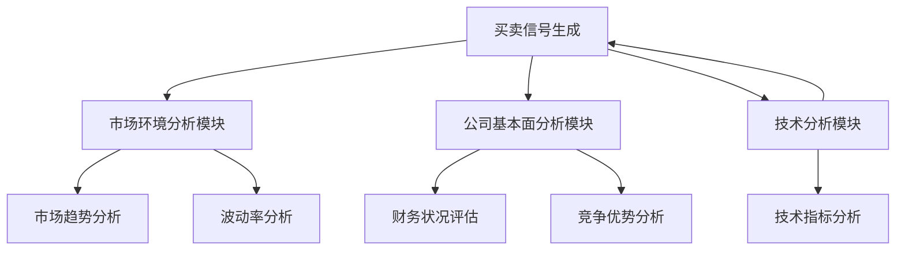
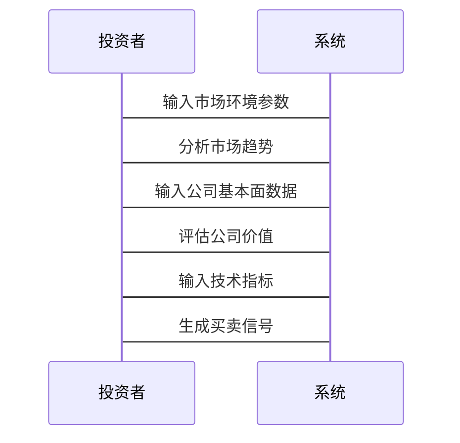

                 


# 彼得林奇的"长期持有"vs"动态调整"在不同市场环境下的选择

## 关键词：
- 彼得林奇
- 长期持有
- 动态调整
- 投资策略
- 市场环境
- 数学模型

## 摘要：
本文深入分析了彼得林奇的“长期持有”和“动态调整”两种投资策略的核心概念、数学模型和在不同市场环境下的适用性。通过对比分析，结合实际投资案例，展示了如何根据市场环境选择最佳策略，并提出了系统的投资决策方法和风险管理建议。

---

## 第一部分：彼得林奇的“长期持有”与“动态调整”策略背景介绍

### 第1章：彼得林奇的投资理念概述

#### 1.1 彼得林奇的投资哲学
- **1.1.1 价值投资的核心理念**
  彼得林奇是价值投资的代表人物，他认为市场波动为投资者提供了以低于内在价值的价格买入优质股票的机会。
- **1.1.2 长期持有的优势**
  长期持有减少了交易成本和税务负担，使投资者能够专注于公司的长期增长。
- **1.1.3 动态调整的灵活性**
  动态调整策略允许投资者在市场变化时及时调整投资组合，捕捉短期收益。

#### 1.2 长期持有与动态调整的定义与区别
- **1.2.1 长期持有策略**
  - **定义**：买入优质股票后长期持有，不因短期波动而改变投资决策。
  - **目标**：通过长期增值实现财富增长。
- **1.2.2 动态调整策略**
  - **定义**：根据市场变化和公司动态，定期调整投资组合，买卖股票。
  - **目标**：捕捉市场波动带来的短期收益，优化投资组合的风险收益比。

### 第2章：长期持有与动态调整策略的核心概念对比

#### 2.1 长期持有策略的核心特征
- **2.1.1 价值驱动**
  - 长期持有基于对公司内在价值的评估，寻找被市场低估的股票。
- **2.1.2 风险承受**
  - 能够承受短期波动，关注长期收益。

#### 2.2 动态调整策略的核心特征
- **2.2.1 市场敏感**
  - 动态调整策略依赖于市场趋势和技术分析，及时捕捉市场信号。
- **2.2.2 灵活性**
  - 频繁调整投资组合，根据市场变化优化资产配置。

### 第3章：长期持有与动态调整的优缺点对比

#### 3.1 长期持有策略的优缺点
- **优点**：
  - 长期稳定的收益潜力。
  - 降低交易成本和税务负担。
- **缺点**：
  - 需要承担短期波动的风险。
  - 需要较长的时间来实现收益。

#### 3.2 动态调整策略的优缺点
- **优点**：
  - 灵活应对市场变化，捕捉短期收益。
  - 优化投资组合的风险收益比。
- **缺点**：
  - 需要较高的市场分析能力。
  - 频繁交易可能导致较高的成本。

---

## 第二部分：长期持有与动态调整的数学模型与算法原理

### 第4章：长期持有策略的数学模型

#### 4.1 长期持有策略的数学模型
- **价值评估模型**：
  $$ V = \frac{E}{k} $$
  其中，V为内在价值，E为预期收益，k为折现率。

- **风险调整后的价值模型**：
  $$ RV = V \times (1 - r) $$
  其中，RV为风险调整后的价值，r为风险调整系数。

#### 4.2 长期持有策略的风险评估模型
- **标准差模型**：
  $$ \sigma = \sqrt{\sum_{i=1}^{n} (x_i - \mu)^2 / N} $$
  其中，σ为标准差，x_i为收益，μ为平均收益，N为数据点数量。

### 第5章：动态调整策略的数学模型

#### 5.1 动态调整策略的数学模型
- **移动平均线策略**：
  - 短期移动平均线（如5日线）和长期移动平均线（如20日线）的交叉点作为买卖信号。
  - 当短期线向上穿越长期线时，产生买入信号；反之，产生卖出信号。

- **相对强弱指数（RSI）策略**：
  - RSI指标用于判断超买或超卖状态。
  - 当RSI超过70时，考虑卖出；当RSI低于30时，考虑买入。

#### 5.2 动态调整策略的风险评估模型
- **波动率模型**：
  $$ \sigma = \sqrt{\sum_{i=1}^{n} (p_i - \mu)^2 / N} $$
  其中，σ为波动率，p_i为价格，μ为平均价格，N为数据点数量。

---

## 第三部分：系统分析与架构设计

### 第6章：投资决策系统的架构设计

#### 6.1 系统功能设计
- **市场环境分析模块**：
  - 监测市场趋势、波动率和宏观经济指标。
- **公司基本面分析模块**：
  - 评估公司的财务状况、竞争优势和管理层能力。
- **技术分析模块**：
  - 应用移动平均线、RSI等技术指标进行市场信号识别。

#### 6.2 系统架构图


#### 6.3 系统交互流程图


---

## 第四部分：项目实战与案例分析

### 第7章：项目实战

#### 7.1 环境安装
- **工具**：Python编程语言、数据可视化库（Matplotlib）、数据分析库（Pandas）。
- **数据源**：历史股价数据、财务数据、宏观经济指标。

#### 7.2 核心实现源代码
```python
# 长期持有策略实现
import pandas as pd
import matplotlib.pyplot as plt

def calculate_intrinsic_value(company_data, required_rate):
    # 计算预期收益
    E = company_data['Earnings'].mean()
    # 计算内在价值
    V = E / required_rate
    return V

# 动态调整策略实现
def moving_average_strategy(prices, short_window, long_window):
    # 计算短期和长期移动平均线
    short_ma = prices.rolling(short_window).mean()
    long_ma = prices.rolling(long_window).mean()
    # 生成买卖信号
    buy_signal = short_ma > long_ma
    sell_signal = short_ma < long_ma
    return buy_signal, sell_signal

# 示例数据
company_data = pd.DataFrame({
    'Earnings': [1.5, 2.0, 2.5, 3.0, 3.5],
    'Price': [50, 60, 70, 80, 90]
})

required_rate = 0.1
V = calculate_intrinsic_value(company_data, required_rate)
print(f"内在价值: {V}")

prices = company_data['Price']
buy, sell = moving_average_strategy(prices, 5, 20)
print(f"买入信号: {buy}")
print(f"卖出信号: {sell}")

plt.plot(prices, label='Price')
plt.plot(short_ma, label='短期MA')
plt.plot(long_ma, label='长期MA')
plt.legend()
plt.show()
```

---

## 第五部分：总结与最佳实践

### 第8章：总结与最佳实践

#### 8.1 投资策略选择
- 根据市场环境选择策略：牛市适合长期持有，熊市适合动态调整。
- 结合价值投资和趋势投资：在市场波动较大时，动态调整可以减少风险。

#### 8.2 风险管理
- 设置止损点：在动态调整策略中，设定止损点以限制损失。
- 分散投资：避免过度集中在单一股票或行业。

#### 8.3 持续学习与调整
- 关注市场变化：定期评估投资组合，根据市场变化调整策略。
- 学习新技术：利用大数据和人工智能技术优化投资决策。

---

通过以上步骤和分析，本文为投资者提供了在不同市场环境下选择最佳投资策略的理论依据和实际操作指南，帮助投资者在长期持有和动态调整之间做出明智决策。

