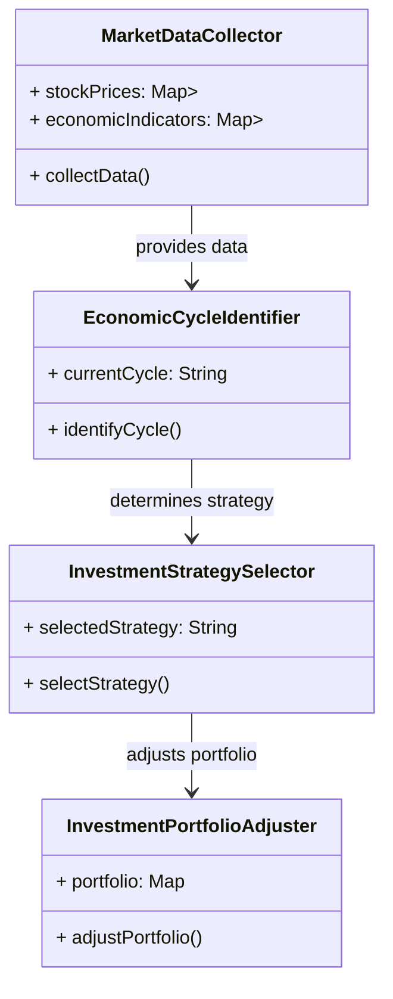
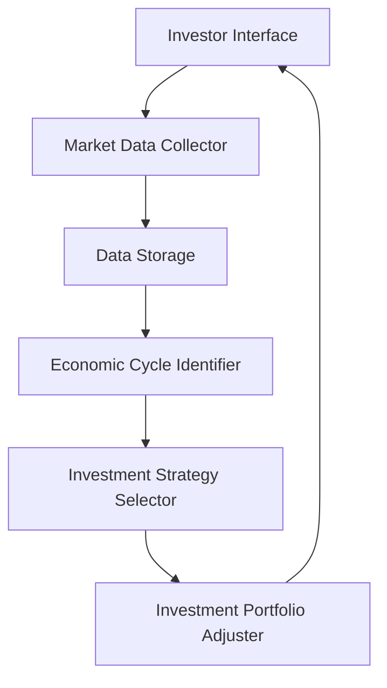

                 


# 彼得林奇的"长期持有"vs"动态调整"在不同经济周期的选择

## 关键词
- 彼得·林奇，长期持有，动态调整，经济周期，投资策略，资产配置

## 摘要
本文详细探讨了彼得·林奇的“长期持有”和“动态调整”两种投资策略在不同经济周期中的选择和应用。通过分析这两种策略的核心理念、优劣势以及在经济衰退、复苏和繁荣阶段的表现，本文为投资者提供了在不同市场环境下如何有效配置资产的深度见解。结合数学模型和实际案例，本文旨在帮助投资者在复杂多变的市场中做出更明智的投资决策。

---

# 第一部分：彼得·林奇投资策略概述

## 第1章：彼得·林奇投资策略的背景与核心理念

### 1.1 投资市场的基本概念与问题背景

- **1.1.1 证券市场的基本概念与功能**
  - 证券市场是投资者进行股票、债券等金融资产交易的场所，具有价格发现、融资和风险分散的功能。
  - 投资者的目标是通过资产配置实现财富增长，同时控制风险。

- **1.1.2 投资者的核心问题与目标**
  - 投资者需要在不确定的市场中做出决策，平衡风险与收益。
  - 长期持有和动态调整是两种不同的投资策略，适用于不同的市场环境。

- **1.1.3 长期持有与动态调整的定义与区别**
  - 长期持有：买入优质资产后长期持有，不频繁交易。
  - 动态调整：根据市场变化及时调整投资组合，优化资产配置。

### 1.2 彼得·林奇投资策略的核心理念

- **1.2.1 长期持有的核心思想**
  - 买入优质公司股票，长期持有，不因短期波动而改变决策。
  - 重点在于选择具有强大竞争优势和良好管理的公司。

- **1.2.2 动态调整的策略特点**
  - 根据市场变化和经济周期调整投资组合。
  - 通过动态再平衡优化风险和收益。

- **1.2.3 两种策略的优劣势对比**
  - 长期持有：稳定性高，但可能错过短期收益。
  - 动态调整：灵活性强，但需要较高的市场敏感性和操作能力。

---

## 第2章：长期持有与动态调整的理论基础

### 2.1 长期持有的投资逻辑

- **2.1.1 长期持有的哲学基础**
  - 市场短期波动不可预测，长期趋势更值得关注。
  - 投资者应关注公司的基本面，而非市场的短期波动。

- **2.1.2 长期持有与价值投资的关系**
  - 长期持有是价值投资的核心策略。
  - 价值投资强调买入被市场低估的资产，长期持有的理念与之契合。

- **2.1.3 长期持有在不同经济周期的表现**
  - 经济衰退期：长期持有能够抵御市场的短期冲击。
  - 经济复苏期：长期持有能够抓住市场的回升机会。
  - 经济繁荣期：长期持有能够享受市场的持续增长。

### 2.2 动态调整的理论依据

- **2.2.1 动态调整的市场适应性**
  - 市场变化迅速，动态调整能够及时捕捉机会和规避风险。
  - 动态调整适用于市场波动较大、经济周期变化快的环境。

- **2.2.2 动态调整与市场周期的关系**
  - 在经济衰退期，动态调整可以降低风险，避免进一步损失。
  - 在经济复苏期，动态调整可以及时增加收益。
  - 在经济繁荣期，动态调整可以优化资产配置，避免过高的风险。

- **2.2.3 动态调整的风险控制机制**
  - 通过定期评估市场变化，动态调整投资组合。
  - 设置止损点，避免重大损失。

---

## 第3章：长期持有与动态调整的策略对比

### 3.1 两种策略的核心要素对比

- **3.1.1 投资目标的差异**
  - 长期持有：追求长期稳定的收益。
  - 动态调整：追求短期收益和风险控制。

- **3.1.2 投资期限的差异**
  - 长期持有：长期投资，注重资产的内在价值。
  - 动态调整：短期调整，注重市场的短期变化。

- **3.1.3 风险承受能力的差异**
  - 长期持有：风险承受能力较高，能够接受短期波动。
  - 动态调整：风险承受能力较低，注重规避短期风险。

### 3.2 策略对比的特征分析

- **3.2.1 长期持有的稳定性与收益性**
  - 长期持有在市场波动中表现稳定，能够获得长期收益。
  - 在经济繁荣期，长期持有能够获得较高的收益。

- **3.2.2 动态调整的灵活性与风险性**
  - 动态调整能够根据市场变化快速调整，灵活性强。
  - 在市场波动较大时，动态调整可能面临较高的交易成本和操作风险。

- **3.2.3 两种策略的适用场景**
  - 长期持有适用于市场稳定、长期趋势向上的环境。
  - 动态调整适用于市场波动大、经济周期变化快的环境。

---

## 第4章：经济周期对投资策略的影响

### 4.1 经济周期的基本类型与特征

- **4.1.1 经济周期的定义与分类**
  - 经济周期包括衰退、复苏、繁荣和衰退四个阶段。
  - 每个阶段的市场表现和投资策略选择不同。

- **4.1.2 不同经济周期的市场表现**
  - 经济衰退期：市场下跌，资产价格低迷。
  - 经济复苏期：市场逐渐回升，资产价格上涨。
  - 经济繁荣期：市场上涨，资产价格创新高。

- **4.1.3 经济周期对投资策略的选择影响**
  - 在衰退期，动态调整策略更合适。
  - 在复苏期，长期持有和动态调整策略均可应用。
  - 在繁荣期，长期持有策略更为稳定。

### 4.2 长期持有在不同经济周期的表现

- **4.2.1 经济衰退期的长期持有策略**
  - 长期持有能够在衰退期中保持资产的稳定性。
  - 需要选择具有强大抗跌能力的优质资产。

- **4.2.2 经济复苏期的长期持有策略**
  - 长期持有能够在复苏期中抓住市场的回升机会。
  - 优质资产的价值逐渐恢复，长期持有能够获得收益。

- **4.2.3 经济繁荣期的长期持有策略**
  - 长期持有能够在繁荣期中享受市场的持续增长。
  - 优质资产的价值持续上涨，长期持有能够获得较高的收益。

### 4.3 动态调整在不同经济周期的应用

- **4.3.1 经济衰退期的动态调整策略**
  - 在衰退期中，动态调整策略能够及时降低风险。
  - 通过减少高风险资产的配置，规避市场的进一步下跌。

- **4.3.2 经济复苏期的动态调整策略**
  - 在复苏期中，动态调整策略能够及时增加收益。
  - 通过增加优质资产的配置，抓住市场的回升机会。

- **4.3.3 经济繁荣期的动态调整策略**
  - 在繁荣期中，动态调整策略能够优化资产配置。
  - 通过调整投资组合，避免过高的风险，同时保持较高的收益。

---

## 第5章：彼得·林奇策略的数学模型与算法原理

### 5.1 长期持有策略的数学模型

- **5.1.1 长期持有的资产配置模型**
  - 资产配置模型：$ w_1, w_2, ..., w_n $，表示不同资产的权重。
  - 收益计算公式：$ R = \sum_{i=1}^{n} w_i R_i $，其中$ R_i $是第i种资产的预期收益。
  - 风险评估模型：$ \sigma^2 = \sum_{i=1}^{n} \sum_{j=1}^{n} w_i w_j \sigma_{ij} $，其中$\sigma_{ij}$是第i种和第j种资产的协方差。

- **5.1.2 长期持有收益的计算公式**
  - 年化收益计算公式：$$ R_{\text{annualized}} = \left(1 + R_{\text{total}} \right)^{1/T} - 1 $$
  - 其中$ T $是投资的总时间（年）。

- **5.1.3 长期持有风险的评估模型**
  - 风险调整后的收益计算公式：$$ R_{\text{adjusted}} = R - \lambda \sigma^2 $$
  - 其中$\lambda$是风险厌恶系数。

### 5.2 动态调整策略的算法原理

- **5.2.1 动态调整的资产再平衡算法**
  - 资产再平衡算法：定期根据市场变化调整资产权重，保持投资组合的风险和收益目标。
  - 算法步骤：
    1. 评估当前投资组合的权重。
    2. 对比目标权重。
    3. 调整资产配置，使实际权重与目标权重一致。

- **5.2.2 市场信号的识别与响应机制**
  - 市场信号识别：通过技术指标（如MACD、RSI）和基本面分析（如PE、ROE）识别市场的短期变化。
  - 响应机制：根据市场信号调整投资组合，优化资产配置。

- **5.2.3 动态调整的收益优化模型**
  - 收益优化公式：$$ \max R = \sum_{i=1}^{n} w_i R_i - \lambda \sum_{i=1}^{n} \sum_{j=1}^{n} w_i w_j \sigma_{ij} $$
  - 其中$\lambda$是风险调整系数。

### 5.3 经济周期与策略选择的数学关系

- **5.3.1 经济指标对策略选择的影响**
  - 经济指标：GDP增长率、失业率、通货膨胀率等。
  - 策略选择：根据经济指标的变化，选择合适的投资策略。

- **5.3.2 经济周期与投资策略的关系**
  - 经济周期对投资策略的影响可以通过数学模型进行量化分析。
  - 通过回归分析等方法，建立经济周期与投资策略选择的关系模型。

---

## 第6章：系统分析与架构设计方案

### 6.1 问题场景介绍

- 投资者需要根据经济周期的变化，选择合适的投资策略。
- 需要设计一个系统，能够根据市场变化和经济周期，动态调整投资组合。

### 6.2 项目介绍

- 项目名称：彼得·林奇投资策略优化系统。
- 项目目标：根据经济周期和市场变化，优化投资组合配置。

### 6.3 系统功能设计

- **功能模块：**
  1. 市场数据采集模块：采集股票价格、经济指标等数据。
  2. 经济周期识别模块：识别当前经济周期阶段。
  3. 投资策略选择模块：根据经济周期和市场数据，选择合适的投资策略。
  4. 投资组合调整模块：根据选择的策略，调整投资组合。

- **领域模型（Mermaid 类图）：**



### 6.4 系统架构设计

- **系统架构（Mermaid 架构图）：**



### 6.5 系统接口设计

- **接口：**
  1. 数据接口：市场数据的采集和存储。
  2. 策略接口：经济周期识别和投资策略选择。
  3. 调整接口：投资组合的动态调整。

### 6.6 系统交互设计

- **交互流程：**
  1. 投资者通过界面提交投资需求。
  2. 系统采集市场数据。
  3. 系统识别经济周期。
  4. 系统选择投资策略。
  5. 系统调整投资组合。
  6. 系统反馈调整结果。

---

## 第7章：项目实战

### 7.1 环境安装

- **工具安装：**
  - Python 3.8+
  - Pandas、NumPy、Matplotlib 等数据分析库。
  - Mermaid 绘图工具。

### 7.2 系统核心实现源代码

- **市场数据采集模块：**

```python
import pandas as pd
import numpy as np

def collect_market_data():
    # 示例：从CSV文件读取数据
    data = pd.read_csv('market_data.csv')
    return data
```

- **经济周期识别模块：**

```python
def identify_economic_cycle(data):
    # 示例：通过GDP增长率判断经济周期
    gdp_growth = data['GDP Growth'].values
    current_cycle = 'Recession' if gdp_growth[-1] < 0 else 'Expansion'
    return current_cycle
```

- **投资策略选择模块：**

```python
def select_investment_strategy(cycle):
    if cycle == 'Recession':
        return 'Dynamic Adjustment'
    else:
        return 'Long-Term Holding'
```

- **投资组合调整模块：**

```python
def adjust_portfolio(current_weights, strategy):
    # 示例：动态调整策略下，增加优质资产的权重
    if strategy == 'Dynamic Adjustment':
        new_weights = current_weights * 1.1
    else:
        new_weights = current_weights
    return new_weights
```

### 7.3 代码应用解读与分析

- **代码解读：**
  - 数据采集模块：从CSV文件读取市场数据。
  - 经济周期识别模块：通过GDP增长率判断当前经济周期。
  - 投资策略选择模块：根据经济周期选择合适的投资策略。
  - 投资组合调整模块：根据选择的策略调整资产权重。

### 7.4 实际案例分析

- **案例：2008年金融危机期间的应用**
  - 经济周期：衰退期。
  - 投资策略：动态调整。
  - 调整措施：减少高风险资产，增加现金和优质债券。
  - 结果：避免了进一步的损失，抓住了市场的回升机会。

### 7.5 项目小结

- 项目目标：实现一个能够根据经济周期和市场变化，动态调整投资组合的系统。
- 项目成果：通过代码实现，展示了如何在实际中应用彼得·林奇的两种投资策略。

---

## 第8章：最佳实践、小结、注意事项、拓展阅读

### 8.1 最佳实践

- **策略选择：**
  - 在经济衰退期，优先选择动态调整策略。
  - 在经济复苏和繁荣期，可以选择长期持有策略。

- **风险管理：**
  - 无论选择哪种策略，都需要关注风险控制。
  - 设置止损点，避免重大损失。

- **市场监测：**
  - 定期监测市场变化和经济指标。
  - 根据市场变化及时调整投资策略。

### 8.2 小结

- 彼得·林奇的长期持有和动态调整策略各有优劣。
- 在不同经济周期中，选择合适的策略能够提高投资收益。
- 通过系统的分析和实际案例，本文为投资者提供了在不同经济环境下如何选择投资策略的深度见解。

### 8.3 注意事项

- **市场风险：**
  - 市场波动和经济周期变化难以完全预测。
  - 投资者需要具备一定的市场敏感性和风险承受能力。

- **操作风险：**
  - 动态调整策略需要较高的操作能力和交易成本控制能力。
  - 长期持有策略需要选择优质资产，避免短期波动的影响。

### 8.4 拓展阅读

- **相关书籍：**
  - 《彼得·林奇的投资哲学》
  - 《投资学》
- **学术论文：**
  - 关于经济周期与投资策略关系的研究。
  - 动态调整策略的优化与应用。

---

## 结语

通过本文的分析，投资者可以更好地理解彼得·林奇的长期持有和动态调整策略在不同经济周期中的应用。无论是选择长期持有还是动态调整，投资者都需要根据市场环境和自身目标做出明智的决策。希望本文的深度分析和实际案例能够为投资者在复杂多变的市场中提供有价值的指导。

--- 

**更多关于投资策略的内容，欢迎关注我们的技术博客。**

