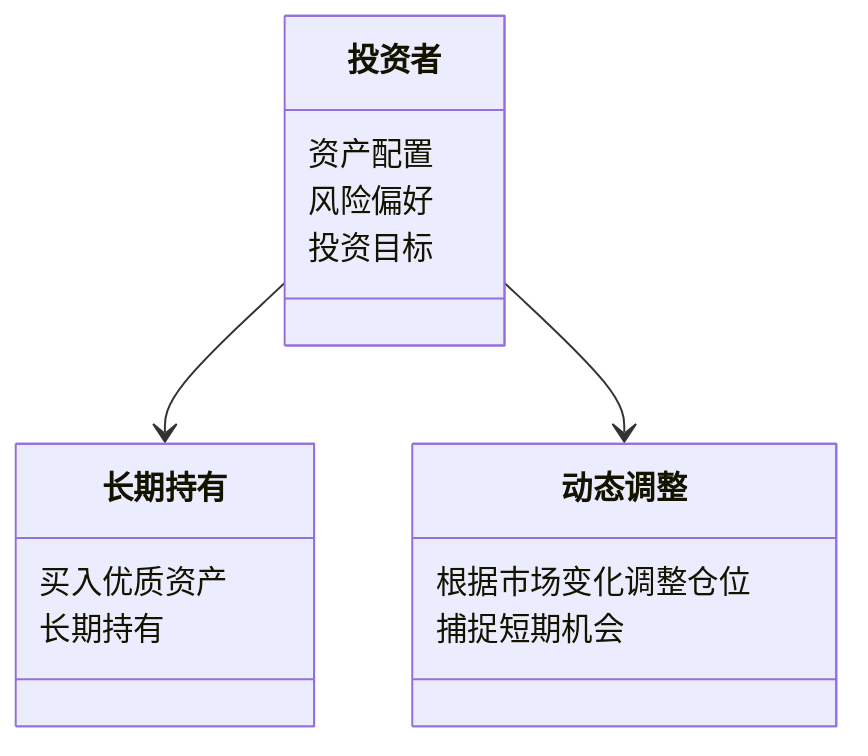
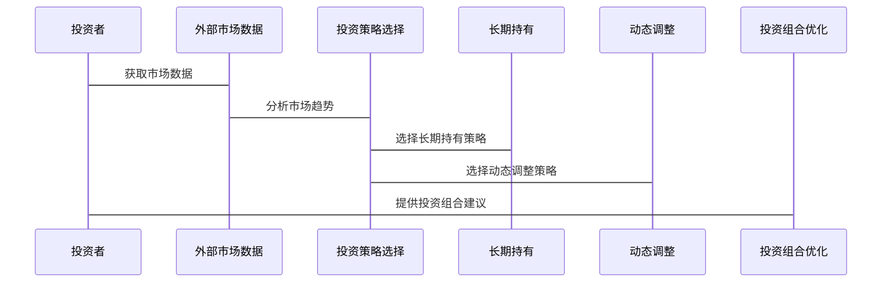

                 


# 彼得林奇的"长期持有"vs"动态调整"的决策框架

## 关键词：彼得·林奇，长期持有，动态调整，投资策略，决策框架

## 摘要：本文深入探讨了彼得·林奇提出的“长期持有”与“动态调整”两种投资策略，分析了它们的理论基础、优缺点及适用场景，并结合实际案例展示了如何在不同市场环境下选择合适的策略。通过系统比较，帮助投资者理解这两种策略的特点及其在投资组合中的应用。

---

# 第一部分：引言

## 第1章：彼得·林奇及其投资理念概述

### 1.1 彼得·林奇的背景与投资风格

#### 1.1.1 彼得·林奇的生平简介
彼得·林奇（Peter Lynch）是美国著名投资专家，曾任富达麦哲伦基金的经理，以其卓越的投资业绩闻名。他的投资哲学强调长期价值和基本面分析，认为市场波动为投资者提供了低价买入优质资产的机会。

#### 1.1.2 林奇的投资哲学与核心理念
林奇主张投资那些易于理解且具备竞争优势的企业，强调长期持有优质股票，避免频繁交易。他认为，市场波动是投资者的朋友，而短期市场预测往往不可靠。

#### 1.1.3 林奇投资方法的核心要素
- 价值投资：寻找基本面良好、管理优秀的企业。
- 长期持有：减少交易次数，降低交易成本。
- 风险控制：通过分散投资降低风险。

### 1.2 "长期持有"与"动态调整"的决策框架

#### 1.2.1 长期持有的定义与特点
长期持有是指投资者买入优质股票后，长期持有，除非基本面发生变化。其特点是简单、低成本、低交易频率。

#### 1.2.2 动态调整的定义与特点
动态调整是指根据市场变化和企业基本面调整投资组合。其特点是灵活、及时捕捉市场机会，但需要较高的市场敏感性和交易成本。

#### 1.2.3 两种策略的优缺点对比
| 策略 | 优点 | 缺点 |
|------|------|------|
| 长期持有 | 成本低、简单有效、避免频繁交易 | 无法捕捉短期市场波动、可能错失短期收益 |
| 动态调整 | 灵活应对市场变化、捕捉短期机会 | 成本高、交易复杂、需要精准判断 |

---

# 第二部分：长期持有策略的理论基础

## 第2章：长期持有策略的理论基础

### 2.1 长期持有的核心概念

#### 2.1.1 长期持有的投资逻辑
- **价值发现**：买入优质资产，等待其价值增长。
- **复利效应**：长期持有可以最大化复利效应。

#### 2.1.2 长期持有与价值投资的关系
长期持有是价值投资的核心策略，强调买入低估的资产并长期持有。

#### 2.1.3 长期持有策略的数学模型
复利公式：$$ FV = PV \times (1 + r)^t $$
其中，PV为本金，r为年化收益率，t为持有时间。

### 2.2 长期持有策略的优势与风险

#### 2.2.1 长期持有的优势分析
- **降低成本**：减少交易次数，降低佣金和税费。
- **避免情绪干扰**：减少市场波动对决策的影响。

#### 2.2.2 长期持有策略的风险与挑战
- **市场波动风险**：短期内可能承受较大波动。
- **流动性风险**：在需要资金时可能难以快速变现。

#### 2.2.3 长期持有策略的经典案例分析
案例：买入并长期持有可口可乐股票，长期获得稳定收益。

---

# 第三部分：动态调整策略的理论基础

## 第3章：动态调整策略的理论基础

### 3.1 动态调整的核心概念

#### 3.1.1 动态调整的投资逻辑
- **趋势投资**：根据市场趋势调整仓位。
- **时机选择**：在市场低估时买入，高估时卖出。

#### 3.1.2 动态调整与趋势投资的关系
动态调整是趋势投资的核心策略，强调根据市场变化调整投资组合。

#### 3.1.3 动态调整策略的数学模型
趋势判断模型：$$ P_t = a \times P_{t-1} + b \times R_{t-1} $$
其中，P为价格，R为收益率，a和b为权重参数。

### 3.2 动态调整策略的优势与风险

#### 3.2.1 动态调整的优势分析
- **捕捉市场机会**：及时调整仓位，捕捉短期收益。
- **降低风险**：通过动态调整降低市场波动带来的损失。

#### 3.2.2 动态调整策略的风险与挑战
- **交易成本**：频繁交易增加佣金和税费。
- **判断失误风险**：动态调整需要精准的市场判断。

#### 3.2.3 动态调整策略的经典案例分析
案例：根据市场波动动态调整股票仓位，捕捉短期收益。

---

# 第四部分：长期持有与动态调整的比较分析

## 第4章：长期持有与动态调整的比较分析

### 4.1 两种策略的异同点

#### 4.1.1 投资目标的差异
- 长期持有：追求长期稳定收益。
- 动态调整：追求短期市场机会。

#### 4.1.2 投资期限的差异
- 长期持有：长期投资。
- 动态调整：短期调整。

#### 4.1.3 风险承受能力的差异
- 长期持有：风险承受能力较强。
- 动态调整：风险承受能力较弱。

### 4.2 不同市场环境下的策略选择

#### 4.2.1 牛市环境下的策略选择
- 长期持有：适合买入优质资产，长期持有。
- 动态调整：适合捕捉市场波动，动态调整仓位。

#### 4.2.2 熊市环境下的策略选择
- 长期持有：适合坚持持有优质资产，等待市场回升。
- 动态调整：适合根据市场情况逐步卖出，降低风险。

#### 4.2.3 震荡市环境下的策略选择
- 长期持有：适合坚持持有优质资产，避免频繁交易。
- 动态调整：适合根据市场波动，逐步调整仓位。

---

# 第五部分：投资组合构建与策略应用

## 第5章：投资组合构建与策略应用

### 5.1 投资组合的构建原则

#### 5.1.1 资产配置的基本原则
- 分散投资：避免过度集中。
- 风险与收益平衡：根据自身风险承受能力调整配置。

#### 5.1.2 风险与收益的平衡
- 长期持有：高收益，高风险。
- 动态调整：中收益，中风险。

#### 5.1.3 投资组合的再平衡策略
定期检查投资组合，根据市场变化进行调整，保持目标配置。

### 5.2 长期持有与动态调整的结合应用

#### 5.2.1 长期持有与动态调整的结合
- 在市场稳定时，采用长期持有策略。
- 在市场波动时，适当进行动态调整。

#### 5.2.2 投资组合的动态调整策略
根据市场变化，定期调整股票、债券等资产的比例，优化投资组合。

---

# 第六部分：系统分析与架构设计方案

## 第6章：系统分析与架构设计方案

### 6.1 问题场景介绍
投资者需要根据市场环境和个人风险偏好，选择合适的投资策略。

### 6.2 系统功能设计

#### 6.2.1 领域模型（Mermaid类图）


### 6.3 系统架构设计（Mermaid架构图）


### 6.4 系统接口设计
- 输入：市场数据、投资者风险偏好。
- 输出：投资策略建议。

### 6.5 系统交互（Mermaid序列图）


---

# 第七部分：项目实战

## 第7章：项目实战

### 7.1 环境安装
- 数据分析工具：Python、Pandas、Matplotlib。
- 投资组合管理工具：Excel、投资组合优化软件。

### 7.2 系统核心实现源代码
```python
import pandas as pd
import numpy as np

def calculate_portfolio(returns, weights):
    return np.dot(returns, weights)

def dynamic_adjustment(returns, threshold):
    return returns > threshold

# 示例数据
returns = pd.DataFrame({
    '股票': [0.05, -0.02, 0.03, 0.01, -0.01],
    '债券': [0.02, 0.03, 0.01, 0.02, 0.04]
})

weights = np.array([0.6, 0.4])

portfolio_return = calculate_portfolio(returns, weights)
dynamic_adjust = dynamic_adjustment(portfolio_return, 0.03)

print("投资组合收益：", portfolio_return)
print("动态调整信号：", dynamic_adjust)
```

### 7.3 代码应用解读与分析
- `calculate_portfolio`：计算投资组合的预期收益。
- `dynamic_adjustment`：根据阈值判断是否进行动态调整。

### 7.4 实际案例分析
案例：根据市场波动动态调整股票和债券的比例，优化投资组合。

### 7.5 项目小结
通过代码实现，投资者可以根据市场变化和自身风险偏好，动态调整投资组合，实现收益与风险的最佳平衡。

---

# 第八部分：总结与展望

## 第8章：总结与展望

### 8.1 全文总结
长期持有和动态调整各有优缺点，投资者应根据市场环境和个人风险偏好选择合适的策略。

### 8.2 未来投资策略的展望
随着市场的变化，投资者需要不断学习和调整策略，以应对未来的挑战。

---

## 关键词：彼得·林奇，长期持有，动态调整，投资策略，决策框架

## 摘要：本文深入探讨了彼得·林奇提出的“长期持有”与“动态调整”两种投资策略，分析了它们的理论基础、优缺点及适用场景，并结合实际案例展示了如何在不同市场环境下选择合适的策略。通过系统比较，帮助投资者理解这两种策略的特点及其在投资组合中的应用。

