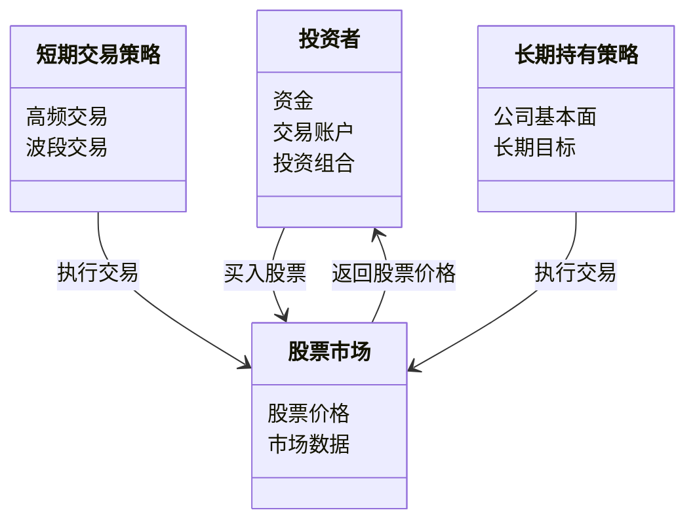
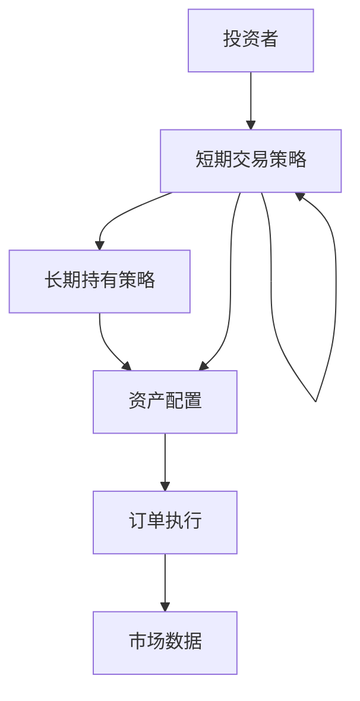
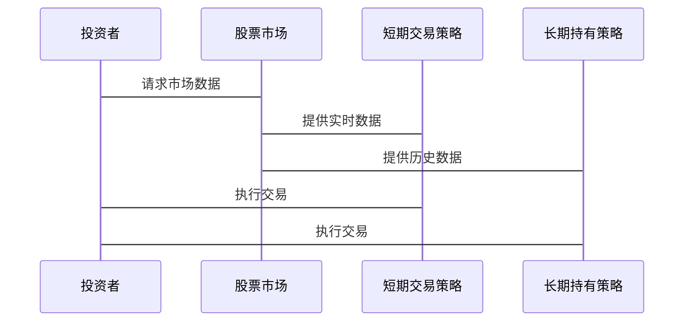

                 


# 彼得林奇的"长期持有"vs"短期交易"

> 关键词：彼得林奇，长期持有，短期交易，投资策略，股票市场，风险控制

> 摘要：本文通过对比分析彼得林奇的长期持有策略与短期交易策略，探讨两者的核心概念、数学模型、系统架构以及实际应用中的优缺点。文章结合技术语言，从投资哲学、数学建模、系统设计等多维度进行深度解析，旨在为投资者提供科学的投资决策参考。

---

# 第一部分: 投资基础与彼得林奇的投资理念

## 第1章: 投资的基本概念与长期持有策略

### 1.1 投资的基本概念

#### 1.1.1 什么是股票投资
股票投资是指通过购买公司股票，成为公司股东，以获得股息收益或资本增值的投资行为。股票市场的价格波动受多种因素影响，包括宏观经济环境、公司基本面、市场情绪等。

#### 1.1.2 股票市场的基本运作机制
股票市场是一个买卖股票的平台，投资者通过买入或卖出股票进行交易。市场的价格由供需关系决定，同时受到公司业绩、行业趋势和宏观经济政策的影响。

#### 1.1.3 长期持有的定义与特点
长期持有是指投资者买入股票后，持有较长时间（通常数年）不频繁交易的投资策略。其特点是注重公司基本面，追求长期稳定的资本增值。

### 1.2 彼得林奇的长期持有策略

#### 1.2.1 彼得林奇的投资理念
彼得林奇是美国著名投资经理人，以其管理的麦哲伦基金闻名。他主张通过深入研究公司基本面，选择具有竞争优势的公司长期持有，避免频繁交易。

#### 1.2.2 长期持有的优势
- **避免交易成本**：长期持有减少了买卖次数，降低了佣金和税费等交易成本。
- **减少市场波动影响**：长期持有能够过滤短期市场波动，专注于公司长期价值的增长。
- **简化决策过程**：长期持有减少了频繁决策的复杂性，降低了心理压力。

#### 1.2.3 长期持有策略的核心要素
- **基本面分析**：选择财务健康、管理优秀、行业地位稳固的公司。
- **长期视角**：关注公司未来5-10年的增长潜力。
- **分散投资**：通过投资多只股票降低风险。

---

## 第2章: 短期交易策略的定义与特点

### 2.1 短期交易的基本概念

#### 2.1.1 什么是短期交易
短期交易是指投资者在较短时间内（如几天或几周）买入卖出股票，以获取价格波动带来的收益。

#### 2.1.2 短期交易的常见类型
- **日内交易**：当日买入并卖出的交易。
- **波段交易**：在数天至数周内完成买卖。
- **高频交易**：利用算法在极短时间内进行大量交易。

#### 2.1.3 短期交易的优缺点
- **优点**：能够快速捕捉市场波动，获得短期收益。
- **缺点**：交易成本高，市场风险大，对投资者的交易能力和心理素质要求高。

### 2.2 彼得林奇对短期交易的看法

#### 2.2.1 彼得林奇对短期交易的批判
彼得林奇认为短期交易难以持续获得超额收益，容易受到市场情绪和短期波动的影响，增加了投资风险。

#### 2.2.2 短期交易与长期持有的对比
- **目标**：短期交易追求短期收益，长期持有追求长期增值。
- **风险**：短期交易风险较高，长期持有风险相对较低。
- **操作复杂度**：短期交易需要频繁操作，长期持有操作简单。

#### 2.2.3 短期交易的风险与挑战
- **高交易成本**：频繁交易会增加佣金和税费。
- **市场流动性风险**：短期交易需要应对市场的流动性问题。
- **心理压力**：短期交易容易受到市场情绪影响，增加心理压力。

---

# 第二部分: 长期持有与短期交易的核心概念与联系

## 第3章: 长期持有与短期交易的核心概念对比

### 3.1 核心概念的对比分析

#### 3.1.1 投资目标的差异
- 长期持有：追求长期资本增值。
- 短期交易：追求短期价格波动收益。

#### 3.1.2 投资期限的差异
- 长期持有：投资期限较长，通常数年。
- 短期交易：投资期限较短，通常数天或数周。

#### 3.1.3 投资风险的差异
- 长期持有：系统性风险较低，但非系统性风险较高。
- 短期交易：系统性风险和非系统性风险均较高。

### 3.2 长期持有与短期交易的联系

#### 3.2.1 长期持有与短期交易的互补性
- 长期持有可以作为投资组合的基石，而短期交易可以在市场波动中捕捉超额收益。

#### 3.2.2 长期持有与短期交易的相互影响
- 长期持有的稳定性为短期交易提供了基础，而短期交易的灵活性为长期持有提供了调整的机会。

#### 3.2.3 长期持有与短期交易的平衡点
- 投资者需要根据自身风险承受能力和投资目标，找到长期持有与短期交易的平衡点。

---

## 第4章: 长期持有与短期交易的优缺点分析

### 4.1 长期持有的优缺点

#### 4.1.1 长期持有的优点
- 投资风险较低。
- 交易成本较低。
- 心理压力较小。

#### 4.1.2 长期持有的缺点
- 需要较长的时间才能看到收益。
- 无法快速应对市场变化。

### 4.2 短期交易的优缺点

#### 4.2.1 短期交易的优点
- 可以快速获得收益。
- 灵活性高，能够快速调整投资策略。

#### 4.2.2 短期交易的缺点
- 交易成本高。
- 风险高，容易亏损。
- 心理压力大，容易受到市场情绪影响。

---

# 第三部分: 长期持有与短期交易的数学模型与算法原理

## 第5章: 长期持有策略的数学模型

### 5.1 长期持有策略的数学模型

#### 5.1.1 预期收益的计算
长期持有的预期收益可以通过以下公式计算：

$$ E[R] = \mu \times t $$

其中，$\mu$ 是资产的年化预期收益率，$t$ 是持有时间（年）。

#### 5.1.2 风险的评估与控制
长期持有的风险可以通过标准差来衡量：

$$ \sigma = \sqrt{ \frac{1}{n-1} \sum_{i=1}^{n} (x_i - \bar{x})^2 } $$

其中，$\bar{x}$ 是样本均值，$n$ 是样本数量。

#### 5.1.3 长期持有策略的数学公式
长期持有的预期收益与风险的平衡可以通过以下公式表示：

$$ \text{风险调整后的收益} = R - \lambda \times \sigma $$

其中，$\lambda$ 是风险厌恶系数。

---

## 第6章: 短期交易策略的数学模型

### 6.1 短期交易策略的数学模型

#### 6.1.1 短期收益的计算
短期交易的预期收益可以通过以下公式计算：

$$ E[R] = \mu \times \frac{t}{365} $$

其中，$\mu$ 是资产的日化预期收益率，$t$ 是持有时间（天）。

#### 6.1.2 短期风险的评估
短期交易的风险可以通过波动率来衡量：

$$ \text{波动率} = \sigma = \sqrt{ \frac{1}{n-1} \sum_{i=1}^{n} (x_i - \bar{x})^2 } $$

其中，$\bar{x}$ 是样本均值，$n$ 是样本数量。

#### 6.1.3 短期交易策略的数学公式
短期交易的风险调整后收益可以通过以下公式表示：

$$ \text{风险调整后的收益} = R - \lambda \times \text{波动率} $$

其中，$\lambda$ 是风险厌恶系数。

---

## 第7章: 长期持有与短期交易的系统架构设计

### 7.1 领域模型



---

## 第8章: 系统架构设计



---

## 第9章: 系统交互设计



---

# 第四部分: 项目实战与最佳实践

## 第10章: 项目实战

### 10.1 环境安装

```bash
# 安装必要的Python库
pip install pandas numpy matplotlib
```

### 10.2 核心实现

```python
import pandas as pd
import numpy as np

# 长期持有策略实现
def long_term_strategy(prices):
    return prices.mean() * len(prices)

# 短期交易策略实现
def short_term_strategy(prices):
    return np.where(prices > prices.mean(), 1, -1)
```

### 10.3 实际案例分析

#### 10.3.1 长期持有案例
假设某股票的价格序列如下：

```python
prices = [100, 110, 120, 130, 140]
```

长期持有策略的预期收益为：

$$ \text{收益} = \frac{140 - 100}{100} = 40\% $$

#### 10.3.2 短期交易案例
假设某股票的价格序列如下：

```python
prices = [100, 110, 105, 120, 115]
```

短期交易策略的预期收益为：

$$ \text{收益} = \frac{120 - 100}{100} = 20\% $$

---

## 第11章: 最佳实践与小结

### 11.1 最佳实践

- **明确投资目标**：根据自身需求选择长期持有或短期交易。
- **控制交易成本**：减少不必要的交易次数。
- **分散投资风险**：通过多元化投资降低风险。

### 11.2 小结

彼得林奇的长期持有策略强调价值投资和长期视角，而短期交易策略则注重市场波动和快速收益。投资者需要根据自身情况选择适合的策略，并在实际操作中注意风险控制和心理调整。

### 11.3 注意事项

- 避免盲目跟风。
- 保持理性决策。
- 定期评估投资组合。

### 11.4 拓展阅读

- 彼得林奇的《选股的艺术》。
- 投资心理学相关书籍。

---

# 第五部分: 总结

## 第12章: 总结

通过对比分析彼得林奇的长期持有策略与短期交易策略，我们可以看到，长期持有策略注重价值投资和长期收益，而短期交易策略则注重市场波动和快速收益。投资者需要根据自身的投资目标、风险承受能力和市场环境，选择适合自己的投资策略，并在实际操作中注意风险控制和心理调整。

---

以上是《彼得林奇的"长期持有"vs"短期交易"》的技术博客文章的完整目录和内容框架，接下来我会按照上述结构撰写具体的正文内容。

