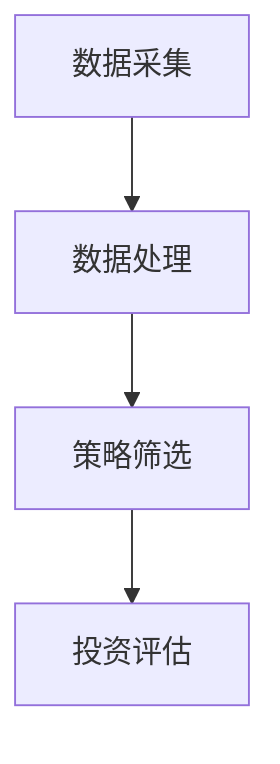
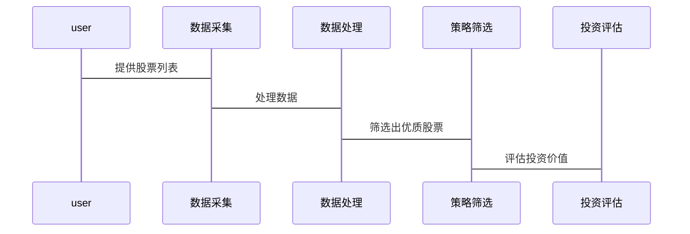

                 


# 彼得林奇的"长期持有"投资策略解析

**关键词**: 彼得林奇，长期持有，投资策略，价值投资，风险管理，投资组合

**摘要**: 本文深入解析了彼得林奇的“长期持有”投资策略，从其核心理念、数学模型到实际应用，结合投资分析系统的构建，全面探讨了该策略的理论基础和实践方法。文章不仅分析了长期持有策略的优势与挑战，还通过实际案例展示了如何在不同市场环境下应用这一策略，为投资者提供了有价值的参考和启示。

---

# 第一部分: 长期持有投资策略的背景与基础

## 第1章: 彼得林奇与长期持有投资策略概述

### 1.1 彼得林奇的生平简介
彼得·林奇是美国著名投资专家，以其长期持有的投资策略闻名。他强调长期投资，避免频繁交易，注重基本面分析。

### 1.2 长期持有投资策略的核心理念
长期持有策略主张买入优质股票并长期持有，避免短期波动的干扰，追求长期的资本增值。

### 1.3 长期持有与短期交易的对比
- **长期持有**：强调长期增值，分散风险，适合风险承受能力较高的投资者。
- **短期交易**：注重短期收益，风险较高，适合经验丰富的投资者。

### 1.4 长期持有策略的适用场景
- 长期持有适合长期稳健增长的投资者，特别适合那些能够承受市场短期波动的投资者。

---

# 第二部分: 长期持有投资策略的核心概念与联系

## 第2章: 长期持有策略的核心要素分析

### 2.1 价值投资与成长投资的对比
- **价值投资**：寻找被低估的股票，注重安全边际。
- **成长投资**：投资于增长潜力大的公司，注重未来收益。

### 2.2 分散投资与集中投资的平衡
- **分散投资**：降低风险，但可能错失大牛股。
- **集中投资**：提高收益，但风险较大。

### 2.3 风险管理与投资组合优化
- 风险管理是长期持有策略的重要组成部分，通过合理的资产配置分散风险。

### 2.4 长期持有策略与市场周期的关系
- 长期持有策略在市场周期中表现稳定，能够抵御短期波动的影响。

### 2.5 核心概念对比表格
| 概念 | 定义 | 特点 | 长期持有策略中的应用 |
|------|------|------|---------------------|
| 价值投资 | 以低于内在价值的价格买入优质股票 | 强调安全边际 | 核心投资 |

---

# 第三部分: 长期持有投资策略的算法原理

## 第3章: 长期持有策略的算法原理

### 3.1 投资标的选择标准
- **基本面分析**：关注公司的财务状况、盈利能力、行业地位等。

### 3.2 投资组合的构建原则
- 分散投资：避免过度集中于某一只股票或行业。

### 3.3 风险管理的注意事项
- 设置止损点：当股价下跌到一定程度时，及时卖出以减少损失。

### 3.4 投资决策流程
1. 选择优质股票
2. 分散投资组合
3. 定期评估和调整

### 3.5 用Python实现的基本面评分系统
```python
def calculate_intrinsic_value(stock_data):
    # 计算内在价值的函数
    return stock_data['现金流'].sum() / stock_data['贴现率']
```

---

# 第四部分: 长期持有投资策略的数学模型

## 第4章: 长期持有策略的数学模型

### 4.1 内在价值的计算公式
$$ \text{内在价值} = \frac{\text{未来现金流}}{\text{贴现率}} $$

### 4.2 投资组合优化的数学模型
$$ \text{收益} = \sum_{i=1}^{n} w_i \times r_i $$
$$ \text{风险} = \sum_{i=1}^{n} w_i^2 \times \sigma_i^2 $$

---

# 第五部分: 长期持有投资策略的系统分析与架构设计

## 第5章: 投资分析系统的构建

### 5.1 系统功能设计
- 数据采集模块：收集股票的基本面数据。
- 筛选模块：根据长期持有策略筛选出优质股票。
- 评估模块：计算内在价值，评估投资价值。

### 5.2 系统架构设计
用mermaid画出系统架构图：


### 5.3 系统交互设计
用mermaid画出交互序列图：


---

# 第六部分: 长期持有投资策略的项目实战

## 第6章: 长期持有策略的实际应用

### 6.1 实战环境安装
- 安装Python和相关库（如pandas、numpy）。

### 6.2 核心代码实现
```python
import pandas as pd
import numpy as np

def calculate_intrinsic_value(stock_data):
    return stock_data['现金流'].sum() / stock_data['贴现率']

# 示例数据
stock_data = pd.DataFrame({
    '现金流': [100, 200, 300],
    '贴现率': [0.1, 0.1, 0.1]
})

# 计算内在价值
intrinsic_value = calculate_intrinsic_value(stock_data)
print(intrinsic_value)
```

### 6.3 实际案例分析
以科技行业为例，选择几只优质股票，详细解读分析过程。

---

# 第七部分: 长期持有投资策略的最佳实践与总结

## 第7章: 长期持有策略的最佳实践

### 7.1 投资理念
- 长期持有优质股票，避免频繁交易。

### 7.2 风险管理
- 设置止损点，分散投资。

### 7.3 交易策略
- 定期评估投资组合，及时调整。

### 7.4 小结
长期持有策略是一种有效的投资策略，需要结合基本面分析和风险管理。

---

# 总结

本文全面解析了彼得林奇的长期持有投资策略，从理论基础到实际应用，帮助投资者更好地理解和应用这一策略。通过系统的构建和实际案例的分析，为投资者提供了有价值的参考和启示。

