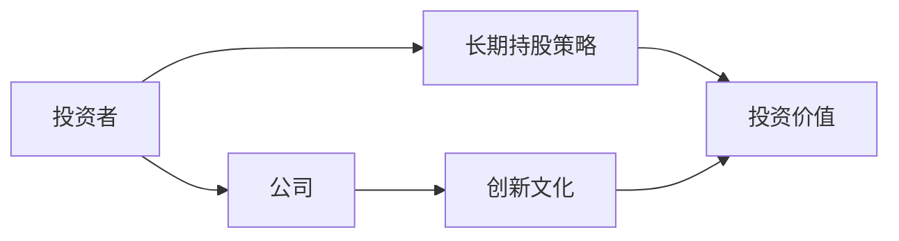
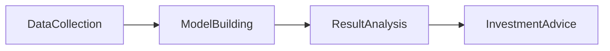

                 


### 第1章: 彼得林奇的长期持股策略

#### 1.1 长期持股的定义与核心要素

##### 1.1.1 长期持股的定义
长期持股是一种投资策略，指投资者长期持有股票，不频繁买卖，以期望获得资本增值和股息收益。这种策略强调对公司的长期表现有信心，关注企业的基本面和长期发展。

##### 1.1.2 长期持股的核心要素
- **时间跨度**：通常指持有时间超过一年，避免短期市场波动的影响。
- **基本面分析**：关注公司的财务状况、行业地位、管理团队等，选择具备长期增长潜力的公司。
- **分散投资**：通过投资不同行业和公司的股票，降低风险。
- **耐心与纪律**：在市场波动时保持冷静，避免因短期亏损而卖出。

##### 1.1.3 长期持股与短期投资的对比
长期持股与短期投资在目标、时间跨度、风险承受等方面存在显著差异。长期持股注重长期增长，而短期投资关注短期收益和市场波动。

### 第2章: 公司创新文化的定义与特征

#### 2.1 创新文化的定义
创新文化是指企业在创新方面的文化和价值观，包括鼓励创新、支持员工创新、开放的文化氛围等。它强调通过创新来提升企业的竞争力和市场地位。

#### 2.2 创新文化的核心特征
- **开放性**：鼓励员工提出新想法和创新方案。
- **支持性**：提供资源和环境支持员工创新。
- **灵活性**：适应变化，快速响应市场趋势。
- **激励机制**：通过奖励机制激励员工创新。

#### 2.3 创新文化与企业绩效的关系
创新文化能够提升企业的创新能力，增强市场竞争力，进而提高企业绩效。研究表明，具备创新文化的公司通常具有更高的增长率和利润率。

### 第3章: 长期持股与公司创新文化的关联性

#### 3.1 关联性的背景介绍
- **投资者与企业的关系**：投资者通过长期持股支持企业，企业通过创新文化提升绩效，形成良性循环。
- **长期持股对企业的潜在影响**：长期持股为公司提供稳定的资金支持，减少短期压力，促进公司长期创新。
- **创新文化在企业中的作用**：创新文化能够提升公司竞争力，增加长期价值，吸引长期投资者。

#### 3.2 关联性分析
- **长期持股如何促进创新文化**：长期持股提供稳定的资金支持，减少短期压力，使企业能够专注于长期创新。
- **创新文化如何影响长期持股的价值**：创新能力强的企业通常具有更高的长期增长潜力，吸引长期投资者。
- **两者之间的相互作用机制**：长期持股支持企业创新，创新文化提升企业价值，两者相互促进，形成正向反馈。

### 第4章: 核心概念与联系

#### 4.1 核心概念的内在联系
- **长期持股的内在逻辑**：通过长期持有优质股票，获得资本增值。
- **创新文化的内在逻辑**：通过鼓励创新，提升企业竞争力和长期价值。
- **两者之间的相互作用**：长期持股支持创新文化，创新文化增强长期持股的价值。

#### 4.2 概念属性对比表
| 属性               | 长期持股                          | 创新文化                          |
|--------------------|------------------------------------|------------------------------------|
| 目标               | 资本增值                          | 提升竞争力                        |
| 时间跨度           | 长期（超过一年）                  | 持续（企业长期发展）              |
| 风险承受能力       | 较高（接受市场波动）              | 较低（通过创新降低风险）          |
| 与企业关系         | 投资者与企业长期合作              | 企业文化与员工创新                |

#### 4.3 ER实体关系图


### 第5章: 算法原理

#### 5.1 算法原理概述
为了量化长期持股与创新文化之间的关系，我们可以构建一个数学模型，评估创新文化对长期股价的影响。

#### 5.2 数学模型
假设公司的创新文化指数为C，长期股价增长率为R。我们可以通过回归分析建立以下模型：
$$ R = \beta_0 + \beta_1 C + \epsilon $$

其中，$\beta_0$是截距，$\beta_1$是创新文化指数C的回归系数，$\epsilon$是误差项。

#### 5.3 实证分析
通过收集多家公司的创新文化指数和股价数据，进行回归分析，验证模型的有效性。

### 第6章: 系统分析与架构设计

#### 6.1 问题场景介绍
我们需要设计一个系统，评估公司的创新文化，并预测其长期股价表现。

#### 6.2 系统功能设计
- **数据收集**：收集公司的创新文化指数和股价数据。
- **模型构建**：建立回归模型，评估创新文化对股价的影响。
- **结果分析**：分析模型结果，提供投资建议。

#### 6.3 系统架构设计


### 第7章: 项目实战

#### 7.1 环境安装
需要安装Python、Pandas、Scikit-learn等工具。

#### 7.2 核心代码实现
```python
import pandas as pd
import numpy as np
from sklearn.linear_model import LinearRegression
from sklearn.metrics import r2_score

# 数据加载
data = pd.read_csv('company_data.csv')

# 模型训练
model = LinearRegression()
model.fit(data[['C']], data['R'])

# 模型评估
predictions = model.predict(data[['C']])
print("R²:", r2_score(data['R'], predictions))
```

#### 7.3 案例分析
以科技公司为例，分析创新文化指数对股价的影响，验证模型的有效性。

### 第8章: 最佳实践

#### 8.1 小结
长期持股与公司创新文化密切相关，长期持股支持创新，创新提升长期价值。

#### 8.2 注意事项
- 需要持续关注公司的创新能力和市场环境。
- 长期持股需具备足够的耐心和风险承受能力。

#### 8.3 拓展阅读
推荐阅读彼得林奇的相关书籍，深入理解长期投资策略。

通过以上步骤，我们可以系统地分析彼得林奇的长期持股策略与公司创新文化的关联性，为企业和投资者提供有价值的见解和建议。

