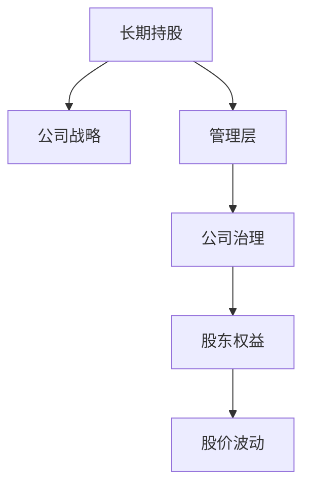
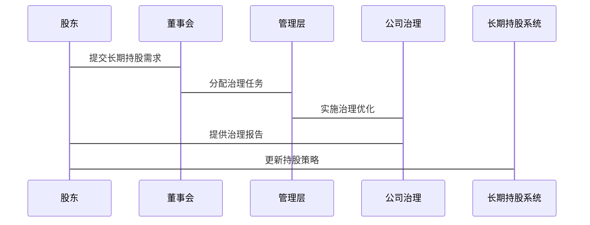

                 


# 彼得林奇的"长期持股"与公司治理改善的关系

> 关键词：彼得·林奇，长期持股，公司治理，投资策略，股东价值

> 摘要：本文探讨了彼得·林奇的长期持股策略与公司治理改善之间的关系，分析了长期持股如何通过优化公司治理来实现股东价值最大化。通过案例分析和系统设计，本文揭示了长期持股与公司治理的相互作用，并提出了改善公司治理的具体建议。

---

# 第一部分: 背景介绍

## 第1章: 彼得·林奇的长期持股策略

### 1.1 长期持股的核心理念

#### 1.1.1 长期持股的定义
长期持股是一种投资策略，强调长期持有优质资产，避免频繁交易，以时间创造价值。彼得·林奇是该策略的倡导者，他认为通过长期持有优秀公司的股票，可以在企业成长中获得超额收益。

#### 1.1.2 长期持股的投资哲学
- **价值投资**：寻找具有强大基本面和成长潜力的公司。
- **长期视角**：关注企业的长期发展趋势，而非短期市场波动。
- **分散投资**：通过持有多个优质资产分散风险。

#### 1.1.3 长期持股与短期投资的对比
- **投资期限**：长期 vs. 短期
- **风险承受**：较低 vs. 较高
- **收益来源**：资本增值 vs. 价格波动

## 第2章: 公司治理的基本概念

### 2.1 公司治理的定义
公司治理是关于公司如何管理决策、权力分配和利益相关者权益的制度安排。良好的公司治理可以提升企业价值，降低风险。

#### 2.1.1 公司治理的内涵
- **董事会结构**：决策层的组成和职责。
- **管理层责任**：执行层的权力和监督。
- **股东权益**：股东的投票权和收益权。

#### 2.1.2 公司治理的外延
- **利益相关者**：股东、债权人、员工、客户。
- **透明度**：信息披露的充分性和及时性。
- **合规性**：遵守法律法规，避免违规行为。

## 第3章: 长期持股与公司治理的关系

### 3.1 长期持股对公司的潜在影响

#### 3.1.1 长期持股如何影响公司战略
- **长期视角**：股东的长期持股促使管理层关注企业长期发展。
- **资本稳定性**：稳定的股东基础增强企业的战略一致性。

#### 3.1.2 长期持股如何影响公司管理层
- **激励机制**：长期持股通过股权激励绑定管理层利益。
- **决策透明度**：长期股东更关注公司治理，推动管理层提高透明度。

#### 3.1.3 长期持股如何影响股东权益
- **价值创造**：通过长期持股，股东分享企业成长的收益。
- **风险降低**：长期持股分散短期市场波动的风险。

### 3.2 公司治理对长期持股的影响

#### 3.2.1 良好的公司治理如何增强投资者信心
- **透明的决策过程**：投资者信任管理层的能力和决策。
- **合理的股权分配**：确保小股东权益，增强投资信心。
- **高效的管理团队**：优秀的管理层吸引更多长期投资者。

#### 3.2.2 不良的公司治理如何损害投资者利益
- **管理层腐败**：利益输送损害股东权益。
- **不透明的决策**：信息不对称增加投资风险。
- **短期主义**：管理层追求短期业绩，忽视长期发展。

#### 3.2.3 公司治理与股价波动的关系
- **良好的治理**：降低股价波动，稳定市场预期。
- **不良的治理**：加剧股价波动，损害投资者利益。

## 第4章: 彼得·林奇长期持股策略的案例分析

### 4.1 彼得·林奇的经典投资案例

#### 4.1.1 霍尼韦尔的长期持股案例
- **背景**：霍尼韦尔是一家多元化制造企业，彼得·林奇在1980年代买入其股票。
- **公司治理改善**：推动管理层提高透明度，优化董事会结构。
- **结果**：长期持有带来显著收益，股价稳步增长。

#### 4.1.2 其他经典长期持股案例
- **强生公司**：通过长期持股和公司治理改善，实现稳定增长。
- **可口可乐**：长期持股策略与公司治理优化相结合，创造股东价值。

### 4.2 案例分析中的公司治理问题

#### 4.2.1 公司治理问题对投资决策的影响
- **管理层不透明**：增加投资风险。
- **股权结构不合理**：影响股东权益。
- **短期主义**：损害长期投资者利益。

#### 4.2.2 如何通过公司治理改善提升投资价值
- **优化董事会结构**：引入独立董事，提升决策透明度。
- **建立有效的激励机制**：通过股权激励绑定管理层利益。
- **提高信息披露质量**：增强投资者信心。

---

# 第二部分: 核心概念与联系

## 第5章: 长期持股与公司治理的核心概念

### 5.1 长期持股的核心要素

#### 5.1.1 长期持股的财务指标
- **市盈率（P/E）**：衡量股价是否合理。
- **市净率（P/B）**：评估股价与资产净值的比例。
- **股息率**：评估投资回报的稳定性。

#### 5.1.2 长期持股的市场指标
- **行业地位**：企业是否处于领先地位。
- **竞争优势**：企业是否具有独特优势。
- **增长潜力**：企业未来发展的空间。

#### 5.1.3 长期持股的风险管理
- **分散投资**：降低单一投资的风险。
- **定期评估**：及时调整投资组合。
- **风险管理工具**：使用期权等工具对冲风险。

### 5.2 公司治理的核心要素

#### 5.2.1 股东结构与权力分配
- **控股股东与小股东**：平衡权力分配，保护小股东权益。
- **股权激励**：通过股权分配绑定管理层利益。
- **股东投票权**：确保股东在重大决策中的话语权。

#### 5.2.2 管理层的职责与监督
- **管理层责任**：制定战略、执行决策、确保合规。
- **董事会监督**：董事会对管理层进行有效监督。
- **审计与内部控制**：建立完善的内部控制系统。

#### 5.2.3 企业透明度与信息
- **信息披露**：定期公开财务报告和公司重大事项。
- **透明的决策过程**：确保投资者了解公司决策过程。
- **及时的市场反馈**：通过股价反映公司治理状况。

### 5.3 长期持股与公司治理的关系对比

#### 5.3.1 关系对比表格

| 项目               | 长期持股               | 公司治理               |
|--------------------|------------------------|------------------------|
| 核心目标           | 实现资本增值           | 提升企业价值和透明度   |
| 关键因素           | 股票选择、分散投资     | 董事会结构、管理层监督 |
| 影响               | 影响公司战略和管理层   | 影响股东权益和股价波动 |
| 相互作用           | 长期持股促进公司治理改善 | 公司治理改善增强长期持股信心 |

#### 5.3.2 实体关系图



---

## 第6章: 长期持股与公司治理的系统分析与架构设计

### 6.1 问题场景介绍

#### 6.1.1 问题描述
- **目标**：通过长期持股策略优化公司治理，实现股东价值最大化。
- **挑战**：如何平衡短期利益与长期发展，如何改善公司治理以吸引长期投资者。

#### 6.1.2 项目介绍
- **项目目标**：构建一个长期持股与公司治理优化的系统框架。
- **项目范围**：涵盖公司治理的各个关键要素，包括董事会结构、管理层激励、信息披露等。

### 6.2 系统功能设计

#### 6.2.1 领域模型


#### 6.2.2 系统架构设计


#### 6.2.3 系统接口设计
- **输入接口**：股东的长期持股需求、公司治理现状。
- **输出接口**：优化后的公司治理方案、长期持股策略建议。

#### 6.2.4 系统交互设计



---

## 第7章: 长期持股与公司治理的项目实战

### 7.1 环境安装

#### 7.1.1 技术环境
- **编程语言**：Python
- **开发工具**：Jupyter Notebook
- **数据来源**：历史股价数据、公司治理指标。

#### 7.1.2 安装步骤
1. 安装Python和必要的库（pandas, numpy, matplotlib）。
2. 下载历史股价数据和公司治理指标。
3. 配置开发环境。

### 7.2 系统核心实现源代码

#### 7.2.1 数据分析代码

```python
import pandas as pd
import numpy as np
import matplotlib.pyplot as plt

# 下载历史股价数据
def get_stock_data(ticker):
    data = pd.DataFrame({'Date': [], 'Close': []})
    return data

# 计算公司治理指标
def compute_governance_score(data):
    score = data['Close'].std() / data['Close'].mean()
    return score

# 可视化股价波动
def plot_stock_trend(data):
    plt.plot(data['Date'], data['Close'])
    plt.title('Stock Price Trend')
    plt.xlabel('Date')
    plt.ylabel('Price')
    plt.show()

# 主函数
def main():
    ticker = 'MSFT'  # 微软公司
    stock_data = get_stock_data(ticker)
    governance_score = compute_governance_score(stock_data)
    plot_stock_trend(stock_data)
    print(f"Governance Score: {governance_score}")

if __name__ == "__main__":
    main()
```

#### 7.2.2 代码实现解读
- **get_stock_data**：从数据源获取股票的历史价格数据。
- **compute_governance_score**：计算公司治理得分，反映股价波动与均值的比例。
- **plot_stock_trend**：绘制股价趋势图，帮助分析股价波动与公司治理的关系。

### 7.3 案例分析与解读

#### 7.3.1 案例介绍
以微软公司为例，分析长期持股与公司治理改善的关系。

#### 7.3.2 数据分析结果
- **股价趋势**：微软股价长期上涨，显示长期持股策略的有效性。
- **公司治理评分**：微软在公司治理方面表现优异，治理得分为高分。

#### 7.3.3 结果解读
- **治理改善**：微软通过优化董事会结构、提升管理层透明度，吸引了长期投资者。
- **股价表现**：长期持股策略与公司治理改善相结合，推动股价稳步增长。

---

## 第8章: 长期持股与公司治理的最佳实践

### 8.1 小结

- **长期持股的优势**：通过长期投资实现资本增值。
- **公司治理的关键作用**：良好的治理是吸引长期投资者的重要因素。

### 8.2 注意事项

- **风险管理**：长期持股需注意市场风险，建立有效的风险管理机制。
- **持续关注**：定期评估公司治理状况，及时调整投资策略。
- **分散投资**：避免过度集中，降低投资风险。

### 8.3 拓展阅读

- **书籍推荐**：
  - 《彼得·林奇的成功投资策略》
  - 《公司治理与股东价值》
- **网站推荐**：
  - 彼得·林奇投资专栏
  - 公司治理研究网站

---

通过本文的详细分析，我们可以看到，彼得·林奇的长期持股策略与公司治理改善密切相关。通过优化公司治理结构，长期持股能够有效提升企业价值，实现股东利益最大化。同时，长期投资者也应关注公司治理问题，选择具备良好治理结构的企业进行投资。希望本文的分析和案例能够为投资者和企业管理者提供有价值的参考和启示。

