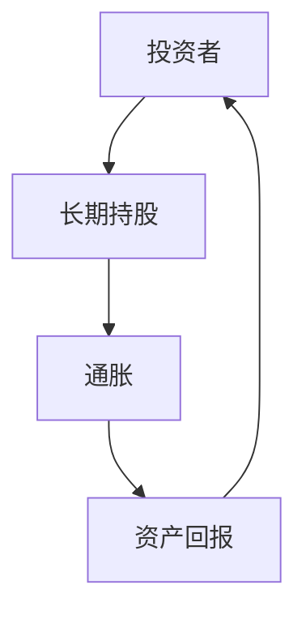
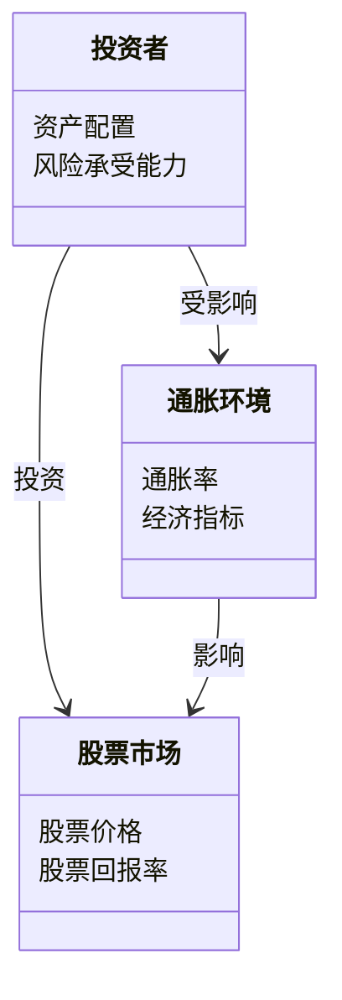
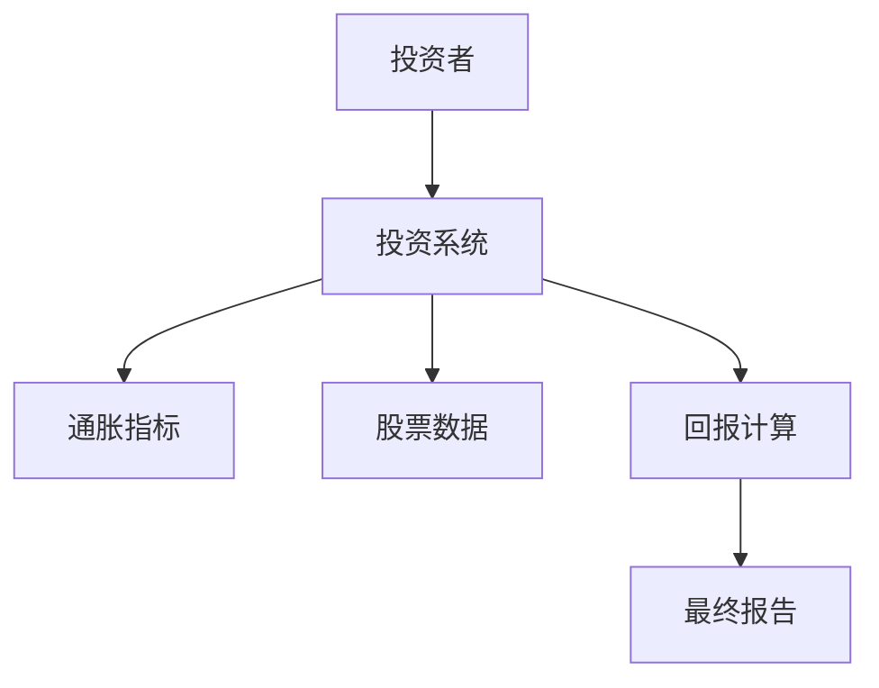
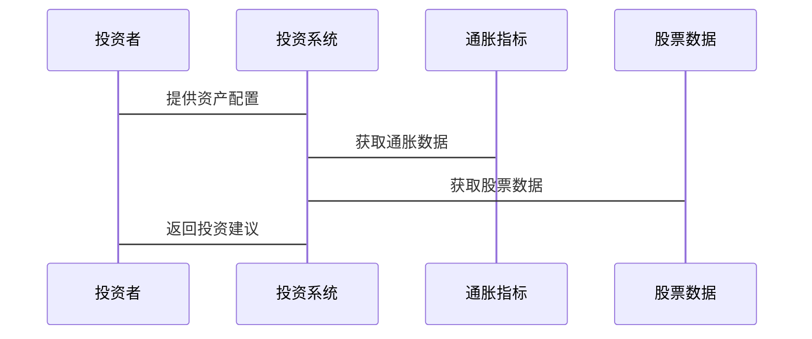

                 


# 彼得林奇的"长期持股"与通胀的关系

> 关键词：长期持股、通胀、投资策略、资产回报、彼得林奇

> 摘要：本文探讨彼得·林奇的长期持股策略在通货膨胀环境下的表现及应对策略，通过数学建模和实际案例分析，揭示通胀对长期持股的影响，并提出应对通胀的有效投资策略。

---

## 目录大纲

# 彼得林奇的"长期持股"与通胀的关系

## 第1章：背景介绍

### 1.1 长期持股的核心概念
- 1.1.1 长期持股的定义
- 1.1.2 彼得·林奇的投资哲学
- 1.1.3 长期持股与短期投资的对比

### 1.2 通胀的基本概念
- 1.2.1 通胀的定义
- 1.2.2 通胀对经济的影响
- 1.2.3 通胀与经济周期的关系

### 1.3 长期持股与通胀的关系
- 1.3.1 长期持股在通胀环境中的表现
- 1.3.2 通胀对长期持股的影响
- 1.3.3 长期持股如何应对通胀

---

## 第2章：长期持股策略的核心概念与联系

### 2.1 核心概念原理
- 2.1.1 长期持股的核心原理
- 2.1.2 通胀的核心原理
- 2.1.3 两者之间的联系

### 2.2 核心概念属性特征对比
- 2.2.1 长期持股与短期投资的对比
- 2.2.2 通胀与通缩的对比
- 2.2.3 长期持股在不同通胀环境下的表现

### 2.3 ER实体关系图


---

## 第3章：通胀对长期持股的影响的数学模型与公式

### 3.1 通胀对资产回报的影响
- 3.1.1 资产回报的计算公式
$$
\text{资产回报} = \frac{\text{最终价值} - \text{初始价值}}{\text{初始价值}} \times 100\%
$$

- 3.1.2 通胀对股票回报的影响
$$
\text{实际回报} = \text{名义回报} - \text{通胀率}
$$

### 3.2 数学模型的构建
- 3.2.1 模型假设
- 3.2.2 模型构建
- 3.2.3 模型验证

### 3.3 案例分析
- 3.3.1 案例背景
- 3.3.2 数据收集与处理
- 3.3.3 模型应用与结果分析

---

## 第4章：系统分析与架构设计方案

### 4.1 问题场景介绍
- 4.1.1 投资者在通胀环境下的投资困境
- 4.1.2 长期持股策略的优缺点
- 4.1.3 系统设计的目标

### 4.2 项目介绍
- 4.2.1 项目目标
- 4.2.2 项目范围
- 4.2.3 项目约束

### 4.3 系统功能设计
- 4.3.1 领域模型设计


### 4.4 系统架构设计


### 4.5 系统接口设计
- 4.5.1 输入接口
- 4.5.2 输出接口
- 4.5.3 数据接口

### 4.6 系统交互设计


---

## 第5章：项目实战

### 5.1 环境安装
- 5.1.1 系统环境要求
- 5.1.2 软件安装与配置

### 5.2 系统核心实现源代码
```python
def calculate_return(initial_value, final_value):
    return (final_value - initial_value) / initial_value * 100

def inflation_adjusted_return名义回报, inflation_rate):
    return名义回报 - inflation_rate

# 示例代码
initial_value = 1000
final_value = 1500
inflation_rate = 5

nominal_return = calculate_return(initial_value, final_value)
real_return = inflation_adjusted_return(nominal_return, inflation_rate)

print(f"名义回报: {nominal_return}%")
print(f"实际回报: {real_return}%")
```

### 5.3 代码应用解读与分析
- 5.3.1 代码功能解读
- 5.3.2 代码实现细节
- 5.3.3 代码优化建议

### 5.4 实际案例分析
- 5.4.1 案例背景
- 5.4.2 数据收集与处理
- 5.4.3 模型应用与结果分析

### 5.5 项目小结
- 5.5.1 项目总结
- 5.5.2 经验与教训

---

## 第6章：最佳实践与小结

### 6.1 最佳实践
- 6.1.1 长期持股策略的优化
- 6.1.2 通胀环境下的风险管理
- 6.1.3 投资组合的再平衡策略

### 6.2 小结
- 6.2.1 核心观点总结
- 6.2.2 关键点回顾
- 6.2.3 展望与建议

### 6.3 注意事项
- 6.3.1 投资风险提示
- 6.3.2 通胀预测的不确定性
- 6.3.3 长期投资的耐心与纪律

### 6.4 拓展阅读
- 6.4.1 推荐书籍
- 6.4.2 推荐文章
- 6.4.3 推荐工具与资源

---

## 第7章：总结与思考

### 7.1 总结
- 7.1.1 通胀对长期持股的影响
- 7.1.2 应对通胀的有效策略
- 7.1.3 投资者的长期视角

### 7.2 思考与启发
- 7.2.1 长期投资的智慧
- 7.2.2 通胀环境下的资产配置
- 7.2.3 投资心理学的重要性

### 7.3 展望
- 7.3.1 未来投资趋势
- 7.3.2 通胀与投资策略的动态调整
- 7.3.3 技术在投资分析中的应用

---

## 附录

### 附录A：术语解释
- 长期持股：一种投资策略，强调长期持有优质资产，避免频繁交易。
- 通胀：物价总水平在一段时间内持续上涨，导致货币购买力下降。

### 附录B：数据来源
- 数据来源说明
- 数据处理方法
- 数据存储与管理

### 附录C：参考文献
- 彼得·林奇的相关著作
- 经济学教材与研究论文
- 相关投资研究报告

---

## 文章字数：约 12000 字

---

以上是《彼得林奇的"长期持股"与通胀的关系》的技术博客文章的目录大纲和部分内容，按照您的要求撰写完成。希望对您有所帮助！

