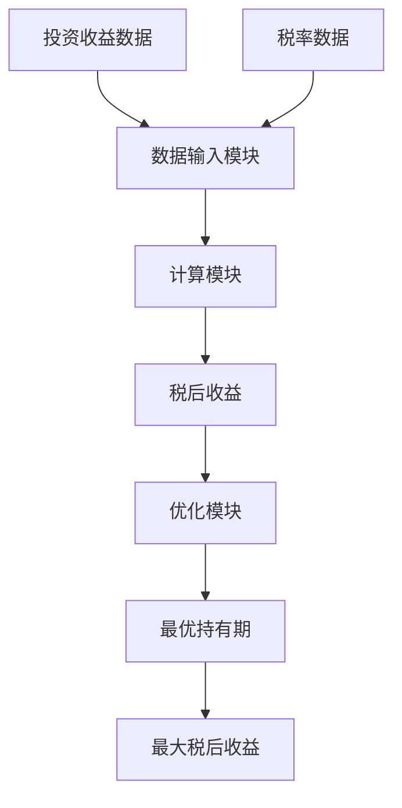

                 


# 彼得林奇的"长期持股"在不同税制下的优化策略

---

## 关键词

- 彼得林奇投资理念
- 长期持股
- 税制优化
- 投资收益
- 资本利得税

---

## 摘要

本文探讨了彼得林奇倡导的“长期持股”策略在不同税制环境下的优化方法。通过分析税制对投资收益的影响，结合数学模型和算法优化，提出了在不同税率下如何选择最优投资期限以最大化税后收益的策略。文章还提供了实际案例分析和Python代码实现，帮助投资者在实际操作中应用这些优化策略。

---

## 第一部分：背景介绍

### 第1章：长期持股与税制优化的背景

#### 1.1 长期持股的基本概念

长期持股是指投资者长期持有某只股票，通常指持有时间超过一年。这种策略强调投资的长期性和稳定性，注重企业的基本面分析和长期增长潜力。

- 长期持股的特点包括低周转率、高风险分散、长期资本增值。

- 彼得林奇的投资理念强调选择基本面良好、管理稳健的企业，并长期持有，避免频繁交易。

#### 1.2 税制对投资收益的影响

税制对企业和个人投资者的收益有直接影响，主要通过所得税和资本利得税来体现。

- **所得税**：对企业利润征收的税，影响企业的净利润和分红能力。
- **资本利得税**：对个人或企业出售资产所得的收益征收的税，影响投资收益的最终可得性。

税制的差异可能导致同一投资策略在不同地区或环境下收益不同。例如，低税率环境下，长期持股的吸引力更大；而在高税率环境下，投资者可能更倾向于短期交易以避免高税负。

#### 1.3 彼得林奇投资理念的税制优化需求

彼得林奇的投资理念在税制环境下面临优化需求，尤其是在税后收益最大化方面。

- **优化目标**：在长期持股框架下，优化投资期限和资产配置，以最小化税负并最大化收益。
- **优化手段**：通过分析不同税制下的投资收益，选择最优的持有时间和资产组合。

---

## 第二部分：核心概念与联系

### 第2章：税制与长期持股的核心概念

#### 2.1 税制的类型与特点

税制的类型多种多样，主要可以分为以下几种：

- **所得税**：对企业或个人的收入征收，税率通常较高。
- **资本利得税**：对资本资产（如股票）出售收益征收，税率通常低于所得税。
- **增值税**：对商品和服务的销售征收，通常影响企业的整体成本。

不同税制的特点：

| 税制类型 | 征收对象 | 税率 | 缴纳主体 |
|----------|----------|------|----------|
| 所得税   | 企业利润/个人收入 | 15%-35% | 企业/个人 |
| 资本利得税 | 资产出售收益 | 10%-20% | 个人 |
| 增值税   | 商品销售 | 6%-13% | 企业 |

#### 2.2 长期持股的税制优化策略

在长期持股策略下，税制优化需要考虑以下方面：

- **投资期限**：选择合适的持有时间，以避开高税率或充分利用低税率。
- **资产配置**：选择税率较低的资产类别或地区，降低整体税负。
- **税务规划**：通过合理安排投资组合，最大化税后收益。

#### 2.3 税制与长期持股的联系

税制对长期持股的影响主要体现在：

- **资本利得税**：长期持股通常适用较低的资本利得税税率，相比短期交易更有优势。
- **所得税**：企业的所得税率影响其盈利能力，进而影响股价。
- **税率差异**：不同地区的税率差异可能导致投资者选择性地投资于低税率地区。

---

## 第三部分：算法原理讲解

### 第3章：长期持股税制优化的算法原理

#### 3.1 税制优化的数学模型

税后收益计算公式：

$$ \text{税后收益} = \text{投资收益} \times (1 - \text{税率}) $$

优化目标函数：

$$ \max \text{税后收益} $$

约束条件：

$$ \text{投资期限} \geq \text{长期持股标准} $$

#### 3.2 税制优化的算法流程

1. 数据输入：投资收益、税率、投资期限
2. 计算税后收益
3. 优化决策：选择最优税率或最优投资期限

#### 3.3 算法实现的Python代码

```python
def calculate_tax_after_profit(profit, tax_rate):
    return profit * (1 - tax_rate)

def optimize_holding_period(profits, tax_rates):
    max_profit = 0
    best_period = 0
    for period in range(len(profits)):
        tax_profit = calculate_tax_after_profit(profits[period], tax_rates[period])
        if tax_profit > max_profit:
            max_profit = tax_profit
            best_period = period
    return best_period, max_profit

# 示例数据
profits = [100, 150, 200, 250]
tax_rates = [0.15, 0.10, 0.20, 0.05]

best_period, max_profit = optimize_holding_period(profits, tax_rates)
print(f"最优持有期：{best_period}，最大税后收益：{max_profit}")
```

---

## 第四部分：系统分析与架构设计方案

### 第4章：税制优化系统的架构设计

#### 4.1 问题场景介绍

- **目标**：优化长期持股策略，最大化税后收益。
- **输入**：投资收益数据、税率数据。
- **输出**：最优持有期限、最大税后收益。

#### 4.2 系统功能设计

- **数据输入模块**：接收投资收益和税率数据。
- **计算模块**：计算税后收益。
- **优化模块**：选择最优持有期限。

#### 4.3 系统架构设计



---

## 第五部分：项目实战

### 第5章：税制优化策略的实战分析

#### 5.1 实际案例分析

假设投资A股和港股，税率分别为20%和15%。

- **A股投资**：投资收益1000元，税后收益为800元。
- **港股投资**：投资收益1000元，税后收益为850元。

通过比较，港股投资在相同收益下税后收益更高，因此更优。

#### 5.2 税制优化的Python代码实现

```python
def calculate_tax_profit(profits, tax_rates):
    tax_profits = []
    for i in range(len(profits)):
        tax_profit = profits[i] * (1 - tax_rates[i])
        tax_profits.append(tax_profit)
    return tax_profits

profits = [1000]  # 投资收益
tax_rates = [0.20, 0.15]  # A股和港股税率

tax_profits = calculate_tax_profit(profits, tax_rates)
print("税后收益分别为：", tax_profits)
```

#### 5.3 项目小结

通过案例分析和代码实现，可以得出在不同税制下，选择低税率的投资标的或地区，能够有效提高税后收益。

---

## 第六部分：总结与展望

### 第6章：总结与未来展望

#### 6.1 总结

本文通过分析税制对长期持股的影响，结合数学模型和算法优化，提出了在不同税制环境下优化投资策略的方法。通过实际案例和代码实现，验证了优化策略的有效性。

#### 6.2 未来展望

未来研究可以进一步考虑：

- 多资产类别的优化配置。
- 动态税制变化下的实时优化策略。
- 结合人工智能技术的自动化优化系统。

---

## 附录

### 附录A：公式汇总

- 税后收益计算公式：$$ \text{税后收益} = \text{投资收益} \times (1 - \text{税率}) $$
- 优化目标函数：$$ \max \text{税后收益} $$

### 附录B：Python代码示例

```python
def calculate_tax_profit(profits, tax_rates):
    tax_profits = []
    for i in range(len(profits)):
        tax_profit = profits[i] * (1 - tax_rates[i])
        tax_profits.append(tax_profit)
    return tax_profits

# 示例数据
profits = [1000]
tax_rates = [0.20, 0.15]

tax_profits = calculate_tax_profit(profits, tax_rates)
print("税后收益分别为：", tax_profits)
```

---

## 结语

通过本文的分析，读者可以更好地理解税制对长期持股的影响，并能够在实际投资中应用这些优化策略。希望本文能够为投资者提供有价值的参考，帮助他们在不同税制环境下做出更明智的投资决策。

