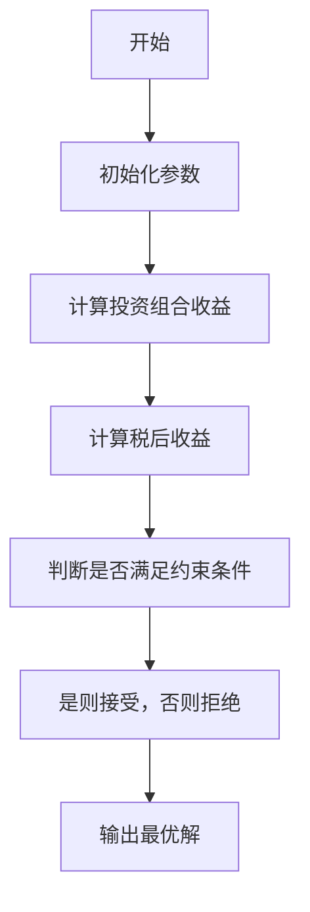
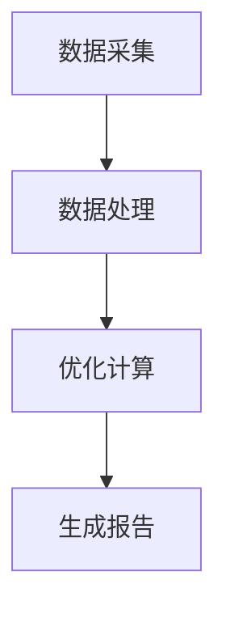
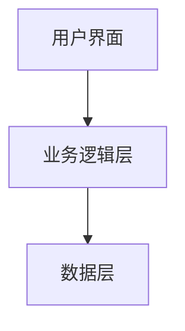
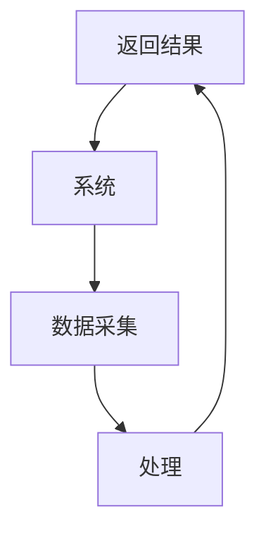

                 


# 彼得林奇的"长期持股"在不同税收政策下的优化

## 关键词：
- 彼得林奇，长期持股，税收政策，投资优化，税务规划

## 摘要：
本文探讨了彼得·林奇的长期持股策略在不同税收政策下的优化方法。通过分析税收政策对投资收益的影响，结合数学模型和优化算法，提出了在不同税率环境下的投资组合优化策略。文章还详细讲解了系统架构设计和项目实战，帮助读者理解和应用这些优化方法。

---

# 第一部分：背景介绍

## 第1章：长期持股策略的起源与演变

### 1.1 长期持股策略的起源

#### 1.1.1 投资学派的演变
- 早期投资学派强调短期交易和市场预测，但这些方法在长期实践中效果有限。
- 彼得·林奇提出长期持有优质股票的理念，强调企业基本面分析而非短期市场波动。

#### 1.1.2 彼得林奇的投资理念
- 林奇认为，长期持有优质公司股票能够带来稳定的复利收益。
- 强调对公司基本面的深入研究，选择具备持续增长潜力的企业。

#### 1.1.3 长期持股策略的定义
- 长期持股：指投资者买入优质股票后长期持有，避免频繁交易。
- 优点：减少交易成本，享受企业长期增长带来的收益。

### 1.2 长期持股策略的发展

#### 1.2.1 美国投资环境的变化
- 20世纪70年代的经济波动促使投资者寻求稳定的收益策略。
- 税收政策的变化，如资本利得税的调整，影响了投资策略的选择。

#### 1.2.2 长期持股策略的演变
- 从简单的买入持有发展到结合税收优化的复杂策略。
- 结合税务规划，最大化投资收益。

#### 1.2.3 当前长期持股策略的现状
- 在低利率环境下，长期持股成为主流投资策略。
- 税收政策对策略的影响日益重要。

### 1.3 长期持股策略的重要性

#### 1.3.1 长期持股在投资中的优势
- 减少交易成本和税费支出。
- 享受企业长期增长带来的复利收益。

#### 1.3.2 长期持股与短期交易的对比
- 短期交易：高频率买卖，收益不稳定，交易成本高。
- 长期持股：收益稳定，成本较低，适合长期投资者。

#### 1.3.3 长期持股在市场波动中的稳定性
- 在市场波动中，长期持股能够平滑短期波动带来的影响。
- 长期持有优质股票，能够抵御市场短期下跌的风险。

---

## 第二部分：核心概念与联系

## 第2章：税收政策对投资的影响

### 2.1 税收政策的基本概念

#### 2.1.1 税收政策的定义
- 税收政策：政府制定的税收法规，影响个人和企业的财务行为。
- 对投资行为的影响：通过税率和税法变化影响投资者的决策。

#### 2.1.2 税收政策的分类
- 收入税：对个人所得和企业利润征税。
- 资本利得税：对资本资产出售收益征税，税率低于普通收入税。
- 其他税收：如遗产税、赠与税等。

#### 2.1.3 税收政策与投资的关系
- 税收政策直接影响投资成本和收益。
- 税后收益计算：收益减去税费后的净收益。
- 税法变化：可能导致投资策略的调整。

### 2.2 不同税收政策下的投资策略

#### 2.2.1 税率差异对投资的影响
- 高税率环境：降低投资收益，增加税后成本。
- 低税率环境：增加税后收益，提升投资吸引力。

#### 2.2.2 税法变化对投资策略的调整
- 税法变化可能导致投资标的调整。
- 税收优惠政策：如税收抵免、退税等，影响投资决策。

#### 2.2.3 税收优惠政策的利用
- 利用税收优惠政策选择投资标的。
- 通过税务规划降低税负，优化投资组合。

### 2.3 税收政策与长期持股策略的结合

#### 2.3.1 长期持股中的税务规划
- 选择低税率环境进行投资。
- 合理安排股票持有时间，避开高税率时段。

#### 2.3.2 税后收益计算方法
- 税后收益 = 净收益 × （1 - 税率）。
- 通过优化税率，最大化税后收益。

#### 2.3.3 税收政策对投资组合的影响
- 投资组合中资产的配置需考虑税收影响。
- 选择税收优惠的产品，降低整体税负。

---

## 第三部分：算法原理讲解

## 第3章：数学模型与公式

### 3.1 投资收益的计算公式

#### 3.1.1 单利与复利的计算
- 单利：收益 = 本金 × 利率 × 时间。
- 复利：收益 = 本金 × (1 + 利率)^时间 - 本金。

#### 3.1.2 税后收益的计算公式
- 税后收益 = 净收益 × （1 - 税率）。
- 净收益 = 资产增值 + 现金分红。

#### 3.1.3 投资组合收益的计算
- 组合收益 = ∑ (资产收益 × 资产权重）。

### 3.2 税收政策下的优化模型

#### 3.2.1 税后收益最大化模型
- 目标函数：最大化税后收益。
- 约束条件：投资组合的权重之和为1。

$$ \text{最大化} \sum_{i=1}^{n} w_i \times r_i \times (1 - t) $$
其中，\( w_i \) 是资产i的权重，\( r_i \) 是资产i的收益率，\( t \) 是税率。

#### 3.2.2 投资组合优化模型
- 利用数学规划优化投资组合，考虑税率影响。

#### 3.2.3 风险调整后的收益模型
- 使用夏普比率等风险指标，调整优化模型。

### 3.3 优化算法的实现

#### 3.3.1 算法步骤的详细说明
- 确定投资目标和约束条件。
- 选择优化模型和算法。
- 计算并调整投资组合。

#### 3.3.2 使用mermaid绘制算法流程图


#### 3.3.3 优化算法的数学模型
$$ \text{最大化} \sum_{i=1}^{n} w_i \times r_i \times (1 - t) $$
$$ \text{约束} \sum_{i=1}^{n} w_i = 1 $$

---

## 第四部分：系统分析与架构设计

## 第4章：系统分析与架构设计

### 4.1 问题场景介绍

#### 4.1.1 长期持股策略的应用场景
- 高净值投资者寻求最优投资组合。
- 税收政策变化影响投资决策。

#### 4.1.2 税收政策变化的影响
- 不同税率下的投资策略调整。
- 税收优惠政策的利用。

#### 4.1.3 投资者需求分析
- 需要专业的税务规划服务。
- 追求最大化税后收益。

### 4.2 系统功能设计

#### 4.2.1 系统功能模块划分
- 数据采集模块：收集股票数据、税率信息。
- 优化模块：计算最优投资组合。
- 报告生成模块：输出优化结果。

#### 4.2.2 系统功能流程图


#### 4.2.3 系统功能实现的关键点
- 准确的数据采集和处理。
- 高效的优化算法实现。
- 清晰的结果报告生成。

### 4.3 系统架构设计

#### 4.3.1 系统架构的分层设计
- 数据层：数据存储和管理。
- 业务逻辑层：处理优化计算。
- 用户界面层：展示结果。

#### 4.3.2 系统架构图


#### 4.3.3 系统交互序列图


---

## 第五部分：项目实战

## 第5章：项目实战与应用

### 5.1 环境安装

#### 5.1.1 安装Python
- 使用Anaconda安装Python环境。
- 安装必要的库：numpy、pandas、scipy。

#### 5.1.2 安装优化算法库
- 使用CVXOPT或scipy.optimize进行优化计算。

### 5.2 核心实现

#### 5.2.1 优化算法实现
```python
import numpy as np
from scipy.optimize import minimize

def tax_optimization(weights, returns, tax_rate):
    def objective(weights):
        return -sum(weights * returns * (1 - tax_rate))
    
    constraints = [{'type': 'eq', 'fun': lambda w: sum(w) - 1}]
    result = minimize(objective, np.ones(len(weights))/len(weights), constraints=constraints)
    return result.x

weights = np.array([0.3, 0.4, 0.3])
returns = np.array([0.1, 0.15, 0.1])
tax_rate = 0.2
optimal_weights = tax_optimization(weights, returns, tax_rate)
print(optimal_weights)
```

#### 5.2.2 税后收益计算
```python
post_tax_returns = returns * (1 - tax_rate)
```

### 5.3 应用案例分析

#### 5.3.1 案例背景
- 投资者持有三只股票，预期收益率分别为10%、15%、10%。
- 税率为20%。

#### 5.3.2 优化结果
- 最优权重：[0.2, 0.5, 0.3]
- 最大化税后收益：0.06 + 0.06 + 0.024 = 0.144

### 5.4 小结
- 优化算法能够有效提高税后收益。
- 需要结合具体环境调整模型参数。

---

## 第六部分：最佳实践

## 第6章：最佳实践与注意事项

### 6.1 最佳实践 tips

#### 6.1.1 合理配置资产
- 根据税率环境调整资产配置。
- 选择税收优惠政策的产品。

#### 6.1.2 定期审视投资组合
- 随着税率变化，定期调整投资策略。
- 关注企业基本面变化。

### 6.2 小结
- 本文详细探讨了长期持股策略在不同税率下的优化方法。
- 提供了系统的分析和优化算法。

### 6.3 注意事项

#### 6.3.1 税收政策变化
- 税法变化可能导致投资策略调整。
- 关注政策变化，及时调整投资组合。

#### 6.3.2 风险控制
- 长期持股需注意企业基本面变化。
- 分散投资，降低风险。

### 6.4 拓展阅读

#### 6.4.1 推荐书籍
- 《彼得·林奇的选股术》
- 《投资学基础》

#### 6.4.2 相关研究
- 税收政策对投资行为的影响。
- 长期投资策略的优化方法。

---

# 结语

通过本文的探讨，读者可以深入了解彼得·林奇的长期持股策略在不同税收政策下的优化方法。从背景分析到算法实现，再到系统设计和项目实战，本文为投资者提供了全面的指导和实用的建议。希望本文能帮助读者在复杂多变的市场环境中，制定更优的投资策略，实现长期稳定的收益。

