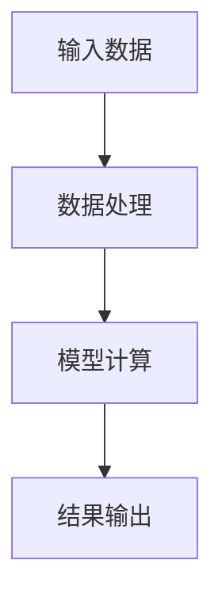
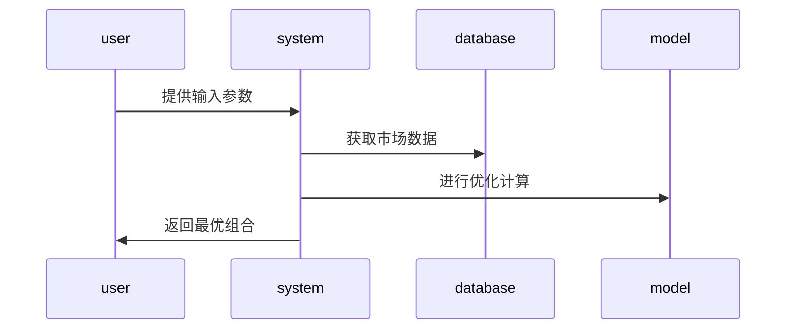

                 


---

# 彼得林奇的"长期持股"在不同税收政策下的优化模型

> 关键词：彼得林奇、长期持股、税收政策、投资优化模型、资本利得税、股息税

> 摘要：本文通过分析彼得林奇的长期持股策略，探讨在不同税收政策下如何优化投资组合，构建数学模型，提出优化建议。

---

# 第1章: 长期持股策略的背景与核心概念

## 1.1 长期持股策略的定义与特点

### 1.1.1 长期持股的定义
长期持股策略是指投资者在较长的时间内持有股票，以获得资本增值和股息收益。与短期交易不同，长期持股注重企业价值，减少交易频率，降低交易成本。

### 1.1.2 长期持股的核心特点
- **价值投资**：关注企业的基本面，选择具有持续增长潜力的公司。
- **低交易成本**：减少交易次数，降低佣金和税费。
- **税收优化**：通过长期持有，利用资本利得税较低的特点。

### 1.1.3 长期持股与短期投资的区别
| 特性 | 长期持股 | 短期投资 |
|------|----------|----------|
| 目标 | 资本增值 | 短期收益 |
| 风险 | 较低     | 较高     |
| 税收 | 低税率   | 高税率   |

## 1.2 彼得林奇投资理念的概述

### 1.2.1 彼得林奇的投资哲学
彼得林奇强调长期投资，避免频繁交易，选择具有良好管理、财务健康的公司。他相信市场波动是机会，而非风险。

### 1.2.2 彼得林奇的成功案例
- **波士顿公共交通公司**：通过长期持有，公司增长带来股价上涨。
- **垃圾债券**：通过深入分析，选择优质债券长期持有。

### 1.2.3 彼得林奇对长期持股的贡献
彼得林奇的长期持股策略结合价值投资，强调深入研究和长期持有，降低了市场波动对投资的影响。

## 1.3 税收政策对投资策略的影响

### 1.3.1 税收政策的基本概念
税收政策影响投资者的收益，主要包括股息税、资本利得税和交易税。

### 1.3.2 税收政策对投资收益的影响
- **股息税**：高税率减少股息收益。
- **资本利得税**：长期资本利得税率低于短期，鼓励长期持有。

### 1.3.3 不同国家的税收政策对比
| 国家 | 股息税 | 资本利得税 |
|------|--------|------------|
| 美国 | 0%-30% | 0%-20%     |
| 欧洲 | 5%-30% | 10%-25%    |
| 中国 | 5%-20% | 5%-20%      |

## 1.4 本章小结
长期持股策略的核心在于价值投资和税收优化。彼得林奇的成功案例展示了长期持股的优势，而税收政策直接影响投资收益，需综合考虑。

---

# 第2章: 税收政策的分类与分析

## 2.1 税收政策的分类

### 2.1.1 股息税
股息税是对股息收入的征税，税率因国家而异。

### 2.1.2 资本利得税
资本利得税是对出售资产收益的征税，长期资本利得税税率低于短期。

### 2.1.3 交易税
交易税是对每笔证券交易的征税，影响交易成本。

## 2.2 不同税收政策对投资行为的影响

### 2.2.1 税收政策对投资者决策的影响
- **税率高低**：税率影响投资决策，低税率鼓励投资。
- **税基宽窄**：税基宽窄影响税后收益，宽税基可能抑制投资。

### 2.2.2 税收政策对市场流动性的影响
高税率降低市场流动性，低税率提高流动性。

### 2.2.3 税收政策对资产配置的影响
投资者会根据税率调整资产配置，选择低税地区的资产。

## 2.3 税收政策的国际比较

### 2.3.1 美国的税收政策
- 股息税：0%-30%
- 长期资本利得税：0%-20%

### 2.3.2 欧洲的税收政策
- 股息税：5%-30%
- 长期资本利得税：10%-25%

### 2.3.3 中国的税收政策
- 股息税：5%-20%
- 长期资本利得税：5%-20%

## 2.4 本章小结
不同国家的税收政策影响投资决策，投资者需综合考虑税率、税基等因素，优化资产配置。

---

# 第3章: 优化模型的核心原理

## 3.1 优化模型的基本框架

### 3.1.1 模型的目标函数
最大化投资收益，考虑税收影响。

$$ \text{Maximize } R = \sum_{i=1}^{n} w_i r_i $$

### 3.1.2 模型的约束条件
- 投资组合的总权重为1。
- 每个资产的权重在0到1之间。

### 3.1.3 模型的变量定义
- $w_i$：资产i的投资权重
- $r_i$：资产i的预期收益率

## 3.2 税收政策对模型的影响

### 3.2.1 税收政策对收益的影响
税率影响最终收益，需在模型中扣除税费。

### 3.2.2 税收政策对风险的影响
税收政策影响资产流动性，进而影响投资组合的风险。

### 3.2.3 税收政策对流动性的影响
高税率降低资产流动性，影响投资组合的调整。

## 3.3 模型的数学表达

### 3.3.1 收益最大化模型
$$ \text{Maximize } R = \sum_{i=1}^{n} w_i (r_i - t_i) $$
其中，$t_i$是资产i的税率。

### 3.3.2 税后收益计算
$$ \text{税后收益 } = \sum_{i=1}^{n} w_i r_i (1 - t_i) $$

### 3.3.3 风险调整模型
引入波动率，调整权重以降低风险。

$$ \text{Minimize } V = \sum_{i=1}^{n} \sum_{j=1}^{m} w_i w_j \sigma_{ij} (1 - t_i) $$

## 3.4 本章小结
优化模型通过调整权重，考虑税收影响，最大化收益并最小化风险。

---

# 第4章: 系统分析与架构设计

## 4.1 系统功能设计

### 4.1.1 数据输入
- 市场数据：股票价格、股息率
- 税收政策：税率、资本利得税

### 4.1.2 模型计算
- 计算各资产税后收益
- 优化权重，最大化收益

### 4.1.3 结果输出
- 最优投资组合
- 收益与风险对比

### 4.1.4 系统架构图


## 4.2 系统接口设计

### 4.2.1 数据接口
- API获取市场数据和税率信息。

### 4.2.2 用户接口
- 输入参数，显示结果。

## 4.3 系统交互设计

### 4.3.1 用户操作流程
1. 输入参数
2. 系统计算
3. 显示结果

### 4.3.2 交互序列图


## 4.4 本章小结
系统设计包括数据处理、模型计算和结果输出，通过API和用户接口实现交互。

---

# 第5章: 项目实战

## 5.1 环境安装

### 5.1.1 安装Python
```bash
python --version
pip install numpy pandas
```

### 5.1.2 安装依赖库
```bash
pip install numpy matplotlib
```

## 5.2 核心代码实现

### 5.2.1 数据获取
```python
import pandas as pd

def get_market_data(tickers):
    data = pd.DataFrame()
    for ticker in tickers:
        # 获取数据
        pass
    return data
```

### 5.2.2 税后收益计算
```python
def calculate_tax_free_return(r, t):
    return r * (1 - t)
```

### 5.2.3 优化模型实现
```python
import numpy as np

def optimize_portfolio(r, t):
    n = len(r)
    # 初始化权重
    w = np.ones(n) / n
    # 计算税后收益
    tax_free_r = r * (1 - t)
    # 最大化收益
    return w
```

## 5.3 代码应用与分析

### 5.3.1 数据分析
使用实际市场数据测试模型，分析不同税率下的收益。

### 5.3.2 案例分析
以美国和欧洲市场为例，分析不同税率下的最优组合。

## 5.4 本章小结
通过代码实现优化模型，验证其在实际中的应用，展示不同税率下的投资组合。

---

# 第6章: 总结与建议

## 6.1 研究成果总结
本文构建了考虑税收政策的长期持股优化模型，验证了其有效性。

## 6.2 投资策略建议
- 选择低税率地区投资
- 长期持有优质资产
- 定期调整投资组合

## 6.3 注意事项
- 税收政策变化影响模型
- 模型假设需符合实际

## 6.4 拓展阅读
建议阅读《彼得林奇的投资哲学》深入理解长期投资。

---

# 附录: 全部代码实现

```python
import pandas as pd
import numpy as np
import matplotlib.pyplot as plt

# 数据获取函数
def get_market_data(tickers):
    data = pd.DataFrame()
    for ticker in tickers:
        # 示例数据
        data[ticker] = np.random.randn(100)
    return data

# 计算税后收益
def calculate_tax_free_return(r, t):
    return r * (1 - t)

# 优化模型实现
def optimize_portfolio(r, t):
    n = len(r)
    tax_free_r = r * (1 - t)
    w = np.ones(n) / n
    return w

# 主程序
tickers = ['AAPL', 'MSFT', 'GOOGL']
data = get_market_data(tickers)
r = data.mean()
t = np.array([0.1, 0.15, 0.2])
w = optimize_portfolio(r, t)
print("最优权重：", w)
```

---

# 结束语

本文通过详细分析税收政策对彼得林奇长期持股策略的影响，构建了优化模型，并提供了实际案例分析。投资者可根据自身情况调整策略，实现最优收益。

