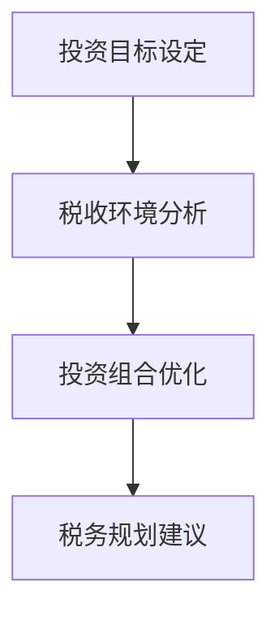

                 

# 彼得林奇的"长期持股"在不同税收环境下的优化策略

## 关键词：长期持股，彼得林奇，税收环境，投资优化，税务规划

## 摘要：本文探讨了彼得林奇倡导的长期持股策略在不同税收环境下的优化策略，分析了税收政策对投资回报的影响，并提出了在不同税率地区进行税务规划的具体方法。文章结合理论与实践，详细阐述了如何在不同税收环境下优化投资策略，以实现最大化的投资收益。

---

# 引言

## 1.1 长期持股策略的概述

### 1.1.1 长期持股的定义

长期持股是一种投资策略，指投资者长期持有优质股票，以分享企业的长期增长。彼得·林奇是该策略的倡导者，他认为长期持有优质股票能够最大化投资回报。

### 1.1.2 彼得·林奇的投资理念

彼得·林奇强调选择优质企业进行长期投资，避免频繁交易和短期波动的影响。他建议投资者关注企业的基本面，如盈利能力、管理团队和行业地位。

### 1.1.3 税收对投资回报的影响

税收是影响投资回报的重要因素。资本利得税、股息税等税收政策会直接影响投资收益。不同国家的税收政策差异显著，投资者需考虑税收因素优化投资策略。

---

## 1.2 税收环境对投资策略的影响

### 1.2.1 税收对投资决策的调节作用

税收政策通过影响投资成本和回报，调节投资行为。例如，低税率地区吸引投资者，而高税率地区可能增加投资成本。

### 1.2.2 不同税收政策下的投资策略差异

不同国家的税收政策差异可能导致投资策略的调整。例如，在高税率国家，投资者可能更倾向于税收优惠的投资产品。

### 1.2.3 本文的目的与结构安排

本文旨在分析彼得林奇的长期持股策略在不同税收环境下的优化方法，结构安排包括理论基础、策略分析、系统设计和案例实战。

---

# 第二部分：长期持股策略的理论基础

## 2.1 彼得·林奇的投资哲学

### 2.1.1 长期投资的核心理念

彼得·林奇认为长期投资能够减少交易成本和税负，同时享受企业的长期增长。他强调选择具有持续盈利能力的企业。

### 2.1.2 股票选择的三大原则

- 企业具有持续盈利能力。
- 管理团队稳定且有较强的能力。
- 企业处于具有增长潜力的行业。

### 2.1.3 风险控制与长期持股

通过分散投资、长期持有优质股票，彼得·林奇认为可以有效控制投资风险。

---

## 2.2 长期持股的核心原则

### 2.2.1 价值投资的内在逻辑

投资于具有合理价值的股票，长期持有以获得超额收益。

### 2.2.2 市场波动与长期策略的结合

市场波动为长期投资者提供了买入机会，避免频繁交易。

### 2.2.3 组合管理与风险分散

通过分散投资降低风险，同时优化资产配置以提高收益。

---

## 2.3 税收对长期持股的影响

### 2.3.1 资本利得税的计算与影响

资本利得税是对资本资产出售收益的征税，税率和计税基础影响投资回报。

### 2.3.2 股息税的差异与优化

股息税是股息收入的征税，不同国家税率不同，影响股息收入的净收益。

### 2.3.3 税收优惠政策的利用

利用税收优惠，如税收抵免和亏损抵扣，优化投资收益。

---

# 第三部分：不同税收环境下的优化策略

## 3.1 税收环境对投资策略的影响分析

### 3.1.1 税率差异对投资决策的影响

税率差异可能导致投资者选择低税率地区进行投资。

### 3.1.2 税收优惠地区的投资策略

在低税率地区投资，可享受税收优惠，降低投资成本。

### 3.1.3 税收环境的动态变化与策略调整

税收政策变化需及时调整投资策略，保持合规性。

---

## 3.2 低税率国家的优化策略

### 3.2.1 税收天堂的特点与选择

低税率、无资本利得税或股息税的国家和地区。

### 3.2.2 税收优惠地区的投资策略

选择税收优惠地区，优化资产配置，降低税负。

### 3.2.3 跨国投资的税务规划

利用不同国家的税收政策，优化跨国投资的税务结构。

---

## 3.3 高税率国家的应对策略

### 3.3.1 税收负担的最小化

通过优化投资组合，选择税收优惠的产品。

### 3.3.2 税收抵免与亏损抵扣的利用

利用税收抵免和亏损抵扣，减少税负。

### 3.3.3 税收政策的合规性与合法性

确保投资行为符合当地税收法规，避免税务风险。

---

# 第四部分：系统分析与架构设计方案

## 4.1 投资决策模型的构建

### 4.1.1 投资目标与约束条件

- 投资目标：长期收益最大化。
- 约束条件：税收政策、市场波动、资产流动性。

### 4.1.2 税收

#### 资本利得税计算：

$$ 税后收益 = 净收益 \times (1 - 税率) $$

#### 股息税计算：

$$ 税后股息收入 = 股息收入 \times (1 - 股息税率) $$

---

## 4.2 投资组合优化模型

### 4.2.1 税后收益最大化模型

$$ \text{最大化} \sum_{i=1}^{n} w_i r_i (1 - t_i) $$

其中，\( w_i \) 是资产i的权重，\( r_i \) 是预期收益率，\( t_i \) 是税率。

### 4.2.2 风险控制模型

$$ \text{最小化} \sum_{i=1}^{n} w_i^2 \sigma_i^2 $$

---

## 4.3 系统架构设计

### 4.3.1 系统功能设计

- 投资目标设定。
- 税收环境分析。
- 投资组合优化。
- 税务规划建议。

### 4.3.2 系统架构图

---

# 第五部分：项目实战

## 5.1 环境分析与策略制定

### 5.1.1 美国市场分析

- 资本利得税：长期资本利得税较低。
- 税务优化：利用税收抵免。

### 5.1.2 英国市场分析

- 高税率环境：需合理避税。

### 5.1.3 新加坡市场分析

- 低税率：适合长期投资。

## 5.2 税务优化策略

### 5.2.1 美国市场

利用税收抵免和长期资本利得税优惠。

### 5.2.2 英国市场

通过资产配置和税务规划降低税负。

### 5.2.3 新加坡市场

选择低税率产品，享受税收优惠。

---

## 5.3 投资组合优化与监控

### 5.3.1 投资组合监控

定期评估投资组合，确保符合税收优化目标。

### 5.3.2 税务调整与优化

根据税收政策变化及时调整投资组合。

---

# 第六部分：结论与展望

## 6.1 本章小结

彼得林奇的长期持股策略在不同税收环境下的优化方法，通过合理利用税收优惠，可以显著提高投资收益。

## 6.2 未来展望

未来研究可关注动态税收环境下的策略调整，以及大数据在税务优化中的应用。

---

# 参考文献

（此处应列出参考文献，但由于篇幅限制，未详细列出。）

---

通过以上结构，文章详细阐述了彼得林奇的长期持股策略在不同税收环境下的优化方法，结合理论与实践，为投资者提供了实用的税务规划建议。

