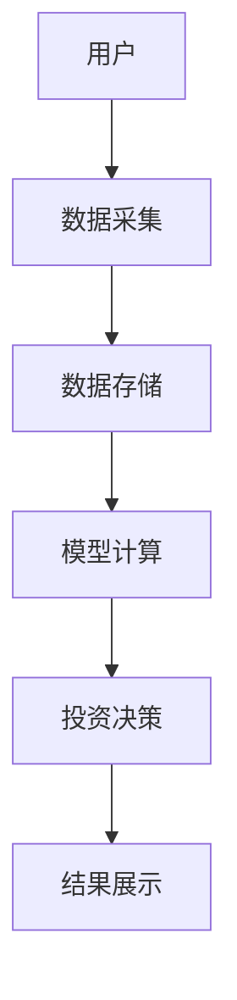
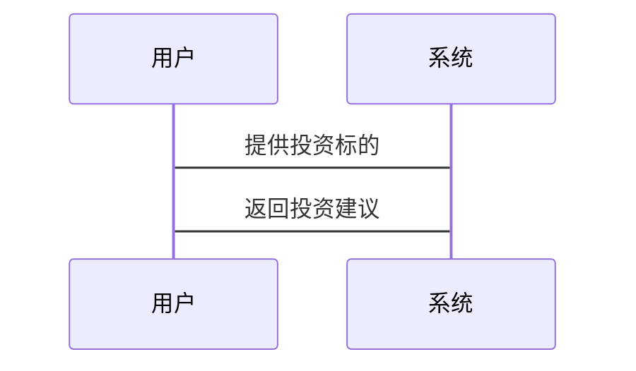

                 


# 彼得林奇的"长期持股"心理准备

## 关键词：长期持股，彼得林奇，投资心理学，风险管理，心态管理

## 摘要：本文深入探讨了彼得林奇的长期持股策略及其背后的心理准备。从基本概念到具体实施，详细分析了长期投资的重要性、心理因素、风险管理以及系统架构，帮助投资者在实践中应用这些策略。

---

# 第1章: 长期投资的基本概念

## 1.1 长期投资的定义与特点

### 1.1.1 长期投资的定义
长期投资是指投资者将资金投入某个资产（如股票、房地产）超过三年以上的投资行为，其核心在于通过时间的积累实现资产增值。

### 1.1.2 长期投资的核心特点
- **时间跨度长**：通常指3年以上。
- **价值增值**：通过资产增值和复利效应实现收益。
- **风险分散**：通过持有多种资产降低风险。

### 1.1.3 长期投资与短期投资的区别
| 方面 | 长期投资 | 短期投资 |
|------|----------|----------|
| 时间 | 3年以上   | 1年以内  |
| 风险 | 较低      | 较高      |
| 收益 | 稳定      | 波动较大  |

## 1.2 彼得·林奇的背景介绍

### 1.2.1 彼得·林奇的生平简介
- 美国著名投资经理，曾管理富达麦哲伦基金，年复合回报率13.7%。
- 以价值投资和长期持股闻名。

### 1.2.2 彼得·林奇的投资理念
- 专注于公司基本面分析。
- 长期持有优质股票，避免频繁交易。

### 1.2.3 彼得·林奇的成功案例
- 管理富达基金期间，基金规模从18美元增至123亿美元。

## 1.3 长期持股的意义与价值

### 1.3.1 长期持股的优势
- 充分利用复利效应。
- 降低交易成本和税务负担。

### 1.3.2 长期持股的风险
- 市场波动可能导致短期亏损。
- 公司基本面变化可能影响长期价值。

### 1.3.3 长期持股与财富增长的关系
长期持有优质资产是实现财富增长的有效方式，通过复利效应和价值增值实现资产的稳定增长。

---

# 第2章: 彼得·林奇的长期投资策略

## 2.1 彼得·林奇的投资哲学

### 2.1.1 价值投资的核心理念
寻找被市场低估的公司，长期持有，等待其价值回归。

### 2.1.2 长期持股的逻辑
- 市场短期波动，但长期趋势反映公司价值。
- 频繁交易增加成本，降低收益。

### 2.1.3 投资者心态的塑造
耐心和纪律是长期投资成功的关键。

## 2.2 彼得·林奇的选股标准

### 2.2.1 选股的核心要素
- 公司基本面良好。
- 具备竞争优势。
- 估值合理。

### 2.2.2 公司基本面分析
- 财务状况：关注利润、负债、现金流。
- 管理团队：稳定且有能力。
- 行业地位：市场领导者。

### 2.2.3 行业分析与竞争优势
- 行业前景：选择增长潜力大的行业。
- 竞争优势：公司具备独特优势。

## 2.3 投资组合管理

### 2.3.1 投资组合的构建原则
- 分散投资，降低风险。
- 选择优质公司，长期持有。

### 2.3.2 股票仓位的分配策略
- 根据资金规模和风险承受能力分配。
- 定期审视，调整仓位。

### 2.3.3 定期复盘与调整
- 定期评估投资组合表现。
- 根据市场变化调整策略。

---

# 第3章: 长期持股的心理准备

## 3.1 投资者心态的塑造

### 3.1.1 耐心与纪律的重要性
- 避免因市场波动而做出错误决策。
- 长期投资需要持续耐心。

### 3.1.2 避免情绪化决策的心理技巧
- 分散注意力，避免情绪影响决策。
- 制定明确的投资计划，严格执行。

### 3.1.3 建立长期投资的信念体系
- 相信长期价值，忽视短期波动。
- 理解市场波动是投资的一部分。

## 3.2 风险管理与心理准备

### 3.2.1 风险的识别与评估
- 识别潜在风险：市场风险、公司风险、流动性风险。
- 评估风险影响：对投资组合的影响。

### 3.2.2 心理承受能力的培养
- 接受波动：认识到市场波动是正常现象。
- 建立心理防线：设定止损点，避免重大损失。

### 3.2.3 风险控制的具体措施
- 分散投资：降低单一资产风险。
- 定期复盘：及时调整投资策略。

## 3.3 长期持股中的决策框架

### 3.3.1 信息收集与分析
- 收集公司基本面数据。
- 分析行业趋势和市场动态。

### 3.3.2 决策的逻辑与步骤
1. 确定投资目标。
2. 收集相关信息。
3. 分析数据，评估风险。
4. 做出决策。
5. 执行并监控。

### 3.3.3 决策执行中的心理调整
- 决策前：保持冷静，避免冲动。
- 决策后：持续监控，及时调整。

---

# 第4章: 长期投资中的风险管理

## 4.1 风险的分类与管理

### 4.1.1 系统性风险
- 来自整体市场波动。
- 无法通过分散投资完全规避。

### 4.1.2 非系统性风险
- 来自特定资产或行业。
- 可以通过分散投资降低。

### 4.1.3 风险控制策略
- 分散投资：降低非系统性风险。
- 定期评估：及时发现潜在风险。

## 4.2 风险评估与应对策略

### 4.2.1 风险评估方法
- 基本面分析：评估公司风险。
- 市场分析：评估市场风险。

### 4.2.2 风险应对策略
- 风险规避：通过分散投资降低风险。
- 风险转移：使用保险或对冲工具。

## 4.3 风险管理中的心理调整

### 4.3.1 保持冷静：市场波动是正常现象。
### 4.3.2 避免恐慌：重大损失时及时调整策略。
### 4.3.3 持续学习：提升风险管理能力。

---

# 第5章: 彼得·林奇投资模型的数学基础

## 5.1 投资模型概述

### 5.1.1 投资模型的基本假设
- 市场是有效的，但存在短期波动。
- 优质公司长期表现优于市场。

### 5.1.2 投资模型的核心公式
$$ V = \frac{E \times (1 + g)}{r - g} $$
其中，V为内在价值，E为当前收益，g为增长率，r为折现率。

## 5.2 投资模型的实现步骤

### 5.2.1 数据收集
- 收集公司过去5年的收益数据。
- 获取行业平均增长率。

### 5.2.2 数据分析
- 计算内在价值。
- 对比市盈率，判断是否低估。

### 5.2.3 投资决策
- 如果股价低于内在价值，买入并长期持有。
- 否则，等待更好的时机。

## 5.3 投资模型的优化

### 5.3.1 参数调整
- 根据市场变化调整增长率和折现率。
- 考虑通货膨胀和利率变化。

### 5.3.2 模型扩展
- 引入更多因素，如管理团队和行业趋势。

---

# 第6章: 系统架构设计

## 6.1 系统功能设计

### 6.1.1 功能模块
- 数据采集：收集公司基本面数据。
- 模型计算：计算内在价值。
- 投资决策：根据模型结果做出决策。

### 6.1.2 功能流程
1. 数据采集：获取公司财务数据。
2. 模型计算：计算内在价值。
3. 投资决策：根据结果做出决策。

## 6.2 系统架构设计

### 6.2.1 架构图


### 6.2.2 接口设计
- 数据接口：与数据源对接。
- 计算接口：模型计算结果。

## 6.3 系统交互设计

### 6.3.1 交互流程
1. 用户输入投资标的。
2. 系统采集数据。
3. 计算内在价值。
4. 提供投资建议。

### 6.3.2 交互图


---

# 第7章: 项目实战

## 7.1 环境安装

### 7.1.1 环境需求
- Python 3.8及以上
- 基本的开发工具（IDE）

### 7.1.2 数据源
- 公司财务数据：可以从Yahoo Finance获取。

## 7.2 核心实现

### 7.2.1 数据采集
```python
import yfinance as yf

def get_data(ticker):
    stock = yf.Ticker(ticker)
    info = stock.info
    return info
```

### 7.2.2 模型计算
```python
def calculate_intrinsic_value(ticker):
    info = get_data(ticker)
    E = info['trailingEps']
    g = 5  # 假设年增长率为5%
    r = 0.1  # 折现率10%
    V = (E * (1 + g)) / (r - g)
    return V
```

### 7.2.3 投资决策
```python
def investment_decision(ticker):
    V = calculate_intrinsic_value(ticker)
    current_price = get_data(ticker)['currentPrice']
    if current_price < V:
        return "买入"
    else:
        return "观望"
```

## 7.3 应用案例

### 7.3.1 案例分析
- 投资标的：苹果公司（AAPL）
- 计算结果：内在价值高于当前价格，建议买入。

### 7.3.2 代码实现
```python
print(investment_decision("AAPL"))  # 输出：买入
```

## 7.4 小结
通过代码实现彼得·林奇模型，投资者可以自动化评估股票价值，辅助投资决策。

---

# 第8章: 总结与展望

## 8.1 总结
彼得·林奇的长期持股策略强调价值投资和耐心持有，投资者需具备良好的心理准备和风险管理能力。

## 8.2 最佳实践 tips
- 建立长期投资心态，避免短期波动影响决策。
- 定期评估投资组合，及时调整策略。
- 学习风险管理技巧，降低投资风险。

## 8.3 注意事项
- 风险管理是长期投资的重要部分。
- 避免过度依赖模型，结合市场实际情况。

## 8.4 拓展阅读
- 《彼得·林奇的选股术》
- 《价值投资入门》

---

# 结语

通过本文的详细讲解，读者可以全面了解彼得·林奇的长期投资策略及其心理准备。从基本概念到系统设计，从理论分析到实战应用，帮助投资者在实际操作中应用这些策略，实现长期财富增长。

