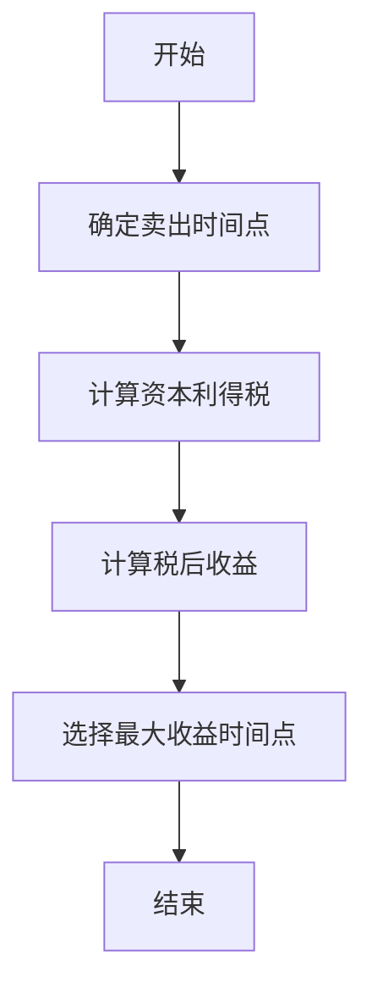
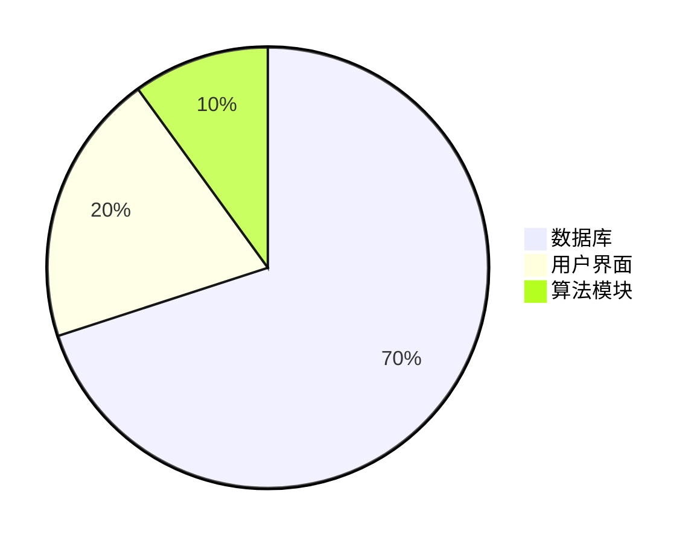
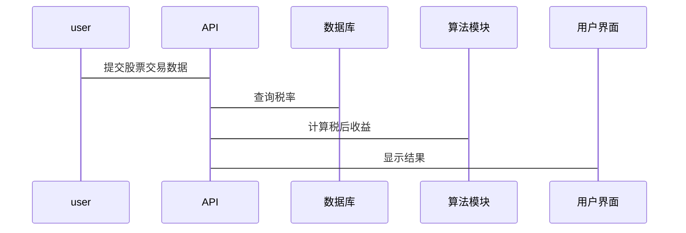

                 


# 彼得林奇的"长期持股"税收优化策略

> 关键词：长期持股，税收优化，资本利得税，投资策略，彼得林奇

> 摘要：本文详细探讨了彼得林奇的长期持股投资策略，并分析了其在税收优化方面的应用。通过数学模型和算法，本文提出了优化长期持股税收的具体方法，并提供了实际案例分析。文章结构包括背景介绍、核心概念、算法原理、系统架构设计、项目实战和最佳实践等内容，旨在为投资者提供科学的税收优化策略。

---

## 第一部分: 彼得林奇的长期持股策略概述

### 第1章: 长期持股的核心理念

#### 1.1 长期持股的定义与特点
- 长期持股的定义：投资者购买并持有优质股票数年，以获取资本增值和股息收益。
- 长期持股的特点： 
  - 时间跨度长
  - 低频交易
  - 风险分散
  - 资本利得为主

#### 1.2 彼得林奇的投资策略
- 投资理念：寻找具有强大竞争优势的公司，长期持有。
- 选股标准： 
  - 高ROE（净资产收益率）
  - 低PE（市盈率）
  - 高分红率
- 成功案例：以麦当劳为例，详细分析长期持股带来的收益。

#### 1.3 长期持股与短期投资的区别
- 风险承受能力不同：长期投资者能承受更大的短期波动。
- 交易成本不同：长期持股减少交易费用和税务负担。

---

### 第2章: 税收优化的基本原理

#### 2.1 税收优化的定义与目标
- 税收优化定义：通过合法手段降低税务负担，最大化净收益。
- 税收优化目标：降低资本利得税、所得税和遗产税等。

#### 2.2 美国税法中的长期持股税收优惠
- 长期资本利得税：持有超过1年，税率为0%、15%或20%。
- 短期资本利得税：持有不足1年，税率为普通收入税率。

#### 2.3 长期资本利得税的计算方法
- 计算公式：资本利得 = 卖出价 - 买入价
- 税额计算：根据持有时间，适用不同税率。

---

### 第3章: 长期持股与税收优化的结合

#### 3.1 长期持股在税收优化中的作用
- 减少税务负担：通过长期持有，享受较低的资本利得税率。
- 延期缴税：长期持有延迟税款缴纳时间。

#### 3.2 彼得林奇的税收优化策略
- 资产配置：平衡股票和债券，降低整体税负。
- 利用税收优惠账户：如401(k)和IRA，延迟缴税。

---

## 第二部分: 长期持股的税收优化策略

### 第4章: 长期持股的资产配置策略

#### 4.1 资产配置的基本原理
- 资产配置定义：将资金分配到不同资产类别，以平衡风险和收益。
- 资产配置目标：最大化收益，最小化风险。

#### 4.2 长期持股的资产配置策略
- 均衡配置：同时持有股票和债券，分散风险。
- 定期再平衡：根据市场变化，调整资产配置比例。

---

### 第5章: 税收优化的数学模型与算法

#### 5.1 税收优化的数学模型
- 变量定义：持有时间（t）、买入价（p0）、卖出价（p1）。
- 目标函数：最大化净收益，即最大化（p1 - p0）×（1 - 税率）。
- 约束条件：持有时间t > 1年。

#### 5.2 税收优化的算法原理
- 使用动态规划计算最优持有时间。
- 算法步骤：
  1. 确定可能的卖出时间点。
  2. 计算每个时间点的资本利得税。
  3. 选择税后收益最大的时间点卖出。



### 第6章: 长期持股的税务风险管理

#### 6.1 税务风险的定义与分类
- 税务风险定义：由于税务政策变化或计算错误导致的损失。
- 税务风险分类：政策风险、计算错误风险。

#### 6.2 长期持股的税务风险管理
- 定期审查税务策略。
- 与税务顾问合作，确保合规性。

---

## 第三部分: 项目实战与最佳实践

### 第7章: 系统架构设计与实现

#### 7.1 项目介绍
- 开发一个税收优化系统，帮助投资者优化长期持股的税务负担。

#### 7.2 系统功能设计
- 用户输入：买入价、卖出价、持有时间。
- 系统输出：税后收益、最优持有时间。

#### 7.3 系统架构设计


#### 7.4 接口设计
- 输入接口：API接收股票交易数据。
- 输出接口：返回优化结果。

#### 7.5 交互流程


### 第8章: 项目实战与代码实现

#### 8.1 环境安装
- 安装Python和相关库（numpy, pandas）。

#### 8.2 核心代码实现
```python
def calculate_capital_gains_tax(buy_price, sell_price, holding_period):
    capital_gains = sell_price - buy_price
    if holding_period > 365:
        tax_rate = 0.15
    else:
        tax_rate = 0.25
    tax = capital_gains * tax_rate
    return capital_gains - tax

# 示例
buy_price = 100
sell_price = 150
holding_period = 366  # 天数

result = calculate_capital_gains_tax(buy_price, sell_price, holding_period)
print(f"税后收益: {result}")
```

#### 8.3 案例分析
- 案例：买入价100，卖出价150，持有366天。
- 结果：税后收益 = 50 - (50 × 0.15) = 42.5。

### 第9章: 最佳实践与小结

#### 9.1 小结
- 长期持股结合税收优化，能有效降低税负，提高收益。

#### 9.2 注意事项
- 遵守税法规定，避免税务风险。
- 定期审查和调整税务策略。

#### 9.3 拓展阅读
- 推荐书籍：《彼得林奇的成功投资》。
- 在线资源：美国IRS官网，了解最新税法。

---

通过以上详细分析，本文为投资者提供了科学的长期持股税收优化策略，帮助他们在投资中最大化收益，降低税务负担。

