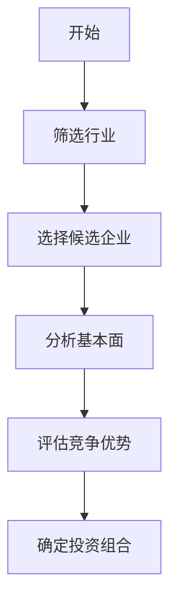
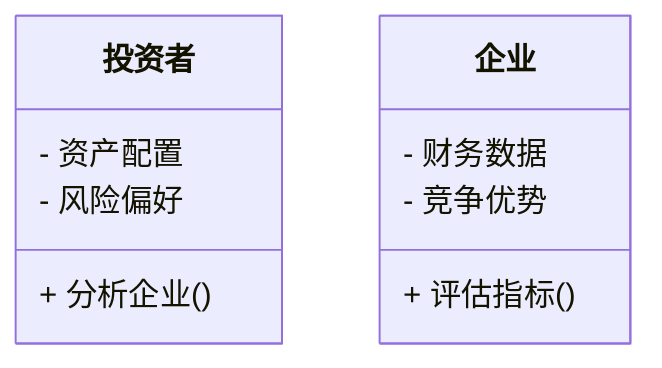
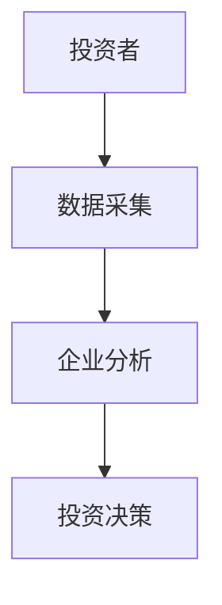

                 


# 彼得林奇的"隐形冠军"发掘方法

## 关键词：隐形冠军、彼得·林奇、投资方法、企业分析、系统架构

## 摘要：本文深入探讨了彼得·林奇提出的“隐形冠军”投资方法，从概念、发现方法、数学模型、系统架构到项目实战，全面解析如何识别和投资这类企业。文章结合理论与实践，提供详细的分析和代码实现，帮助读者掌握这一投资策略。

---

# 第一部分：彼得·林奇“隐形冠军”投资方法概述

## 第1章：彼得·林奇与“隐形冠军”概述

### 1.1 彼得·林奇的投资理念

#### 1.1.1 彼得·林奇的生平与投资成就

彼得·林奇是全球知名的投资专家，以其在共同基金领域的卓越表现闻名。他在富达投资管理公司管理麦哲伦基金期间，取得了年均22.5%的复合收益率，为投资者创造了巨大价值。林奇的投资哲学强调长期价值和深入的企业基本面分析。

#### 1.1.2 “隐形冠军”概念的提出与定义

“隐形冠军”指的是那些在特定细分市场中占据领先地位，但知名度较低的公司。这些企业专注于狭窄的领域，具有强大的竞争优势和持续的盈利能力。

#### 1.1.3 “隐形冠军”与传统投资方法的区别

与传统的投资方法相比，“隐形冠军”策略更注重企业的独特性和市场专注性，而非单纯的市场规模或行业地位。

---

### 1.2 “隐形冠军”企业的核心特征

#### 1.2.1 专注特定领域的投资逻辑

隐形冠军企业通常专注于单一产品或服务，通过深度挖掘市场机会，成为该领域的领导者。

#### 1.2.2 隐形冠军企业的属性特征对比表

| 特征                | 隐形冠军企业          | 传统巨头企业        |
|---------------------|-----------------------|---------------------|
| 市场专注度          | 高                   | 中                   |
| 竞争优势           | 明显                 | 较弱                 |
| 市场知名度          | 低                   | 高                   |
| 盈利能力            | 强                   | 中                   |

#### 1.2.3 隐形冠军企业的ER实体关系图（Mermaid流程图）

```mermaid
er
actor: 投资者
entity: 企业
rel: 投资者 -> 企业: 分析
```

---

## 第2章：“隐形冠军”企业的发现方法

### 2.1 发现“隐形冠军”的核心步骤

#### 2.1.1 确定投资领域的筛选标准

选择具有高增长潜力的行业，重点关注市场规模较小但增长迅速的领域。

#### 2.1.2 企业基本面分析方法

分析企业的财务报表，重点关注净利润率、ROE（净资产收益率）等指标。

#### 2.1.3 企业竞争优势的识别与评估

通过SWOT分析法，识别企业的竞争优势和潜在风险。

---

### 2.2 “隐形冠军”企业的评估标准

#### 2.2.1 市场地位与竞争优势分析

评估企业在细分市场中的地位，是否有独特的竞争优势。

#### 2.2.2 财务指标与成长性评估

分析企业的财务健康状况，关注收入增长、利润率和现金流。

#### 2.2.3 管理层能力与企业治理

评估管理层的稳定性和治理结构的透明度。

---

## 第3章：“隐形冠军”投资方法的数学模型与算法原理

### 3.1 投资决策的数学模型

#### 3.1.1 投资价值评估公式

投资价值 = (预期收益 / 折现率) - 当前股价

#### 3.1.2 市盈率与市净率的计算与比较

市盈率 = 股价 / 每股收益

市净率 = 股价 / 每股净资产

#### 3.1.3 股票内在价值的估算公式

内在价值 = 现金流折现值

---

### 3.2 投资组合优化的算法原理

#### 3.2.1 隐形冠军企业筛选的算法流程图（Mermaid流程图）



#### 3.2.2 投资组合优化的数学模型

收益最大化：Maximize (Σ w_i * r_i)

风险最小化：Minimize (Σ w_i^2 * σ_i^2)

约束条件：Σ w_i = 1

---

## 第4章：“隐形冠军”投资方法的系统架构设计

### 4.1 投资系统功能设计

#### 4.1.1 领域模型设计（Mermaid类图）



#### 4.1.2 系统功能模块划分

模块1：数据采集与处理

模块2：企业分析与评估

模块3：投资组合优化

---

### 4.2 系统架构设计

#### 4.2.1 系统架构设计图（Mermaid架构图）



#### 4.2.2 系统接口设计

API接口：GET /api/enterprise/{id}

---

## 第5章：项目实战——“隐形冠军”企业识别与投资策略

### 5.1 项目环境与工具安装

#### 5.1.1 环境要求

操作系统：Windows 10+

开发工具：PyCharm

依赖库：Pandas, Matplotlib

---

### 5.2 核心代码实现

#### 5.2.1 数据处理代码

```python
import pandas as pd

# 加载数据
df = pd.read_csv('enterprises.csv')

# 筛选隐形冠军
df = df[df['market_cap'] < 1000000000]

# 计算财务指标
df['pe_ratio'] = df['price'] / df['eps']
df['pb_ratio'] = df['price'] / df['book_value']
```

#### 5.2.2 可视化代码

```python
import matplotlib.pyplot as plt

plt.figure(figsize=(10, 6))
plt.scatter(df['pe_ratio'], df['pb_ratio'], c='blue', marker='o')
plt.xlabel('市盈率')
plt.ylabel('市净率')
plt.title('隐形冠军企业分布图')
plt.show()
```

---

## 第6章：总结与展望

### 6.1 最佳实践 tips

- 系统化地筛选和分析企业
- 定期复盘和调整投资组合
- 保持对市场的敏感性和洞察力

### 6.2 项目小结

通过本文的分析和实战，读者可以掌握“隐形冠军”企业的识别方法，并在实际投资中应用。

### 6.3 注意事项

- 风险管理是投资成功的关键
- 避免过度集中投资
- 定期评估和调整投资策略

### 6.4 拓展阅读

推荐书籍：
1. 《彼得·林奇的成功投资》
2. 《投资中最简单的事》

---

通过以上结构，本文系统地介绍了彼得·林奇的“隐形冠军”投资方法，从理论到实践，为读者提供了详尽的指导和实用的工具。

