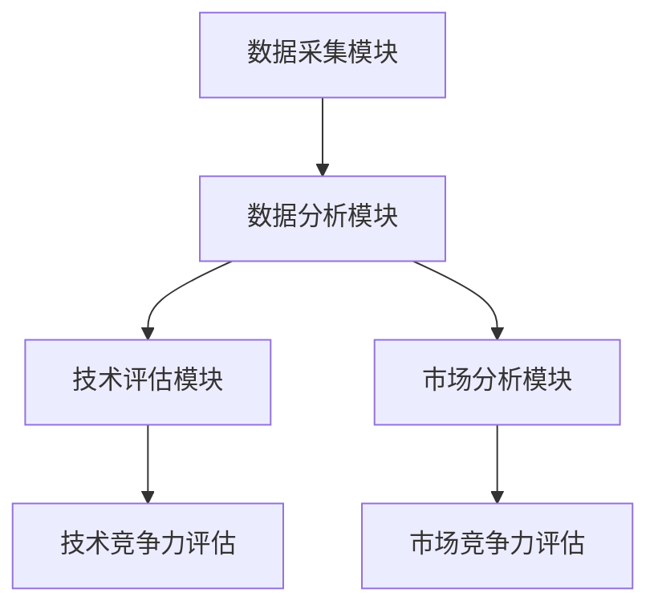

                 

好的，我将按照您的要求逐步构建这篇文章。首先，让我们先了解文章的核心内容和结构。由于文章篇幅较长，我们将分批次完成。

---

# 彼得林奇的"隐形冠军"在工业4.0背景下的发掘方法

## 关键词：工业4.0，隐形冠军，数据分析，技术评估，系统架构

## 摘要：  
本文以彼得·林奇提出的“隐形冠军”概念为基础，结合工业4.0的背景，系统性地探讨如何在工业4.0环境下发掘隐形冠军企业。文章首先介绍工业4.0的核心概念和隐形冠军的定义，分析其在工业4.0中的重要性；接着从数据驱动、技术驱动和市场驱动三个维度，详细阐述隐形冠军的发掘方法；最后结合实际案例，设计一套基于工业4.0的隐形冠军发掘系统架构，并提出具体的实施步骤和注意事项。本文旨在为工业4.0背景下的企业战略规划提供理论支持和实践指导。

---

## 第一部分：工业4.0与隐形冠军概述

### 第1章：工业4.0的定义与特点

#### 1.1 工业4.0的核心概念
工业4.0是指基于信息化、数字化、智能化的制造技术，通过物联网（IoT）、大数据、人工智能（AI）等技术，实现生产过程的智能化和自动化。其核心目标是通过数据驱动的方式优化生产效率、降低成本、提高产品质量。

#### 1.2 工业4.0与传统制造业的对比
| 特性                | 传统制造业                | 工业4.0                  |
|---------------------|--------------------------|--------------------------|
| 数据采集            | 人工记录、单点采集      | 自动化采集、实时监控    |
| 生产效率            | 低效、人工干预多        | 高效、自动化、智能化      |
| 产品定制化          | 少量定制、标准化生产    | 大规模定制、个性化生产  |
| 供应链管理          | 线性、刚性               | 网络化、动态、灵活        |

#### 1.3 工业4.0的实现技术与应用场景
- **实现技术**：物联网（IoT）、大数据分析、人工智能（AI）、区块链、边缘计算。
- **应用场景**：智能制造、智能工厂、智能供应链、数字孪生（Digital Twin）。

---

### 第2章：隐形冠军的定义与特征

#### 2.1 隐形冠军的定义
隐形冠军是指在某个细分市场中占据主导地位，但未上市的中小型企业。它们通常专注于某个领域，具有强大的技术实力和市场竞争力。

#### 2.2 隐形冠军的核心特征
| 特征                | 描述                     |
|---------------------|-------------------------|
| 市场专注             | 专注于特定市场或产品     |
| 技术领先             | 在核心技术或工艺上具有优势 |
| 财务稳健             | 利润率高，现金流稳定     |
| 组织灵活             | 管理结构扁平，反应速度快   |

#### 2.3 隐形冠军在工业4.0中的优势
- **技术优势**：隐形冠军在细分市场中积累的技术优势，在工业4.0环境下更容易转化为竞争优势。
- **市场优势**：专注于特定市场的企业能够更快地响应客户需求，满足个性化需求。
- **成本优势**：通过工业4.0技术优化生产流程，隐形冠军能够进一步降低成本，提高效率。

---

## 第二部分：隐形冠军的发掘方法论

### 第3章：数据驱动的隐形冠军识别方法

#### 3.1 数据采集与处理
- **数据来源**：通过物联网设备采集生产数据，包括温度、压力、速度等。
- **数据清洗**：去除噪声数据，确保数据的完整性和准确性。

#### 3.2 数据分析与特征提取
- 使用大数据分析技术，提取隐形冠军的特征，例如：
  - 市场占有率
  - 技术专利数量
  - 产品生命周期

#### 3.3 数据可视化与模式识别
- 使用数据可视化工具（如Tableau、Power BI）展示数据，识别隐形冠军的潜在模式。

---

### 第4章：技术驱动的隐形冠军评估方法

#### 4.1 技术创新评估模型
- 通过技术专利分析、技术文档评估等方式，评估企业的技术创新能力。

#### 4.2 技术专利分析方法
- 使用专利数据库（如专利检索平台）分析企业的技术布局和创新能力。

#### 4.3 技术竞争力的动态评估
- 结合工业4.0的技术趋势，动态评估隐形冠军的技术竞争力。

---

### 第5章：市场驱动的隐形冠军筛选方法

#### 5.1 市场需求分析
- 通过市场调研、客户反馈等方式，分析市场需求的变化趋势。

#### 5.2 市场份额评估
- 结合行业数据分析，评估企业在特定市场的占有率。

#### 5.3 市场竞争力的综合评价
- 综合考虑市场、技术和财务等多个维度，评估隐形冠军的竞争力。

---

## 第三部分：工业4.0背景下的隐形冠军系统架构

### 第6章：隐形冠军发掘的系统架构设计

#### 6.1 系统功能模块设计
- **数据采集模块**：通过物联网设备采集生产数据。
- **数据分析模块**：对数据进行清洗、分析和特征提取。
- **技术评估模块**：评估企业的技术创新能力和技术竞争力。
- **市场分析模块**：分析市场需求和市场份额。

#### 6.2 系统架构

---

### 第7章：项目实战与案例分析

#### 7.1 项目背景与目标
- 以某汽车制造行业的隐形冠军发掘为例。

#### 7.2 数据采集与处理
- 使用传感器采集生产线数据，包括温度、压力、振动等。

#### 7.3 数据分析与可视化
- 使用Python进行数据分析，生成数据可视化图表。

#### 7.4 技术评估与市场分析
- 结合专利数据和技术趋势，评估企业的技术竞争力。

---

## 第四部分：总结与展望

### 第8章：总结与展望

#### 8.1 总结
- 工业4.0为隐形冠军的发掘提供了新的技术和方法。
- 数据驱动、技术驱动和市场驱动的结合是关键。

#### 8.2 未来展望
- 随着人工智能和大数据技术的不断发展，隐形冠军的发掘方法将更加智能化和精准化。

---

以上是文章的目录大纲和部分内容的详细说明。接下来，我们将按照这个大纲逐步完成文章的撰写。如果您对某一部分有特别的需求或希望调整内容，请随时告诉我！

