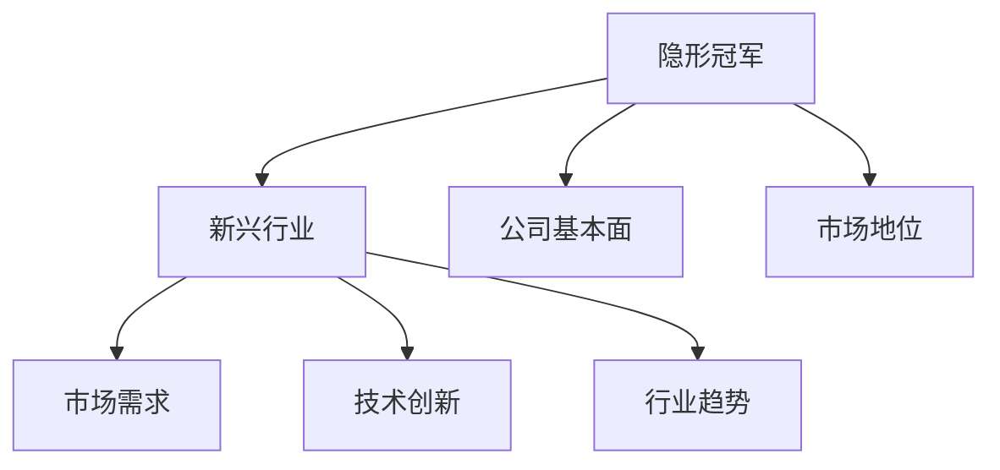
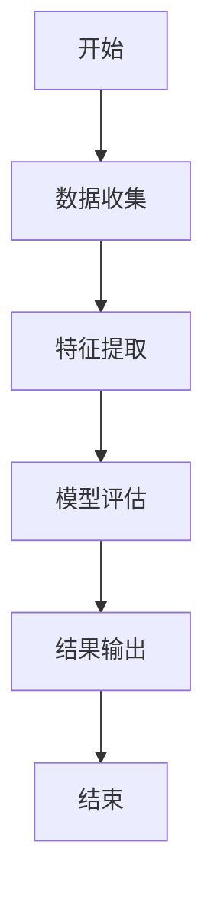
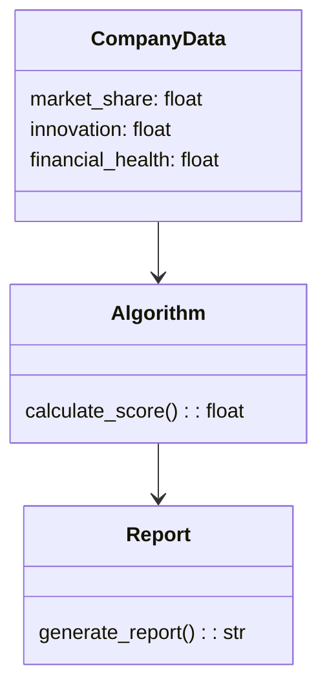
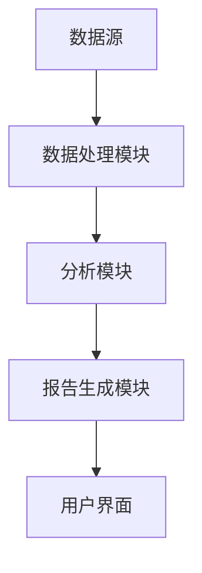

                 


# 彼得林奇的"隐形冠军"在新兴行业的识别

## 关键词：彼得林奇，隐形冠军，新兴行业，投资策略，行业分析

## 摘要：本文详细探讨了彼得林奇提出的“隐形冠军”概念，并结合新兴行业的特点，系统性地分析了如何在新兴行业中识别这些“隐形冠军”。通过理论分析、算法设计、系统架构和项目实战，本文为读者提供了一套完整的识别方法，帮助投资者在新兴市场中发现具有潜力的企业。

---

# 目录

## 第1章: 引言

### 1.1 问题背景
- “隐形冠军”在新兴行业中的重要性
- 新兴行业的发展趋势

### 1.2 问题描述
- 什么是“隐形冠军”
- 为什么在新兴行业中识别“隐形冠军”具有挑战性

### 1.3 问题解决
- 彼得林奇的识别方法
- 新兴行业中的具体应用

### 1.4 边界与外延
- “隐形冠军”的定义范围
- 新兴行业的边界条件

## 第2章: 核心概念与联系

### 2.1 核心概念原理
- “隐形冠军”的核心要素：市场占有率、创新能力、财务表现
- 新兴行业的核心驱动因素：技术创新、市场需求、政策支持

### 2.2 概念属性对比
| 概念       | 属性                     |
|------------|--------------------------|
| 隐形冠军   | 市场占有率高，行业影响力小 |
| 新兴行业   | 增长速度快，不确定性高    |

### 2.3 ER实体关系图


## 第3章: 算法原理

### 3.1 算法概述
- 识别“隐形冠军”的核心步骤：数据收集、特征提取、模型评估
- 适用于新兴行业的算法优化

### 3.2 算法流程图


### 3.3 数学模型
$$ \text{评分公式} = \frac{\text{市场占有率} + \text{技术创新能力} + \text{财务表现}}{3} $$

### 3.4 代码实现
```python
def identify_invisible_champion(company_data):
    # 公司数据处理
    scores = []
    for company in company_data:
        market_share = company['market_share']
        innovation = company['innovation']
        financial_health = company['financial_health']
        score = (market_share + innovation + financial_health) / 3
        scores.append(score)
    return scores
```

## 第4章: 系统分析与架构设计

### 4.1 问题场景介绍
- 系统目标：识别新兴行业中的“隐形冠军”
- 用户需求：投资者需要实时数据分析和评估工具

### 4.2 系统功能设计


### 4.3 系统架构图


## 第5章: 项目实战

### 5.1 环境安装
- 安装Python和相关库（Pandas, NumPy）

### 5.2 核心代码实现
```python
import pandas as pd

def main():
    # 数据加载
    data = pd.read_csv('companies.csv')
    # 计算评分
    data['score'] = (data['market_share'] + data['innovation'] + data['financial_health']) / 3
    # 输出结果
    print(data.head())

if __name__ == "__main__":
    main()
```

### 5.3 案例分析
- 以电动汽车行业为例，分析三家公司的评分和潜力

## 第6章: 最佳实践

### 6.1 小结
- 识别“隐形冠军”的关键步骤和注意事项

### 6.2 注意事项
- 数据质量的重要性
- 模型的局限性

### 6.3 拓展阅读
- 推荐书籍和文献

---

通过以上步骤，我们可以系统性地识别新兴行业中的“隐形冠军”，并为投资者提供科学的决策支持。

