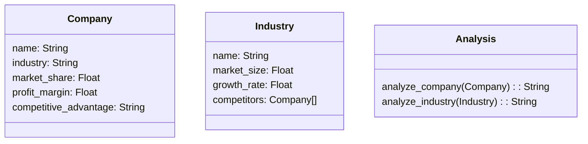
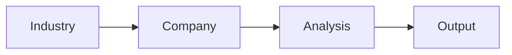

                 


# 彼得林奇的"隐藏冠军"发掘技巧

> 关键词：彼得·林奇，隐藏冠军，投资策略，企业分析，财务指标

> 摘要：本文深入探讨了彼得·林奇的“隐藏冠军”投资策略，分析了隐藏冠军的定义、特征、评估标准和发现方法。通过结合技术语言和实际案例，详细讲解了如何通过系统化的分析和评估，发现具有长期增长潜力的隐藏冠军公司。文章内容涵盖了行业调研、财务分析、竞争优势评估等多个方面，并结合Python代码和数学模型，为读者提供了一套完整的技术博客文章。

---

## # 第一部分：隐藏冠军的定义与背景

### ## 第1章：隐藏冠军的定义与重要性

#### ### 1.1 隐藏冠军的定义

隐藏冠军是指那些在特定行业中具有领先地位，但尚未被广泛认知的公司。它们通常在某个细分市场中占据主导地位，具有强大的竞争优势和持续增长的潜力。隐藏冠军的核心特征包括：

- **行业领导地位**：在特定细分市场中占据领先地位。
- **竞争优势**：具备独特的竞争优势，如技术、成本或品牌。
- **财务健康**：财务状况稳健，盈利能力强。
- **管理团队**：管理团队经验丰富，公司治理良好。

#### ### 1.2 隐藏冠军的重要性

隐藏冠军在投资中具有重要意义。首先，它们通常具有较高的成长潜力，能够在长期为投资者带来超额回报。其次，隐藏冠军往往在市场波动中表现更稳定，能够抵御外部风险。最后，发现隐藏冠军需要深入的行业调研和公司分析，这种研究过程本身能够帮助投资者更好地理解市场和企业运作。

#### ### 1.3 彼得·林奇的隐藏冠军方法论

彼得·林奇是全球著名的职业基金经理，他的投资哲学强调长期持有优质股票。他提出的“隐藏冠军”概念，是指那些在特定行业中具有竞争优势，但尚未被市场充分发现的公司。林奇的三大原则是：

1. **深入研究**：通过深入研究行业和公司，发现具有长期增长潜力的企业。
2. **长期持有**：避免短期交易，长期持有优质股票。
3. **分散投资**：通过投资多个隐藏冠军，降低投资风险。

---

## # 第二部分：隐藏冠军的核心概念与分析方法

### ## 第2章：隐藏冠军的核心要素

#### ### 2.1 隐藏冠军的行业地位

行业地位是评估隐藏冠军的重要指标。通过分析公司的市场占有率、行业排名和竞争优势，可以判断其是否具备成为行业领导者的潜力。例如，以下表格对比了两家公司在同一行业的市场占有率和竞争优势：

| 公司名称 | 市场占有率 | 竞争优势       |
|----------|------------|----------------|
| 公司A    | 25%        | 成本优势       |
| 公司B    | 15%        | 技术创新       |

从表格可以看出，公司A在成本控制方面具有优势，而公司B在技术创新方面更具潜力。

#### ### 2.2 隐藏冠军的竞争优势

竞争优势是隐藏冠军的核心要素。以下是竞争优势的几个关键维度：

- **成本优势**：公司是否在生产成本上有显著优势。
- **技术优势**：公司是否拥有独特的技术或专利。
- **品牌优势**：公司品牌是否在目标市场中具有强大的影响力。
- **渠道优势**：公司是否拥有稳固的销售渠道。

#### ### 2.3 隐藏冠军的财务指标

财务指标是评估公司健康状况的重要工具。以下是常用的财务指标：

- **净利润率**：衡量公司盈利能力的指标。
- **毛利率**：衡量公司产品或服务的盈利能力。
- **资产负债率**：衡量公司财务杠杆的风险。
- **现金流**：衡量公司运营能力的指标。

---

## # 第三部分：隐藏冠军的评估与筛选方法

### ## 第3章：隐藏冠军的评估标准

#### ### 3.1 隐藏冠军的筛选标准

筛选隐藏冠军需要结合定量和定性分析。以下是一些常用的筛选标准：

1. **行业地位**：公司在行业中的排名和市场占有率。
2. **财务健康**：公司的财务指标是否稳健。
3. **竞争优势**：公司是否具备独特的竞争优势。
4. **管理团队**：公司管理团队的能力和稳定性。

#### ### 3.2 隐藏冠军的定性分析

定性分析包括对公司愿景、战略和管理团队的评估。例如，以下是一个公司的愿景和战略分析：

- **愿景**：成为行业领导者。
- **战略**：通过技术创新和市场扩展，实现持续增长。

#### ### 3.3 隐藏冠军的定量分析

定量分析通常涉及财务指标的计算。例如，以下是一个公司的财务指标分析：

- 净利润率为20%，表明公司盈利能力较强。
- 毛利率为30%，表明公司产品或服务的成本控制良好。

---

## # 第四部分：隐藏冠军的发现与投资策略

### ## 第4章：隐藏冠军的发现方法

#### ### 4.1 隐藏冠军的行业调研方法

行业调研是发现隐藏冠军的第一步。以下是行业调研的步骤：

1. **行业分析**：了解行业的市场规模、增长潜力和竞争格局。
2. **公司筛选**：根据行业分析结果，筛选出具有潜力的公司。
3. **深入研究**：对筛选出的公司进行深入研究，评估其竞争优势和财务状况。

#### ### 4.2 隐藏冠军的公司调研方法

公司调研包括对公司基本面的全面分析。以下是公司调研的步骤：

1. **公司背景**：了解公司的历史、愿景和战略。
2. **财务分析**：分析公司的财务指标，评估其健康状况。
3. **竞争优势**：评估公司的竞争优势，判断其是否具备成为行业领导者的潜力。

#### ### 4.3 隐藏冠军的财务分析方法

财务分析是评估公司的重要工具。以下是财务分析的步骤：

1. **计算关键指标**：如净利润率、毛利率等。
2. **比较分析**：将公司指标与行业平均水平或竞争对手进行比较。
3. **趋势分析**：分析公司财务指标的变化趋势，判断其财务健康状况。

---

## # 第五部分：隐藏冠军的系统分析与架构设计

### ## 第5章：隐藏冠军的系统分析

#### ### 5.1 系统功能设计

以下是系统功能设计的类图：



#### ### 5.2 系统架构设计

以下是系统架构设计的架构图：



---

## # 第六部分：隐藏冠军的项目实战

### ## 第6章：隐藏冠军的项目实战

#### ### 6.1 项目环境安装

以下是项目环境安装步骤：

1. 安装Python和相关库：
   ```bash
   pip install numpy pandas matplotlib
   ```

2. 下载行业数据和公司财务数据。

#### ### 6.2 项目核心实现

以下是项目核心实现的代码：

```python
import pandas as pd
import numpy as np

def calculate_profit_margin(revenue, cost):
    return (revenue - cost) / revenue * 100

def analyze_company(finance_data):
    profit_margin = calculate_profit_margin(finance_data['revenue'], finance_data['cost'])
    if profit_margin > 20:
        return "High profit margin"
    elif 10 < profit_margin < 20:
        return "Moderate profit margin"
    else:
        return "Low profit margin"

# 示例数据
finance_data = {
    'revenue': 1000000,
    'cost': 800000
}

result = analyze_company(finance_data)
print(result)
```

#### ### 6.3 项目案例分析

以下是项目案例分析的详细步骤：

1. 选择一个行业，例如医疗科技。
2. 下载相关公司的财务数据。
3. 计算各公司的净利润率和毛利率。
4. 根据分析结果，筛选出具有高净利润率和毛利率的公司。
5. 进一步分析这些公司的竞争优势和行业地位。

---

## # 第七部分：隐藏冠军的最佳实践

### ## 第7章：隐藏冠军的最佳实践

#### ### 7.1 投资成功的关键点

- **长期关注行业动态**：持续关注行业变化，发现新的隐藏冠军。
- **深入分析公司基本面**：通过财务分析和行业调研，评估公司的潜力。
- **分散投资**：通过投资多个隐藏冠军，降低投资风险。

#### ### 7.2 小结

通过本文的分析，我们可以看出，发现隐藏冠军需要结合定量和定性分析，深入研究行业和公司基本面。只有通过系统化的分析和评估，才能发现具有长期增长潜力的隐藏冠军。

#### ### 7.3 注意事项

- 避免盲目跟风，确保分析的客观性和科学性。
- 定期评估投资组合，及时调整策略。
- 风险提示：投资有风险，需谨慎决策。

#### ### 7.4 拓展阅读

- 彼得·林奇的书籍：《彼得·林奇的投资哲学》。
- 技术分析书籍：《技术分析实战指南》。

---

## # 结语

通过本文的详细讲解，我们深入探讨了彼得·林奇的“隐藏冠军”投资策略，分析了隐藏冠军的定义、特征、评估标准和发现方法。希望读者能够通过本文的指导，发现更多具有长期增长潜力的隐藏冠军公司，实现投资目标。

