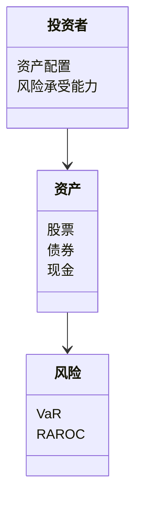

                 


# 《彼得林奇的风险管理原则》

---

## 关键词：
风险管理，彼得林奇，投资策略，风险管理原则，分散投资，止损策略，风险控制，投资组合，价值投资

---

## 摘要：
本文将深入探讨彼得·林奇的风险管理原则，结合其投资理念，分析风险管理的核心概念、具体策略以及实际应用。通过详细阐述风险管理的基本原理、数学模型和系统架构，结合实际案例和代码示例，帮助读者掌握如何在投资决策中有效管理风险，实现长期稳健的投资回报。

---

# 第一部分：风险管理的背景与核心概念

## 第1章：风险管理的重要性与彼得林奇的基本理念

### 1.1 风险管理的核心概念

#### 1.1.1 风险的定义与分类

- **风险的定义**：风险是指在投资过程中，由于不确定因素导致投资回报低于预期甚至产生损失的可能性。
- **风险的分类**：
  - **市场风险**：由于市场波动导致的投资损失。
  - **流动性风险**：无法在合理时间内以合理价格变现资产的风险。
  - **信用风险**：债券发行人违约的风险。
  - **操作风险**：由于操作失误或内部控制系统缺陷导致的风险。
- **风险的来源与特征**：
  - 来源：市场波动、经济周期、政策变化、公司基本面变化等。
  - 特征：不确定性、潜在损失、影响投资回报。

#### 1.1.2 风险与收益的关系

- **风险与收益的正相关性**：通常，风险越高，潜在收益也越高，但同时损失的可能性也越大。
- **风险厌恶与风险偏好**：
  - 风险厌恶：投资者更倾向于选择低风险的投资。
  - 风险偏好：投资者愿意承担更高风险以追求更高收益。
- **风险调整后的收益（RAROC）概念**：
  - RAROC = 净利润 / 风险资本。
  - 用于衡量单位风险资本的收益效率。

#### 1.1.3 彼得林奇的基本投资理念

- **投资的第一原则**：保护本金不亏损。
- **长期投资与价值投资的核心**：寻找具有持续增长潜力的公司，长期持有。
- **风险管理在投资决策中的优先地位**：在投资前，先评估风险，确保投资的安全性。

### 1.2 彼得林奇的风险管理模型

#### 1.2.1 风险管理的三要素

- **投资目标**：明确投资目的和预期收益。
- **风险承受能力**：根据自身财务状况和风险偏好，确定可承受的最大损失。
- **风险敞口**：投资组合中各种资产的风险暴露程度。

#### 1.2.2 风险管理的数学模型

- **风险价值（VaR）公式**：
  $$ VaR = \sigma \times z \times \sqrt{T} $$
  - $\sigma$：资产收益率的标准差。
  - $z$：标准正态分布的分位数。
  - $T$：时间跨度（天数）。
  - VaR表示在给定置信水平下，资产可能的最大损失。

- **风险调整后的回报公式**：
  $$ RAROC = \frac{ROE}{\text{风险资本}} $$
  - ROE：净资产收益率。
  - 风险资本：用于覆盖潜在损失的资本。

#### 1.2.3 风险管理的可视化工具

- **风险-收益关系图**：
  ```mermaid
  graph TD
      A[风险] --> B[收益];
      B --> C[投资回报];
  ```

---

## 第2章：彼得林奇的风险管理原则

### 2.1 投资组合的分散化原则

#### 2.1.1 分散化投资的原理

- **非相关资产的风险分散**：通过投资不同类型的资产（股票、债券、房地产等）来降低特定资产的风险。
- **相关资产的风险集中**：避免在同一行业或相关资产上过度集中，降低系统性风险。

#### 2.1.2 分散化投资的实施步骤

- **资产类别分散**：将资金分配到股票、债券、现金等不同资产类别。
- **行业分散**：避免在单一行业集中过多，如同时投资科技、医疗、金融等行业。
- **地理区域分散**：投资不同国家或地区的资产，降低区域风险。

### 2.2 止损策略的应用

#### 2.2.1 什么是止损

- **止损的定义与作用**：设定一个价格水平，当资产价格下跌至该水平时，立即卖出以限制损失。
- **止损与止盈的区别**：
  - 止损：限制亏损。
  - 止盈：锁定收益。

#### 2.2.2 止损策略的实施

- **固定比例止损**：设定亏损比例，如亏损10%时立即止损。
- **技术指标止损**：基于技术指标（如均线、RSI）设置止损点。

### 2.3 估值分析与风险管理

#### 2.3.1 估值的基本概念

- **市盈率（P/E）**：
  $$ P/E = \frac{\text{股价}}{\text{每股收益}} $$
- **市净率（P/B）**：
  $$ P/B = \frac{\text{股价}}{\text{每股净资产}} $$

#### 2.3.2 估值分析的实施步骤

- **评估公司基本面**：分析收入、利润、资产负债表等。
- **比较市场估值**：与行业平均或历史平均水平对比。
- **判断投资的安全边际**：确保买入价格低于内在价值。

---

## 第3章：风险管理的系统分析与架构设计

### 3.1 系统功能设计

#### 3.1.1 风险管理系统的模块划分

- **数据采集模块**：收集市场数据、公司财务数据等。
- **风险评估模块**：计算VaR、信用评分等。
- **策略执行模块**：根据风险评估结果执行分散化或止损策略。
- **监控与报告模块**：实时监控风险敞口，生成风险报告。

#### 3.1.2 系统功能设计的领域模型



### 3.2 系统架构设计

#### 3.2.1 系统架构图


---

## 第4章：项目实战——基于彼得林奇风险管理原则的投资组合构建

### 4.1 环境安装与工具准备

- **工具**：数据分析工具（Python、Excel）、投资平台（如 brokerage accounts）。

### 4.2 核心实现源代码

#### 4.2.1 风险评估代码示例

```python
import pandas as pd
import numpy as np

def calculate VaR(returns, confidence_level=95):
    returns_sorted = sorted(returns)
    VaR = returns_sorted[int(len(returns_sorted) * (1 - confidence_level/100))]
    return VaR
```

#### 4.2.2 分散化投资组合代码示例

```python
import pandas as pd
import numpy as np

# 假设我们有多个资产的收益率数据
assets = ['股票', '债券', '现金']
returns = pd.DataFrame({
    '股票': [0.1, -0.05, 0.08],
    '债券': [0.02, 0.03, -0.01],
    '现金': [0, 0, 0]
})

# 计算投资组合的预期收益和风险
weights = np.array([1/3, 1/3, 1/3])
portfolio_return = np.sum(weights * returns.mean())
portfolio_variance = np.dot(weights.T, np.dot(returns.cov(), weights))
portfolio_VaR = calculate_VaR(returns.mean())
```

### 4.3 实际案例分析

#### 4.3.1 案例背景

- **投资目标**：追求稳定收益，风险承受能力较低。
- **可用资金**：$10,000。

#### 4.3.2 投资组合构建

- **分散化策略**：
  - 40%股票：投资于科技、医疗、金融行业。
  - 30%债券：投资于政府债券和企业债券。
  - 30%现金：保持流动性，应对突发事件。

#### 4.3.3 风险管理实施

- **止损策略**：设定每只股票的止损点为-10%。
- **定期再平衡**：每季度调整投资组合，确保符合分散化原则。

---

## 第5章：最佳实践与小结

### 5.1 小结

- 彼得林奇的风险管理原则强调分散化、止损和估值分析。
- 通过系统的风险管理，投资者可以有效降低风险，实现长期稳健的投资回报。

### 5.2 注意事项

- **定期审查与调整**：市场环境变化，需及时调整投资策略。
- **避免过度自信**：认识到市场不可预测性，保持谦逊。
- **持续学习与实践**：通过不断学习和实践，提升风险管理能力。

### 5.3 拓展阅读

- 《彼得·林奇的成功投资》
- 《风险管理与投资组合优化》

---

通过以上目录大纲，我们能够系统地了解彼得林奇的风险管理原则，并将其应用于实际投资中。

