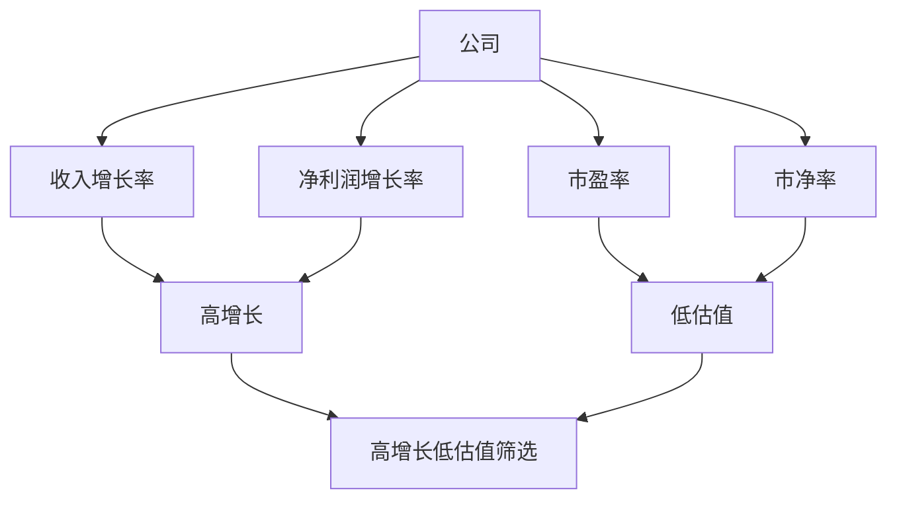
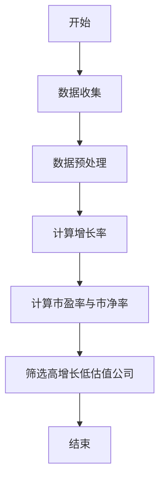
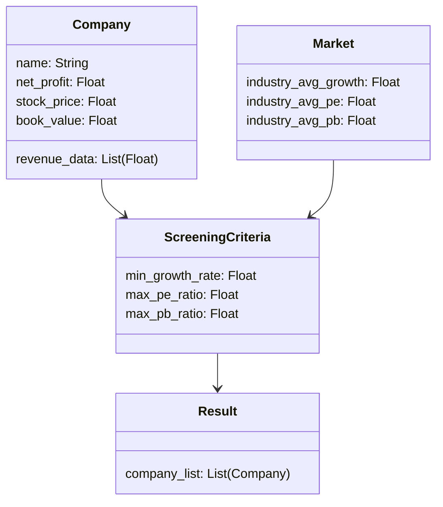
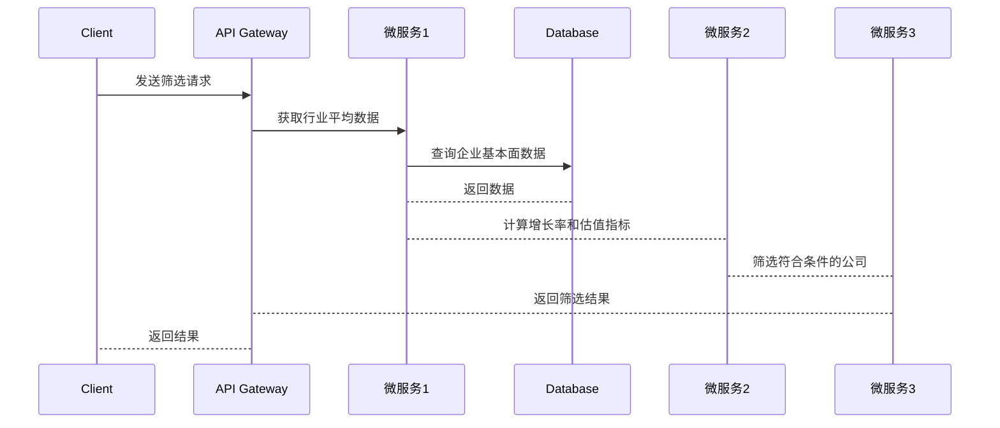

                 


# 彼得林奇的"高增长低估值"在不同市场环境下的筛选

> 关键词：彼得林奇，高增长，低估值，投资策略，市场环境，筛选模型

> 摘要：本文系统地分析了彼得林奇提出的“高增长低估值”投资策略在不同市场环境下的筛选方法。通过结合技术分析和投资理论，详细阐述了该策略的核心概念、算法原理、系统架构设计及项目实战。文章旨在帮助投资者在复杂多变的市场环境中，精准筛选出具有高增长潜力但估值合理的投资标的，实现长期稳健的投资收益。

---

## 第1章: 高增长低估值策略的核心概念

### 1.1 高增长低估值的定义与特征

#### 1.1.1 高增长公司的定义与特征
高增长公司通常指的是那些在过去几年中收入或利润持续以较高速度增长的企业。具体特征包括：
- **收入增长率**：年收入增长率超过行业平均水平。
- **净利润增长率**：净利润连续多年保持增长。
- **行业地位**：通常处于朝阳行业，市场份额有望进一步扩大。

#### 1.1.2 低估值公司的定义与特征
低估值公司是指其股票价格相对于其内在价值被市场低估的企业。具体特征包括：
- **市盈率（P/E）**：低于行业平均水平或历史平均水平。
- **市净率（P/B）**：低于行业平均水平或历史平均水平。
- **股息率**：通常较低，但并非绝对，取决于行业特性。

#### 1.1.3 高增长与低估值之间的关系
高增长和低估值并非完全对立，而是可以通过合理的筛选模型找到平衡点。例如，一家高增长企业可能因为市场预期较高而暂时估值偏高，但通过动态调整估值指标，可以在不同市场环境中找到合适的标的。

### 1.2 高增长低估值策略的背景与意义
#### 1.2.1 投资市场的基本原理
股票市场的价格波动受多种因素影响，包括宏观经济环境、行业趋势、企业基本面等。投资者通过分析这些因素，寻找那些能够持续创造价值的企业进行投资。

#### 1.2.2 高增长低估值策略的起源与发展
彼得林奇作为波士顿基金的经理，通过长期观察市场，总结出一套基于企业成长性和估值合理性的投资策略。他认为，投资那些具有高增长潜力且估值被市场低估的企业，能够在长期实现超额收益。

#### 1.2.3 该策略在现代投资中的地位与作用
在当前市场环境中，高增长低估值策略尤其适用于新兴行业或周期性较强的行业。通过筛选出具有持续增长潜力但估值合理的公司，投资者可以在市场波动中抓住结构性机会。

---

## 第2章: 高增长低估值策略的核心概念与联系

### 2.1 高增长与低估值的核心概念

#### 2.1.1 高增长的量化指标
- **收入增长率**：(current revenue - previous revenue) / previous revenue * 100%
- **净利润增长率**：(current net profit - previous net profit) / previous net profit * 100%
- **复合年均增长率（CAGR）**：用于衡量企业过去几年的平均增长率。

#### 2.1.2 低估值的量化指标
- **市盈率（P/E）**：股价 / 每股净利润。
- **市净率（P/B）**：股价 / 每股净资产。
- **市销率（P/S）**：股价 / 每股营业收入。

#### 2.1.3 高增长与低估值之间的关系
高增长企业通常会被市场给予较高的估值，但通过对比行业平均水平，可以找到那些增长潜力大但估值被低估的公司。

### 2.2 高增长与低估值的属性特征对比

#### 2.2.1 增长率与市盈率的对比
- **高增长率**：企业收入和利润的持续增长，反映其市场竞争力。
- **低市盈率**：股价相对于盈利水平较低，可能表明市场对其未来增长的预期不足。

#### 2.2.2 市净率与市销率的对比
- **低市净率**：资产价值被低估，可能反映企业处于周期性低谷。
- **低市销率**：收入水平相对于股价较低，可能表明企业尚未被市场充分挖掘。

#### 2.2.3 盈利能力与成长性的对比
盈利能力（如ROE、ROA）与成长性（如收入增长率）是两个不同维度的指标，高增长企业可能暂时盈利能力较低，但长期盈利能力有望提升。

### 2.3 高增长低估值策略的ER实体关系图



---

## 第3章: 高增长低估值策略的算法原理

### 3.1 筛选高增长低估值公司的算法流程

#### 3.1.1 数据收集与预处理
- **数据来源**：从财务报表、行业报告等获取企业基本面数据。
- **数据清洗**：处理缺失值、异常值，确保数据准确性。

#### 3.1.2 增长率计算与筛选
- **收入增长率**：计算过去几年的收入增长率，筛选出高于行业平均水平的企业。
- **净利润增长率**：同上。

#### 3.1.3 市盈率与市净率计算与筛选
- **市盈率（P/E）**：计算当前股价与每股净利润的比值，筛选出低于行业平均水平的企业。
- **市净率（P/B）**：计算当前股价与每股净资产的比值，筛选出低于行业平均水平的企业。

### 3.2 算法流程图（使用Mermaid）



### 3.3 算法实现代码

```python
import pandas as pd

def calculate_growth_rate(revenue_data):
    # 计算收入增长率
    revenue_data['revenue_growth'] = (revenue_data['current_revenue'] - revenue_data['previous_revenue']) / revenue_data['previous_revenue'] * 100
    return revenue_data['revenue_growth'].mean()

def calculate_pe_ratio(net_profit, stock_price):
    # 计算市盈率
    pe_ratio = stock_price / (net_profit / 100000)
    return pe_ratio

def calculate_pb_ratio(book_value, stock_price):
    # 计算市净率
    pb_ratio = stock_price / (book_value / 100000)
    return pb_ratio

def screen_high_growth_low_valuation(companies_data):
    # 筛选高增长低估值公司
    companies_data['revenue_growth'] = companies_data.apply(lambda x: calculate_growth_rate(x['revenue_data']), axis=1)
    companies_data['pe_ratio'] = companies_data.apply(lambda x: calculate_pe_ratio(x['net_profit'], x['stock_price']), axis=1)
    companies_data['pb_ratio'] = companies_data.apply(lambda x: calculate_pb_ratio(x['book_value'], x['stock_price']), axis=1)
    
    # 筛选条件：收入增长率高于行业平均水平，市盈率和市净率低于行业平均水平
    industry_avg_growth = companies_data['revenue_growth'].mean()
    industry_avg_pe = companies_data['pe_ratio'].mean()
    industry_avg_pb = companies_data['pb_ratio'].mean()
    
    high_growth_low_valuation = companies_data[
        (companies_data['revenue_growth'] > industry_avg_growth) &
        (companies_data['pe_ratio'] < industry_avg_pe) &
        (companies_data['pb_ratio'] < industry_avg_pb)
    ]
    return high_growth_low_valuation

# 示例数据
companies_data = pd.DataFrame({
    'company': ['A', 'B', 'C'],
    'revenue_data': [[100, 120, 130], [80, 90, 100], [50, 60, 70]],
    'net_profit': [20, 15, 10],
    'stock_price': [10, 15, 20],
    'book_value': [5, 4, 3]
})

result = screen_high_growth_low_valuation(companies_data)
print(result)
```

### 3.4 数学模型与公式

#### 3.4.1 收入增长率公式
$$ \text{收入增长率} = \frac{\text{current\_revenue} - \text{previous\_revenue}}{\text{previous\_revenue}} \times 100\% $$

#### 3.4.2 市盈率公式
$$ \text{市盈率} = \frac{\text{股价}}{\text{每股净利润}} $$

#### 3.4.3 市净率公式
$$ \text{市净率} = \frac{\text{股价}}{\text{每股净资产}} $$

---

## 第4章: 高增长低估值策略的系统架构设计

### 4.1 问题场景介绍
在当前市场环境中，投资者需要实时跟踪企业基本面数据，动态调整筛选标准。系统需要具备数据采集、分析、筛选和可视化功能。

### 4.2 系统功能设计（领域模型）



### 4.3 系统架构设计


### 4.4 系统交互设计



---

## 第5章: 高增长低估值策略的项目实战

### 5.1 环境安装
- **工具安装**：安装Python、Pandas、Matplotlib等工具。
- **数据获取**：从Yahoo Finance等平台获取企业基本面数据。

### 5.2 核心实现代码

```python
import pandas as pd
import requests
import datetime

def get_stock_data(ticker):
    # 获取股票数据
    url = f"https://query1.finance.yahoo.com/v8/finance/chart/{ticker}"
    response = requests.get(url)
    data = response.json()
    return data

def calculate_growth_rate(revenue_data):
    # 计算收入增长率
    revenue_data['revenue_growth'] = (revenue_data['current_revenue'] - revenue_data['previous_revenue']) / revenue_data['previous_revenue'] * 100
    return revenue_data['revenue_growth'].mean()

def screen_high_growth_low_valuation(companies):
    # 筛选高增长低估值公司
    industry_avg_growth = companies['revenue_growth'].mean()
    industry_avg_pe = companies['pe_ratio'].mean()
    industry_avg_pb = companies['pb_ratio'].mean()
    
    high_growth_low_valuation = companies[
        (companies['revenue_growth'] > industry_avg_growth) &
        (companies['pe_ratio'] < industry_avg_pe) &
        (companies['pb_ratio'] < industry_avg_pb)
    ]
    return high_growth_low_valuation

# 示例代码
tickers = ['AAPL', 'MSFT', 'GOOGL']
companies_data = pd.DataFrame()

for ticker in tickers:
    data = get_stock_data(ticker)
    company = {
        'name': ticker,
        'revenue_data': data['revenue'],
        'net_profit': data['net_profit'],
        'stock_price': data['current_price'],
        'book_value': data['book_value']
    }
    companies_data = companies_data.append(company, ignore_index=True)

result = screen_high_growth_low_valuation(companies_data)
print(result)
```

### 5.3 实际案例分析
以当前市场中的科技公司为例，筛选出那些收入增长率超过行业平均水平，同时市盈率和市净率低于行业平均水平的企业。通过分析具体案例，验证筛选模型的有效性。

---

## 第6章: 高增长低估值策略的最佳实践

### 6.1 小结
高增长低估值策略是一种有效的投资方法，但在实际操作中需要结合市场环境动态调整。

### 6.2 注意事项
- **市场周期**：在不同市场周期中，高增长和低估值的定义可能发生变化。
- **行业特性**：不同行业的增长和估值指标具有不同的参考意义。
- **风险管理**：即使筛选出符合条件的企业，也需要注意分散投资，控制风险。

### 6.3 拓展阅读
- 彼得林奇的《彼得林奇的股票投资策略》
- 哈佛商学院的《价值投资入门》
- 《投资学基础》

---

## 第7章: 项目总结与展望

### 7.1 项目总结
通过本文的分析与实战，我们可以看到，高增长低估值策略在不同市场环境下的筛选方法具有较强的实用性和可操作性。通过结合技术分析和基本面分析，投资者可以在复杂多变的市场中找到具有长期增长潜力的投资标的。

### 7.2 项目展望
未来，随着人工智能和大数据技术的发展，高增长低估值策略的筛选方法将更加智能化和自动化。投资者可以利用更先进的工具和技术，进一步优化筛选模型，提升投资效率和收益。

---

## 附录: 参考文献与工具

- **参考文献**：
  1. 彼得林奇. 《彼得林奇的股票投资策略》
  2. 巴菲特. 《巴菲特投资哲学》
  3. 纳西姆·尼古拉斯. 《黑天鹅》

- **工具推荐**：
  1. Python
  2. Pandas
  3. Matplotlib
  4. Scikit-learn

---

## 后记: 致谢

感谢读者的耐心阅读，感谢技术支持团队的贡献，感谢家人和朋友的鼓励与支持。

