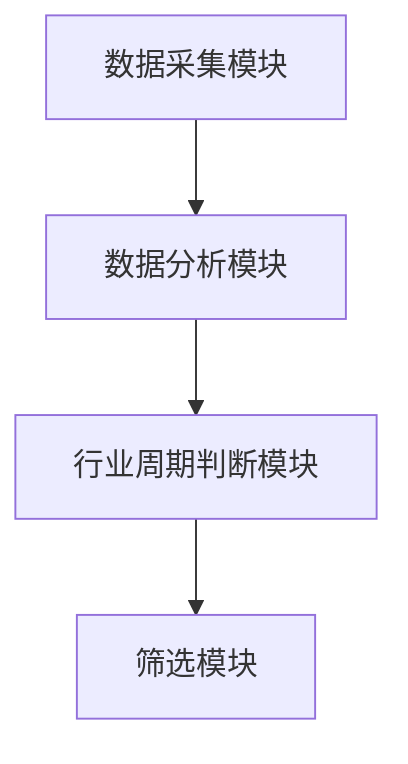

                 


# 彼得林奇的"高增长低估值"在不同行业周期中的筛选

## 关键词：  
彼得·林奇，高增长低估值，行业周期，投资策略，股票筛选，风险管理

## 摘要：  
本文深入探讨了彼得·林奇的“高增长低估值”投资策略在不同行业周期中的应用。通过分析行业周期的特性，结合高增长和低估值的核心概念，本文提出了一套系统的筛选方法，并通过实际案例和数学模型进行了详细阐述。同时，本文还探讨了风险管理的重要性，为投资者提供了在不同市场环境下优化投资组合的有效策略。

---

## 第一部分：引言

### 1.1 彼得·林奇投资理念概述

#### 1.1.1 彼得·林奇的生平与投资成就
彼得·林奇（Peter Lynch）是美国著名的职业基金经理人，曾管理富达麦哲伦基金（Fidelity Magellan Fund），并创造了令人瞩目的投资业绩。他在任职期间（1977年-1990年）实现了年均29%的回报率，远超市场平均水平。林奇的成功部分归功于他对企业的深入研究和对行业周期的敏锐洞察。

#### 1.1.2 高增长低估值策略的核心思想
林奇认为，投资成功的关键在于找到那些收入和利润快速增长但估值被市场低估的企业。这种“高增长低估值”的策略能够在企业进入成熟期时带来超额收益，尤其是在行业周期的上升阶段。

#### 1.1.3 不同行业周期对投资策略的影响
行业周期的变化直接影响企业的增长潜力和估值水平。例如，在行业增长期，高增长企业往往能够快速扩张，而在行业衰退期，低估值企业可能更具防御性。因此，理解行业周期是应用高增长低估值策略的关键。

---

### 1.2 高增长低估值策略的背景与意义

#### 1.2.1 高增长企业的定义与特征
高增长企业是指收入和利润持续以较高速度增长的企业。这类企业在行业增长期往往能够占据更大的市场份额，具有较强的竞争优势。

#### 1.2.2 低估值的衡量标准与意义
低估值通常通过市盈率（P/E）和市净率（P/B）等指标来衡量。低估值意味着企业当前的市场价格低于其内在价值，为投资者提供了安全边际。

#### 1.2.3 行业周期对企业估值的影响
行业周期的变化会影响企业的估值水平。例如，在行业衰退期，低估值企业可能因为市场恐慌而被进一步低估，为投资者提供了抄底的机会。

---

### 1.3 本书的核心内容与目标

#### 1.3.1 本书的研究范围
本文将重点分析高增长低估值策略在不同行业周期中的应用，包括如何通过行业周期判断筛选标准的适用性。

#### 1.3.2 本书的主要目标
通过本文，读者将能够掌握如何在不同行业周期中筛选高增长低估值的企业，并制定相应的投资策略。

#### 1.3.3 本书的结构安排
本文分为多个部分，包括高增长低估值的核心概念、筛选方法、行业周期分析、数学模型构建等，力求全面而深入地探讨这一策略。

---

## 第二部分：高增长低估值策略的基础

### 2.1 高增长低估值的核心概念

#### 2.1.1 高增长的定义与衡量指标
高增长通常通过收入增长率和净利润增长率来衡量。收入增长率 = (当前收入 - 上期收入) / 上期收入 × 100%。净利润增长率 = (当前净利润 - 上期净利润) / 上期净利润 × 100%。

#### 2.1.2 低估值的定义与衡量指标
低估值可以通过市盈率（P/E）和市净率（P/B）来衡量。市盈率 = 股价 / 每股净利润，市净率 = 股价 / 每股净资产。

#### 2.1.3 高增长与低估值的内在联系
高增长企业通常具有较高的市盈率，但低估值意味着其市盈率和市净率低于行业平均水平。

---

### 2.2 高增长低估值与行业周期的关系

#### 2.2.1 行业周期的定义与分类
行业周期分为增长期、成熟期和衰退期。在增长期，企业收入和利润快速增长；在成熟期，企业增长放缓；在衰退期，企业收入和利润下降。

#### 2.2.2 不同行业周期下高增长低估值的特点
在行业增长期，高增长企业具有较大的发展空间；在行业衰退期，低估值企业可能因为市场恐慌而被低估。

#### 2.2.3 行业周期对投资策略的影响
行业周期的变化会影响企业的增长潜力和估值水平，因此在不同周期下需要调整高增长低估值的筛选标准。

---

### 2.3 高增长低估值策略的核心要素

#### 2.3.1 收入增长率的重要性
收入增长率是衡量企业增长潜力的重要指标。高收入增长率通常意味着企业具有较强的市场竞争力。

#### 2.3.2 净利润增长率的重要性
净利润增长率是衡量企业盈利能力的重要指标。高净利润增长率通常意味着企业具有较强的盈利能力。

#### 2.3.3 市盈率与市净率的对比分析
市盈率和市净率是衡量企业估值水平的重要指标。低市盈率和低市净率通常意味着企业具有较低的估值水平。

---

## 第三部分：高增长低估值策略的筛选方法

### 3.1 高增长低估值的筛选标准

#### 3.1.1 收入与利润增长率的双重考量
在筛选高增长企业时，需要同时考虑收入增长率和净利润增长率。

#### 3.1.2 市盈率与市净率的对比分析
在筛选低估值企业时，需要同时考虑市盈率和市净率。

#### 3.1.3 行业周期对估值的影响
在不同行业周期下，高增长低估值的筛选标准需要进行调整。

---

## 第四部分：行业周期分析与策略应用

### 4.1 不同行业周期下的高增长低估值策略

#### 4.1.1 行业增长期的策略
在行业增长期，应重点关注收入和利润快速增长的企业。

#### 4.1.2 行业成熟期的策略
在行业成熟期，应重点关注收入和利润稳定增长、估值较低的企业。

#### 4.1.3 行业衰退期的策略
在行业衰退期，应重点关注估值极低、具有防御性的企业。

---

## 第五部分：数学模型与算法实现

### 5.1 高增长低估值筛选的数学模型

#### 5.1.1 收入增长率模型
收入增长率 = (当前收入 - 上期收入) / 上期收入 × 100%

#### 5.1.2 净利润增长率模型
净利润增长率 = (当前净利润 - 上期净利润) / 上期净利润 × 100%

#### 5.1.3 市盈率与市净率模型
市盈率 = 股价 / 每股净利润  
市净率 = 股价 / 每股净资产

---

### 5.2 算法实现

#### 5.2.1 行业周期判断算法
1. 收集行业指数数据。
2. 计算行业指数的涨跌趋势。
3. 根据趋势判断行业周期阶段。

#### 5.2.2 高增长低估值筛选算法
1. 确定行业周期阶段。
2. 计算企业收入增长率和净利润增长率。
3. 计算企业市盈率和市净率。
4. 根据筛选标准选出符合条件的企业。

---

## 第六部分：系统架构与风险管理

### 6.1 系统架构设计

#### 6.1.1 系统功能模块
- 数据采集模块：收集企业财务数据和行业指数数据。
- 数据分析模块：计算收入增长率、净利润增长率、市盈率和市净率。
- 行业周期判断模块：根据行业指数数据判断行业周期阶段。
- 筛选模块：根据筛选标准选出符合条件的企业。

#### 6.1.2 系统架构图


---

### 6.2 风险管理

#### 6.2.1 行业风险
不同行业周期下，高增长低估值策略的风险不同。例如，在行业衰退期，低估值企业可能因为市场恐慌而进一步下跌。

#### 6.2.2 估值陷阱
某些企业可能因为市场情绪波动而被低估，但其基本面并不支持高增长。

#### 6.2.3 周期波动风险
行业周期的变化可能会影响企业的增长潜力和估值水平，从而影响投资收益。

---

## 第七部分：案例分析与优化

### 7.1 实战案例分析

#### 7.1.1 案例一：科技行业
在行业增长期，选择收入和利润快速增长的科技企业，如苹果和谷歌。

#### 7.1.2 案例二：消费行业
在行业成熟期，选择收入和利润稳定增长、估值较低的消费企业，如可口可乐和宝洁。

---

### 7.2 策略优化与调整

#### 7.2.1 动态调整筛选标准
根据行业周期的变化，动态调整高增长低估值的筛选标准。

#### 7.2.2 行业轮换策略
根据行业周期的变化，进行行业轮换，选择具有更高增长潜力的行业。

---

## 第八部分：总结与展望

### 8.1 本文总结
本文系统地探讨了彼得·林奇的高增长低估值策略在不同行业周期中的应用，提出了系统的筛选方法，并通过实际案例进行了详细阐述。

### 8.2 未来展望
未来，随着市场环境的变化和科技的进步，高增长低估值策略的应用将更加广泛和复杂。投资者需要不断优化筛选方法，以应对新的挑战。

---

## 附录

### 附录A：相关公式与计算方法
- 收入增长率公式
- 净利润增长率公式
- 市盈率公式
- 市净率公式

### 附录B：行业周期判断标准
- 行业增长期的特征
- 行业成熟期的特征
- 行业衰退期的特征

### 附录C：Python代码实现
```python
import pandas as pd

# 数据采集模块
data = pd.read_csv('stock_data.csv')

# 数据分析模块
growth_rate = (data['current_revenue'] - data['previous_revenue']) / data['previous_revenue'] * 100
profit_growth_rate = (data['current_profit'] - data['previous_profit']) / data['previous_profit'] * 100

# 行业周期判断模块
industry_growth = data['industry_index'].pct_change().mean()

# 筛选模块
selected_stocks = data[(growth_rate > 20) & (profit_growth_rate > 15) & (data['P/E'] < 15) & (data['P/B'] < 2)]
```

---

通过以上内容，读者可以全面了解彼得·林奇的高增长低估值策略在不同行业周期中的应用，并能够通过实际案例和数学模型进行深入分析和实践。

