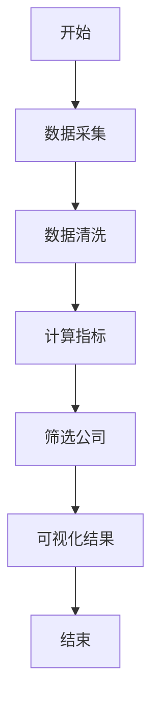
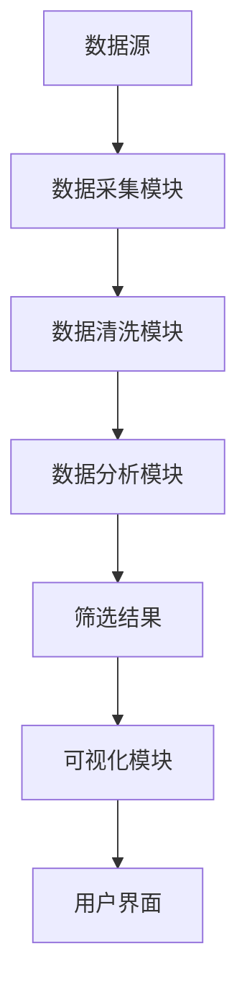
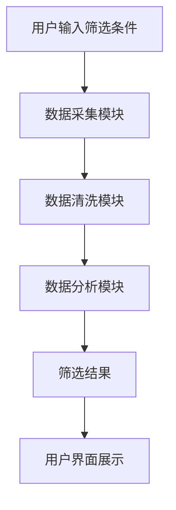

                 


# 彼得林奇的"高增长低估值"在新兴市场的筛选

> 关键词：彼得林奇，高增长，低估值，新兴市场，投资策略，量化分析

> 摘要：本文详细探讨了彼得林奇的“高增长低估值”投资策略在新兴市场的应用，从理论基础到量化分析，从系统设计到实战案例，全面解析了如何在新兴市场中筛选出具有高增长潜力但估值较低的公司，为投资者提供了系统化的筛选方法和工具。

---

## # 第一章: 高增长低估值策略的背景与理论基础

### ## 1.1 彼得林奇投资理念的核心要素

#### ### 1.1.1 高增长的定义与衡量标准

- 高增长公司的定义：收入或净利润持续增长的企业。
- 衡量标准：收入增长率、净利润增长率、营业利润率。
- 高增长公司的特征：市场占有率提升、新产品推出能力强、行业地位稳固。

#### ### 1.1.2 低估值的定义与衡量标准

- 低估值的定义：市盈率、市净率、市销率等指标低于行业平均水平。
- 衡量标准：市盈率（P/E）、市净率（P/B）、市销率（P/S）。
- 低估值公司的特征：市场预期较低、股价被低估、财务状况健康。

#### ### 1.1.3 高增长与低估值的结合

- 高增长低估值公司的特征：收入和利润快速增长，但估值指标低于行业平均水平。
- 理论基础：市场对高增长公司的预期可能过于悲观，导致估值被低估。

### ## 1.2 新兴市场的特点与投资机会

#### ### 1.2.1 新兴市场的定义与分类

- 新兴市场的定义：经济快速发展、市场机制逐步完善、但尚未完全成熟的国家或地区。
- 新兴市场的分类：按地区划分（如亚洲、拉丁美洲）、按发展阶段划分（如发展中市场、转型市场）。

#### ### 1.2.2 新兴市场的增长驱动力

- 人口红利：新兴市场的人口结构年轻，消费潜力大。
- 经济转型：从劳动密集型产业向技术密集型产业转型。
- 政策支持：政府通过政策引导和扶持推动经济增长。

#### ### 1.2.3 新兴市场的风险与挑战

- 市场波动性大：新兴市场受全球经济波动影响较大。
- 法律法规不完善：市场机制尚不健全，投资风险较高。
- 通货膨胀压力：新兴市场通胀率较高，影响企业盈利能力和估值。

### ## 1.3 高增长低估值策略的核心逻辑

#### ### 1.3.1 高增长公司的识别标准

- 收入增长率：衡量公司主营业务收入的增长速度。
- 净利润增长率：衡量公司盈利能力的增长速度。
- 营业利润率：衡量公司核心业务的盈利能力。

#### ### 1.3.2 低估值公司的筛选方法

- 市盈率：净利润与股价的比率，反映市场对公司盈利能力的预期。
- 市净率：净资产与股价的比率，反映市场对公司资产价值的评估。
- 市销率：营业收入与股价的比率，反映市场对公司收入的估值。

#### ### 1.3.3 高增长与低估值的平衡点

- 高增长公司可能估值偏高，低估值公司可能增长潜力不足。
- 高增长低估值公司的筛选需要综合考虑增长率和估值指标。

---

## # 第二章: 高增长低估值策略的量化分析

### ## 2.1 高增长公司的识别指标

#### ### 2.1.1 收入增长率的计算与分析

- 收入增长率 = (本年收入 - 上年收入) / 上年收入 × 100%
- 示例：某公司去年收入为100万元，今年收入为120万元，收入增长率为20%。

#### ### 2.1.2 净利润增长率的计算与分析

- 净利润增长率 = (本年净利润 - 上年净利润) / 上年净利润 × 100%
- 示例：某公司去年净利润为50万元，今年净利润为60万元，净利润增长率为20%。

#### ### 2.1.3 营业利润率的计算与分析

- 营业利润率 = 净利润 / 营业收入 × 100%
- 示例：某公司净利润为60万元，营业收入为300万元，营业利润率为20%。

### ## 2.2 低估值公司的筛选指标

#### ### 2.2.1 市盈率的计算与分析

- 市盈率 = 股价 / 每股净利润
- 示例：某公司股价为20元，每股净利润为2元，市盈率为10倍。

#### ### 2.2.2 市净率的计算与分析

- 市净率 = 股价 / 每股净资产
- 示例：某公司股价为20元，每股净资产为5元，市净率为4倍。

#### ### 2.2.3 市销率的计算与分析

- 市销率 = 股价 / 每股营业收入
- 示例：某公司股价为20元，每股营业收入为5元，市销率为4倍。

### ## 2.3 高增长与低估值的量化关系

#### ### 2.3.1 高增长与低估值的动态平衡

- 高增长公司可能估值偏高，低估值公司可能增长潜力不足。
- 需要找到高增长和低估值之间的平衡点，避免单一指标的偏差。

#### ### 2.3.2 市场周期对高增长低估值策略的影响

- 在市场牛市中，高增长公司的估值可能偏高，低估值公司的增长潜力可能被低估。
- 在市场熊市中，高增长公司的估值可能被低估，低估值公司的价值可能被市场忽视。

#### ### 2.3.3 行业周期对高增长低估值策略的影响

- 在行业上升周期中，高增长公司的增长潜力更大。
- 在行业衰退周期中，低估值公司的风险可能更大。

---

## # 第三章: 高增长低估值策略的筛选标准与方法

### ## 3.1 高增长低估值公司的筛选标准

#### ### 3.1.1 收入增长率的筛选标准

- 收入增长率应高于行业平均水平。
- 示例：行业平均水平为10%，筛选标准为收入增长率 > 10%。

#### ### 3.1.2 净利润增长率的筛选标准

- 净利润增长率应高于行业平均水平。
- 示例：行业平均水平为8%，筛选标准为净利润增长率 > 8%。

#### ### 3.1.3 营业利润率的筛选标准

- 营业利润率应高于行业平均水平。
- 示例：行业平均水平为15%，筛选标准为营业利润率 > 15%。

### ## 3.2 高增长低估值公司的筛选方法

#### ### 3.2.1 基于财务指标的筛选方法

- 使用财务指标（如收入增长率、净利润增长率、市盈率）进行多维度筛选。
- 示例：筛选收入增长率 > 20%，净利润增长率 > 15%，市盈率 < 行业平均水平。

#### ### 3.2.2 基于行业分析的筛选方法

- 结合行业发展趋势，选择具有高增长潜力的行业。
- 示例：新兴市场中，科技、消费、金融等行业具有较高的增长潜力。

#### ### 3.2.3 基于市场环境的筛选方法

- 结合宏观经济环境，选择具有抗风险能力的公司。
- 示例：在经济下行周期中，选择具有稳定现金流和低估值的公司。

### ## 3.3 筛选过程中的注意事项

#### ### 3.3.1 筛选标准的灵活性与适应性

- 根据市场环境和行业特点调整筛选标准。
- 示例：在新兴市场中，可能需要降低收入增长率的筛选标准，同时提高市盈率的筛选标准。

#### ### 3.3.2 筛选过程中的风险控制

- 通过多元化筛选指标降低投资风险。
- 示例：同时关注收入增长率、净利润增长率和市盈率，避免单一指标的偏差。

#### ### 3.3.3 筛选过程中的动态调整

- 定期回顾和调整筛选标准，适应市场变化。
- 示例：每年对筛选标准进行一次评估和调整，确保筛选方法的有效性。

---

## # 第四章: 高增长低估值策略的系统分析与架构设计

### ## 4.1 系统功能设计

#### ### 4.1.1 高增长低估值筛选系统的需求分析

- 需求背景：投资者需要快速筛选出具有高增长低估值的公司。
- 需求目标：开发一个基于量化分析的高增长低估值公司筛选系统。

#### ### 4.1.2 系统功能模块划分

- 数据采集模块：采集公司财务数据和市场数据。
- 数据分析模块：计算各项指标，筛选出符合条件的公司。
- 可视化模块：展示筛选结果，帮助投资者做出决策。

#### ### 4.1.3 系统功能流程图



### ## 4.2 系统架构设计

#### ### 4.2.1 系统架构图



#### ### 4.2.2 系统接口设计

- 数据接口：与财务数据源（如数据库、API）对接。
- 用户接口：提供用户输入筛选条件和查看筛选结果的界面。

#### ### 4.2.3 系统交互流程图



---

## # 第五章: 高增长低估值策略的实战案例分析

### ## 5.1 项目环境与工具安装

#### ### 5.1.1 环境配置

- 操作系统：Windows 10或更高版本。
- 开发工具：Python 3.8及以上版本，Jupyter Notebook。
- 数据库：MySQL或MongoDB。

#### ### 5.1.2 依赖库安装

```bash
pip install pandas numpy matplotlib seaborn
```

### ## 5.2 核心代码实现

#### ### 5.2.1 数据采集模块

```python
import pandas as pd
import requests

def get_financial_data(symbol):
    url = f"https://api.example.com/financial_data/{symbol}"
    response = requests.get(url)
    data = response.json()
    return pd.DataFrame(data)
```

#### ### 5.2.2 数据分析模块

```python
def calculate_growth_rates(df):
    df['收入增长率'] = (df['收入'] / df['收入'].shift(1)) - 1
    df['净利润增长率'] = (df['净利润'] / df['净利润'].shift(1)) - 1
    df['营业利润率'] = df['净利润'] / df['收入'] * 100
    return df
```

#### ### 5.2.3 筛选模块

```python
def screen_high_growth_low_valuation(df, threshold_income_growth=0.2, threshold_profit_growth=0.15, threshold_pe=15):
    df = df[df['收入增长率'] > threshold_income_growth]
    df = df[df['净利润增长率'] > threshold_profit_growth]
    df = df[df['市盈率'] < threshold_pe]
    return df
```

### ## 5.3 案例分析与解读

#### ### 5.3.1 案例背景

- 新兴市场：东南亚市场。
- 行业：科技行业。

#### ### 5.3.2 数据分析与筛选

- 数据采集：从API获取东南亚科技公司的财务数据。
- 数据清洗：处理缺失值和异常值。
- 数据分析：计算收入增长率、净利润增长率和市盈率。
- 筛选结果：筛选出收入增长率 > 20%、净利润增长率 > 15%、市盈率 < 15的公司。

#### ### 5.3.3 结果解读

- 筛选出的公司具有较高的收入和利润增长潜力，同时估值较低，具有较高的投资价值。

---

## # 第六章: 高增长低估值策略的总结与展望

### ## 6.1 总结

#### ### 6.1.1 核心观点回顾

- 高增长低估值策略的核心是寻找具有高增长潜力但估值较低的公司。
- 在新兴市场中，高增长低估值公司的筛选需要结合行业特点和市场环境。

#### ### 6.1.2 技术实现总结

- 通过量化分析和系统设计，可以高效地筛选出符合条件的公司。
- 筛选系统可以帮助投资者快速找到具有高增长低估值的公司。

### ## 6.2 展望

#### ### 6.2.1 策略优化

- 结合人工智能技术，进一步优化筛选算法。
- 示例：使用机器学习模型预测公司未来增长潜力和估值。

#### ### 6.2.2 应用拓展

- 将高增长低估值策略应用于其他市场和行业。
- 示例：将策略扩展到拉丁美洲、非洲等其他新兴市场。

#### ### 6.2.3 风险控制

- 加强风险分析，降低市场波动对投资组合的影响。
- 示例：通过多元化投资和风险对冲降低投资风险。

---

## # 第七章: 最佳实践与注意事项

### ## 7.1 最佳实践

#### ### 7.1.1 筛选标准的动态调整

- 定期回顾和调整筛选标准，适应市场变化。
- 示例：每年对收入增长率和净利润增长率的筛选标准进行一次评估和调整。

#### ### 7.1.2 多元化投资

- 通过多元化投资降低风险。
- 示例：将资金分配到不同行业和不同地区的公司，分散投资风险。

### ## 7.2 注意事项

#### ### 7.2.1 避免过度依赖单一指标

- 高增长低估值策略需要结合多个指标进行综合评估。
- 示例：仅关注收入增长率可能导致误判公司的真实增长潜力。

#### ### 7.2.2 关注公司基本面

- 除了财务指标，还需要关注公司管理团队和行业前景。
- 示例：选择管理团队稳定、行业前景广阔的公司。

### ## 7.3 拓展阅读

- 彼得林奇的《聪明的投资者》。
- 投资策略相关的书籍和文章。

---

## # 第八章: 附录

### ## 8.1 数据来源与工具

- 数据来源：公开财务数据、API接口。
- 工具：Python、Jupyter Notebook、Pandas、Matplotlib、Seaborn。

### ## 8.2 代码实现

- 完整的Python代码实现：数据采集、数据分析、筛选模块。
- 示例代码：如上文所示的Python代码。

### ## 8.3 参考文献

- 彼得林奇的著作。
- 相关学术论文和研究报告。

---

## # 第九章: 小结

- 通过本文的详细分析，读者可以系统地了解彼得林奇的“高增长低估值”策略在新兴市场的应用。
- 从理论到实践，从分析到筛选，读者可以掌握如何在新兴市场中筛选出具有高增长低估值的公司。
- 未来，随着市场的变化和技术的进步，这一策略将不断完善和优化，为投资者提供更多的价值。

---

# END

