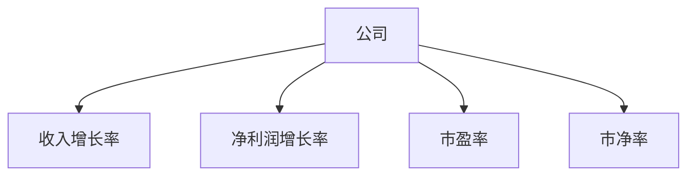
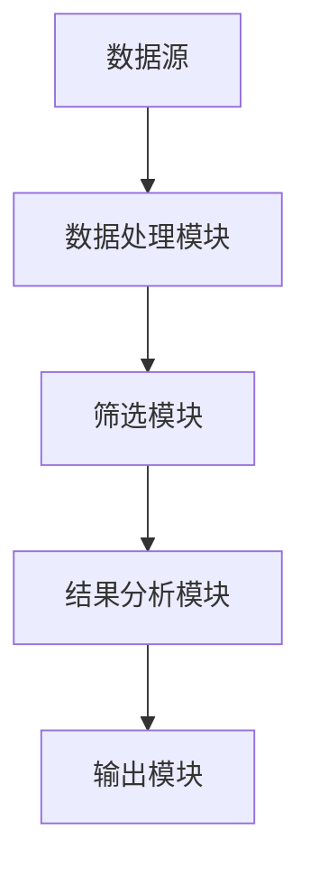

                 


# 彼得林奇的"高增长低估值"在新兴科技细分领域的筛选

## 关键词：彼得林奇，高增长低估值，科技细分领域，投资筛选，价值发现，技术分析

## 摘要：  
本文深入分析了彼得林奇的“高增长低估值”投资策略，并结合新兴科技细分领域的特点，探讨了该策略在筛选投资标的时的应用方法。通过技术分析和实际案例，我们展示了如何在科技领域中发现具有高增长潜力但估值较低的企业，帮助投资者在复杂多变的市场环境中做出明智的投资决策。

---

## 第一部分：背景介绍

### 第1章：高增长低估值的定义与特点

#### 1.1 高增长的定义  
高增长是指企业在一定时间内收入或利润的持续增长。通常，增长率可以用年复合增长率（CAGR）来衡量，公式如下：  
$$ CAGR = \frac{1}{n} \left( \frac{FV}{PV} \right)^{1/n} - 1 $$  
其中，$FV$ 是最终价值，$PV$ 是初始价值，$n$ 是时间跨度。

#### 1.2 低估值的定义  
低估值是指企业的市场价值低于其内在价值。常用的估值指标包括市盈率（P/E）和市净率（P/B），公式如下：  
$$ P/E = \frac{\text{股价}}{\text{每股净利润}} $$  
$$ P/B = \frac{\text{股价}}{\text{每股净资产}} $$  
低估值意味着这些指标低于行业平均水平或历史平均水平。

#### 1.3 高增长与低估值的结合特点  
高增长和低估值的结合意味着企业具有强劲的增长潜力，但市场尚未充分认识到其价值，从而提供了一个买入的机会。这种组合通常出现在新兴科技细分领域，因为这些领域的公司可能处于成长阶段，尚未被市场充分挖掘。

---

### 第2章：彼得林奇投资理念的核心要素

#### 2.1 投资理念的背景  
彼得林奇是美国著名投资经理人，以其在富达麦哲伦基金的投资业绩闻名。他认为，成功的投资需要结合基本面分析和市场估值，寻找那些具有持续增长潜力但被市场低估的企业。

#### 2.2 高增长低估值策略的形成  
彼得林奇的策略基于以下原则：  
1. **高增长**：寻找收入或利润快速增长的公司。  
2. **低估值**：确保企业的市场价值低于其内在价值。  
3. **长期投资**：耐心持有优质资产，等待市场重新评估其价值。  

#### 2.3 科技细分领域的适用性  
科技细分领域（如人工智能、云计算、网络安全等）通常具有高增长潜力，但许多公司可能因市场认知不足或行业波动而被低估，为高增长低估值策略提供了丰富的筛选空间。

---

## 第二部分：核心概念与联系

### 第3章：高增长与低估值的内在联系

#### 3.1 高增长与低估值的关系  
高增长和低估值之间存在动态关系。高增长企业可能暂时估值较低，因为市场可能低估了其未来的盈利能力。这种认知差距为投资者提供了机会。

#### 3.2 科技细分领域的高增长低估值筛选指标  
以下是科技细分领域筛选高增长低估值企业的关键指标：  
- **收入增长率**：$$ \text{收入增长率} = \frac{\text{当年收入} - \text{上期收入}}{\text{上期收入}} \times 100\% $$  
- **净利润增长率**：$$ \text{净利润增长率} = \frac{\text{当年净利润} - \text{上期净利润}}{\text{上期净利润}} \times 100\% $$  
- **市盈率（P/E）**：衡量企业估值的常用指标。  
- **市净率（P/B）**：适用于资产密集型行业。  

#### 3.3 实体关系图  
以下是高增长低估值筛选的实体关系图：  



---

## 第三部分：算法原理讲解

### 第4章：高增长低估值筛选算法的基本原理

#### 4.1 算法实现的步骤  
1. **数据收集**：收集目标科技细分领域的公司财务数据和市场数据。  
2. **计算增长率**：使用CAGR公式计算收入和净利润增长率。  
3. **计算估值指标**：计算P/E和P/B。  
4. **筛选标准**：设定筛选条件，例如：  
   - 收入增长率 > 行业平均水平  
   - 净利润增长率 > 行业平均水平  
   - P/E < 行业平均水平  
   - P/B < 行业平均水平  
5. **输出结果**：筛选出符合条件的公司列表。

#### 4.2 算法实现的数学模型  
以下是高增长低估值筛选算法的数学模型：  
- **收入增长率**：$$ \text{CAGR} = \frac{1}{n} \left( \frac{FV}{PV} \right)^{1/n} - 1 $$  
- **P/E 和 P/B 比较**：将企业的P/E和P/B与行业平均水平进行比较。  

#### 4.3 算法实现的代码示例  
以下是Python代码示例：

```python
import pandas as pd

# 数据收集
data = pd.read_csv('tech_companies.csv')

# 计算收入增长率
data['收入增长率'] = ((data['收入'] / data['收入'].shift(1)) ** (1/ (data['年份'].diff().mean())) - 1)

# 计算净利润增长率
data['净利润增长率'] = ((data['净利润'] / data['净利润'].shift(1)) ** (1/ (data['年份'].diff().mean())) - 1)

# 计算P/E和P/B
data['P/E'] = data['股价'] / data['每股净利润']
data['P/B'] = data['股价'] / data['每股净资产']

# 筛选标准
行业平均PE = data['P/E'].mean()
行业平均PB = data['P/B'].mean()

筛选结果 = data[(data['收入增长率'] > 行业平均收入增长率) &
                (data['净利润增长率'] > 行业平均净利润增长率) &
                (data['P/E'] < 行业平均PE) &
                (data['P/B'] < 行业平均PB)]
```

---

## 第四部分：系统分析与架构设计

### 第5章：系统分析与架构设计

#### 5.1 系统架构图  
以下是高增长低估值筛选系统的架构图：  



#### 5.2 功能模块设计  
1. **数据处理模块**：收集、清洗和整理数据。  
2. **筛选模块**：根据预设条件筛选公司。  
3. **结果分析模块**：对筛选结果进行深入分析。  
4. **输出模块**：生成报告或可视化结果。  

---

## 第五部分：项目实战

### 第6章：项目实战

#### 6.1 环境安装与数据准备  
- **环境安装**：安装Python、Pandas、Matplotlib等工具。  
- **数据准备**：收集目标科技细分领域的公司数据。

#### 6.2 算法实现  
使用Python代码实现高增长低估值筛选算法，并对结果进行分析。

#### 6.3 实战结果分析  
以人工智能领域的公司为例，分析筛选结果，并解释其投资价值。

#### 6.4 项目小结  
总结项目实施过程中的经验教训，并提出改进建议。

---

## 第六部分：总结与展望

### 第7章：总结与展望

#### 7.1 总结  
本文通过分析彼得林奇的高增长低估值策略，结合科技细分领域的特点，探讨了如何筛选具有投资潜力的企业。通过技术分析和实际案例，我们展示了该策略的有效性和实用性。

#### 7.2 未来展望  
随着科技领域的快速发展，高增长低估值策略将面临更多的挑战和机遇。未来，可以通过引入机器学习和大数据技术，进一步优化筛选算法，提高筛选效率和准确性。

---

通过本文的分析，投资者可以在新兴科技细分领域中，利用彼得林奇的高增长低估值策略，筛选出具有投资价值的企业，从而在复杂多变的市场中获得超额收益。

