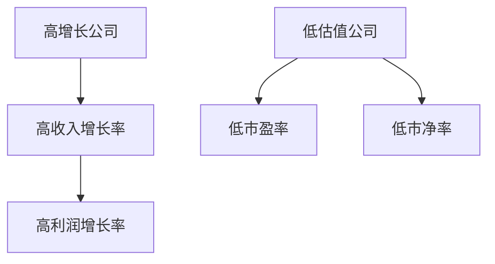
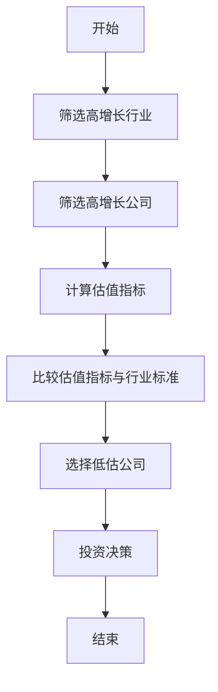
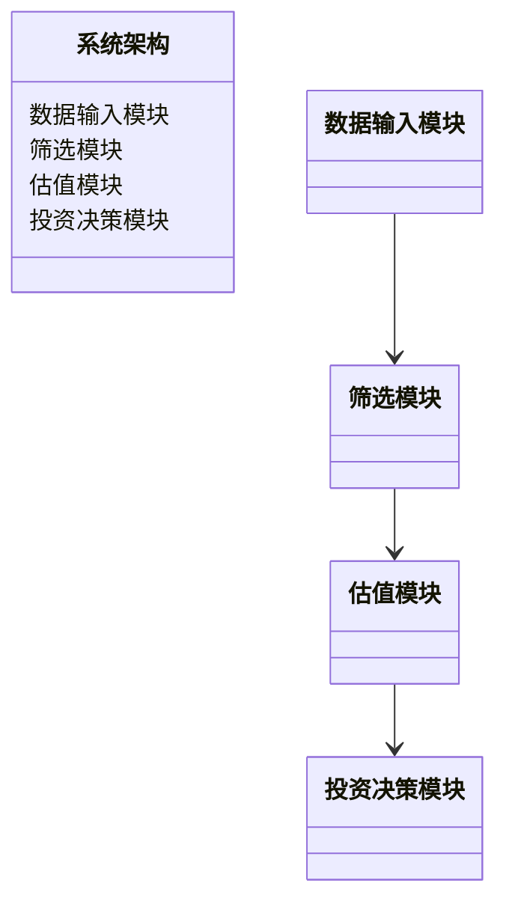
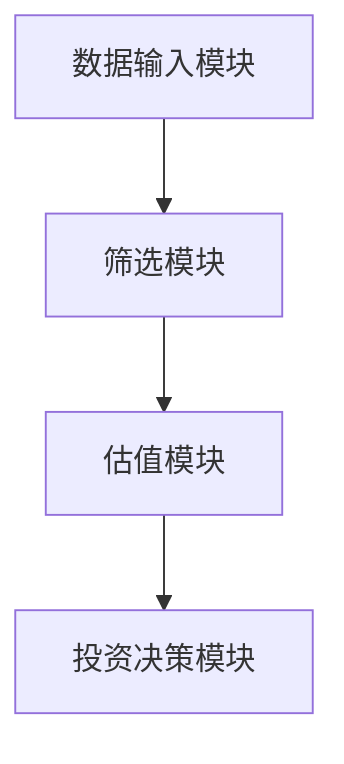
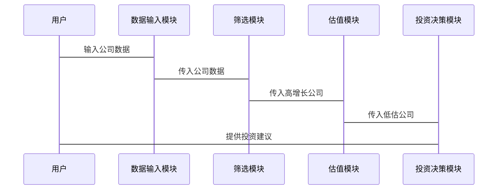

                 


# 彼得林奇的"高增长低估值"案例分析

## 关键词：彼得·林奇，高增长，低估值，投资策略，股票分析，价值投资

## 摘要：  
彼得·林奇作为历史上最成功的基金经理之一，以其独特的“高增长低估值”投资策略闻名。本文通过详细分析这一策略的核心概念、数学模型、算法原理和实际案例，揭示其背后的逻辑和应用场景，为投资者提供深度的分析和实践指导。文章结合技术语言和专业术语，深入探讨了高增长与低估值之间的平衡点，以及如何通过数学模型和系统架构设计来实现投资决策的优化。

---

## 第一部分：彼得·林奇的"高增长低估值"投资策略背景

### 第1章：彼得·林奇与"高增长低估值"策略概述

#### 1.1 彼得·林奇的生平与投资理念  
- **彼得·林奇的个人经历**：  
  彼得·林奇（Peter Lynch）是美国历史上最成功的基金经理之一，管理麦哲伦基金（Fidelity Magellan Fund）长达13年，创造了年均29%的惊人回报率。他以深入的行业研究和独特的投资策略闻名。  

- **林奇的投资哲学与方法**：  
  林奇强调“简单就是伟大”，主张投资于那些具有持续增长潜力的公司，并通过深入的行业分析和公司基本面研究来寻找低估的投资机会。他反对短期市场波动，倡导长期价值投资。  

- **林奇对价值投资的贡献**：  
  林奇将价值投资理念与成长股投资相结合，提出了“高增长低估值”的策略，即寻找那些收入和利润快速增长，但估值被市场低估的公司。这种方法在当时传统价值投资中注入了新的活力。  

#### 1.2 高增长低估值策略的定义与特点  
- **高增长公司的定义**：  
  高增长公司是指收入和利润持续快速增长，且增长率远超行业平均水平的企业。这些公司通常处于扩张期，具有强大的市场竞争力和增长潜力。  

- **低估值公司的特征**：  
  低估值公司是指市盈率（P/E）、市净率（P/B）等估值指标低于行业平均水平的企业。这些公司可能被市场忽视或低估，但其内在价值与当前股价存在较大的差距。  

- **高增长与低估值的平衡点**：  
  林奇强调，高增长公司并不一定意味着高估值。真正的投资机会在于那些增长潜力大但估值被低估的公司。  

#### 1.3 高增长低估值策略的核心要素  
- **收入增长的核心作用**：  
  收入增长是判断公司是否为高增长公司的核心指标。林奇认为，持续的收入增长是公司未来利润增长的保障。  

- **估值指标的重要性**：  
  林奇通过市盈率、市净率等指标来评估公司的估值水平。他认为，低估值公司具有较高的安全边际，能够在市场波动中提供超额回报。  

- **市场环境的影响**：  
  林奇的策略高度依赖于市场环境。在熊市中，低估值公司更容易被市场忽视，从而提供投资机会；而在牛市中，高增长公司更容易被市场发现，估值可能偏高。  

#### 1.4 本章小结  
本章详细介绍了彼得·林奇的生平及其“高增长低估值”策略的核心理念。通过定义高增长和低估值公司的特征，揭示了该策略的核心要素和应用场景。

---

## 第二部分：高增长低估值策略的核心概念与联系

### 第2章：高增长与低估值的内在联系  

#### 2.1 高增长公司的特征分析  
- **收入增长率**：  
  收入增长率是衡量公司增长潜力的核心指标。林奇通常寻找收入增长率超过行业平均水平的公司。  

- **利润增长率**：  
  利润增长率反映了公司的盈利能力和成本控制能力。高利润增长率表明公司具有较强的盈利能力。  

- **市场地位与竞争优势**：  
  高增长公司通常在市场上具有强大的竞争优势，例如独特的技术、品牌优势或成本优势。  

#### 2.2 低估值公司的特征分析  
- **市盈率的计算与分析**：  
  市盈率（P/E）= 股价 / 每股净利润。低市盈率意味着公司股价相对其盈利水平较低，可能被市场低估。  

- **市净率的评估标准**：  
  市净率（P/B）= 股价 / 每股净资产。低市净率表明公司股价相对于其净资产价值较低，可能被市场低估。  

- **股价与内在价值的对比**：  
  林奇通过比较公司股价与其内在价值，寻找那些股价低于内在价值的公司。  

#### 2.3 高增长与低估值的平衡点  
- **市场预期与实际增长的匹配**：  
  高增长公司可能因为市场预期过高而被高估，而低估值公司可能因为市场预期过低而被低估。  

- **估值指标与增长潜力的关系**：  
  林奇认为，低估值公司通常具有较高的增长潜力，因为其估值与实际增长潜力之间的差距较大。  

- **行业周期与公司周期的影响**：  
  高增长公司可能出现在成长期行业，而低估值公司可能出现在成熟期行业。行业周期和公司周期对高增长低估值策略的应用具有重要影响。  

#### 2.4 核心概念对比表  
| 特征 | 高增长公司 | 低估值公司 |
|------|------------|------------|
| 收入增长率 | 高         | 无特别要求 |
| 利润增长率 | 高         | 无特别要求 |
| 市盈率 | 无特别要求 | 低         |
| 市净率 | 无特别要求 | 低         |

#### 2.5 实体关系图  


#### 2.6 本章小结  
本章通过对比高增长公司和低估值公司的特征，揭示了两者之间的内在联系，并通过对比表和实体关系图进一步明确了策略的核心要素。

---

## 第三部分：高增长低估值策略的算法原理

### 第3章：高增长低估值策略的筛选算法  

#### 3.1 算法原理概述  
高增长低估值策略的核心是通过筛选高增长和低估值的公司，寻找那些具有增长潜力但估值被低估的投资机会。以下是具体的筛选算法：



#### 3.2 算法实现步骤  
1. **筛选高增长行业**：  
   根据收入增长率和利润增长率，筛选出增长潜力大的行业。  

2. **筛选高增长公司**：  
   在高增长行业中，进一步筛选收入和利润增长率超过行业平均水平的公司。  

3. **计算估值指标**：  
   计算市盈率（P/E）、市净率（P/B）等估值指标。  

4. **比较估值指标与行业标准**：  
   将公司估值指标与行业平均水平进行比较，找出估值低于行业平均水平的公司。  

5. **选择低估公司**：  
   结合公司基本面和行业前景，选择那些估值被低估且具有持续增长潜力的公司。  

#### 3.3 数学模型与公式  
- **市盈率（P/E）计算公式**：  
  $$ P/E = \frac{\text{股价}}{\text{每股净利润}} $$  

- **市净率（P/B）计算公式**：  
  $$ P/B = \frac{\text{股价}}{\text{每股净资产}} $$  

- **收入增长率计算公式**：  
  $$ \text{收入增长率} = \frac{\text{当前收入} - \text{上期收入}}{\text{上期收入}} \times 100\% $$  

- **利润增长率计算公式**：  
  $$ \text{利润增长率} = \frac{\text{当前利润} - \text{上期利润}}{\text{上期利润}} \times 100\% $$  

#### 3.4 实际案例分析  
假设我们有一个包含100家公司的数据集，目标是筛选出高增长低估值的公司。以下是具体的实现步骤：

1. **计算收入增长率和利润增长率**：  
   使用上述公式计算每家公司的收入增长率和利润增长率。  

2. **筛选高增长行业**：  
   根据收入增长率和利润增长率，找出增长潜力大的行业。  

3. **计算估值指标**：  
   计算每家公司的市盈率和市净率。  

4. **比较估值指标与行业标准**：  
   找出市盈率和市净率低于行业平均水平的公司。  

5. **选择低估公司**：  
   结合公司基本面和行业前景，选择具有持续增长潜力的低估公司。  

#### 3.5 本章小结  
本章通过具体的算法步骤和数学公式，详细解释了高增长低估值策略的筛选过程，并通过实际案例分析展示了其应用方法。

---

## 第四部分：高增长低估值策略的系统架构与实现

### 第4章：高增长低估值策略的系统架构设计  

#### 4.1 系统功能设计  
高增长低估值策略的系统架构设计如下：  



- **数据输入模块**：  
  负责输入公司基本面数据，包括收入、利润、股价等。  

- **筛选模块**：  
  根据收入增长率和利润增长率，筛选出高增长公司。  

- **估值模块**：  
  计算市盈率和市净率，比较与行业平均水平的差距。  

- **投资决策模块**：  
  综合公司基本面和行业前景，做出投资决策。  

#### 4.2 系统架构图  


#### 4.3 系统接口设计  
- **数据输入接口**：  
  接收公司基本面数据，包括收入、利润、股价等。  

- **筛选接口**：  
  根据收入增长率和利润增长率，筛选出高增长公司。  

- **估值接口**：  
  计算市盈率和市净率，比较与行业平均水平的差距。  

- **投资决策接口**：  
  综合公司基本面和行业前景，做出投资决策。  

#### 4.4 系统交互图  


#### 4.5 本章小结  
本章通过系统架构设计，详细解释了高增长低估值策略的实现过程，并通过接口设计和交互图进一步明确了系统的功能模块和流程。

---

## 第五部分：高增长低估值策略的项目实战

### 第5章：高增长低估值策略的实战分析  

#### 5.1 项目环境安装  
- **数据来源**：  
  使用公开的股票数据，包括收入、利润、股价等。  

- **工具选择**：  
  使用Python编程语言和Pandas、NumPy等库进行数据分析。  

#### 5.2 核心实现代码  
以下是高增长低估值策略的核心实现代码：  

```python
import pandas as pd
import numpy as np

# 数据加载
data = pd.read_csv('company_data.csv')

# 计算收入增长率和利润增长率
data['收入增长率'] = (data['收入'] - data['上期收入']) / data['上期收入'] * 100
data['利润增长率'] = (data['利润'] - data['上期利润']) / data['上期利润'] * 100

# 筛选高增长公司
high_growth = data[data['收入增长率'] > data['行业收入增长率平均值']]
high_growth = high_growth[high_growth['利润增长率'] > high_growth['行业利润增长率平均值']]

# 计算估值指标
high_growth['市盈率'] = high_growth['股价'] / high_growth['每股净利润']
high_growth['市净率'] = high_growth['股价'] / high_growth['每股净资产']

# 筛选低估值公司
low_valuation = high_growth[(high_growth['市盈率'] < high_growth['行业市盈率平均值']) &
                             (high_growth['市净率'] < high_growth['行业市净率平均值'])]

# 投资决策
low_valuation.to_csv('投资机会.csv')
```

#### 5.3 代码应用解读与分析  
1. **数据加载**：  
   使用`pandas`读取公司数据，包括收入、利润、股价等。  

2. **计算增长率**：  
   根据公式计算收入增长率和利润增长率，筛选出高增长公司。  

3. **计算估值指标**：  
   计算市盈率和市净率，比较与行业平均水平的差距。  

4. **筛选低估公司**：  
   根据估值指标，筛选出低估公司。  

5. **投资决策**：  
   将低估公司保存为投资机会列表。  

#### 5.4 实际案例分析  
以科技行业为例，分析如何应用该策略筛选投资机会。  

#### 5.5 本章小结  
本章通过具体的代码实现，展示了高增长低估值策略的应用过程，并通过实际案例分析进一步验证了其有效性。

---

## 第六部分：最佳实践与总结

### 第6章：最佳实践与总结  

#### 6.1 最佳实践 tips  
- **持续学习与研究**：  
  投资者需要不断学习市场动态和公司基本面，保持对市场的敏感性。  

- **分散投资**：  
  高增长低估值策略的风险较高，建议分散投资，降低风险。  

- **长期持有**：  
  林奇强调长期投资，避免频繁交易，以获得稳定的回报。  

#### 6.2 本章小结  
本章总结了高增长低估值策略的应用要点，并提供了最佳实践的建议。

#### 6.3 注意事项  
- 高增长公司可能面临较高的市场风险。  
- 低估值公司可能由于基本面恶化而继续被低估。  
- 需要结合行业周期和市场环境进行投资决策。  

#### 6.4 拓展阅读  
推荐阅读彼得·林奇的著作《彼得·林奇的成功投资》和《股票投资策略》。

---

## 总结  

本文通过详细分析彼得·林奇的“高增长低估值”策略，揭示了其背后的逻辑和应用场景。从核心概念到算法实现，从系统架构到项目实战，本文为投资者提供了全面的指导。通过本文的学习，读者可以更好地理解高增长低估值策略的精髓，并将其应用于实际投资中。  

--- 

**关键词**：彼得·林奇，高增长，低估值，投资策略，股票分析，价值投资  
**摘要**：本文详细分析了彼得·林奇的“高增长低估值”投资策略，揭示了其核心概念、数学模型、算法原理和实际案例，为投资者提供了深度的分析和实践指导。

