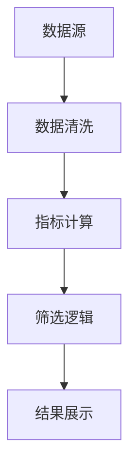

                 

# 彼得林奇的"高增长低估值"筛选技巧

> 关键词：彼得·林奇，高增长，低估值，选股模型，投资策略，价值投资

> 摘要：本文深入分析了彼得·林奇的“高增长低估值”选股技巧，从其投资哲学、选股模型、筛选标准、成功案例到风险管理，全面解析了这一策略的内在逻辑和实际应用。通过详细阐述其选股模型的构建与优化过程，结合实际案例分析，为投资者提供了科学的选股思路和风险管理策略。

---

## 第一章：彼得·林奇与他的投资哲学

### 1.1 彼得·林奇的背景与成就

彼得·林奇是美国著名投资经理人，曾任富达麦哲伦基金的经理，创造了年均21.5%的复合回报率。他以独特的选股方法闻名，注重基本面分析和长期投资。

### 1.2 高增长低估值选股法的核心思想

彼得·林奇认为，投资者应寻找那些具有高增长潜力但市场价格低于其内在价值的企业。这种策略结合了成长与价值投资的双重优势。

### 1.3 选股模型的核心步骤

1. 确定投资目标：明确投资期限、风险承受能力。
2. 筛选高增长企业：通过财务指标筛选高增长公司。
3. 评估低估值股票：通过估值指标筛选价格低于内在价值的股票。
4. 组合优化与风险控制：分散投资，定期调整。

---

## 第二章：高增长企业的识别与分析

### 2.1 高增长企业的定义与特征

高增长企业是指收入和利润持续增长，且增速高于行业平均水平的企业。其核心特征包括：

- **收入增长率**：收入连续多年保持较高增长。
- **净利润增长率**：净利润持续增长。
- **ROE**：净资产收益率高且稳定。

### 2.2 低估值股票的识别标准

低估值股票是指市场价格低于其内在价值的股票。常用估值指标包括：

- **市盈率（P/E）**：股价与每股收益的比率。
- **市净率（P/B）**：股价与每股净资产的比率。
- **EV/EBITDA**：企业价值与息税折旧及摊销前利润的比率。

### 2.3 高增长与低估值的结合策略

通过筛选高增长且估值低的股票，彼得·林奇实现了长期收益。其策略的关键在于平衡增长与估值。

---

## 第三章：彼得·林奇选股模型的构建与应用

### 3.1 高增长低估值选股模型的构建

#### 3.1.1 模型的构建逻辑

- **输入变量**：收入增长率、净利润增长率、市盈率、市净率。
- **输出结果**：符合条件的股票列表。

#### 3.1.2 模型的数学公式

彼得·林奇模型通过以下公式筛选股票：

$$ \text{筛选标准} = (收入增长率 > 15\% \land 净利润增长率 > 15\% \land 市盈率 < 行业平均市盈率) \land 市净率 < 行业平均市净率 $$

#### 3.1.3 模型的优化与调整

根据市场变化，定期调整模型参数，以适应新的市场环境。

### 3.2 模型的系统架构

#### 3.2.1 系统功能设计

- 数据采集：收集公司财务数据和市场数据。
- 数据分析：计算各项指标，筛选符合条件的股票。
- 结果展示：生成股票列表和报告。

#### 3.2.2 系统架构图

---

## 第四章：高增长低估值的选股标准

### 4.1 选股标准的细化

彼得·林奇的选股标准包括：

1. **收入增长率**：年均收入增长率 > 15%。
2. **净利润增长率**：年均净利润增长率 > 15%。
3. **市盈率**：市盈率 < 行业平均市盈率。
4. **市净率**：市净率 < 行业平均市净率。
5. **ROE**：ROE > 15%。

### 4.2 选股标准的动态调整

根据市场环境和公司基本面的变化，定期调整选股标准。

---

## 第五章：彼得·林奇选股法的实际案例

### 5.1 成功案例分析

以某公司为例，分析其如何通过彼得·林奇的选股模型被筛选出来。

### 5.2 失败案例分析

分析因未满足选股标准而表现不佳的股票。

---

## 第六章：风险管理与投资策略

### 6.1 风险管理的重要性

彼得·林奇强调分散投资和定期调整投资组合。

### 6.2 投资策略的优化

通过动态调整投资组合，降低风险，提高收益。

---

## 第七章：总结与展望

### 7.1 本文总结

彼得·林奇的“高增长低估值”选股法结合了成长与价值投资的优势，是一种有效的选股策略。

### 7.2 未来展望

随着市场的变化，投资者需要不断优化选股模型，以适应新的市场环境。

---

通过以上分析，彼得·林奇的选股法为投资者提供了一种科学的选股思路，但需要结合市场环境和公司基本面进行动态调整。

