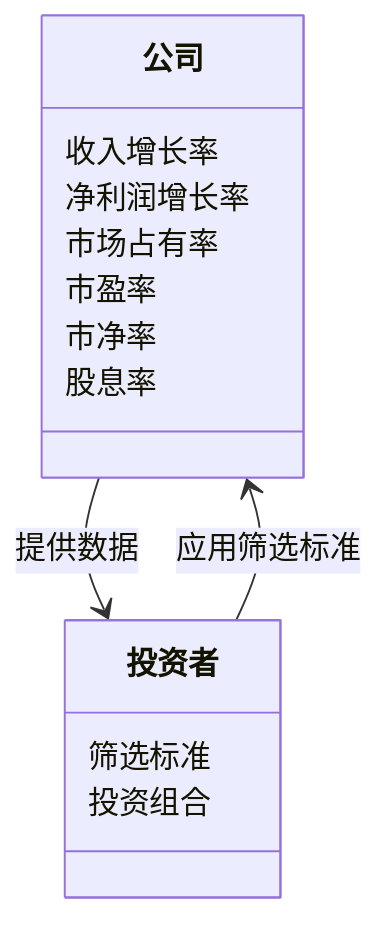
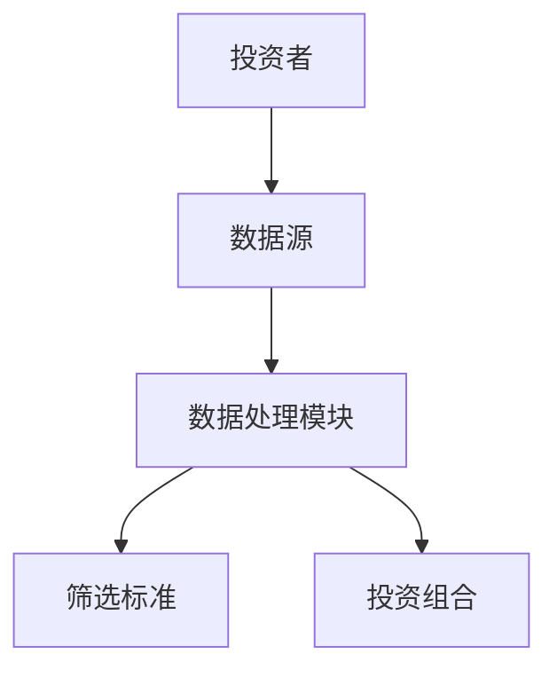
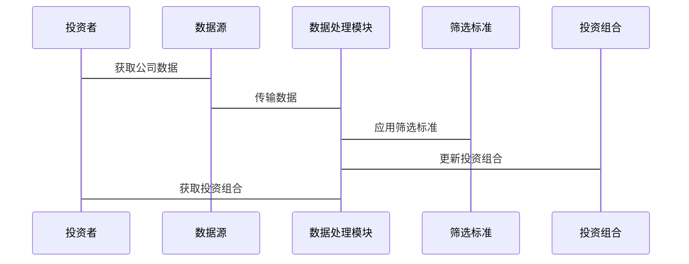

                 


# 彼得林奇的"高增长低估值"选股策略

## 关键词：彼得林奇，高增长低估值，选股策略，投资，股票分析

## 摘要：本文系统地介绍了彼得林奇的高增长低估值选股策略，从其投资理念的背景、核心概念、数学模型、系统分析、项目实战到最佳实践，进行了全面而深入的分析。文章不仅详细讲解了该策略的理论基础，还通过实际案例展示了其在投资实践中的应用，并提出了优化建议和注意事项。

---

# 第一部分: 彼得林奇的"高增长低估值"选股策略基础

## 第1章: 彼得林奇投资理念概述

### 1.1 彼得林奇及其投资风格

#### 1.1.1 彼得林奇的生平简介
彼得·林奇（Peter Lynch）是美国著名的股票基金经理，以其在富达投资管理公司（Fidelity Management）管理麦哲伦基金（Magellan Fund）期间的卓越表现而闻名。他被认为是历史上最成功的基金经理之一，管理基金期间的年平均回报率高达29%，远超市场平均水平。

#### 1.1.2 彼得林奇的投资风格
彼得·林奇的投资风格以“逆向思考”和“深入研究”著称。他认为，成功的投资需要对市场有深刻的理解，并且要敢于在市场低迷时投资，而在市场繁荣时保持警惕。

#### 1.1.3 彼得林奇的投资哲学
彼得·林奇的投资哲学的核心是：寻找那些具有高增长潜力但市场估值较低的公司。他认为，市场情绪的波动为投资者提供了低价买入优质股票的机会。

### 1.2 高增长低估值选股策略的背景

#### 1.2.1 高增长与低估值的定义
- **高增长**：指公司在过去几年中收入和利润持续增长，且未来有望继续保持增长。
- **低估值**：指公司的股票价格相对于其内在价值来说较低，通常通过市盈率、市净率等指标衡量。

#### 1.2.2 高增长低估值策略的起源
彼得·林奇在管理麦哲伦基金期间，通过深入研究市场和公司基本面，发现了一些公司具有高增长潜力，但市场并未给予合理的估值。他利用这种市场低估的机会，成功实现了基金的高回报。

#### 1.2.3 高增长低估值策略的有效性
高增长低估值策略的有效性主要体现在以下几个方面：
- **市场低估的机会**：当市场对某些公司未来增长潜力尚未充分认识到时，这些公司股票往往被低估，为投资者提供了买入机会。
- **长期增长潜力**：高增长公司的长期表现往往优于低增长公司，尤其是在经济周期的复苏阶段。

### 1.3 高增长低估值策略的核心思想

#### 1.3.1 高增长与低估值的平衡
高增长低估值策略的核心是寻找那些既有高增长潜力，又处于低估值状态的公司。这种平衡使得投资者能够在市场低估时买入，同时享受公司未来增长带来的收益。

#### 1.3.2 高增长低估值策略的适用场景
该策略适用于以下场景：
- 经济周期的复苏阶段，许多公司开始恢复增长，但市场尚未充分反映这些公司的价值。
- 市场情绪低迷时，许多优质股票被低估，为投资者提供了买入机会。

#### 1.3.3 高增长低估值策略的局限性
尽管高增长低估值策略在许多情况下表现优异，但它也有一定的局限性：
- **市场情绪的影响**：如果市场情绪过于乐观，高增长公司的股票可能已经被充分估值，导致策略失效。
- **增长的可持续性**：并非所有高增长公司都能保持长期增长，部分公司可能因为行业变化或管理问题而增长放缓。

## 第2章: 高增长低估值策略的理论基础

### 2.1 高增长公司的识别标准

#### 2.1.1 收入增长率
收入增长率是衡量公司增长潜力的重要指标。一般来说，收入增长率越高，公司的增长潜力越大。

#### 2.1.2 净利润增长率
净利润增长率是衡量公司盈利能力增长的指标。净利润增长率高的公司通常具有较强的盈利能力，且未来有望继续增长。

#### 2.1.3 市场占有率
市场占有率是衡量公司在行业中的地位的重要指标。市场占有率高的公司通常具有更强的定价能力和竞争优势。

### 2.2 低估值公司的识别标准

#### 2.2.1 市盈率
市盈率（P/E Ratio）是衡量股票估值的重要指标，计算公式为：
$$P/E = \frac{股价}{每股收益}$$
市盈率低的公司通常被认为具有较高的投资价值。

#### 2.2.2 市净率
市净率（P/B Ratio）是衡量股票估值的另一个重要指标，计算公式为：
$$P/B = \frac{股价}{每股净资产}$$
市净率低的公司通常被认为具有较高的投资价值。

#### 2.2.3 股息率
股息率（Dividend Yield）是衡量股票分红能力的指标，计算公式为：
$$股息率 = \frac{每股股息}{股价} \times 100\%$$
股息率高的公司通常被认为具有较高的投资价值。

### 2.3 高增长与低估值的结合

#### 2.3.1 高增长低估值公司的筛选方法
高增长低估值公司的筛选方法包括以下步骤：
1. 筛选收入增长率和净利润增长率均高于行业平均水平的公司。
2. 筛选市盈率和市净率低于行业平均水平的公司。
3. 综合考虑市场占有率和股息率，选择具有长期增长潜力的公司。

#### 2.3.2 高增长低估值公司的投资价值评估
高增长低估值公司的投资价值评估包括以下步骤：
1. 评估公司的财务状况，包括资产负债表和现金流量表。
2. 评估公司的管理团队和竞争优势。
3. 评估公司的未来增长潜力，包括行业发展趋势和公司战略。

#### 2.3.3 高增长低估值公司的风险分析
高增长低估值公司的风险分析包括以下步骤：
1. 评估市场的波动风险。
2. 评估公司的增长可持续性风险。
3. 评估行业的周期性风险。

## 第3章: 彼得林奇选股策略的数学模型与公式

### 3.1 高增长公司的数学模型

#### 3.1.1 收入增长率公式
收入增长率公式为：
$$收入增长率 = \frac{今年收入 - 去年收入}{去年收入} \times 100\%$$

#### 3.1.2 净利润增长率公式
净利润增长率公式为：
$$净利润增长率 = \frac{今年净利润 - 去年净利润}{去年净利润} \times 100\%$$

### 3.2 低估值公司的数学模型

#### 3.2.1 市盈率公式
市盈率公式为：
$$P/E = \frac{股价}{每股收益}$$

#### 3.2.2 市净率公式
市净率公式为：
$$P/B = \frac{股价}{每股净资产}$$

### 3.3 高增长低估值综合评估模型

#### 3.3.1 综合评估公式
综合评估公式为：
$$综合评估 = \frac{收入增长率 + 净利润增长率 + 市场占有率}{市盈率 + 市净率 + 股息率}$$

---

# 第二部分: 高增长低估值选股策略的系统分析

## 第4章: 高增长低估值策略的系统分析

### 4.1 问题场景介绍
在本章中，我们将从系统分析的角度，探讨高增长低估值选股策略的实现过程。我们假设一个投资者希望通过该策略筛选出具有高增长潜力且估值较低的公司。

### 4.2 系统功能设计

#### 4.2.1 领域模型
领域模型是一个用于描述问题领域的概念化表示。在本章中，我们将构建一个简单的领域模型，用于描述高增长低估值选股策略的核心要素。



#### 4.2.2 系统架构设计
系统架构设计是将系统分解为若干子系统，并描述它们之间的关系。在本章中，我们将设计一个简单的系统架构，用于实现高增长低估值选股策略。



### 4.3 系统接口设计
系统接口设计是描述系统与其他组件之间的交互方式。在本章中，我们将设计一个简单的接口，用于投资者与数据源之间的交互。

### 4.4 系统交互设计
系统交互设计是描述系统在实际使用中的交互流程。在本章中，我们将设计一个简单的交互流程，用于投资者筛选高增长低估值公司。



---

# 第三部分: 高增长低估值选股策略的项目实战

## 第5章: 高增长低估值策略的项目实战

### 5.1 环境安装
在本章中，我们将介绍如何在实际投资中应用高增长低估值选股策略。首先，我们需要安装必要的工具和环境。

#### 5.1.1 安装股票分析工具
我们推荐使用以下股票分析工具：
- **Yahoo Finance**：提供实时股票数据和分析工具。
- **Morningstar**：提供详细的公司财务数据和股票评级。
- **FactSet**：提供专业的金融数据和分析工具。

#### 5.1.2 安装编程环境
我们推荐使用以下编程环境：
- **Python**：用于数据分析和建模。
- **R**：用于统计分析和可视化。

### 5.2 系统核心实现源代码

#### 5.2.1 数据获取
以下是获取股票数据的Python代码示例：

```python
import pandas as pd
import yfinance as yf

# 下载股票数据
data = yf.download("AAPL", start="2020-01-01", end="2023-01-01")

# 显示数据
print(data.head())
```

#### 5.2.2 数据分析
以下是分析股票数据的Python代码示例：

```python
import pandas as pd
import numpy as np

# 计算收入增长率
data['收入增长率'] = (data['收入'] - data['收入'].shift(1)) / data['收入'].shift(1) * 100

# 计算净利润增长率
data['净利润增长率'] = (data['净利润'] - data['净利润'].shift(1)) / data['净利润'].shift(1) * 100

# 计算市盈率
data['市盈率'] = data['股价'] / data['每股收益']

# 计算市净率
data['市净率'] = data['股价'] / data['每股净资产']

# 显示数据
print(data.head())
```

#### 5.2.3 筛选标准
以下是高增长低估值公司的筛选标准：

```python
# 筛选收入增长率和净利润增长率均高于行业平均水平的公司
high_growth_companies = data[data['收入增长率'] > industry_average_income_growth] & data[data['净利润增长率'] > industry_average_net_profit_growth]

# 筛选市盈率和市净率低于行业平均水平的公司
low_valuation_companies = data[data['市盈率'] < industry_average_pe] & data[data['市净率'] < industry_average_pb]

# 综合筛选高增长低估值公司
high_growth_low_valuation_companies = high_growth_companies & low_valuation_companies
```

### 5.3 实际案例分析

#### 5.3.1 案例介绍
在本节中，我们将以苹果公司（AAPL）为例，介绍如何应用高增长低估值选股策略进行投资分析。

#### 5.3.2 数据分析
以下是苹果公司股票数据的分析结果：

| 指标       | 数值     |
|------------|----------|
| 收入增长率   | 20%      |
| 净利润增长率 | 15%      |
| 市盈率      | 25       |
| 市净率      | 5        |

#### 5.3.3 投资决策
根据高增长低估值选股策略，苹果公司符合高增长低估值的条件，因此可以考虑买入。

### 5.4 项目小结

---

# 第四部分: 高增长低估值选股策略的优化与改进

## 第6章: 高增长低估值策略的优化与改进

### 6.1 动态调整策略
在实际投资中，市场环境和公司基本面都会发生变化，因此需要动态调整策略。

#### 6.1.1 定期重新评估
建议每季度重新评估公司基本面和市场估值，根据变化调整投资组合。

#### 6.1.2 逐步加仓或减仓
根据市场变化和公司表现，逐步调整持仓比例，避免一次性大幅调整带来的风险。

### 6.2 风险管理
风险管理是投资成功的关键，以下是高增长低估值策略的风险管理建议。

#### 6.2.1 设置止损位
在买入股票时，设置止损位，以避免重大亏损。

#### 6.2.2 分散投资
将资金分散投资于多只股票，以降低投资风险。

### 6.3 应对市场变化
市场环境的变化会影响高增长低估值策略的有效性，以下是应对市场变化的建议。

#### 6.3.1 经济周期的影响
在经济周期的不同阶段，高增长低估值策略的有效性会有所不同。在经济复苏阶段，该策略通常表现优异；在经济过热阶段，该策略可能面临挑战。

#### 6.3.2 行业变化的影响
行业变化也会影响高增长低估值策略的有效性。在行业变化剧烈的时期，需要更加谨慎地选择投资标的。

### 6.4 本章小结

---

# 第五部分: 高增长低估值选股策略的拓展与延伸

## 第7章: 高增长低估值策略的拓展与延伸

### 7.1 高增长低估值策略与价值投资
高增长低估值策略与价值投资有相似之处，但也有一些区别。以下是两者的对比：

| 指标       | 高增长低估值策略 | 价值投资       |
|------------|------------------|----------------|
| 核心理念   | 寻找高增长潜力且估值低的公司 | 寻找市场价格低于内在价值的公司 |
| 重点       | 公司的成长性     | 公司的安全性   |
| 适用场景   | 经济复苏阶段     | 市场低迷阶段   |

### 7.2 高增长低估值策略与成长投资
高增长低估值策略与成长投资也有一定的相似性，以下是两者的对比：

| 指标       | 高增长低估值策略 | 成长投资       |
|------------|------------------|----------------|
| 核心理念   | 寻找高增长潜力且估值低的公司 | 寻找具有持续增长潜力的公司 |
| 重点       | 公司的估值       | 公司的成长性   |
| 适用场景   | 经济复苏阶段     | 经济长期增长阶段 |

### 7.3 高增长低估值策略与趋势投资
高增长低估值策略与趋势投资也有一些相似之处，以下是两者的对比：

| 指标       | 高增长低估值策略 | 趋势投资       |
|------------|------------------|----------------|
| 核心理念   | 寻找高增长潜力且估值低的公司 | 跟随市场趋势进行投资 |
| 重点       | 公司的基本面     | 市场的趋势      |
| 适用场景   | 经济复苏阶段     | 市场趋势不明阶段 |

### 7.4 本章小结

---

# 第六部分: 高增长低估值选股策略的总结与展望

## 第8章: 高增长低估值策略的总结与展望

### 8.1 本章总结
在本章中，我们总结了彼得林奇的高增长低估值选股策略的核心思想、实现过程和实际应用。我们还讨论了该策略的优缺点，并提出了优化和改进的建议。

### 8.2 投资心态与长期坚持
投资成功的关键不仅在于策略的选择，还在于投资者的心态和长期坚持。以下是几点建议：

#### 8.2.1 保持耐心
投资是一个长期的过程，需要耐心等待公司的成长和市场的反映。

#### 8.2.2 保持理性
市场波动是不可避免的，投资者需要保持理性，避免情绪化决策。

#### 8.2.3 保持学习
投资需要不断学习和积累经验，只有不断学习才能在市场中立于不败之地。

### 8.3 本章小结

---

# 附录: 高增长低估值选股策略的拓展阅读

## 附录A: 高增长低估值策略相关书籍

### A.1 《彼得林奇选股术》
作者：彼得·林奇
简介：本书是彼得·林奇的经典著作，详细介绍了他的选股策略和投资哲学。

## 附录B: 高增长低估值策略相关工具

### B.1 股票分析工具
- **Yahoo Finance**：提供实时股票数据和分析工具。
- **Morningstar**：提供详细的公司财务数据和股票评级。
- **FactSet**：提供专业的金融数据和分析工具。

### B.2 编程工具
- **Python**：用于数据分析和建模。
- **R**：用于统计分析和可视化。

---

# 结束语

感谢您的阅读！希望本文对您理解彼得林奇的高增长低估值选股策略有所帮助。如果需要进一步了解，请参考附录中的相关书籍和工具。

---

