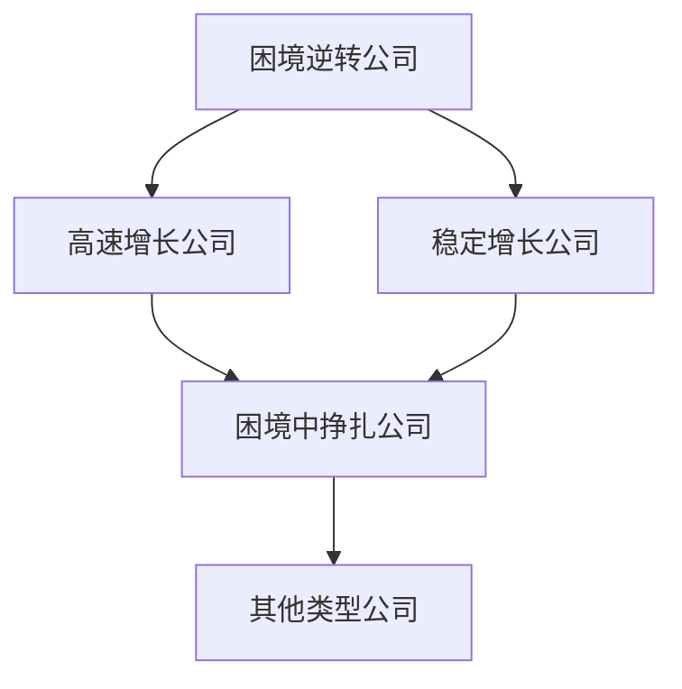
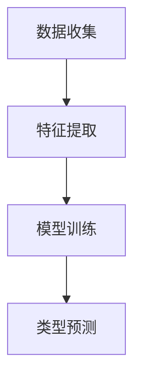
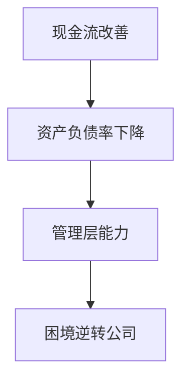
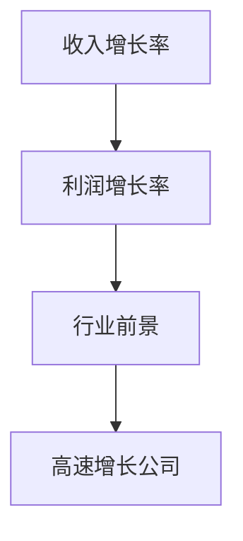
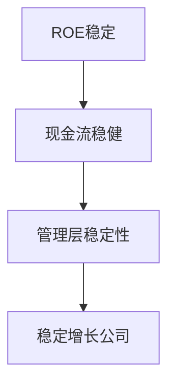
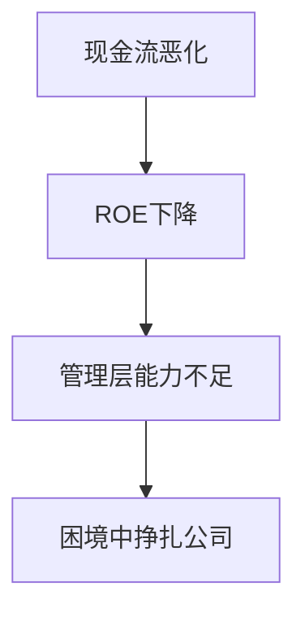

                 

# 彼得林奇眼中的六类公司类型

## 关键词：彼得·林奇，公司类型，投资策略，困境逆转，高速增长

## 摘要

本文将详细介绍彼得·林奇在投资生涯中总结的六类公司类型，包括困境逆转公司、高速增长公司、稳定增长公司、困境中挣扎公司以及其他类型公司。通过分析每种公司的定义、特征、投资策略和案例，本文将帮助投资者更好地理解如何通过公司类型筛选出优质的投资目标。文章结合了理论分析与实际案例，深入探讨了每种公司类型的核心要素，为投资者提供了系统的投资策略框架。

---

## 第一部分：背景介绍与核心概念

### 第1章：彼得林奇投资理念概述

#### 1.1 投资大师彼得·林奇的简介

彼得·林奇（Peter Lynch）是美国著名的投资专家，被誉为“股神”巴菲特之后最成功的基金经理之一。他在富达投资集团管理麦哲伦基金期间，创造了年化29%的复合回报率，远超市场平均水平。林奇的投资理念以价值投资为核心，注重对公司基本面的深入分析和行业趋势的把握。他强调投资者应关注企业的内在价值，而非市场的短期波动。

#### 1.2 六类公司类型的研究背景

在彼得·林奇的投资生涯中，他总结出了六种具有不同特征的公司类型。这些公司类型基于企业的财务状况、行业地位、管理层能力和市场环境等多方面因素，帮助投资者快速筛选出具备投资价值的企业。通过研究这六类公司类型，投资者可以更好地理解不同公司的经营状况和潜在风险，从而制定更科学的投资策略。

#### 1.3 公司类型分类的核心要素

公司类型分类的核心要素包括以下几个方面：
- **财务指标**：如净利润率、资产负债率、ROE（净资产收益率）等。
- **行业地位**：公司在行业中的市场份额、竞争地位和增长潜力。
- **管理层稳定性**：管理层的团队能力、战略规划和管理风格。

通过对这些核心要素的分析，投资者可以更准确地判断公司的潜在价值和成长性。

---

## 第二部分：六类公司类型的核心概念与联系

### 第2章：六类公司类型的概念结构

#### 2.1 六类公司类型的定义与特征

六类公司类型包括：
1. **困境逆转公司**：财务状况不佳，但具有潜在的反转机会。
2. **高速增长公司**：收入和利润快速增长，行业前景广阔。
3. **稳定增长公司**：业绩稳定，具备持续增长能力。
4. **困境中挣扎公司**：财务状况恶化，难以扭亏为盈。
5. **其他类型公司**：包括周期性公司、杠杆过高公司等。

以下是一个六类公司类型的核心属性特征对比表格：

| 公司类型                | 财务指标        | 行业地位        | 管理层稳定性 |
|------------------------|----------------|----------------|-------------|
| 困境逆转公司            | 负债率高，现金流改善 | 市场份额逐步回升 | 稳定且有能力扭转局面 |
| 高速增长公司            | 收入和利润快速增长 | 市场份额持续扩大 | 强大的管理团队 |
| 稳定增长公司            | 财务稳健，ROE稳定 | 市场地位稳固     | 管理层经验丰富 |
| 困境中挣扎公司          | 负债率高，现金流恶化 | 市场份额不断流失 | 管理层能力不足 |
| 其他类型公司            | 根据具体情况分析 | 根据具体情况分析 | 根据具体情况分析 |

以下是一个六类公司类型之间的关系图（使用Mermaid绘制）：

#### 2.2 六类公司类型分类的数学模型

基于上述分类标准，我们可以建立一个公司类型分类的数学模型：

$$ \text{公司类型} = f(\text{财务指标}, \text{行业地位}, \text{管理层稳定性}) $$

其中，$$f$$是一个多变量函数，用于综合评估公司的财务状况、行业地位和管理层稳定性。具体实现可以通过以下步骤进行：

1. **数据收集**：收集公司的财务数据、行业数据和管理层信息。
2. **特征提取**：提取关键的财务指标、行业指标和管理层能力指标。
3. **分类模型训练**：使用机器学习算法（如决策树、随机森林等）对数据进行训练，建立分类模型。
4. **公司类型预测**：输入新的公司数据，预测其所属的公司类型。

以下是一个简单的分类算法流程图（使用Mermaid绘制）：

---

## 第三部分：六类公司类型的投资策略分析

### 第3章：困境逆转公司

#### 3.1 困境逆转公司的定义与特征

困境逆转公司是指那些当前财务状况不佳，但具有潜在反转能力的公司。这类公司通常面临短期的财务困境，但具备扭亏为盈的可能。

**财务指标**：困境逆转公司的资产负债率较高，但现金流正在改善，净利润率逐步上升。

**行业地位**：这类公司通常市场份额较低，但在行业整合或市场复苏中具有潜在的机会。

**管理层稳定性**：管理层需要具备较强的能力，能够带领公司走出困境。

#### 3.2 困境逆转公司的投资策略

**数学模型**：

$$ \text{困境逆转公司} = f(\text{现金流改善}, \text{资产负债率下降}, \text{管理层能力}) $$

**算法流程图**：

---

## 第4章：高速增长公司

#### 4.1 高速增长公司的定义与特征

高速增长公司是指收入和利润快速增长，行业前景广阔的公司。

**财务指标**：收入和利润增长率较高，ROE持续上升。

**行业地位**：市场份额持续扩大，行业处于高速发展阶段。

**管理层稳定性**：管理层团队能力强，战略清晰。

#### 4.2 高速增长公司的投资策略

**数学模型**：

$$ \text{高速增长公司} = f(\text{收入增长率}, \text{利润增长率}, \text{行业前景}) $$

**算法流程图**：

---

## 第5章：稳定增长公司

#### 5.1 稳定增长公司的定义与特征

稳定增长公司是指财务状况稳健，业绩持续增长，市场地位稳固的公司。

**财务指标**：ROE稳定，负债率低，现金流稳健。

**行业地位**：市场份额稳定，行业处于成熟阶段。

**管理层稳定性**：管理层经验丰富，公司治理良好。

#### 5.2 稳定增长公司的投资策略

**数学模型**：

$$ \text{稳定增长公司} = f(\text{ROE稳定}, \text{现金流稳健}, \text{管理层稳定性}) $$

**算法流程图**：

---

## 第6章：困境中挣扎公司

#### 6.1 困境中挣扎公司的定义与特征

困境中挣扎公司是指财务状况恶化，难以扭亏为盈的公司。

**财务指标**：现金流持续恶化，资产负债率高，ROE持续下降。

**行业地位**：市场份额不断流失，行业前景黯淡。

**管理层稳定性**：管理层能力不足，公司治理存在问题。

#### 6.2 困境中挣扎公司的投资策略

**数学模型**：

$$ \text{困境中挣扎公司} = f(\text{现金流恶化}, \text{ROE下降}, \text{管理层能力不足}) $$

**算法流程图**：

---

## 第7章：其他类型公司

#### 7.1 其他类型公司的定义与特征

其他类型公司包括周期性公司、杠杆过高公司等。这类公司具有特殊的风险和机会，需要单独分析。

---

## 结语

通过分析彼得·林奇总结的六类公司类型，投资者可以更好地理解不同公司的特征和潜在风险，从而制定更科学的投资策略。本文通过定义、特征、投资策略和案例分析，为投资者提供了一个系统的投资框架。希望本文能够帮助读者在投资决策中做出更明智的选择。

--- 

**注**：本文内容为理论分析，不构成具体投资建议。实际投资需根据市场变化和公司具体情况谨慎决策。

