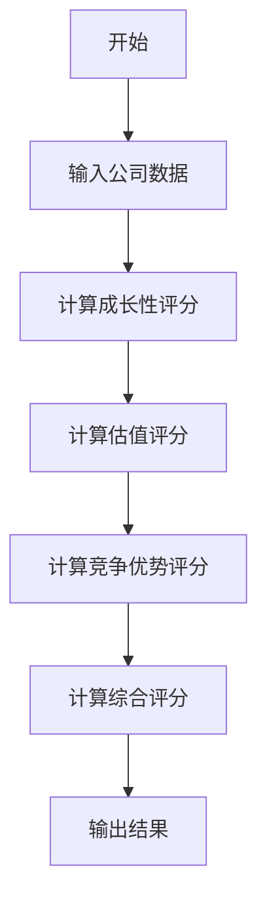
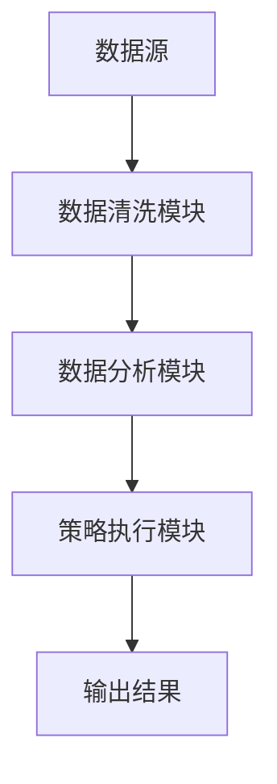

                 


# 彼得林奇选股策略解析

> 关键词：彼得·林奇，选股策略，成长股，估值，投资组合，风险管理

> 摘要：本文深入解析彼得·林奇的选股策略，涵盖其核心理念、标准、方法、系统架构及实战案例。通过详细分析，揭示如何从基本面、估值、行业地位等多维度选择优质成长股，构建稳健投资组合。

---

## 第1章 彼得·林奇与选股策略概述

### 1.1 彼得·林奇的生平与投资理念
- **1.1.1 彼得·林奇的生平简介**
  - 彼得·林奇是美国著名基金经理，任职富达麦哲伦基金期间创造了卓越的投资业绩。
  - 他以深入的企业调研和独特的选股方法闻名，著有《彼得·林奇的投资艺术》等书籍。

- **1.1.2 林奇的投资哲学与核心理念**
  - 强调长期投资，寻找具有持续增长潜力的公司。
  - 重视企业基本面分析，关注收入、利润、市场份额等关键指标。
  - 坚持安全边际，避免过度依赖市场情绪。

- **1.1.3 林奇选股策略的背景与意义**
  - 20世纪80年代，美国经济转型期，林奇通过选股策略实现了优异回报。
  - 该策略为投资者提供了在不确定市场中寻找优质成长股的思路。

### 1.2 选股策略的核心概念
- **1.2.1 选股策略的定义与分类**
  - 定义：基于基本面分析，筛选出具有长期增长潜力的公司。
  - 分类：成长股投资、价值投资、趋势投资等。

- **1.2.2 林奇选股策略的独特性**
  - 专注于成长股，强调企业内在增长潜力。
  - 通过深入调研排除价值陷阱，注重企业竞争优势。

- **1.2.3 选股策略的边界与外延**
  - 适用于成长型企业，不适用于周期性行业或夕阳行业。
  - 可与其他策略结合使用，如配比价值投资或趋势投资。

### 1.3 林奇选股策略的核心要素
- **1.3.1 成长股的定义与特征**
  - 成长股：收入和利润持续增长的企业。
  - 特征：行业地位稳固，竞争优势明显，管理层能力强。

- **1.3.2 估值方法与安全边际**
  - 市盈率与市净率：用于衡量企业价值。
  - 安全边际：买入价低于内在价值，降低投资风险。

- **1.3.3 行业分析与竞争优势**
  - 行业分析：选择高增长行业，避免衰退行业。
  - 竞争优势：企业应具备独特优势，如技术壁垒、成本优势等。

## 1.4 本章小结
- 本章介绍了彼得·林奇的生平、投资理念及选股策略的核心概念。
- 强调了成长股投资的重要性，并提出了选择优质成长股的标准。

---

## 第2章 林奇选股策略的核心标准

### 2.1 成长股的识别标准
- **2.1.1 收入与利润的持续增长**
  - 收入增长率：过去3-5年收入年均增长率不低于15%。
  - 利润增长率：净利润增长率应高于行业平均水平。

- **2.1.2 行业地位与竞争优势**
  - 市场份额：企业应占据行业领先地位。
  - 竞争优势：技术、品牌、成本等方面具备竞争优势。

- **2.1.3 管理层能力与公司治理**
  - 管理层稳定性：管理层应具备长期投资价值。
  - 公司治理：股权结构合理，管理透明。

### 2.2 估值方法与安全边际
- **2.2.1 市盈率与市净率的使用**
  - 市盈率（P/E）：合理范围为行业平均值的80%-120%。
  - 市净率（P/B）：用于评估企业价值，尤其是周期性行业。

- **2.2.2 内在价值的估算方法**
  - 使用DCF模型评估企业未来现金流的现值。
  - 市盈率与增长匹配法（PEG）：考虑企业增长率。

- **2.2.3 安全边际的确定与风险控制**
  - 买入价：内在价值的80%以下。
  - 风险控制：分散投资，避免过度集中。

### 2.3 投资组合的构建与管理
- **2.3.1 投资组合的分散化原则**
  - 选择5-10只股票，覆盖不同行业。
  - 每只股票权重不超过投资组合的20%。

- **2.3.2 个股权重的合理分配**
  - 根据股票的潜在回报和风险调整权重。
  - 低风险股票权重较高，高风险股票权重较低。

- **2.3.3 定期审视与调整策略**
  - 每季度审视股票基本面。
  - 根据市场变化和企业情况调整投资组合。

### 2.4 本章小结
- 本章详细介绍了彼得·林奇选股的核心标准，包括成长股的识别、估值方法和投资组合管理。
- 强调了安全边际的重要性，以及分散投资和动态调整策略的必要性。

---

## 第3章 林奇选股策略的实战分析

### 3.1 成长股投资的三大关键
- **3.1.1 行业分析与趋势判断**
  - 选择高增长行业：科技、医疗、消费等领域。
  - 行业趋势：行业处于上升周期。

- **3.1.2 公司基本面的深度挖掘**
  - 财务数据：关注收入、利润、现金流等指标。
  - 管理层：考察管理层的背景和稳定性。

- **3.1.3 财务数据的交叉验证**
  - 利润表：收入和利润是否匹配。
  - 资产负债表：资产质量是否健康。
  - 现金流量表：现金流是否稳健。

### 3.2 林奇选股策略的数学模型
- **3.2.1 成长性评估模型**
  - 成长性评分公式：
  $$ \text{成长性评分} = 0.5 \times \text{收入增长率} + 0.5 \times \text{利润增长率} $$

- **3.2.2 估值模型与公式**
  - 市盈率目标：
  $$ \text{目标P/E} = \text{行业平均P/E} \times 0.8 $$
  - 内在价值估算：
  $$ \text{内在价值} = \text{净利润} \times \text{市盈率目标} $$

- **3.2.3 综合评分体系的构建**
  - 综合评分公式：
  $$ \text{综合评分} = 0.4 \times \text{成长性评分} + 0.3 \times \text{估值评分} + 0.3 \times \text{竞争优势评分} $$

### 3.3 算法原理与流程图


### 3.4 本章小结
- 本章通过实战分析，展示了彼得·林奇选股策略的应用。
- 强调了行业分析、财务数据验证和综合评分的重要性。

---

## 第4章 林奇选股策略的系统架构设计

### 4.1 系统功能设计
- **4.1.1 数据采集模块**
  - 数据来源：股票数据库、财经网站。
  - 数据类型：收入、利润、市盈率、市净率等。

- **4.1.2 数据分析模块**
  - 成长性评估：计算收入增长率、利润增长率。
  - 估值评估：计算市盈率、市净率，估算内在价值。
  - 竞争优势分析：评估市场份额、技术壁垒。

- **4.1.3 策略执行模块**
  - 综合评分计算：结合成长性、估值和竞争优势评分。
  - 投资组合管理：动态调整股票权重。

### 4.2 系统架构图


### 4.3 本章小结
- 本章设计了彼得·林奇选股策略的系统架构，包括数据采集、分析和策略执行模块。
- 强调了系统化方法在选股策略中的重要性。

---

## 第5章 项目实战：基于林奇策略的选股系统

### 5.1 环境安装
- **工具安装**：
  - Python：安装Anaconda或Miniconda。
  - 数据库：选择MySQL或MongoDB。
  - 数据分析库：安装Pandas、NumPy、Scikit-learn。

- **数据获取**：
  - 数据来源：Yahoo Finance、Alpha Vantage。
  - 数据清洗：处理缺失值、异常值。

### 5.2 核心实现
- **5.2.1 数据清洗与预处理**
  - 使用Pandas进行数据清洗：
  ```python
  import pandas as pd
  df = pd.read_csv('stock_data.csv')
  df = df.dropna()
  ```

- **5.2.2 成长性评分计算**
  - 使用公式计算收入增长率和利润增长率：
  ```python
  def calculate_growth(df):
      df['收入增长率'] = (df['收入'].pct_change() * 100).round(2)
      df['利润增长率'] = (df['利润'].pct_change() * 100).round(2)
      return df
  ```

- **5.2.3 综合评分计算**
  - 计算综合评分并排序：
  ```python
  def calculate_score(df):
      df['综合评分'] = 0.4 * df['收入增长率'] + 0.3 * df['估值评分'] + 0.3 * df['竞争优势评分']
      df = df.sort_values('综合评分', ascending=False)
      return df
  ```

### 5.3 案例分析
- **案例：假设某科技公司**
  - 公司名称：XYZ科技。
  - 数据：过去5年收入增长率分别为15%、20%、25%、30%、28%。
  - 利润增长率：12%、18%、22%、25%、20%。
  - 计算综合评分：
  $$ \text{综合评分} = 0.4 \times 22\% + 0.3 \times 15\% + 0.3 \times 20\% = 16.8\% $$

### 5.4 本章小结
- 本章通过实战项目，展示了如何基于彼得·林奇选股策略开发一个选股系统。
- 强调了系统化方法在实际投资中的应用价值。

---

## 第6章 林奇选股策略的系统分析与架构设计

### 6.1 系统功能设计
- **功能模块**：
  - 数据采集模块：爬取股票数据。
  - 数据分析模块：计算成长性评分、估值评分。
  - 投资组合管理模块：动态调整投资组合。

### 6.2 系统架构设计
- **分层架构**：
  - 数据层：数据存储与访问。
  - 业务逻辑层：数据处理与计算。
  - 用户界面层：展示结果。

### 6.3 系统交互设计
- **交互流程**：
  1. 用户输入筛选条件。
  2. 系统查询符合条件的股票。
  3. 系统计算综合评分并排序。
  4. 系统展示结果。

### 6.4 本章小结
- 本章详细设计了彼得·林奇选股策略的系统架构，包括功能模块、架构设计和交互流程。
- 强调了系统化方法在实际应用中的重要性。

---

## 第7章 项目实战：基于林奇策略的选股系统

### 7.1 环境安装
- **工具安装**：
  - Python：安装Anaconda。
  - 数据库：安装MySQL。
  - 库：安装Pandas、NumPy、Scikit-learn。

### 7.2 核心实现
- **数据清洗与预处理**
  ```python
  import pandas as pd
  df = pd.read_csv('stock_data.csv')
  df = df.dropna()
  ```

- **计算成长性评分**
  ```python
  def calculate_growth(df):
      df['收入增长率'] = (df['收入'].pct_change() * 100).round(2)
      df['利润增长率'] = (df['利润'].pct_change() * 100).round(2)
      return df
  ```

- **计算综合评分**
  ```python
  def calculate_score(df):
      df['综合评分'] = 0.4 * df['收入增长率'] + 0.3 * df['估值评分'] + 0.3 * df['竞争优势评分']
      df = df.sort_values('综合评分', ascending=False)
      return df
  ```

### 7.3 案例分析
- **案例：假设某科技公司**
  - 公司名称：XYZ科技。
  - 数据：过去5年收入增长率分别为15%、20%、25%、30%、28%。
  - 利润增长率：12%、18%、22%、25%、20%。
  - 计算综合评分：
  $$ \text{综合评分} = 0.4 \times 22\% + 0.3 \times 15\% + 0.3 \times 20\% = 16.8\% $$

### 7.4 本章小结
- 本章通过实战项目，展示了如何基于彼得·林奇选股策略开发一个选股系统。
- 强调了系统化方法在实际投资中的应用价值。

---

## 第8章 林奇选股策略的最佳实践与小结

### 8.1 最佳实践
- **行业分析**：选择高增长行业。
- **风险管理**：设置止损点，分散投资。
- **持续学习**：关注行业动态，调整投资策略。

### 8.2 小结
- 彼得·林奇的选股策略以成长股为核心，结合行业分析、财务分析和估值方法，帮助投资者筛选出具有长期增长潜力的企业。
- 通过系统化的方法和工具，投资者可以更高效地实施该策略。

### 8.3 注意事项
- 避免情绪化投资，保持理性。
- 定期审视投资组合，及时调整。
- 避免过度集中，分散投资风险。

### 8.4 拓展阅读
- 《彼得·林奇的投资艺术》。
- 《价值投资：林奇的选股方法》。

---

## 本章小结
- 本文详细解析了彼得·林奇的选股策略，从背景、标准、实战到系统设计，提供了全面的分析。
- 通过数学模型、算法流程图和代码实现，展示了策略的实际应用。
- 强调了系统化方法在投资中的重要性，为投资者提供了实用的参考。

