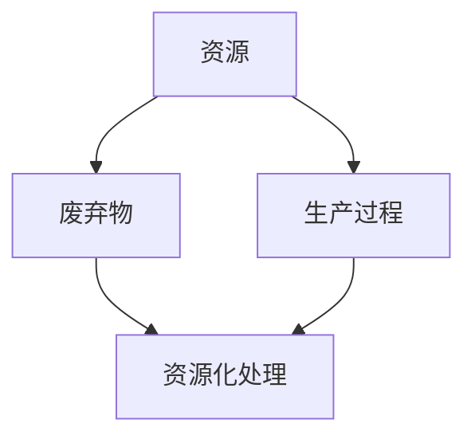
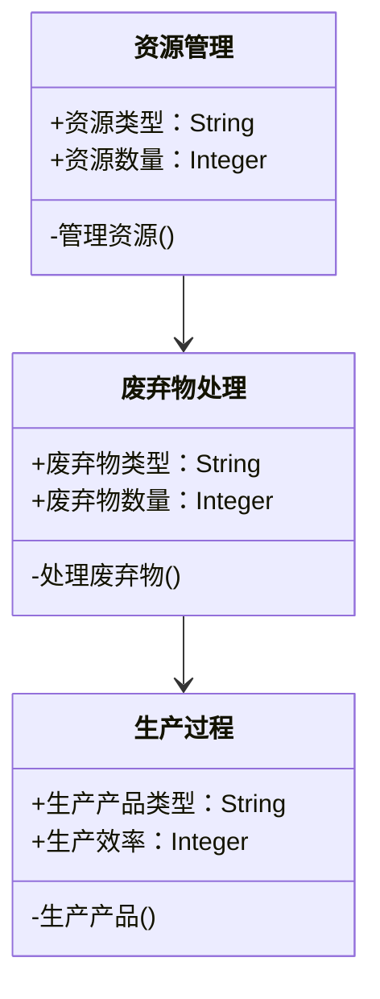
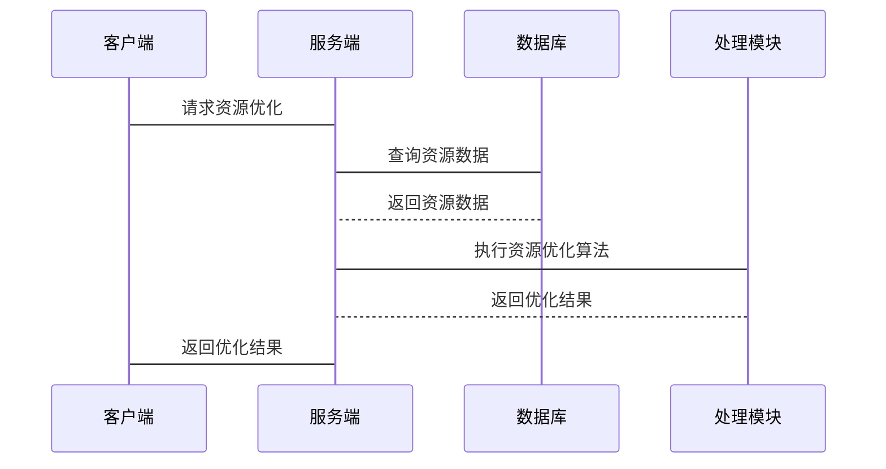

                 


# 循环经济在不同行业的应用前景比较

## 关键词：循环经济，资源利用，废弃物资源化，闭环生产，行业模式对比

## 摘要：循环经济作为一种新型经济模式，通过资源的高效利用和废弃物的资源化，逐步在各个行业展现出其独特的优势。本文将从循环经济的基本概念出发，结合不同行业的特点，分析循环经济在这些行业的应用前景，比较其在不同行业中的模式差异，并探讨其面临的挑战与未来的发展方向。

---

# 第1章：循环经济的基本概念与背景

## 1.1 循环经济的定义与内涵

### 1.1.1 从线性经济到循环经济的转变
传统的线性经济模式是“资源-产品-废弃物”的单向流动，资源被消耗后直接成为废弃物，导致资源枯竭和环境污染。循环经济则强调“资源-产品-再生资源”的闭环流动，通过最大化资源的利用效率和减少废弃物的产生，实现可持续发展。

### 1.1.2 循环经济的核心特征
循环经济的核心特征包括：
1. **资源高效利用**：通过技术手段最大化资源的利用率。
2. **废弃物资源化**：将废弃物重新转化为可利用的资源。
3. **闭环生产模式**：通过设计生产流程，实现资源在不同环节之间的循环利用。

### 1.1.3 循环经济的全球发展趋势
随着全球资源短缺和环境问题的加剧，循环经济已成为全球关注的焦点。各国政府和企业纷纷采取措施，推动循环经济的发展，以减少对环境的压力。

## 1.2 循环经济的背景与问题背景

### 1.2.1 当前资源短缺与环境污染的现状
全球范围内，资源的过度开发导致资源枯竭，同时工业生产产生的大量废弃物对环境造成严重污染。

### 1.2.2 线性经济模式的局限性
线性经济模式导致资源浪费和环境污染，已经无法满足可持续发展的需求。

### 1.2.3 循环经济的提出与意义
循环经济的提出为解决资源短缺和环境污染问题提供了新的思路，通过资源的循环利用，减少对环境的压力。

## 1.3 循环经济的边界与外延

### 1.3.1 循环经济的适用范围
循环经济适用于各个行业，包括制造业、农业、建筑业等，但其具体实施方式因行业特点而异。

### 1.3.2 循环经济与其他经济模式的区别
循环经济与传统线性经济的区别在于其强调资源的循环利用和废弃物的资源化。

### 1.3.3 循环经济的核心要素组成
循环经济的核心要素包括资源的高效利用、废弃物的资源化和闭环生产模式。

## 1.4 本章小结
本章介绍了循环经济的基本概念、背景和核心特征，为后续章节的分析奠定了基础。

---

# 第2章：循环经济的核心概念与原理

## 2.1 循环经济的核心原理

### 2.1.1 资源的高效利用
通过技术手段最大化资源的利用率，减少资源的浪费。

### 2.1.2 废弃物的资源化
将废弃物重新转化为可利用的资源，减少对环境的污染。

### 2.1.3 闭环生产模式
通过设计生产流程，实现资源在不同环节之间的循环利用。

## 2.2 循环经济的系统性特征

### 2.2.1 系统的整体性
循环经济是一个整体系统，资源在不同环节之间循环流动。

### 2.2.2 资源的循环流动
资源在生产过程中不断循环利用，形成闭环。

### 2.2.3 系统的协同性
循环经济需要系统内部各环节的协同合作，才能实现资源的高效利用。

## 2.3 循环经济的核心概念对比

### 2.3.1 资源利用效率对比
不同行业在资源利用效率上的差异较大，循环经济可以通过技术手段提高资源利用率。

### 2.3.2 废弃物处理方式对比
不同行业废弃物的种类和处理方式不同，循环经济需要根据不同行业的特点制定相应的策略。

### 2.3.3 不同行业循环经济模式的对比
不同行业的循环经济模式因行业特点而异，例如制造业注重生产过程中的资源循环利用，农业注重废弃物的资源化利用。

## 2.4 循环经济的ER实体关系图


## 2.5 本章小结
本章详细介绍了循环经济的核心概念和原理，分析了不同行业在循环经济中的特点和差异。

---

# 第3章：循环经济的算法原理与数学模型

## 3.1 循环经济的算法原理

### 3.1.1 资源优化配置算法
通过优化算法实现资源的高效配置，减少浪费。

### 3.1.2 废弃物处理的数学模型
建立数学模型，模拟废弃物的资源化过程，优化处理方案。

## 3.2 循环经济的数学模型

### 3.2.1 资源利用效率模型
$$效率 = \frac{资源利用率}{资源消耗量}$$

### 3.2.2 废弃物资源化模型
$$资源化率 = \frac{废弃物再利用率}{废弃物总量}$$

## 3.3 算法实现与案例分析

### 3.3.1 算法实现
以下是资源优化配置的Python代码示例：
```python
def resource_optimization(resource_input, waste_output):
    # 计算资源利用率
    resource_efficiency = resource_input / (resource_input + waste_output)
    return resource_efficiency

# 示例数据
resource_input = 100
waste_output = 20
print(resource_optimization(resource_input, waste_output))
```

### 3.3.2 案例分析
通过具体案例分析，说明算法在实际中的应用和效果。

## 3.4 本章小结
本章通过数学模型和算法分析，展示了循环经济在资源优化和废弃物处理中的应用。

---

# 第4章：循环经济的系统分析与架构设计

## 4.1 系统分析

### 4.1.1 问题场景介绍
以某个行业为例，描述循环经济在该行业的应用场景。

### 4.1.2 项目介绍
简要介绍循环经济在该行业的具体实施项目。

## 4.2 系统功能设计

### 4.2.1 领域模型设计
以下是领域模型的Mermaid类图：


### 4.2.2 系统架构设计
以下是系统架构的Mermaid架构图：


### 4.2.3 系统接口设计
描述系统接口的设计和功能。

## 4.3 系统交互设计

### 4.3.1 系统交互流程
以下是系统交互的Mermaid序列图：


## 4.4 本章小结
本章通过系统分析和架构设计，展示了循环经济在不同行业中的具体实施方式。

---

# 第5章：循环经济的项目实战

## 5.1 项目环境安装与配置

### 5.1.1 环境要求
列出项目所需的硬件和软件环境。

### 5.1.2 工具安装
安装必要的工具和库，例如Python、数据分析工具等。

## 5.2 项目核心实现

### 5.2.1 资源优化代码实现
以下是资源优化的Python代码：
```python
import numpy as np

def optimize_resources(resources):
    # 使用线性规划模型优化资源分配
    resources_optimized = np.max(resources)
    return resources_optimized

# 示例数据
resources = np.array([100, 80, 90])
print(optimize_resources(resources))
```

### 5.2.2 废弃物处理代码实现
以下是废弃物处理的Python代码：
```python
from sklearn import cluster

def process_waste(wastes):
    # 使用聚类算法处理废弃物
    clusters = cluster.KMeans(n_clusters=3).fit(wastes)
    return clusters.labels_

# 示例数据
wastes = np.array([[1,2], [3,4], [5,6]])
print(process_waste(wastes))
```

## 5.3 项目案例分析

### 5.3.1 制造业案例
分析制造业中循环经济的实施案例，包括资源优化和废弃物处理的具体应用。

### 5.3.2 农业案例
分析农业中循环经济的实施案例，例如农业废弃物的资源化利用。

## 5.4 本章小结
本章通过项目实战，展示了循环经济在不同行业中的具体应用和实施效果。

---

# 第6章：循环经济的最佳实践与未来展望

## 6.1 最佳实践

### 6.1.1 资源管理策略
制定科学的资源管理策略，提高资源利用效率。

### 6.1.2 废弃物处理技术
采用先进的废弃物处理技术，实现废弃物的高效资源化。

## 6.2 小结

### 6.2.1 经验总结
总结循环经济在不同行业中的实施经验。

### 6.2.2 注意事项
提醒读者在实施循环经济时需要注意的问题。

## 6.3 未来展望

### 6.3.1 循环经济的技术发展趋势
预测循环经济未来的技术发展趋势。

### 6.3.2 循环经济的行业扩展方向
分析循环经济在更多行业中的应用前景。

## 6.4 拓展阅读
推荐一些关于循环经济的书籍和论文，供读者进一步学习。

---

# 附录：参考文献与致谢

## 附录A：参考文献
列出本文中引用的文献和资料。

## 附录B：致谢
感谢在本书编写过程中给予帮助和支持的人员。

---

# 结束语

循环经济作为一种可持续发展的经济模式，将在未来发挥越来越重要的作用。通过本文的分析，读者可以更好地理解循环经济在不同行业中的应用前景，并为实际应用提供参考。

