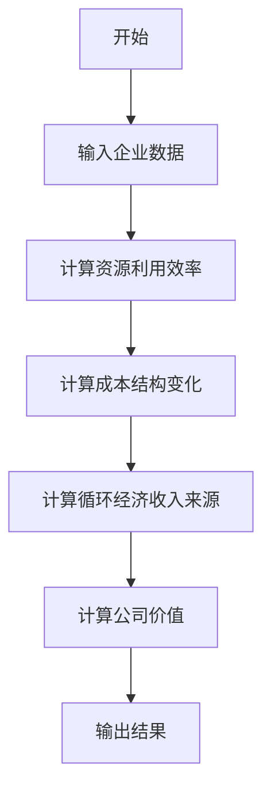
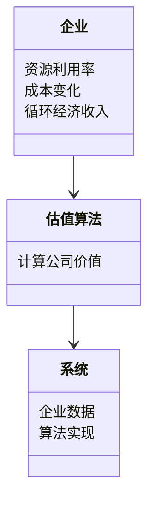
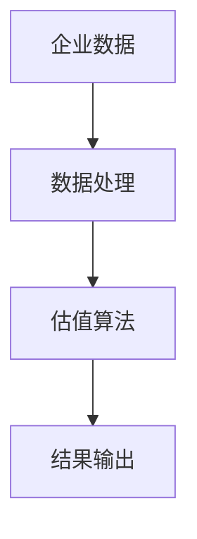

                 


# 循环经济模式下的公司估值方法

> 关键词：循环经济、公司估值、资源效率、可持续发展、循环经济模式、企业价值评估

> 摘要：本文探讨了循环经济模式下公司估值的方法与挑战，结合实际案例和数学模型，分析了循环经济对传统估值的影响，提出了新的估值框架和方法，为企业的可持续发展提供了理论支持。

---

# 第一部分: 循环经济模式下的公司估值背景与核心概念

## 第1章: 循环经济模式概述

### 1.1 循环经济的基本概念

循环经济是一种以资源高效利用和循环利用为核心，以最小化资源消耗和环境污染为目标的经济模式。与传统线性经济（资源-产品-废物）不同，循环经济强调“资源-产品-再生资源”的闭环模式。

#### 1.1.1 循环经济的定义
循环经济是以资源节约和循环利用为基础，通过减少资源消耗、延长产品生命周期、提高资源再利用率，实现经济可持续发展的模式。

#### 1.1.2 循环经济的核心特征
- **资源高效利用**：最大限度地利用资源，减少浪费。
- **废弃物最小化**：通过设计和技术创新，减少废弃物产生。
- **闭环系统**：建立资源循环利用的产业链，形成闭环经济模式。
- **可持续性**：注重环境保护和经济长期发展。

#### 1.1.3 循环经济与传统经济模式的区别
| 特性 | 传统经济模式 | 循环经济模式 |
|------|--------------|--------------|
| 资源利用 | 一次性使用，资源单向流动 | 资源循环利用，形成闭环 |
| 废弃物处理 | 单独处理，可能产生环境污染 | 内部循环，减少外部废弃物 |
| 经济目标 | 追求短期利润最大化 | 追求长期可持续发展 |

### 1.2 循环经济的发展历程

循环经济的发展可以分为以下几个阶段：

#### 1.2.1 国际循环经济发展概况
- **起步阶段**：20世纪60年代，环保意识开始兴起，循环经济概念逐步提出。
- **发展阶段**：20世纪90年代，欧盟等地区开始推广循环经济，制定相关法规和政策。
- **成熟阶段**：21世纪以来，全球范围内循环经济实践广泛展开，技术进步推动其快速发展。

#### 1.2.2 国内循环经济的实践与政策支持
- **政策支持**：中国政府出台了一系列政策，如《循环经济促进法》，鼓励企业采用循环经济模式。
- **行业实践**：在制造业、农业等领域，循环经济模式逐渐普及，废弃物资源化利用成为重要方向。

#### 1.2.3 循环经济的未来发展趋势
- **技术创新**：循环经济依赖于技术进步，如资源回收技术、清洁生产技术等。
- **政策引导**：政府将继续通过政策引导和激励措施推动循环经济的发展。
- **全球协作**：循环经济将作为全球可持续发展的重要组成部分，各国协作共同推动。

### 1.3 循环经济模式对企业的影响

循环经济模式对企业的影响是多方面的，主要体现在企业运营模式、成本结构和资源利用效率等方面。

#### 1.3.1 对企业运营模式的影响
循环经济模式要求企业重新设计产品生命周期，从原材料采购、生产、销售到废弃物处理，形成闭环系统。企业需要改变传统的线性思维，采用系统性思维，注重资源的循环利用。

#### 1.3.2 对企业成本结构的影响
在循环经济模式下，企业的成本结构发生了变化。一方面，资源回收和再利用减少了原材料的使用，降低了采购成本；另一方面，废弃物处理成本也有所下降，甚至可能通过资源化利用带来额外收益。

#### 1.3.3 对企业资源利用效率的影响
循环经济模式强调资源的高效利用，企业需要优化资源配置，提高生产效率。例如，通过清洁生产技术减少资源浪费，通过废弃物资源化利用提高资源利用率。

---

## 第2章: 公司估值的基本原理

### 2.1 公司估值的核心概念

#### 2.1.1 公司估值的定义
公司估值是指对公司整体价值的评估，通常包括资产、负债、权益等方面的价值计算。传统公司估值方法主要基于财务指标和市场比较，但在循环经济模式下，需要考虑更多的因素。

#### 2.1.2 传统公司估值方法的局限性
传统公司估值方法主要基于财务指标，如净利润、营业收入、资产总额等，但这些方法难以全面反映循环经济模式下的企业价值。例如，企业可能通过循环利用资源降低了成本，但传统估值方法可能忽略了这些因素。

#### 2.1.3 循环经济模式下的公司估值特点
在循环经济模式下，公司估值需要考虑以下因素：
- **资源利用效率**：企业如何高效利用资源，减少浪费。
- **循环经济收入来源**：企业是否通过废弃物资源化利用获得额外收入。
- **成本结构变化**：循环经济模式下，企业的成本结构发生了变化，需要重新评估。

### 2.2 循环经济模式下的公司估值框架

#### 2.2.1 循环经济模式下公司估值的核心要素
- **资源利用效率**：企业如何高效利用资源，减少浪费。
- **循环经济收入来源**：企业是否通过废弃物资源化利用获得额外收入。
- **成本结构变化**：循环经济模式下，企业的成本结构发生了变化，需要重新评估。

#### 2.2.2 循环经济模式下公司估值的逻辑结构
循环经济模式下的公司估值需要从以下几个方面进行分析：
1. **资源利用效率**：评估企业在资源利用方面的效率，包括原材料利用率、能源利用率等。
2. **循环经济收入来源**：评估企业是否通过废弃物资源化利用获得收入，例如回收材料的销售收入。
3. **成本结构变化**：分析循环经济模式对企业成本结构的影响，例如原材料成本降低、废弃物处理成本降低等。

#### 2.2.3 循环经济模式下公司估值的边界与外延
循环经济模式下的公司估值需要考虑企业内外部的资源流动情况，包括：
- **内部资源循环**：企业内部资源的循环利用。
- **外部资源交换**：企业与外部企业之间的资源交换，形成资源循环网络。

---

## 第3章: 循环经济模式与公司估值的核心联系

### 3.1 循环经济模式对传统估值方法的挑战

#### 3.1.1 资源利用效率对估值的影响
在循环经济模式下，企业的资源利用效率是影响公司价值的重要因素。高效的资源利用可以降低成本，提高企业的盈利能力。

#### 3.1.2 循环经济模式下的收入来源变化
循环经济模式下，企业可能通过废弃物资源化利用获得新的收入来源，例如回收材料的销售收入。这需要在估值时进行额外考虑。

#### 3.1.3 循环经济模式下的成本结构变化
循环经济模式下，企业的成本结构发生了变化。例如，原材料成本可能降低，废弃物处理成本也可能降低，甚至可能通过资源化利用获得额外收入。

### 3.2 循环经济模式下公司估值的核心要素

#### 3.2.1 资源利用效率
资源利用效率是循环经济模式下公司估值的核心要素之一。需要评估企业在资源利用方面的效率，包括原材料利用率、能源利用率等。

#### 3.2.2 循环经济下的收入来源
循环经济模式下，企业可能通过废弃物资源化利用获得额外收入。例如，回收材料的销售收入可以作为企业收入的一部分。

#### 3.2.3 循环经济下的成本结构
循环经济模式下，企业的成本结构发生了变化。例如，原材料成本可能降低，废弃物处理成本也可能降低，甚至可能通过资源化利用获得额外收入。

### 3.3 循环经济模式下公司估值的数学模型

#### 3.3.1 循环经济模式下公司估值的数学公式
循环经济模式下的公司估值可以表示为：

$$
V = V_{\text{传统}} + V_{\text{循环经济}}
$$

其中：
- $V_{\text{传统}}$ 表示传统模式下的公司价值。
- $V_{\text{循环经济}}$ 表示循环经济模式下带来的额外价值。

#### 3.3.2 循环经济模式下公司估值的数学模型
以下是循环经济模式下公司估值的数学模型：

$$
V = \alpha \times R + \beta \times C + \gamma \times I
$$

其中：
- $R$ 表示资源利用效率。
- $C$ 表示成本结构变化。
- $I$ 表示循环经济收入来源。
- $\alpha$、$\beta$、$\gamma$ 表示各因素的权重。

---

## 第4章: 循环经济模式下的公司估值算法原理

### 4.1 循环经济模式下公司估值算法的概述

#### 4.1.1 算法概述
循环经济模式下的公司估值算法是一种基于资源利用效率、成本结构变化和循环经济收入来源的综合评估方法。

#### 4.1.2 算法流程图
以下是循环经济模式下公司估值算法的流程图：



---

### 4.2 循环经济模式下公司估值算法的实现

#### 4.2.1 算法实现代码

```python
def calculate.circular.economy.value():
    import pandas as pd
    import numpy as np

    # 输入企业数据
    data = pd.read_csv('企业数据.csv')

    # 计算资源利用效率
    resource_efficiency = data['资源利用率'].mean()

    # 计算成本结构变化
    cost_changes = data['成本变化'].mean()

    # 计算循环经济收入来源
    circular_income = data['循环经济收入'].mean()

    # 计算公司价值
    company_value = resource_efficiency * 0.3 + cost_changes * 0.3 + circular_income * 0.4

    return company_value

calculate.circular.economy.value()
```

#### 4.2.2 算法实现的详细步骤
1. **输入企业数据**：读取企业数据，包括资源利用率、成本变化、循环经济收入等。
2. **计算资源利用效率**：计算企业的平均资源利用率。
3. **计算成本结构变化**：计算企业的平均成本变化。
4. **计算循环经济收入来源**：计算企业的平均循环经济收入。
5. **计算公司价值**：根据资源利用效率、成本结构变化和循环经济收入来源，计算公司的总价值。

---

## 第5章: 系统分析与架构设计方案

### 5.1 系统功能设计

#### 5.1.1 领域模型（类图）
以下是循环经济模式下公司估值的领域模型类图：



### 5.2 系统架构设计

#### 5.2.1 系统架构图
以下是循环经济模式下公司估值系统的架构图：



---

## 第6章: 项目实战

### 6.1 环境配置

#### 6.1.1 安装必要的库
```bash
pip install pandas numpy matplotlib
```

### 6.2 核心代码实现

#### 6.2.1 代码实现
```python
import pandas as pd
import numpy as np

# 输入企业数据
data = pd.read_csv('企业数据.csv')

# 计算资源利用效率
resource_efficiency = data['资源利用率'].mean()

# 计算成本结构变化
cost_changes = data['成本变化'].mean()

# 计算循环经济收入来源
circular_income = data['循环经济收入'].mean()

# 计算公司价值
company_value = resource_efficiency * 0.3 + cost_changes * 0.3 + circular_income * 0.4

print("公司价值:", company_value)
```

#### 6.2.2 代码解读
- **数据读取**：从CSV文件中读取企业数据。
- **资源利用效率计算**：计算企业的平均资源利用率。
- **成本结构变化计算**：计算企业的平均成本变化。
- **循环经济收入来源计算**：计算企业的平均循环经济收入。
- **公司价值计算**：根据资源利用效率、成本结构变化和循环经济收入来源，计算公司的总价值。

### 6.3 实际案例分析

#### 6.3.1 案例分析
假设我们有以下企业数据：

| 企业名称 | 资源利用率 | 成本变化 | 循环经济收入 |
|----------|------------|----------|--------------|
| 企业A    | 0.8        | -0.1     | 100          |
| 企业B    | 0.7        | -0.2     | 150          |

根据上述公式，计算两家企业在循环经济模式下的公司价值：

- **企业A**：
  $$ company\_value = 0.8 \times 0.3 + (-0.1) \times 0.3 + 100 \times 0.4 = 0.24 - 0.03 + 40 = 40.21 $$

- **企业B**：
  $$ company\_value = 0.7 \times 0.3 + (-0.2) \times 0.3 + 150 \times 0.4 = 0.21 - 0.06 + 60 = 60.15 $$

---

## 第7章: 最佳实践与总结

### 7.1 小结
循环经济模式下的公司估值方法需要考虑资源利用效率、成本结构变化和循环经济收入来源等因素。通过建立数学模型和算法，可以更准确地评估企业在循环经济模式下的价值。

### 7.2 注意事项
- **数据准确性**：确保输入数据的准确性，避免因数据错误导致估值偏差。
- **模型适用性**：根据具体行业和企业特点，调整模型参数和权重。
- **持续优化**：根据实际情况不断优化模型，提高估值的准确性。

### 7.3 拓展阅读
- **循环经济与企业战略**：了解循环经济模式如何影响企业战略和运营。
- **资源效率与技术创新**：研究资源利用效率与技术创新的关系，探索如何通过技术创新提高资源利用效率。

---

# 结语

循环经济模式下的公司估值方法是一种新兴的估值方式，它不仅考虑了企业的财务指标，还考虑了资源利用效率和循环经济收入来源。通过本文的分析，我们可以看到循环经济模式对企业估值的重要影响。未来，随着循环经济的不断发展，公司估值方法也需要不断创新和优化，以适应新的经济模式和市场需求。

