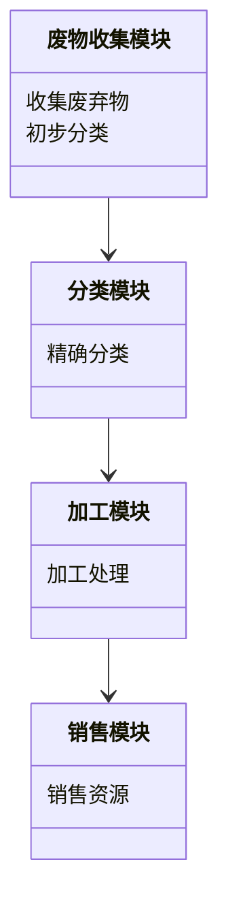
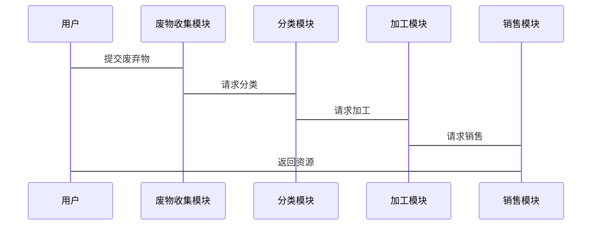

                 


# 循环经济模式下的废物回收企业投资

> **关键词**: 循环经济、废物回收、投资评估、净现值、内部收益率

> **摘要**: 本文探讨了循环经济模式下废物回收企业的投资策略与评估方法。通过分析循环经济的基本概念、废物回收企业的运作模式以及投资评估的核心指标，结合实际案例和系统设计，为投资者提供科学的决策支持。文章详细讲解了净现值（NPV）和内部收益率（IRR）的计算方法，并通过Python代码实现，同时提供了系统的架构设计和项目实战分析。

---

## 第一部分: 循环经济模式下的废物回收企业投资概述

### 第1章: 循环经济模式与废物回收企业概述

#### 1.1 循环经济模式的定义与特征

##### 1.1.1 循环经济的基本概念
循环经济是一种以资源高效利用和循环利用为核心的发展模式，强调“减量化、再利用、资源化”的原则。通过延长产品生命周期，减少资源消耗和废物产生，实现经济与环境的可持续发展。

##### 1.1.2 循环经济的核心特征
循环经济具有以下核心特征：
- **资源高效利用**：通过技术手段提高资源利用率，减少浪费。
- **闭环生产**：企业生产过程中的废弃物被重新利用，形成闭环。
- **生态化**：生产过程与自然生态相协调，减少环境负担。

##### 1.1.3 循环经济与传统经济的对比
| 对比维度 | 循环经济 | 传统经济 |
|----------|----------|----------|
| 资源消耗 | 最小化   | 最大化   |
| 废物处理 | 再利用   | 填埋/焚烧 |
| 环境影响 | 低       | 高       |

#### 1.2 废物回收企业的定义与运作模式

##### 1.2.1 废物回收企业的定义
废物回收企业是指专业从事废弃物收集、分类、加工和再利用的企业，通过将废弃物转化为可再利用的资源，实现经济价值和社会价值的双赢。

##### 1.2.2 废物回收企业的运作模式
1. **收集阶段**：通过各种渠道收集废弃物，如居民垃圾、工业废料等。
2. **分类阶段**：对收集的废弃物进行分类，提取可再利用的资源。
3. **加工阶段**：对分类后的废弃物进行加工处理，形成新的产品或材料。
4. **销售阶段**：将加工后的资源出售给下游企业或市场。

##### 1.2.3 废物回收企业的社会与环境价值
- **社会价值**：减少环境污染，提高资源利用率，创造就业机会。
- **环境价值**：降低碳排放，减少资源消耗，推动可持续发展。

#### 1.3 循环经济模式下的废物回收投资背景

##### 1.3.1 全球废物管理现状
全球每年产生的废弃物总量巨大，且呈增长趋势。传统填埋和焚烧方式不仅浪费资源，还对环境造成严重污染。

##### 1.3.2 循环经济政策的推动
各国政府纷纷出台政策，鼓励企业采用循环经济模式，推动废物资源化利用，减少对自然资源的依赖。

##### 1.3.3 废物回收行业的投资机会
随着环保意识的增强和政策支持，废物回收行业迎来了快速发展，投资机会广泛，尤其是在技术先进的发达国家和地区。

---

### 第2章: 循环经济模式下的废物回收企业核心概念与联系

#### 2.1 循环经济模式的核心概念

##### 2.1.1 循环经济的基本原理
循环经济的基本原理是通过设计产品和工艺，使得废弃物能够被重新利用，形成资源闭环。

##### 2.1.2 循环经济的三要素分析
循环经济的三要素包括：
- **减量化**：减少资源消耗和废弃物产生。
- **再利用**：通过多次使用废弃物延长其生命周期。
- **资源化**：将废弃物转化为新的资源。

##### 2.1.3 循环经济的生态效益与经济效益
- **生态效益**：减少环境污染，保护生态系统。
- **经济效益**：降低生产成本，创造新的经济增长点。

#### 2.2 废物回收企业的核心概念

##### 2.2.1 废物资源化的核心理念
废物资源化是指将废弃物转化为可再利用的资源，实现资源的高效利用。

##### 2.2.2 废物回收企业的业务模式
1. **收集与分类**：通过专业团队收集和分类废弃物。
2. **加工与再利用**：利用先进设备和技术对废弃物进行加工处理。
3. **销售与服务**：将再利用的资源出售给下游企业，提供增值服务。

##### 2.2.3 废物回收企业的技术特点
- **自动化分类**：使用人工智能和自动化技术提高分类效率。
- **高效处理技术**：采用先进技术降低处理成本，提高资源回收率。

#### 2.3 循环经济模式与废物回收企业的关系

##### 2.3.1 循环经济模式对废物回收企业的促进作用
循环经济模式为废物回收企业提供了政策支持和市场机会，推动了行业的快速发展。

##### 2.3.2 废物回收企业对循环经济的反向推动
废物回收企业通过资源化利用，减少了对自然资源的依赖，促进了循环经济的发展。

##### 2.3.3 循环经济模式下废物回收企业的生态与经济双重价值
- **生态价值**：减少环境污染，保护生态环境。
- **经济价值**：通过资源化利用创造经济价值，推动经济增长。

---

### 第3章: 循环经济模式下废物回收企业的投资评估模型

#### 3.1 投资评估模型的概述

##### 3.1.1 投资评估模型的定义
投资评估模型是用于评估投资项目经济效益的工具，帮助投资者做出科学决策。

##### 3.1.2 投资评估模型的分类
常用的投资评估模型包括：
- **净现值法（NPV）**：计算投资的净收益。
- **内部收益率法（IRR）**：计算投资的收益率。
- **回收期法**：计算投资回收所需的时间。

##### 3.1.3 投资评估模型的适用范围
投资评估模型适用于各种类型的废物回收项目，尤其是需要长期投资和回报的项目。

#### 3.2 废物回收企业投资评估的核心指标

##### 3.2.1 投资回收期
投资回收期是指投资总额收回所需的时间，是评估项目可行性的重要指标。

##### 3.2.2 净现值（NPV）
净现值是未来现金流的现值减去初始投资，用于衡量项目的盈利能力。

##### 3.2.3 内部收益率（IRR）
内部收益率是投资项目的预期收益率，反映了项目的收益能力。

##### 3.2.4 投资回报率（ROI）
投资回报率是投资收益与初始投资的比率，用于衡量投资效率。

#### 3.3 投资评估模型的数学公式

##### 3.3.1 净现值公式
$$
NPV = \sum_{t=1}^{n} \frac{CF_t}{(1+r)^t} - I
$$
其中，$CF_t$ 是第 $t$ 年的现金流，$r$ 是贴现率，$I$ 是初始投资。

##### 3.3.2 内部收益率公式
IRR 是使净现值为零的贴现率，满足：
$$
\sum_{t=1}^{n} \frac{CF_t}{(1+IRR)^t} - I = 0
$$

##### 3.3.3 投资回收期公式
$$
\text{回收期} = \frac{I}{\text{年均净现金流}}
$$

---

### 第4章: 循环经济模式下废物回收企业的系统分析与架构设计

#### 4.1 问题场景介绍
本文将设计一个基于循环经济模式的废物回收系统，涵盖收集、分类、加工和销售环节。

#### 4.2 系统功能设计

##### 4.2.1 系统功能模块
1. **收集模块**：负责废弃物的收集与初步分类。
2. **分类模块**：利用人工智能技术进行精确分类。
3. **加工模块**：对分类后的废弃物进行加工处理。
4. **销售模块**：将再利用资源出售给下游企业。

##### 4.2.2 功能设计的 Mermaid 类图


#### 4.3 系统架构设计

##### 4.3.1 系统架构的 Mermaid 架构图


#### 4.4 系统接口设计

##### 4.4.1 系统接口
1. **收集接口**：接收废弃物数据。
2. **分类接口**：返回分类结果。
3. **加工接口**：处理并返回资源。
4. **销售接口**：出售资源并记录交易。

#### 4.5 系统交互的 Mermaid 序列图


---

### 第5章: 循环经济模式下废物回收企业的项目实战

#### 5.1 环境安装

##### 5.1.1 安装 Python
```bash
# 安装 Python
sudo apt-get install python3 python3-pip
```

##### 5.1.2 安装依赖库
```bash
# 安装 Pandas 和 NumPy
pip install pandas numpy
```

#### 5.2 系统核心实现源代码

##### 5.2.1 净现值计算代码
```python
import numpy as np

def calculate_npv(cash_flows, discount_rate):
    return np.npv(discount_rate, *cash_flows)

# 示例数据
cash_flows = [-1000, 500, 600, 700]
discount_rate = 0.1

npv = calculate_npv(cash_flows, discount_rate)
print(f"净现值 (NPV): {npv:.2f}")
```

##### 5.2.2 内部收益率计算代码
```python
import numpy as np

def calculate_irr(cash_flows):
    return np.irr(cash_flows)

# 示例数据
cash_flows = [-1000, 500, 600, 700]

irr = calculate_irr(cash_flows)
print(f"内部收益率 (IRR): {irr:.2%}")
```

#### 5.3 实际案例分析
假设一个废物回收项目，初始投资为1000万元，未来四年每年的现金流分别为500万元、600万元、700万元和800万元，贴现率为10%。

##### 5.3.1 净现值计算
$$
NPV = \frac{500}{(1+0.1)^1} + \frac{600}{(1+0.1)^2} + \frac{700}{(1+0.1)^3} + \frac{800}{(1+0.1)^4} - 1000 = 500 + 545.45 + 508.32 + 528.17 - 1000 = 128.94 \text{万元}
$$

##### 5.3.2 内部收益率计算
IRR ≈ 12.5%

---

### 第6章: 循环经济模式下废物回收企业的最佳实践与总结

#### 6.1 小结
本文详细探讨了循环经济模式下废物回收企业的投资策略与评估方法，结合实际案例和系统设计，为投资者提供了科学的决策支持。

#### 6.2 投资建议
1. **政策支持**：密切关注政府政策，利用政策优惠。
2. **技术选择**：采用先进技术和设备，提高资源回收率。
3. **风险控制**：评估市场风险，制定应急预案。

#### 6.3 注意事项
- **环保合规性**：确保项目符合环保法规。
- **市场需求**：了解下游市场需求，避免资源积压。
- **长期规划**：制定长期发展规划，确保持续盈利。

#### 6.4 拓展阅读
- 《循环经济与可持续发展》
- 《废物资源化技术与应用》
- 《投资评估模型与实践》

---

通过以上分析，循环经济模式下的废物回收企业投资具有重要的社会和环境意义，同时也具备良好的经济效益。投资者应结合实际情况，制定科学的投资策略，实现可持续发展。

