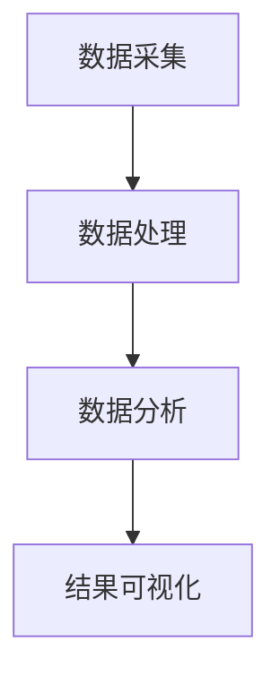

                 

# 微生物组研究对健康产业的影响与投资前景

> 关键词：微生物组研究，健康产业，投资前景，生物技术，健康管理

> 摘要：本文章深入探讨了微生物组研究对健康产业的重要影响，分析了其在疾病预防、个性化医疗、营养补充等领域的应用，结合当前的投资趋势，预测了微生物组研究的未来发展方向及潜在的投资机会。通过系统分析和案例研究，本文为投资者和相关产业提供了科学依据和决策参考。

---

# 第一部分：微生物组研究的背景与核心概念

## 第1章：微生物组研究的背景与意义

### 1.1 微生物组的定义与研究的重要性

#### 1.1.1 微生物组的定义
微生物组是指存在于特定环境中的所有微生物的集合，包括细菌、病毒、真菌等。在人体中，微生物组主要分布在肠道、皮肤、口腔等部位，与宿主的健康状态密切相关。

#### 1.1.2 微生物组研究的重要性
微生物组研究的重要性体现在以下几个方面：
1. **疾病预防与治疗**：通过分析微生物组的组成和功能，可以发现疾病早期预警标志物，并开发针对微生物组的治疗手段。
2. **个性化医疗**：微生物组的个体差异可能导致对药物的反应不同，因此可以通过微生物组研究制定个性化的治疗方案。
3. **健康监测**：通过监测微生物组的变化，可以评估个人的健康状况，并提供针对性的健康建议。

#### 1.1.3 微生物组研究的多学科交叉性
微生物组研究涉及多个学科领域，如生物技术、信息技术、医学、营养学等。多学科的交叉为微生物组研究提供了丰富的理论和技术支持。

### 1.2 微生物组研究的基本方法

#### 1.2.1 基因测序技术
基因测序技术是微生物组研究的核心工具，常用的测序技术包括：
1. **Illumina测序**：高通量测序技术，适用于大规模微生物组研究。
2. **Ion Torrent测序**：基于半导体技术的测序方法，具有快速和低成本的特点。

#### 1.2.2 生物信息学分析方法
生物信息学分析是微生物组研究的重要环节，主要包括：
1. **数据预处理**：去除低质量数据和宿主DNA。
2. **序列比对与注释**：将测序数据比对到参考数据库，进行功能注释。
3. **数据分析与可视化**：使用统计学方法分析微生物组的组成和功能，并通过图表进行可视化。

#### 1.2.3 实验室操作流程
实验室操作流程包括样本采集、DNA提取、文库制备、测序和数据分析等步骤。

### 1.3 微生物组研究的健康影响

#### 1.3.1 微生物组与人体健康的关系
微生物组通过代谢途径与人体健康密切相关，例如：
1. **代谢性疾病**：微生物组的代谢产物可以影响宿主的代谢功能，与肥胖、糖尿病等代谢性疾病密切相关。
2. **免疫系统**：微生物组通过调节免疫系统的活性，影响宿主的免疫功能。
3. **心理健康**：近年来研究表明，微生物组可能与抑郁症、焦虑症等心理健康问题有关。

#### 1.3.2 微生物组在疾病中的作用
微生物组在疾病中的作用主要体现在以下几个方面：
1. **致病菌的检测与鉴定**：通过微生物组研究可以快速识别致病菌，为疾病诊断提供依据。
2. **治疗效果评估**：通过分析微生物组的变化，可以评估治疗方案的效果。

#### 1.3.3 微生物组对健康产业的潜在影响
微生物组研究为健康产业提供了新的方向，例如：
1. **益生菌产品**：通过研究有益菌的种类和功能，开发新型益生菌产品。
2. **功能性食品**：基于微生物组的研究结果，开发具有特定功能的食品，改善宿主健康。
3. **个性化健康管理**：通过分析个体的微生物组数据，提供个性化的健康管理方案。

## 第2章：微生物组研究的核心概念与联系

### 2.1 微生物组的结构与功能

#### 2.1.1 微生物组的组成
微生物组的组成包括细菌、病毒、真菌等多种微生物，不同环境中的微生物组组成差异较大。

#### 2.1.2 微生物组的功能网络
微生物组的功能网络是指微生物之间以及微生物与宿主之间的相互作用网络，通过分析功能网络可以揭示微生物组的复杂功能。

#### 2.1.3 微生物组的动态变化
微生物组在宿主的不同生理状态下会发生动态变化，例如在疾病发生时，微生物组的组成和功能会发生显著变化。

### 2.2 微生物组与人体健康的关系

#### 2.2.1 微生物组对人体代谢的影响
微生物组通过代谢宿主摄入的营养物质，影响宿主的代谢功能，与肥胖、糖尿病等代谢性疾病密切相关。

#### 2.2.2 微生物组对免疫系统的作用
微生物组通过调节免疫系统的活性，影响宿主的免疫功能，增强或抑制宿主的免疫反应。

#### 2.2.3 微生物组对慢性病的影响
微生物组在慢性病的发生和发展中起重要作用，例如在炎症性肠病、哮喘等慢性病中，微生物组的组成和功能发生了显著变化。

### 2.3 微生物组与健康产业的联系

#### 2.3.1 微生物组在食品健康中的应用
微生物组研究为功能性食品的研发提供了科学依据，例如开发具有特定功能的益生菌食品。

#### 2.3.2 微生物组在医药研发中的作用
微生物组研究为新药开发提供了新的思路，例如通过靶向微生物组的特定成分开发新型抗生素或治疗药物。

#### 2.3.3 微生物组对个人健康管理的影响
通过分析个体的微生物组数据，可以制定个性化的健康管理方案，预防疾病的发生，改善个人健康状况。

---

# 第二部分：微生物组研究的算法与系统分析

## 第3章：微生物组研究的算法原理

### 3.1 微生物组数据分析流程

#### 3.1.1 数据预处理
数据预处理包括去除低质量数据、去除宿主DNA、去除人源序列等步骤。

#### 3.1.2 数据比对与注释
数据比对与注释是将测序数据比对到参考数据库，进行功能注释。常用的数据库包括NCBI、KEGG等。

#### 3.1.3 数据分析与可视化
数据分析与可视化包括统计分析、网络分析、热图绘制等步骤。

### 3.2 常用的生物信息学工具

#### 3.2.1 QIIME
QIIME（Quantitative Insights into Microbial Ecology）是一个广泛使用的微生物组分析工具，支持从测序数据到结果分析的全流程。

#### 3.2.2 Mothur
Mothur是一个基于命令行的微生物组分析工具，支持数据处理、数据分析和可视化。

#### 3.2.3 Meta分析工具
Meta分析工具用于整合多个研究的结果，评估微生物组的组成和功能。

### 3.3 微生物组数据的数学模型

#### 3.3.1 主成分分析（PCA）
主成分分析（PCA）是一种常用的降维技术，可以将复杂的微生物组数据简化为几个主成分，便于可视化和分析。

#### 3.3.2 线性判别分析（LDA）
线性判别分析（LDA）用于识别不同组别之间的差异特征，常用于寻找微生物组中与疾病相关的差异菌群。

#### 3.3.3 网络分析方法
网络分析方法用于构建微生物组的功能网络，分析微生物之间的相互作用关系。

## 第4章：微生物组研究的系统架构设计

### 4.1 微生物组研究的系统功能设计

#### 4.1.1 数据采集模块
数据采集模块负责采集微生物组样本的测序数据。

#### 4.1.2 数据处理模块
数据处理模块包括数据预处理和比对注释，为后续分析提供高质量的数据。

#### 4.1.3 数据分析模块
数据分析模块包括统计分析、网络分析和可视化，生成微生物组的分析结果。

### 4.2 微生物组研究的系统架构图

---

# 第三部分：微生物组研究对健康产业的影响与投资前景

## 第5章：微生物组研究的健康产业应用

### 5.1 微生物组研究在食品健康中的应用

#### 5.1.1 益生菌产品
益生菌产品是微生物组研究的重要成果，通过研究有益菌的种类和功能，开发新型益生菌产品。

#### 5.1.2 功能性食品
功能性食品基于微生物组的研究结果，开发具有特定功能的食品，改善宿主健康。

### 5.2 微生物组研究在医药研发中的应用

#### 5.2.1 抗生素研发
通过分析微生物组的组成和功能，可以发现新的抗生素靶点，开发新型抗生素。

#### 5.2.2 疾病治疗
微生物组研究为疾病的治疗提供了新思路，例如通过调节微生物组的组成和功能，治疗炎症性肠病、哮喘等疾病。

### 5.3 微生物组研究在个性化医疗中的应用

#### 5.3.1 个性化用药方案
通过分析个体的微生物组数据，可以制定个性化的用药方案，提高治疗效果。

#### 5.3.2 个性化健康管理
通过分析个体的微生物组数据，可以制定个性化的健康管理方案，预防疾病的发生，改善个人健康状况。

## 第6章：微生物组研究的投资前景

### 6.1 微生物组研究的市场潜力

#### 6.1.1 健康产业的快速发展
随着人们对健康的关注不断增加，健康产业的市场规模持续增长，为微生物组研究提供了广阔的应用场景。

#### 6.1.2 微生物组技术的成熟
微生物组研究技术的不断成熟，使得其在健康领域的应用逐渐普及，为投资者提供了更多的投资机会。

### 6.2 微生物组研究的投资机会

#### 6.2.1 益生菌产业
益生菌产业是微生物组研究的重要应用领域，随着消费者对益生菌产品的认知度不断提高，市场需求持续增长。

#### 6.2.2 生物技术公司
生物技术公司在微生物组研究领域具有重要的地位，投资者可以通过投资生物技术公司，分享微生物组研究的成果。

#### 6.2.3 健康管理平台
基于微生物组研究的健康管理平台具有广阔的市场前景，投资者可以通过投资健康管理平台，提供个性化的健康管理服务。

### 6.3 微生物组研究的挑战与未来趋势

#### 6.3.1 技术挑战
微生物组研究面临数据量大、分析复杂等技术挑战，需要不断优化研究方法和技术手段。

#### 6.3.2 市场挑战
微生物组研究的市场应用需要面对市场竞争激烈、消费者认知度不高等问题。

#### 6.3.3 未来趋势
未来，微生物组研究将更加注重个体化和精准化，结合人工智能等技术，推动微生物组研究的进一步发展。

---

# 第四部分：总结与展望

## 第7章：微生物组研究的总结与展望

### 7.1 微生物组研究的现状
目前，微生物组研究已经取得了一系列重要成果，为健康产业的发展提供了重要支持。

### 7.2 投资前景分析
微生物组研究具有广阔的市场前景，投资者可以通过多种方式参与微生物组研究的投资。

### 7.3 未来发展趋势
未来，微生物组研究将更加注重个体化和精准化，结合人工智能等技术，推动微生物组研究的进一步发展。

---

# 附录：微生物组研究的相关工具与资源

## 附录A：常用微生物组分析工具

1. QIIME
2. Mothur
3. Meta分析工具
4. R语言中的微生物组分析包

## 附录B：微生物组研究的数据库

1. NCBI
2. KEGG
3. Metagenomic Analysis Server (MAS)
4. 等等。

---

以上为《微生物组研究对健康产业的影响与投资前景》的文章结构和内容，希望对您有所帮助！

