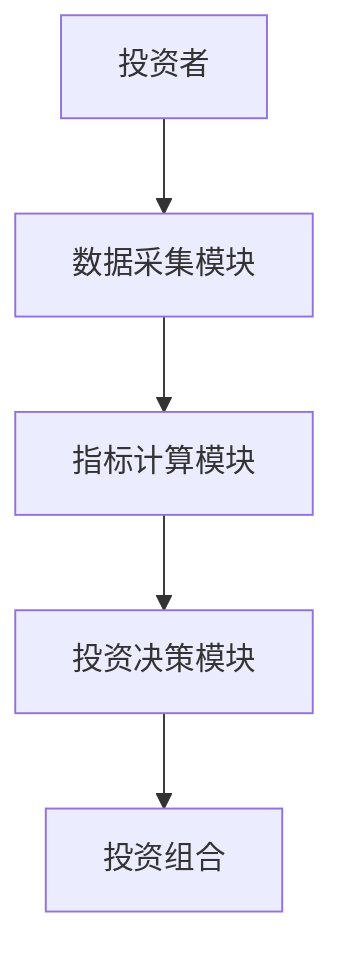
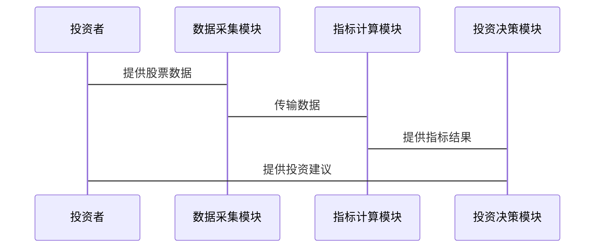

                 


# 成长型投资vs价值型投资：市场周期中的选择

## 关键词：成长型投资，价值型投资，市场周期，投资策略，风险管理

## 摘要：  
本文深入分析了成长型投资和价值型投资的核心概念、数学模型、算法原理以及在不同市场周期中的应用策略。通过比较两者的优缺点，结合实际案例和系统设计，探讨了在不同市场环境下如何选择适合的投资策略，并通过Python代码实现投资组合优化。

---

## 第1章: 投资基础与概念解析

### 1.1 投资的基本概念

#### 1.1.1 投资的定义与分类
- 投资是指将资金投入到某个资产或项目中，以获得未来收益的行为。
- 分类：股票、债券、基金、房地产等。

#### 1.1.2 股票投资的核心要素
- 股票：代表公司所有权的凭证。
- 股票价格：受市场供需、公司业绩、宏观经济等因素影响。

#### 1.1.3 投资的长期与短期目标
- 长期目标：资本增值、资产保值。
- 短期目标：资本利得、股息收入。

### 1.2 成长型投资与价值型投资的定义

#### 1.2.1 成长型投资的定义
- 以公司未来高增长为核心，寻找具有持续增长潜力的公司。
- 适合长期投资者，注重公司基本面和成长性。

#### 1.2.2 价值型投资的定义
- 以公司当前价值被市场低估为核心，寻找价格低于内在价值的股票。
- 适合保守投资者，注重安全边际和估值。

#### 1.2.3 两者的区别与联系
| 对比维度 | 成长型投资 | 价值型投资 |
|----------|------------|------------|
| 核心目标 | 未来增长   | 当前低估   |
| 风险偏好 | 较高       | 较低       |
| 投资期限 | 长期       | 中长期     |

### 1.3 投资策略的选择标准

#### 1.3.1 投资者的风险偏好
- 高风险偏好：适合成长型投资。
- 低风险偏好：适合价值型投资。

#### 1.3.2 投资者的资金规模
- 小资金：适合成长型投资（灵活性高）。
- 大资金：适合价值型投资（稳定性强）。

#### 1.3.3 市场环境的影响
- 牛市：成长型投资表现优于价值型投资。
- 熊市：价值型投资更具防御性。

---

## 第2章: 市场周期与投资策略

### 2.1 市场周期的基本概念

#### 2.1.1 经济周期的定义
- 经济周期分为：衰退、复苏、过热、滞胀。

#### 2.1.2 股市周期的阶段划分
- 牛市：市场上涨，投资者信心强。
- 熊市：市场下跌，投资者信心弱。
- 震荡市：市场波动大，不确定性高。

#### 2.1.3 市场周期对投资策略的影响
- 市场周期决定了投资策略的有效性和收益潜力。

### 2.2 不同市场周期中的投资策略选择

#### 2.2.1 牛市中的投资策略
- 成长型投资：适合牛市，高增长公司股价上涨快。
- 价值型投资：收益稳定，适合保守投资者。

#### 2.2.2 熊市中的投资策略
- 价值型投资：防御性强，适合熊市。
- 成长型投资：风险较高，需谨慎选择。

#### 2.2.3 震荡市中的投资策略
- 组合投资：平衡成长型和价值型投资。
- 灵活调整：根据市场变化及时调整仓位。

### 2.3 市场周期中的风险管理

#### 2.3.1 风险控制的重要性
- 风险管理是投资成功的关键。
- 风险控制包括：止损、分散投资、仓位管理。

#### 2.3.2 不同周期中的风险特征
| 市场周期 | 风险特征 |
|----------|----------|
| 牛市     | 风险较低 |
| 熊市     | 风险较高 |
| 震荡市   | 风险中高 |

#### 2.3.3 风险管理的具体措施
- 设置止损点：防止亏损过大。
- 分散投资：降低单一投资的风险。
- 定期调整：根据市场变化优化投资组合。

---

## 第3章: 成长型投资的数学模型与算法

### 3.1 成长型投资的核心指标

#### 3.1.1 市盈率（P/E）的计算
$$ P/E = \frac{价格}{每股收益} $$

#### 3.1.2 市净率（P/B）的计算
$$ P/B = \frac{价格}{每股净资产} $$

#### 3.1.3 市盈率相对盈利增长比率（PEG）的计算
$$ PEG = \frac{P/E}{净利润增长率} $$

### 3.2 成长型投资的算法流程

#### 3.2.1 数据收集与处理
- 数据来源：股票历史价格、财务报表数据。
- 数据清洗：处理缺失值、异常值。

#### 3.2.2 指标计算与筛选
- 计算成长性指标（PEG、收入增长率、净利润增长率）。
- 根据指标筛选出符合条件的股票。

#### 3.2.3 投资组合的构建
- 根据筛选结果，构建投资组合。
- 调整权重，分散风险。

### 3.3 成长型投资的数学公式

#### 3.3.1 P/E = 价格 / 每股收益
- 示例：某公司股价为50元，每股收益为5元，则P/E=10。

#### 3.3.2 P/B = 价格 / 每股净资产
- 示例：某公司股价为40元，每股净资产为20元，则P/B=2。

#### 3.3.3 PEG = P/E / 净利润增长率
- 示例：某公司P/E=15，净利润增长率为15%，则PEG=1。

---

## 第4章: 价值型投资的数学模型与算法

### 4.1 价值型投资的核心指标

#### 4.1.1 市盈率（P/E）的计算
$$ P/E = \frac{价格}{每股收益} $$

#### 4.1.2 市净率（P/B）的计算
$$ P/B = \frac{价格}{每股净资产} $$

#### 4.1.3 市售率（P/S）的计算
$$ P/S = \frac{价格}{每股销售收入} $$

### 4.2 价值型投资的算法流程

#### 4.2.1 数据收集与处理
- 数据来源：股票历史价格、财务报表数据。
- 数据清洗：处理缺失值、异常值。

#### 4.2.2 指标计算与筛选
- 计算估值指标（P/E、P/B、P/S）。
- 根据指标筛选出低估的股票。

#### 4.2.3 投资组合的构建
- 根据筛选结果，构建投资组合。
- 调整权重，分散风险。

### 4.3 价值型投资的数学公式

#### 4.3.1 P/E = 价格 / 每股收益
- 示例：某公司股价为30元，每股收益为15元，则P/E=2。

#### 4.3.2 P/B = 价格 / 每股净资产
- 示例：某公司股价为20元，每股净资产为10元，则P/B=2。

#### 4.3.3 P/S = 价格 / 每股销售收入
- 示例：某公司股价为40元，每股销售收入为20元，则P/S=2。

---

## 第5章: 成长型投资与价值型投资的比较

### 5.1 两种投资策略的优缺点对比

| 对比维度       | 成长型投资                     | 价值型投资                     |
|----------------|------------------------------|------------------------------|
| 核心目标       | 未来增长                     | 当前低估                     |
| 风险偏好       | 较高                         | 较低                         |
| 投资期限       | 长期                         | 中长期                       |
| 适用场景       | 牛市                         | 熊市、震荡市                   |

### 5.2 不同市场周期中的策略选择

#### 5.2.1 牛市中的策略选择
- 成长型投资表现优于价值型投资。
- 适合高风险偏好的投资者。

#### 5.2.2 熊市中的策略选择
- 价值型投资更具防御性。
- 适合保守投资者。

#### 5.2.3 震荡市中的策略选择
- 组合投资：平衡成长型和价值型投资。
- 灵活调整：根据市场变化及时调整仓位。

### 5.3 系统化投资策略

#### 5.3.1 系统化投资的核心理念
- 通过数学模型和算法，实现投资决策的自动化和系统化。

#### 5.3.2 系统化投资的具体步骤
1. 数据采集与处理。
2. 指标计算与筛选。
3. 投资组合构建与优化。
4. 风险管理与监控。

---

## 第6章: 投资决策系统的实现

### 6.1 系统功能设计

#### 6.1.1 数据采集模块
- 从股票数据库中获取历史数据。
- 数据清洗与预处理。

#### 6.1.2 指标计算模块
- 计算成长性指标和估值指标。
- 筛选出符合条件的股票。

#### 6.1.3 投资决策模块
- 根据市场周期和投资者偏好，选择合适的投资策略。
- 构建投资组合并优化权重。

### 6.2 系统架构设计

#### 6.2.1 系统架构图


#### 6.2.2 系统交互流程


### 6.3 系统实现与优化

#### 6.3.1 系统实现
- 使用Python编写数据采集和处理模块。
- 使用机器学习算法优化投资组合。

#### 6.3.2 系统优化
- 提高数据处理效率。
- 优化算法模型，提升投资收益。

---

## 第7章: 项目实战与总结

### 7.1 项目实战

#### 7.1.1 环境安装
- 安装Python、Pandas、NumPy等库。

#### 7.1.2 核心实现
```python
import pandas as pd
import numpy as np

# 示例：计算PEG
def calculate_peg(price, eps, growth_rate):
    pe = price / eps
    peg = pe / growth_rate
    return peg

# 示例：筛选成长型股票
data = pd.DataFrame({
    '公司': ['A', 'B', 'C'],
    '价格': [50, 40, 30],
    '每股收益': [5, 4, 3],
    '净利润增长率': [20, 15, 10]
})

data['peg'] = data.apply(lambda x: calculate_peg(x['价格'], x['每股收益'], x['净利润增长率']), axis=1)
print(data)
```

#### 7.1.3 代码解读
- 计算PEG：衡量公司成长性。
- 筛选成长型股票：根据PEG指标选择优质股票。

### 7.2 项目总结

#### 7.2.1 项目小结
- 成功实现成长型和价值型投资策略的系统化决策。
- 提供了在不同市场周期中选择投资策略的方法。

#### 7.2.2 注意事项
- 投资有风险，需谨慎选择。
- 系统化投资需结合市场实际情况进行调整。

#### 7.2.3 拓展阅读
- 《投资学》：深入理解投资理论。
- 《Python金融计算》：学习金融计算的编程技巧。

---

## 第8章: 最佳实践与小结

### 8.1 最佳实践

#### 8.1.1 投资策略选择
- 根据市场周期和个人风险偏好选择策略。
- 组合投资，分散风险。

#### 8.1.2 系统化投资
- 利用数学模型和算法优化投资决策。
- 定期监控和调整投资组合。

### 8.2 总结

- 成长型和价值型投资各有优缺点。
- 在不同市场周期中选择合适的策略。
- 系统化投资是未来发展的趋势。
- 投资需谨慎，建议结合专业知识和实际市场情况制定策略。

---

## 结语

通过本文的分析，读者可以更好地理解成长型和价值型投资的区别与联系，并在不同市场周期中选择适合的投资策略。系统化投资的方法也为投资者提供了科学的决策依据。希望本文能为投资者提供有价值的参考和启示。

