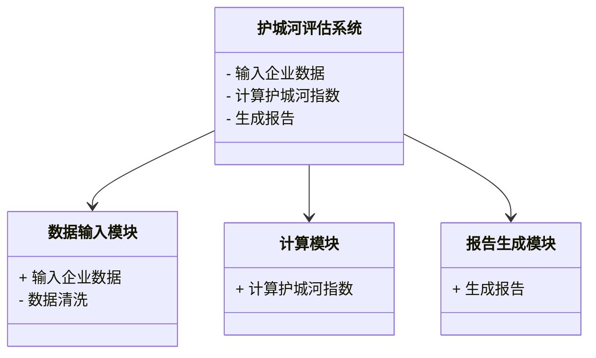

                 


# 戴维·多德的护城河评估体系

## 关键词：
- 护城河评估体系
- 戴维·多德
- 投资分析
- 竞争优势
- 企业估值

## 摘要：
戴维·多德的护城河评估体系是一种用于评估企业竞争优势的方法，通过分析企业的成本优势、品牌忠诚度和网络效应等因素，帮助企业建立可持续的竞争优势。本文详细介绍了护城河的概念、评估方法、数学模型及实际应用案例，帮助读者理解如何通过护城河评估体系提升企业价值。

---

## 正文

### 第一章：背景介绍

#### 1.1 护城河概念的起源与发展
戴维·多德作为投资领域的先驱，提出了护城河理论，用于评估企业的长期竞争优势。护城河是指企业抵御竞争对手的能力，通常体现在成本优势、品牌忠诚度和网络效应等方面。本文将介绍护城河的定义、类型及其在投资决策中的应用。

#### 1.2 护城河评估体系的核心要素
护城河的核心要素包括：
- 成本优势：企业通过规模经济或专有技术降低成本。
- 网络效应：用户数量增加，产品价值提升，如社交媒体平台。
- 品牌忠诚度：强大的品牌影响力吸引客户忠诚。

### 第二章：护城河的核心概念与联系

#### 2.1 护城河的核心要素对比
以下是不同类型护城河的对比表格：

| 护城河类型   | 核心要素                | 优缺点分析                         |
|--------------|-------------------------|------------------------------------|
| 成本优势     | 规模经济、专有技术       | 稳定性高，但易受技术变革影响       |
| 网络效应     | 用户数量、产品价值       | 高粘性，但市场扩展受限             |
| 品牌忠诚度   | 品牌影响力、客户认知度   | 强大市场影响力，但维护成本高         |

#### 2.2 护城河评估框架的ER图
以下是护城河评估框架的ER图：

```mermaid
erd
  竞争优势
    成本优势
    网络效应
    品牌忠诚度
  市场地位
    市场份额
    行业排名
  财务表现
    营业利润率
    净资产收益率
```

### 第三章：护城河评估的数学模型与算法原理

#### 3.1 护城河指数计算模型
护城河指数通过加权平均计算企业竞争优势的强弱：

$$ \text{护城河指数} = \sum_{i=1}^{n} w_i \times s_i $$

其中，\( w_i \) 是各要素的权重，\( s_i \) 是各要素的评分。

#### 3.2 护城河指数计算的Python实现
以下是计算护城河指数的Python代码：

```python
def calculate_h护城河指数(competitive_advantages):
    weights = [0.3, 0.4, 0.3]  # 权重分配
    return sum(weight * score for weight, score in zip(weights, competitive_advantages))

# 示例输入
competitive_advantages = [0.8, 0.7, 0.9]
index = calculate_h护城河指数(competitive_advantages)
print(f"护城河指数: {index}")
```

### 第四章：系统分析与架构设计方案

#### 4.1 问题场景介绍
本文将护城河评估体系应用于企业分析，构建一个评估系统，帮助企业识别竞争优势。

#### 4.2 系统功能设计
以下是系统功能设计的Mermaid类图：



### 第五章：项目实战

#### 5.1 环境安装
安装Python和必要的库（如pandas、numpy）：

```bash
pip install pandas numpy
```

#### 5.2 核心代码实现
以下是计算护城河指数的核心代码：

```python
import pandas as pd
import numpy as np

def calculate_h护城河指数(df):
    weights = [0.3, 0.4, 0.3]
    competitive_advantages = df[['成本优势', '网络效应', '品牌忠诚度']].values
    return np.dot(competitive_advantages, weights)

# 示例数据
data = {
    '成本优势': [0.8, 0.7],
    '网络效应': [0.6, 0.8],
    '品牌忠诚度': [0.7, 0.6]
}
df = pd.DataFrame(data)
index = calculate_h护城河指数(df)
print(index)
```

### 第六章：最佳实践与总结

#### 6.1 总结
护城河评估体系通过分析企业竞争优势，帮助企业建立可持续的竞争优势。本文详细介绍了护城河的定义、评估方法、数学模型及系统架构设计，并通过实际案例展示了其应用。

#### 6.2 注意事项
- 定期更新评估模型，适应市场变化。
- 结合其他分析方法，全面评估企业价值。

#### 6.3 拓展阅读
推荐阅读戴维·多德的经典著作《投资的智慧》，深入了解护城河理论的深度。

---

通过本文的详细讲解，读者可以全面理解戴维·多德的护城河评估体系，并将其应用到实际的企业分析和投资决策中。

