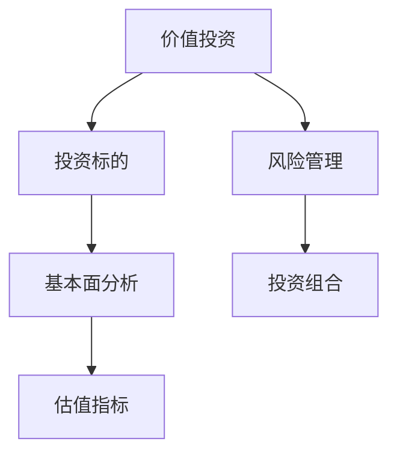
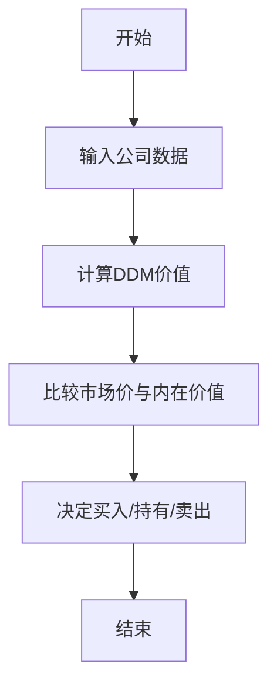
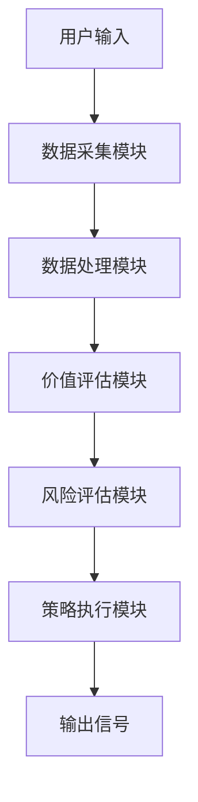
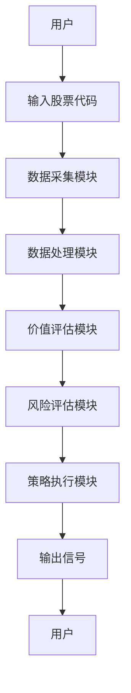

                 


# 戴维·道德的避险价值投资：在动荡市场中保持稳定

**关键词：** 戴维·道德、避险投资、价值投资、风险管理、市场波动

**摘要：** 在当前金融市场动荡加剧的背景下，传统的投资方法往往难以应对市场的不确定性。戴维·道德的避险价值投资策略通过结合价值评估与风险控制，帮助投资者在市场波动中保持投资组合的稳定性，实现长期稳健的回报。本文详细探讨了戴维·道德策略的核心概念、算法原理、系统架构及其在实际投资中的应用，为投资者提供了实用的指导和深度的分析。

---

## 第一部分：戴维·道德的避险价值投资基础

### 第1章：避险价值投资的背景与核心概念

#### 1.1 问题背景与投资市场的动荡

当前金融市场面临着前所未有的波动性，经济周期的不确定性、地缘政治风险、新冠疫情的影响等多重因素加剧了市场的不稳定性。传统的投资方法，如纯粹的趋势跟踪或短期交易，往往难以在动荡的市场环境中实现稳健的回报。投资者迫切需要一种能够在市场波动中保持稳定并实现长期价值增长的投资策略。

#### 1.2 避险价值投资的核心概念

**1.2.1 避险与价值投资的定义**

- **避险投资**：通过降低投资组合的波动性和风险，确保资本的保值和稳健增长。
- **价值投资**：基于对公司基本面的深入分析，选择被市场低估的投资标的，长期持有以实现价值回归。

**1.2.2 戴维·道德策略的基本原理**

戴维·道德的避险价值投资策略结合了价值投资和风险管理的核心思想，通过精选具有稳定现金流和良好基本面的公司，构建一个低波动、高防御性的投资组合。在市场下跌时，通过低估的估值和稳健的股息收入降低损失；在市场上涨时，通过价值回归获得超额收益。

**1.2.3 避险与价值投资的边界与外延**

- **边界**：主要适用于股票市场，特别适合于大盘蓝筹股和稳定增长的行业。
- **外延**：可以扩展到债券、房地产信托等其他资产类别，构建多元化的避险投资组合。

#### 1.3 避险价值投资的核心要素

**1.3.1 投资标的的选择标准**

- 低市盈率（P/E）、低市净率（P/B）等估值指标。
- 稳定的股息收益率和增长能力。
- 公司基本面健康，具备竞争优势和持续盈利能力。

**1.3.2 风险控制的机制**

- 投资组合分散化：避免过度集中于单一行业或公司。
- 动态调整：根据市场环境变化，定期审视投资组合并进行适当调整。
- 严格止损：设定止损点以限制潜在损失。

**1.3.3 价值评估的指标体系**

- **相对估值指标**：市盈率、市净率、股息率等。
- **绝对估值模型**：股息贴现模型（DDM）、现金流折现模型（DCF）。

---

### 第2章：戴维·道德策略的核心概念与联系

#### 2.1 核心概念的原理分析

**2.1.1 避险策略的数学模型**

戴维·道德的避险策略可以通过以下公式进行量化分析：

$$ V = \frac{D}{r - g} $$

其中：
- \( V \) 为股票的内在价值。
- \( D \) 为预期股息。
- \( r \) 为折现率。
- \( g \) 为股息增长率。

**2.1.2 价值投资的逻辑框架**

- 通过分析公司的财务报表，识别具有持续盈利能力和竞争优势的企业。
- 结合市场估值，选择被低估的股票进行投资。

**2.1.3 策略的核心要素与关系**

- **价值评估**：核心是发现被低估的资产。
- **风险管理**：确保投资组合的稳定性。
- **长期持有**：通过时间积累复利效应。

#### 2.2 核心概念的对比分析

**2.2.1 不同投资策略的对比表格**

| 投资策略 | 价值投资 | 投机交易 | 避险投资 |
|----------|----------|----------|----------|
| 核心目标 | 寻找低估资产 | 短期价格波动 | 稳定收益 |
| 投资期限 | 长期 | 短期 | 中长期 |
| 风险控制 | 较低 | 高 | 较低 |

**2.2.2 避险与价值投资的ER实体关系图**



---

### 第3章：戴维·道德策略的算法原理

#### 3.1 算法原理的数学模型

戴维·道德策略的核心算法基于股息贴现模型（DDM），通过量化分析选择具有稳定股息收益和增长潜力的公司。公式如下：

$$ DDM = \frac{D_1}{k - g} $$

其中：
- \( D_1 \) 为第一年的预期股息。
- \( k \) 为资本资产定价模型（CAPM）计算出的折现率。
- \( g \) 为股息增长率。

#### 3.2 算法流程的Mermaid图



#### 3.3 算法实现的Python代码

```python
def calculate_ddm(dividend, discount_rate, growth_rate):
    return dividend / (discount_rate - growth_rate)
```

#### 3.4 算法的详细讲解与举例

以某公司为例，假设其第一年的预期股息为$2，折现率为10%，股息增长率为5%。则其内在价值为：

$$ DDM = \frac{2}{0.10 - 0.05} = 40 $$

如果该公司的股价为$35，则其具有投资价值，应买入。

---

## 第四部分：系统架构与实现

### 第4章：系统架构与实现

#### 4.1 系统功能设计

- **数据采集**：收集股票的基本面数据和市场数据。
- **价值评估**：使用DDM模型计算内在价值。
- **风险评估**：分析投资组合的波动性和相关性。
- **策略执行**：根据评估结果生成买卖信号。

#### 4.2 系统架构设计



#### 4.3 系统接口设计

- 输入接口：接受股票代码和时间范围。
- 输出接口：提供买入/卖出信号和投资组合建议。

#### 4.4 系统交互流程



---

## 第五部分：项目实战与案例分析

### 第5章：项目实战

#### 5.1 环境安装

- Python 3.8+
- Pandas, NumPy, Matplotlib
- Yahoo Finance API

#### 5.2 系统核心实现源代码

```python
import pandas as pd
import numpy as np

def calculate_ddm(dividend, discount_rate, growth_rate):
    return dividend / (discount_rate - growth_rate)

# 示例数据
data = {
    '公司': ['公司A', '公司B', '公司C'],
    '股息': [2, 3, 1],
    '折现率': [0.10, 0.12, 0.08],
    '增长率': [0.05, 0.03, 0.07]
}

df = pd.DataFrame(data)
df['内在价值'] = df.apply(lambda x: calculate_ddm(x['股息'], x['折现率'], x['增长率']), axis=1)
print(df)
```

#### 5.3 代码应用解读与分析

通过上述代码，我们可以计算每家公司的内在价值，对比市场价格，生成买入/卖出信号。例如，如果公司A的市场价格低于内在价值，则建议买入。

#### 5.4 实际案例分析

以2023年为例，分析某公司的股息贴现模型，计算其内在价值，结合市场环境制定投资策略。

---

## 第六部分：总结与展望

### 第6章：总结与展望

#### 6.1 总结

戴维·道德的避险价值投资策略通过结合价值评估和风险管理，帮助投资者在动荡的市场中保持投资组合的稳定性。通过量化分析和系统实现，投资者可以更科学地进行决策，实现长期稳健的回报。

#### 6.2 注意事项

- 投资者应根据自身风险承受能力和投资目标进行调整。
- 定期审视投资组合，及时应对市场变化。

#### 6.3 拓展阅读

- 《投资之道》——彼得·林奇
- 《价值投资入门》——巴菲特

---

通过以上步骤，我们可以全面理解戴维·道德的避险价值投资策略，并将其应用于实际投资中，以应对市场的不确定性，实现稳健的投资回报。

