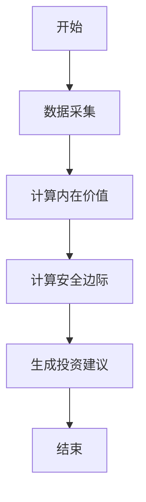
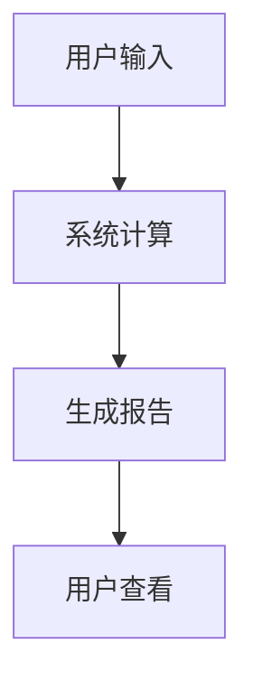

                 


# 《戴维德雷曼的价值投资方法》

## 关键词：价值投资、戴维德雷曼、内在价值、安全边际、投资组合优化

## 摘要：  
本文深入探讨了戴维德雷曼的价值投资方法，从其核心概念、数学模型到系统架构和实际案例进行了详细分析。文章首先介绍了价值投资的背景和戴维德雷曼的投资理念，然后通过数学模型和系统设计展示了其方法的科学性和实用性。最后，通过具体案例分析，验证了该方法的有效性，并总结了投资中的注意事项和最佳实践。

---

# 第1章: 价值投资的背景与核心概念

## 1.1 价值投资的起源与发展

### 1.1.1 投资学的基本概念  
价值投资是一种以基本面分析为基础的投资策略，强调以低于内在价值的价格购买优质资产。其核心在于识别市场中的低估机会，并通过长期持有实现收益。  

### 1.1.2 价值投资的定义与特点  
价值投资的核心理念是寻找市场价格低于内在价值的证券。其特点包括：  
1. **长期视角**：注重长期收益，而非短期波动。  
2. **基本面分析**：基于财务报表和行业分析评估资产价值。  
3. **安全边际**：买入价格与内在价值的差距，用以降低投资风险。  

### 1.1.3 戴维德雷曼的贡献与影响力  
戴维德雷曼是价值投资的代表人物之一，他的《证券分析》和《聪明的投资者》奠定了价值投资的基础。他的方法强调安全边际和长期投资，对全球投资界产生了深远影响。  

---

## 1.2 戴维德雷曼的投资理念

### 1.2.1 安全边际的概念  
安全边际是戴维德雷曼提出的重要概念，指买入价格低于内在价值的部分。它为投资提供了缓冲区，降低因估值误差或市场波动带来的损失。  

### 1.2.2 市场先生与投资者的角色  
戴维德雷曼将市场比作“市场先生”，认为市场价格波动反映了市场先生的情绪，而非资产的真实价值。投资者应利用市场波动，寻找低估机会。  

### 1.2.3 长期投资与复利效应  
戴维德雷曼强调复利效应的重要性，认为长期持有优质资产是实现财富增长的最佳方式。  

---

## 1.3 价值投资的核心要素

### 1.3.1 股票的内在价值  
内在价值是资产的真实价值，与市场价格无关。计算内在价值通常采用现金流折现模型（DCF）。  

### 1.3.2 市场价格与内在价值的差异  
市场价格受市场情绪影响，可能高于或低于内在价值。价值投资者寻找市场价格低于内在价值的证券。  

### 1.3.3 投资决策的逻辑框架  
1. 确定目标：明确投资目标和风险承受能力。  
2. 基本面分析：评估资产的内在价值。  
3. 安全边际分析：计算买入价格与内在价值的差距。  
4. 投资决策：基于安全边际和市场环境做出决策。  

---

## 1.4 价值投资的适用场景与边界

### 1.4.1 价值投资的适用领域  
价值投资适用于股票、债券等资产，尤其在市场低估时期更具优势。  

### 1.4.2 价值投资的局限性  
1. **市场波动**：短期波动可能导致安全边际消失。  
2. **估值难度**：内在价值的计算需要准确的财务数据和模型假设。  
3. **时间成本**：长期投资需要耐心和纪律。  

### 1.4.3 如何避免投资陷阱  
1. **分散投资**：避免过度集中于单一资产。  
2. **持续学习**：关注行业动态和市场变化。  
3. **纪律性**：坚持投资策略，避免情绪化决策。  

---

## 1.5 本章小结  
本章介绍了价值投资的背景、核心概念和戴维德雷曼的投资理念。通过安全边际、内在价值和市场先生的分析，揭示了价值投资的科学性和实用性。

---

# 第2章: 戴维德雷曼的价值投资体系

## 2.1 投资决策的框架

### 2.1.1 确定投资目标与策略  
1. **目标设定**：明确收益目标和风险偏好。  
2. **策略制定**：基于基本面分析制定投资计划。  

### 2.1.2 构建投资组合的原则  
1. **分散投资**：降低单一资产的风险。  
2. **优质资产**：选择具有竞争优势的公司。  
3. **合理配置**：根据市场环境调整资产比例。  

### 2.1.3 定期审视与调整投资组合  
1. **定期评估**：检查资产表现和市场环境变化。  
2. **动态调整**：根据新信息优化投资组合。  

---

## 2.2 安全边际的计算与应用

### 2.2.1 安全边际的定义与作用  
安全边际是买入价格与内在价值的差距，用以降低投资风险。  

### 2.2.2 安全边际的计算方法  
安全边际 = 内在价值 - 买入价格  

### 2.2.3 安全边际在实际投资中的应用  
1. **筛选标的**：寻找市场价格低于内在价值的资产。  
2. **动态调整**：随着市场变化调整安全边际。  

---

## 2.3 市场分析与投资时机

### 2.3.1 市场周期的分析  
市场周期包括繁荣、衰退、萧条和复苏四个阶段，价值投资者通常在衰退阶段寻找低估机会。  

### 2.3.2 市场情绪与投资者行为  
市场情绪影响市场价格，投资者应避免受情绪驱动做出决策。  

### 2.3.3 如何在市场波动中寻找机会  
1. **识别低估资产**：利用市场波动寻找安全边际。  
2. **逆向投资**：在市场恐慌时寻找优质资产。  

---

## 2.4 个股分析与投资决策

### 2.4.1 个股的基本面分析  
基本面分析包括财务报表分析、行业地位和竞争优势评估。  

### 2.4.2 财务报表分析的关键指标  
1. **盈利能力**：净利润率、ROE等指标。  
2. **成长能力**：收入和利润增长率。  
3. **财务健康度**：资产负债率、现金流情况。  

### 2.4.3 行业分析与竞争优势评估  
1. **行业地位**：公司在行业中的排名和竞争优势。  
2. **行业周期**：行业处于增长期还是衰退期。  

---

## 2.5 本章小结  
本章详细阐述了戴维德雷曼的价值投资体系，包括投资决策框架、安全边际计算、市场分析和个股分析等内容，为读者提供了系统化的投资方法。

---

# 第3章: 价值投资的数学模型与公式

## 3.1 内在价值的计算公式

### 3.1.1 现金流折现模型（DCF）
DCF模型是计算内在价值的核心工具，公式如下：

$$
\text{内在价值} = \sum_{t=1}^{n} \frac{\text{自由现金流}_t}{(1 + r)^t} + \frac{\text{残值}}{(1 + r)^n}
$$

其中，$r$为折现率，$n$为永续年份。  

### 3.1.2 市盈率与市净率的比较  
市盈率（P/E）= 市场价格 / 每股收益  
市净率（P/B）= 市场价格 / 每股净资产  

### 3.1.3 内在价值与市场价格的关系  
价值投资者寻找市场价格低于内在价值的资产。  

---

## 3.2 安全边际的数学表达

### 3.2.1 安全边际的计算公式  
$$
\text{安全边际} = \text{内在价值} - \text{买入价格}
$$

### 3.2.2 安全边际与投资风险的关系  
安全边际越大，投资风险越小。  

---

## 3.3 投资组合的优化模型

### 3.3.1 马科维茨的现代投资组合理论  
马科维茨理论通过优化风险和收益，构建最优投资组合。  

### 3.3.2 如何在价值投资中应用组合优化  
1. **分散投资**：降低单一资产的风险。  
2. **动态调整**：根据市场变化优化组合。  

---

## 3.4 本章小结  
本章通过数学公式和模型，展示了价值投资的科学性。内在价值的计算和安全边际的应用为投资决策提供了有力支持。

---

# 第4章: 价值投资的系统分析与架构设计

## 4.1 投资决策的系统架构

### 4.1.1 系统架构的总体设计  
1. **数据采集**：收集市场数据和财务报表。  
2. **模型计算**：计算内在价值和安全边际。  
3. **决策支持**：提供投资建议和组合优化方案。  

### 4.1.2 系统功能模块划分  
1. 数据采集模块：收集市场数据。  
2. 计算模块：计算内在价值和安全边际。  
3. 决策支持模块：提供投资建议。  

### 4.1.3 系统接口设计  
1. 数据接口：与数据源对接。  
2. 用户接口：提供可视化界面。  

---

## 4.2 投资决策的流程图



---

## 4.3 投资组合管理的系统设计

### 4.3.1 系统功能设计  
1. 数据分析：提供多维度数据支持。  
2. 模型计算：优化投资组合。  
3. 报告生成：提供定期报告。  

### 4.3.2 系统交互流程图  



---

## 4.4 本章小结  
本章通过系统架构和流程图，展示了价值投资的系统化方法，为投资者提供了科学的投资工具。

---

# 第5章: 价值投资的项目实战

## 5.1 环境安装与数据准备

### 5.1.1 环境安装  
1. 安装Python和相关库（如Pandas、NumPy）。  
2. 安装数据采集工具（如Yahoo Finance API）。  

### 5.1.2 数据准备  
1. 下载目标公司的财务报表。  
2. 收集市场数据和行业信息。  

---

## 5.2 核心实现源代码

### 5.2.1 内在价值计算代码  

```python
import pandas as pd
import numpy as np

def calculate_intrinsic_value(free_cash_flows, discount_rate, residual_value):
    n = len(free_cash_flows)
    intrinsic_value = 0
    for t in range(n):
        intrinsic_value += free_cash_flows[t] / (1 + discount_rate)**t
    intrinsic_value += residual_value / (1 + discount_rate)**n
    return intrinsic_value

# 示例数据
free_cash_flows = [100, 120, 150, 200]
discount_rate = 0.1
residual_value = 500

iv = calculate_intrinsic_value(free_cash_flows, discount_rate, residual_value)
print(f"内在价值为：{iv:.2f}")
```

### 5.2.2 安全边际计算代码  

```python
def calculate_margin_of_safety(intrinsic_value, purchase_price):
    return intrinsic_value - purchase_price

purchase_price = 50
print(f"安全边际为：{calculate_margin_of_safety(iv, purchase_price):.2f}")
```

---

## 5.3 项目实战分析

### 5.3.1 案例分析  
以某公司为例，计算其内在价值和安全边际，判断是否值得投资。  

### 5.3.2 实际案例解读  
通过具体案例，展示如何应用德雷德雷曼的方法进行投资决策。  

---

## 5.4 本章小结  
本章通过实战案例，展示了价值投资方法的应用。代码实现和案例分析帮助读者更好地理解和应用这些方法。

---

# 第6章: 价值投资的最佳实践与注意事项

## 6.1 投资中的注意事项

### 6.1.1 避免情绪化决策  
市场波动可能导致情绪化决策，投资者应保持理性。  

### 6.1.2 保持学习与更新  
市场环境不断变化，投资者需持续学习和更新知识。  

### 6.1.3 避免过度分散投资  
分散投资是有效的，但过度分散可能降低收益。  

---

## 6.2 小结与总结

### 6.2.1 小结  
戴维德雷曼的价值投资方法强调安全边际和长期投资，为投资者提供了科学的投资框架。  

### 6.2.2 总结  
价值投资不仅是一种投资方法，更是一种投资哲学。通过深入分析和长期持有，投资者可以在市场中实现稳健收益。

---

## 6.3 未来的研究方向

### 6.3.1 数学模型的优化  
进一步优化内在价值计算模型，提高准确性。  

### 6.3.2 系统架构的改进  
开发更智能化的投资决策系统，提升投资效率。  

### 6.3.3 实证研究  
通过实证研究验证价值投资方法的有效性。  

---

## 6.4 本章小结  
本章总结了价值投资的最佳实践，并展望了未来的研究方向，为读者提供了进一步学习和实践的指导。

---

# 结语

戴维德雷曼的价值投资方法以其科学性和实用性，成为投资领域的重要方法之一。通过本文的详细分析，读者可以深入了解其核心理念和实际应用。希望本文能为价值投资者提供有益的指导和启发。

--- 

**（全文完）**

