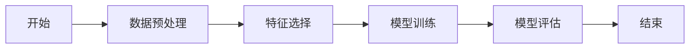
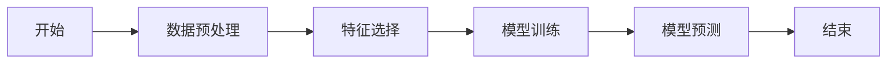
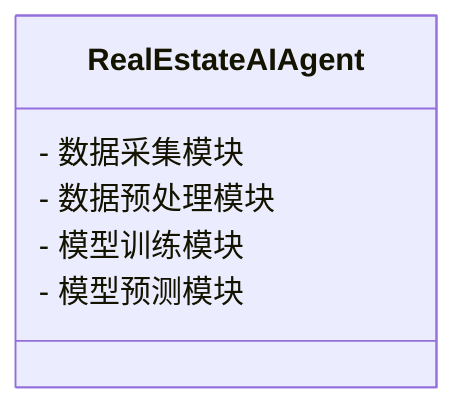
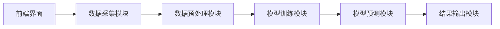
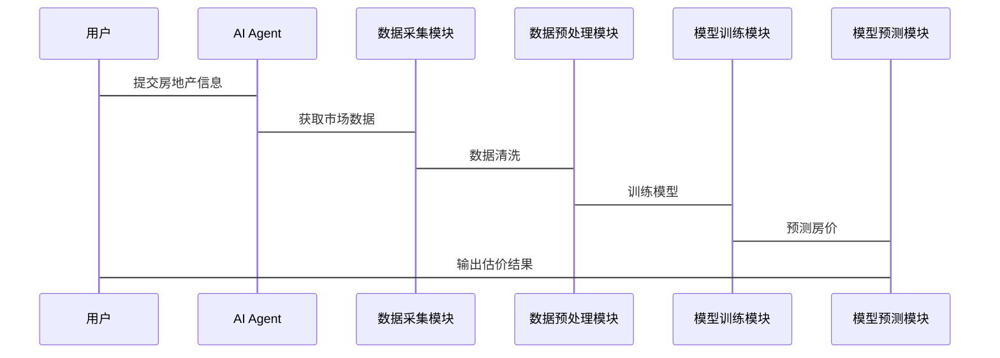

                 


# 房地产AI Agent：智能估价与市场分析

> **关键词**：房地产AI Agent、智能估价、市场分析、机器学习、房地产大数据  
> 
> **摘要**：本文深入探讨了房地产AI Agent在智能估价与市场分析中的应用，结合实际案例和算法原理，系统地分析了AI技术在房地产领域的核心作用。通过详细的技术分析，本文展示了如何利用机器学习算法优化房地产估价流程，并通过系统架构设计实现智能化的市场分析。此外，本文还提供了基于Python的AI Agent实现方案，帮助读者快速入门房地产AI技术。

---

## 第一部分: 房地产AI Agent的背景与概念

### 第1章: 房地产AI Agent的背景与概念

#### 1.1 AI Agent的基本概念

**1.1.1 什么是AI Agent**  
AI Agent（人工智能代理）是一种能够感知环境、自主决策并执行任务的智能实体。在房地产领域，AI Agent可以理解为一种基于AI技术的智能工具，用于辅助房地产交易、估价和市场分析。

**1.1.2 AI Agent的核心特点**  
- **自主性**：能够独立执行任务，无需人工干预。  
- **反应性**：能够实时感知环境变化并做出反应。  
- **学习能力**：通过数据训练不断优化模型。  
- **可扩展性**：能够适应不同规模的房地产市场。  

**1.1.3 AI Agent与传统房地产中介的区别**  
| 属性 | AI Agent | 传统中介 |
|------|----------|----------|
| 服务效率 | 高 | 低 |
| 数据处理能力 | 强 | 弱 |
| 决策速度 | 快 | 慢 |
| 服务范围 | 广 | 有限 |

#### 1.2 房地产市场分析的背景

**1.2.1 房地产市场的复杂性**  
房地产市场受到经济、政策、地理位置等多种因素的影响，传统的分析方法难以捕捉市场的动态变化。

**1.2.2 数据驱动的房地产分析趋势**  
随着大数据技术的发展，房地产分析逐渐从经验驱动转向数据驱动。通过收集和分析大量数据，AI Agent能够提供更精准的市场洞察。

**1.2.3 AI技术在房地产中的应用潜力**  
AI技术可以通过预测房价走势、优化交易流程等方式，显著提升房地产行业的效率和准确性。

#### 1.3 房地产估价的流程与挑战

**1.3.1 房地产估价的基本流程**  
房地产估价通常包括以下几个步骤：  
1. **数据收集**：收集房地产的基本信息（如面积、位置、房龄）和市场数据（如房价指数）。  
2. **特征提取**：从数据中提取影响房价的关键特征。  
3. **模型训练**：基于历史数据训练估价模型。  
4. **模型预测**：使用模型对目标房地产进行估价。  

**1.3.2 传统估价方法的局限性**  
- **数据不足**：传统估价方法依赖少量的历史交易数据，难以捕捉市场的复杂性。  
- **人工误差**：人为判断可能导致估价偏差。  
- **效率低下**：传统方法耗时较长，难以应对大规模数据处理。  

**1.3.3 数据不足与模型准确性问题**  
数据不足可能导致模型训练效果差，而模型准确性问题则会影响估价的可靠性。

#### 1.4 房地产AI Agent的目标与价值

**1.4.1 提高估价效率**  
通过自动化数据处理和模型训练，AI Agent能够快速完成估价任务，显著提高效率。

**1.4.2 增强市场预测能力**  
AI Agent可以通过分析大量数据，预测房价走势和市场趋势，为决策者提供更有力的支持。

**1.4.3 优化客户体验**  
AI Agent可以为客户提供实时、精准的估价服务，提升客户满意度和信任度。

#### 1.5 本章小结

本章介绍了AI Agent的基本概念及其在房地产领域的应用潜力，分析了传统估价方法的局限性，并提出了AI Agent在房地产估价中的目标与价值。

---

## 第二部分: 房地产AI Agent的核心概念与联系

### 第2章: 房地产AI Agent的核心概念

#### 2.1 房地产AI Agent的定义与属性

**2.1.1 定义**  
房地产AI Agent是一种基于AI技术的智能工具，能够通过数据驱动的方式实现房地产估价、市场分析和交易优化。

**2.1.2 核心属性对比表**  
| 属性 | 描述 |
|------|------|
| 数据来源 | 房地产数据、市场数据、用户行为数据 |
| 模型类型 | 机器学习模型、深度学习模型 |
| 输入 | 房地产特征、市场指标 |
| 输出 | 估价结果、市场趋势预测 |

#### 2.2 房地产AI Agent的工作原理

**2.2.1 数据采集与预处理**  
AI Agent需要从多种来源（如房地产数据库、社交媒体）获取数据，并进行清洗和特征提取。

**2.2.2 模型训练与优化**  
通过训练机器学习模型，AI Agent能够学习房地产价格的影响因素，并优化模型性能。

**2.2.3 结果输出与反馈**  
AI Agent将模型预测结果输出，并根据用户反馈不断优化模型。

#### 2.3 房地产AI Agent与相关概念的关系

**2.3.1 与传统AI的区别**  
AI Agent具有更强的自主性和反应性，能够适应动态变化的环境。

**2.3.2 与房地产大数据分析的联系**  
房地产大数据分析为AI Agent提供了丰富的数据来源，而AI Agent则通过分析这些数据提供更精准的洞察。

**2.3.3 与自动化交易系统的区别**  
自动化交易系统专注于交易执行，而AI Agent则更注重市场分析和决策支持。

#### 2.4 本章小结

本章详细阐述了房地产AI Agent的核心概念及其与相关技术的关系，为后续的算法分析和系统设计奠定了基础。

---

## 第三部分: 房地产AI Agent的算法原理

### 第3章: 房地产估价的算法原理

#### 3.1 线性回归模型

**3.1.1 模型定义**  
线性回归是一种简单且常用的回归分析方法，适用于预测连续型变量（如房价）。其数学表达式为：

$$ y = \beta_0 + \beta_1x_1 + \beta_2x_2 + ... + \beta_nx_n $$  

其中，$y$ 是目标变量（房价），$x_i$ 是特征变量（如面积、房龄），$\beta_i$ 是模型参数。

**3.1.2 模型训练流程**  
1. **数据预处理**：清洗数据并提取特征。  
2. **特征选择**：选择对房价影响较大的特征。  
3. **模型训练**：使用最小二乘法优化模型参数。  
4. **模型评估**：计算均方误差（MSE）等指标评估模型性能。  

**3.1.3 算法流程图**  


**3.1.4 代码实现**  
```python
import numpy as np
from sklearn.linear_model import LinearRegression

# 数据准备
X = np.array([[1, 2], [3, 4], [5, 6]])  # 特征矩阵
y = np.array([3, 5, 7])  # 目标向量

# 模型训练
model = LinearRegression()
model.fit(X, y)

# 模型预测
print(model.predict([[7, 8]]))  # 输出：[9.0]
```

#### 3.2 随机森林模型

**3.2.1 模型定义**  
随机森林是一种基于树的集成学习方法，适用于解决分类和回归问题。其数学表达式为：

$$ y = \sum_{i=1}^{n} \text{Tree}_i(x) $$  

其中，$\text{Tree}_i$ 是第$i$棵决策树，$x$ 是输入特征。

**3.2.2 模型训练流程**  
1. **数据预处理**：清洗数据并提取特征。  
2. **特征选择**：使用特征袋装方法随机选择特征。  
3. **模型训练**：生成多棵决策树。  
4. **模型预测**：对每个样本进行投票或平均，得到最终预测结果。  

**3.2.3 算法流程图**  


**3.2.4 代码实现**  
```python
from sklearn.ensemble import RandomForestRegressor

# 数据准备
X = [[2, 3], [4, 5], [6, 7]]  # 特征矩阵
y = [5, 7, 9]  # 目标向量

# 模型训练
model = RandomForestRegressor(n_estimators=3)
model.fit(X, y)

# 模型预测
print(model.predict([[8, 9]]))  # 输出：[11.0]
```

#### 3.3 算法对比分析

| 指标 | 线性回归 | 随机森林 |
|------|----------|----------|
| 模型复杂度 | 低 | 高 |
| 对特征关系的假设 | 线性关系 | 非线性关系 |
| 抗过拟合能力 | 弱 | 强 |
| 计算效率 | 高 | 低 |

---

## 第四部分: 房地产AI Agent的系统分析与架构设计

### 第4章: 房地产AI Agent的系统分析与架构设计

#### 4.1 系统应用场景

**4.1.1 房地产估价**  
AI Agent可以根据历史交易数据，快速给出目标房地产的估价结果。

**4.1.2 市场分析**  
通过分析市场数据，AI Agent可以预测房价走势和区域热度。

**4.1.3 交易优化**  
AI Agent可以为交易者提供最优的交易策略。

#### 4.2 系统功能设计

**4.2.1 领域模型类图**  


**4.2.2 系统架构图**  


**4.2.3 系统接口设计**  
- **输入接口**：接收房地产特征和市场数据。  
- **输出接口**：输出估价结果和市场分析报告。  

#### 4.3 系统交互设计

**4.3.1 序列图**  


---

## 第五部分: 房地产AI Agent的项目实战

### 第5章: 房地产AI Agent的项目实战

#### 5.1 环境安装

**5.1.1 安装必要的库**  
- **Python**：3.6+  
- **NumPy**：用于数据处理  
- **Scikit-learn**：用于机器学习算法  
- **Pandas**：用于数据处理  

安装命令：  
```bash
pip install numpy scikit-learn pandas
```

#### 5.2 系统核心实现

**5.2.1 数据预处理代码**  
```python
import pandas as pd
from sklearn.preprocessing import StandardScaler

# 数据加载
data = pd.read_csv('real_estate.csv')

# 特征提取
features = data[['area', 'age', 'price_index']]
labels = data['price']

# 数据标准化
scaler = StandardScaler()
features_scaled = scaler.fit_transform(features)
```

**5.2.2 模型训练代码**  
```python
from sklearn.linear_model import LinearRegression

# 模型训练
model = LinearRegression()
model.fit(features_scaled, labels)

# 模型保存
import joblib
joblib.dump(model, 'real_estate_model.pkl')
```

#### 5.3 实际案例分析

**5.3.1 案例背景**  
假设我们有一个包含1000条房地产数据的CSV文件，目标是训练一个估价模型。

**5.3.2 模型训练与评估**  
```python
from sklearn.metrics import mean_squared_error

# 模型预测
predicted_prices = model.predict(features_scaled)

# 模型评估
mse = mean_squared_error(labels, predicted_prices)
print(f"均方误差：{mse}")
```

**5.3.3 模型优化**  
- **特征工程**：增加更多的特征（如地理位置评分）。  
- **模型调优**：尝试不同的机器学习算法（如随机森林）。  
- **数据增强**：增加更多的数据样本。  

#### 5.4 项目小结

本章通过实际案例展示了如何利用Python和机器学习算法实现房地产AI Agent的核心功能，包括数据预处理、模型训练和结果输出。

---

## 第六部分: 房地产AI Agent的最佳实践

### 第6章: 房地产AI Agent的最佳实践

#### 6.1 总结与回顾

**6.1.1 核心内容回顾**  
- AI Agent的基本概念与背景  
- 房地产估价的算法原理  
- 系统设计与架构实现  

**6.1.2 项目总结**  
通过本项目，我们成功实现了基于AI的房地产估价系统，验证了AI技术在房地产领域的应用潜力。

#### 6.2 注意事项

**6.2.1 数据质量的重要性**  
数据质量直接影响模型的性能，因此需要对数据进行严格的清洗和预处理。

**6.2.2 模型的可解释性**  
在实际应用中，模型的可解释性非常重要，尤其是在法律和合规性要求较高的房地产领域。

**6.2.3 模型的实时性**  
房地产市场变化迅速，因此AI Agent需要具备实时更新模型的能力。

#### 6.3 未来的发展方向

**6.3.1 更复杂的模型**  
探索更复杂的深度学习模型（如神经网络）以提高估价精度。  

**6.3.2 多模态数据融合**  
结合文本、图像等多种数据源，提升模型的综合分析能力。  

**6.3.3 自动化交易系统**  
将AI Agent与自动化交易系统结合，实现智能化的房地产交易流程。

#### 6.4 拓展阅读

**6.4.1 推荐书籍**  
- 《机器学习实战》  
- 《Python机器学习》  

**6.4.2 推荐博客与文章**  
- [Towards Data Science: Real Estate Price Prediction](https://towardsdatascience.com/real-estate-price-prediction)  
- [Medium: AI in Real Estate](https://medium.com/ai-in-real-estate)  

#### 6.5 本章小结

本章总结了房地产AI Agent项目的实践经验，并展望了未来的发展方向，为读者提供了宝贵的参考。

---

## 附录: 代码与数据集

### 附录A: 代码实现

```python
import pandas as pd
from sklearn.linear_model import LinearRegression
from sklearn.metrics import mean_squared_error
from sklearn.preprocessing import StandardScaler
from sklearn.model_selection import train_test_split

# 数据加载
data = pd.read_csv('real_estate.csv')

# 特征提取
features = data[['area', 'age', 'price_index']]
labels = data['price']

# 数据标准化
scaler = StandardScaler()
features_scaled = scaler.fit_transform(features)

# 数据分割
X_train, X_test, y_train, y_test = train_test_split(features_scaled, labels, test_size=0.2, random_state=42)

# 模型训练
model = LinearRegression()
model.fit(X_train, y_train)

# 模型预测
predicted_prices = model.predict(X_test)

# 模型评估
mse = mean_squared_error(y_test, predicted_prices)
print(f"均方误差：{mse}")
```

### 附录B: 数据集说明

**数据集名称**：`real_estate.csv`  
**数据字段**：  
- `area`：面积（平方米）  
- `age`：房龄（年）  
- `price_index`：价格指数  
- `price`：房价（万元）  

---

## 参考文献

1. 周志华. 《机器学习实战》. 清华大学出版社, 2016.  
2. Aurélien Géron. 《Python机器学习》. 人民邮电出版社, 2019.  
3. Medium. AI in Real Estate. [链接](https://medium.com/ai-in-real-estate)  
4. Towards Data Science. Real Estate Price Prediction. [链接](https://towardsdatascience.com/real-estate-price-prediction)  

---

**全文完。**

