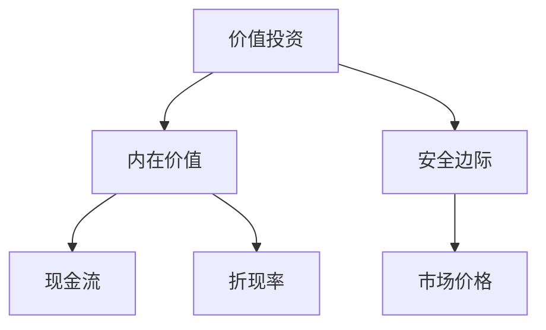
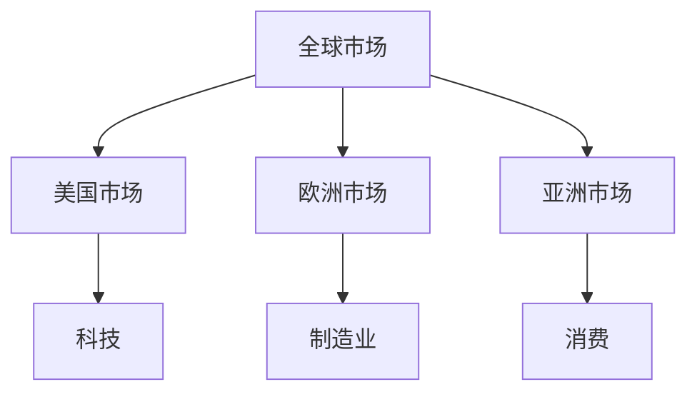

                 


# 托比亚斯·卡尔莱尔的全球价值投资：跨境寻找投资机会

## 关键词：托比亚斯·卡尔莱尔，全球价值投资，跨境投资，风险管理，资产配置，系统化投资

## 摘要：  
托比亚斯·卡尔莱尔的全球价值投资方法强调在跨境市场中寻找低估的资产，通过深入分析市场结构、行业趋势和公司基本面，构建安全边际高的投资组合。本文将从价值投资的核心理念出发，分析全球主要市场的特点，探讨跨境投资的策略，风险管理的原理，并结合系统化投资的方法，提供具体的实践指导。通过详细讲解投资模型、数学公式和代码实现，帮助读者掌握在全球化市场中寻找投资机会的方法。

---

## 第一部分：价值投资的核心理念

### 第1章：价值投资的核心理念

#### 1.1 价值投资的定义与起源

价值投资是一种以低于内在价值的价格买入优质资产的投资策略，其核心在于寻找市场中的定价错误。托比亚斯·卡尔莱尔的价值投资理念继承了本杰明·格雷厄姆和戴维·多德的理论基础，但更加注重全球市场中的机会。  

**核心概念：**  
- **内在价值：** 资产在未来现金流的现值，计算公式为：$$\text{内在价值} = \sum_{t=1}^{n} \frac{CF_t}{(1 + r)^t}$$  
  其中，\( CF_t \) 是第 \( t \) 年的现金流，\( r \) 是折现率。  

- **安全边际：** 投资价格与内在价值之间的差距，公式为：$$\text{安全边际} = \text{内在价值} - \text{市场价格}$$  

**背景介绍：**  
价值投资起源于20世纪30年代，格雷厄姆和多德提出“市场先生”的概念，强调市场情绪的波动性和投资者的理性决策。  

**概念结构图：**  


#### 1.2 价值投资的核心原则

托比亚斯·卡尔莱尔的价值投资原则包括：  
1. **买入低估资产：** 识别市场价格低于内在价值的资产。  
2. **长期持有：** 避免频繁交易，等待市场重新定价。  
3. **安全边际：** 通过安全边际降低投资风险。  

**数学模型：**  
计算内在价值和安全边际的公式如上，其中折现率 \( r \) 通常基于市场风险溢价和无风险利率。  

#### 1.3 价值投资的适用场景

价值投资适用于：  
- 经济低迷时期：市场低估优质资产。  
- 新兴市场：价格波动大，低估机会多。  

---

## 第二部分：全球市场分析

### 第2章：全球主要市场的特点

#### 2.1 美国市场的特点

美国市场是全球最大的股票市场，特点包括：  
- **市场规模：** 标普500指数涵盖美国500家大公司。  
- **行业分布：** 高科技、金融、能源等行业占比高。  

#### 2.2 欧洲市场的特点

欧洲市场以成熟经济体为主，特点包括：  
- **经济结构：** 制造业和服务业发达。  
- **政治风险：** 欧盟政策对市场影响较大。  

#### 2.3 亚洲市场的特点

亚洲市场增长迅速，特点包括：  
- **新兴市场：** 如中国、印度等。  
- **行业趋势：** 科技、消费等领域增长快。  

**系统架构图：**  


---

## 第三部分：跨境投资策略

### 第3章：跨境投资的机会与挑战

#### 3.1 跨境投资的基本概念

- **定义：** 在多个市场中配置资产，分散风险。  
- **驱动因素：** 利率差异、汇率变化、市场波动。  

#### 3.2 新兴市场与发达国家市场的对比

| 特性 | 新兴市场 | 发达国家市场 |
|------|----------|--------------|
| 增长率 | 高       | 低           |
| 风险 | 高       | 中           |
| 流动性 | 低       | 高           |

#### 3.3 跨境投资的策略选择

- **分散投资：** 将资产分配到不同国家和行业。  
- **资产配置：** 根据市场波动调整权重。  

**数学模型：**  
资产配置模型：$$ w_i = \frac{v_i}{\sum v_j}$$  
其中，\( w_i \) 是第 \( i \) 个资产的权重，\( v_i \) 是其价值。  

---

## 第四部分：风险管理与投资组合优化

### 第4章：风险管理的核心原则

#### 4.1 风险管理的基本概念

- **风险：** 资产价格波动的可能性。  
- **风险管理：** 通过策略和工具降低风险。  

#### 4.2 价值投资中的风险管理

- **安全边际：** 确保价格低于内在价值。  
- **风险厌恶：** 避免高风险资产。  

#### 4.3 跨境投资中的汇率风险与政治风险

- **汇率风险：** 外汇波动影响资产价值。  
- **政治风险：** 政策变化影响市场。  

**VaR模型：**  
$$ \text{VaR} = \sum_{i=1}^{n} w_i \times \text{资产i的波动性} $$  

---

## 第五部分：系统化投资策略

### 第5章：系统化投资策略的构建

#### 5.1 系统化投资的基本概念

- **系统化投资：** 基于数学模型的投资策略。  
- **系统化优势：** 降低人为干扰，提高效率。  

#### 5.2 系统化投资的构建步骤

1. **数据收集：** 收集全球市场的历史数据。  
2. **模型开发：** 使用Python开发预测模型。  
3. **回测：** 验证模型的有效性。  
4. **优化：** 调整参数提高收益。  

**代码实现：**  
```python
import pandas as pd
import numpy as np

# 数据收集
data = pd.read_csv('global_markets.csv')

# 模型开发
def predict_prices(data, window=30):
    return data['price'].rolling(window).mean()

# 回测
def backtest(predict, actual):
    returns = []
    for i in range(len(predict)):
        if predict[i] > actual[i]:
            returns.append(1)
        else:
            returns.append(0)
    return np.mean(returns)

# 优化
from sklearn.model_selection import GridSearchCV
param_grid = {'window': range(20, 40)}
grid_search = GridSearchCV(predict_prices, param_grid)
best_params = grid_search.best_params_
```

---

## 小结

托比亚斯·卡尔莱尔的全球价值投资方法结合了深度分析和系统化策略，为投资者提供了在全球市场中寻找机会的有效工具。通过理解价值投资的核心理念、分析全球市场特点、制定跨境投资策略、管理风险并优化投资系统，投资者可以更好地在全球市场中实现长期收益。

