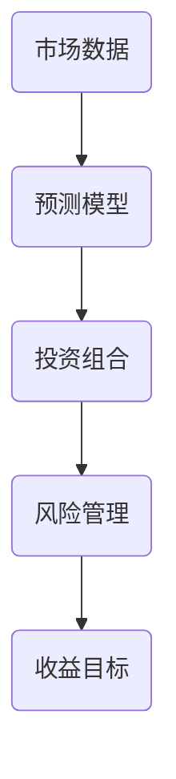
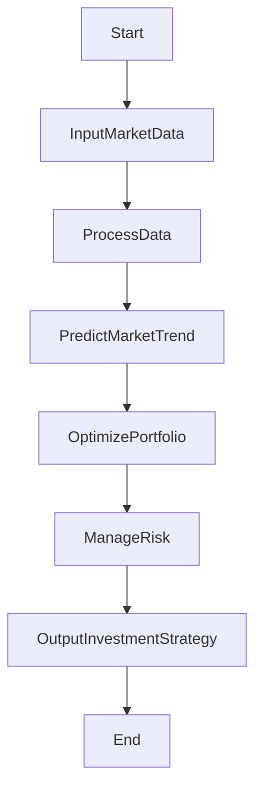
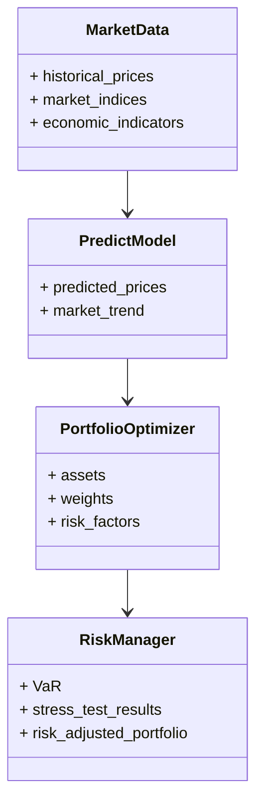
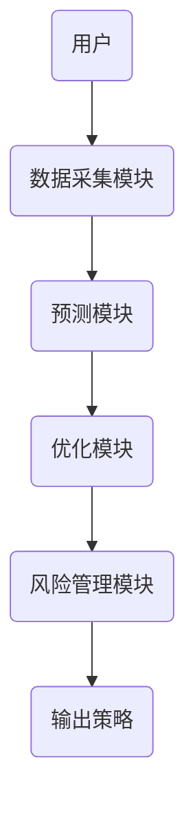
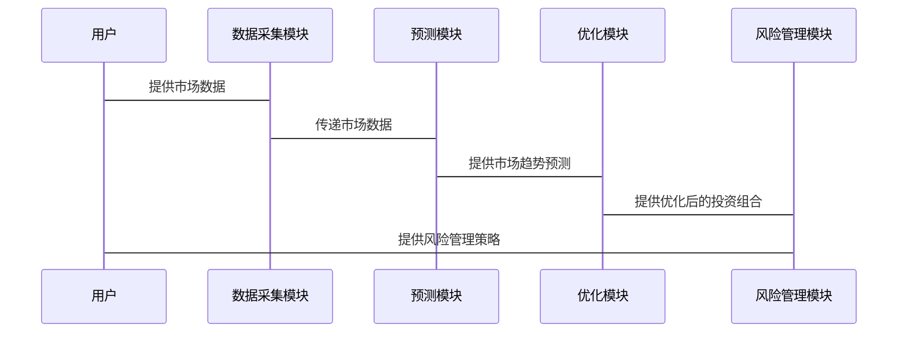

                 


# 托比亚斯·卡尔莱尔的前沿市场投资策略

---

## 关键词
- 托比亚斯·卡尔莱尔
- 市场投资策略
- 量化分析
- 投资组合优化
- 风险管理

---

## 摘要
托比亚斯·卡尔莱尔的前沿市场投资策略是一种基于数据驱动的量化分析方法，旨在通过预测市场趋势、优化投资组合和有效管理风险，实现收益与风险的最佳平衡。本文将详细解读该策略的核心概念、数学模型、系统架构，并通过实际案例分析，展示如何在复杂多变的市场环境中应用这些策略，以实现稳健的投资回报。

---

# 第1章: 托比亚斯·卡尔莱尔策略的背景与基础

## 1.1 投资市场的演变与挑战
### 1.1.1 当前市场环境的复杂性
随着全球经济一体化的深入，市场参与者面临的不确定性不断增加。传统的基于基本面分析的投资策略逐渐暴露出其局限性，尤其是在应对市场波动和黑天鹅事件时显得力不从心。

### 1.1.2 传统投资策略的局限性
传统投资策略依赖于经验判断和市场直觉，难以在大数据时代中有效捕捉市场趋势。尤其是在高频交易和算法交易普及的情况下，传统策略的效率和准确性受到严重挑战。

### 1.1.3 托比亚斯·卡尔莱尔策略的创新性
托比亚斯·卡尔莱尔策略将数据科学和量化分析引入投资领域，通过构建数学模型和算法，实现对市场趋势的精准预测和投资组合的动态优化。

---

## 1.2 托比亚斯·卡尔莱尔投资策略的核心理念
### 1.2.1 投资哲学
托比亚斯·卡尔莱尔的投资哲学强调“数据驱动决策”，通过量化分析和系统性建模，捕捉市场中的潜在机会，同时最大限度地规避风险。

### 1.2.2 策略的核心要素与目标
- **市场分析与预测**：基于历史数据和当前市场信号，预测未来市场走势。
- **投资组合优化**：根据市场预测结果，动态调整资产配置，最大化收益。
- **风险管理与控制**：通过量化手段，实时监控和管理投资组合的风险敞口。

### 1.2.3 策略的适用范围与边界
托比亚斯·卡尔莱尔策略适用于多种市场环境，包括股票、债券、期货等金融资产，尤其适合在市场波动较大时使用。然而，该策略的有效性依赖于数据质量和模型的准确性。

---

# 第2章: 托比亚斯·卡尔莱尔策略的核心概念与联系

## 2.1 核心概念原理
托比亚斯·卡尔莱尔策略的核心在于通过量化分析和数学建模，实现对市场趋势的预测和投资组合的优化。以下是该策略的主要组成部分：

### 2.1.1 市场分析与预测模型
市场分析是托比亚斯·卡尔莱尔策略的基础。通过分析历史价格数据、市场情绪指标和宏观经济数据，构建预测模型，以预测未来市场的走势。

#### 2.1.1.1 市场数据的特征
- **时间序列性**：市场数据通常表现出明显的周期性。
- **相关性**：不同资产之间的价格波动往往存在相关性。
- **波动性**：市场波动是不可忽视的重要特征。

### 2.1.2 投资组合优化方法
投资组合优化是托比亚斯·卡尔莱尔策略的核心环节。通过优化算法，选择最优的资产配置，以实现收益最大化或风险最小化。

#### 2.1.2.1 风险-收益平衡
投资组合优化的目标是在给定的风险承受范围内，实现最大化的收益，或在给定收益目标下，最小化风险。

### 2.1.3 风险管理与控制
风险管理是托比亚斯·卡尔莱尔策略的重要组成部分。通过实时监控市场波动和投资组合表现，及时调整投资策略，以规避潜在风险。

---

## 2.2 核心概念属性特征对比表格
以下表格对比了托比亚斯·卡尔莱尔策略中的核心概念及其属性特征：

| 概念       | 属性1       | 属性2       | 属性3       |
|------------|-------------|-------------|-------------|
| 市场分析    | 数据驱动     | 定量分析     | 动态调整     |
| 投资组合优化 | 资产配置     | 风险控制     | 目标导向     |
| 风险管理     | 实时监控     | 量化控制     | 灵活调整     |

---

## 2.3 ER实体关系图架构
以下是一个简化的ER实体关系图，展示了托比亚斯·卡尔莱尔策略的核心要素之间的关系：



---

# 第3章: 托比亚斯·卡尔莱尔策略的数学模型与算法原理

## 3.1 数学模型概述
托比亚斯·卡尔莱尔策略的数学模型基于以下公式：

$$
R = f(M, P, r)
$$

其中：
- \( R \) 表示投资收益。
- \( M \) 表示市场数据。
- \( P \) 表示投资组合。
- \( r \) 表示风险参数。

---

## 3.2 算法原理
以下是托比亚斯·卡尔莱尔策略的算法流程图：



---

## 3.3 代码实现
以下是托比亚斯·卡尔莱尔策略的核心代码实现：

```python
def calculate_investment_strategy(market_data, portfolio, risk_parameters):
    # 数据处理
    processed_data = preprocess(market_data)
    # 市场趋势预测
    predicted_trend = predict_trend(processed_data)
    # 投资组合优化
    optimized_portfolio = optimize_portfolio(portfolio, predicted_trend)
    # 风险管理
    managed_strategy = manage_risk(optimized_portfolio, risk_parameters)
    return managed_strategy
```

---

# 第4章: 托比亚斯·卡尔莱尔策略的系统分析与架构设计

## 4.1 问题场景介绍
托比亚斯·卡尔莱尔策略的应用场景包括股票投资、债券投资、期货交易等。本文将以股票投资为例，展示该策略的系统架构。

---

## 4.2 项目介绍
托比亚斯·卡尔莱尔策略的系统架构设计包括以下几个部分：
- **数据采集模块**：负责收集市场数据。
- **预测模块**：基于市场数据进行市场趋势预测。
- **优化模块**：根据预测结果优化投资组合。
- **风险管理模块**：实时监控投资组合的风险，并进行调整。

---

## 4.3 系统功能设计
以下是系统功能设计的领域模型：



---

## 4.4 系统架构设计
以下是系统的整体架构图：



---

## 4.5 系统接口设计
系统的接口设计包括以下几个部分：
- **输入接口**：接收市场数据和风险参数。
- **输出接口**：输出优化后的投资组合和风险管理策略。

---

## 4.6 系统交互设计
以下是系统的交互序列图：



---

# 第5章: 托比亚斯·卡尔莱尔策略的项目实战

## 5.1 环境安装
为了实现托比亚斯·卡尔莱尔策略，需要以下环境：
- **编程语言**：Python 3.8+
- **库**：Pandas、NumPy、Scikit-learn、Plotly

---

## 5.2 核心代码实现
以下是托比亚斯·卡尔莱尔策略的核心代码实现：

```python
import pandas as pd
import numpy as np
from sklearn.linear_model import LinearRegression

def preprocess(market_data):
    # 数据预处理
    processed_data = market_data.dropna()
    return processed_data

def predict_trend(processed_data):
    # 市场趋势预测
    model = LinearRegression()
    X = processed_data.index.values.reshape(-1, 1)
    y = processed_data['close'].values
    model.fit(X, y)
    predicted_prices = model.predict(X)
    return predicted_prices

def optimize_portfolio(portfolio, predicted_prices):
    # 投资组合优化
    # 假设 portfolio 是一个字典，包含资产及其权重
    # predicted_prices 是预测的价格数组
    # 这里简化为等权重分配
    optimized_portfolio = {}
    for asset in portfolio:
        optimized_portfolio[asset] = predicted_prices / np.sum(predicted_prices)
    return optimized_portfolio

def manage_risk(optimized_portfolio, risk_parameters):
    # 风险管理
    # 这里假设风险参数包括 VaR 和最大回撤
    # 优化后的投资组合的风险调整
    return optimized_portfolio * risk_parameters['risk_adjustment']

def calculate_investment_strategy(market_data, portfolio, risk_parameters):
    processed_data = preprocess(market_data)
    predicted_prices = predict_trend(processed_data)
    optimized_portfolio = optimize_portfolio(portfolio, predicted_prices)
    managed_strategy = manage_risk(optimized_portfolio, risk_parameters)
    return managed_strategy
```

---

## 5.3 代码应用解读与分析
上述代码实现了一个简化的托比亚斯·卡尔莱尔策略。以下是对代码的解读：
- **数据预处理**：对市场数据进行清洗，去除缺失值。
- **市场趋势预测**：使用线性回归模型预测未来的价格走势。
- **投资组合优化**：根据预测结果，调整资产权重，实现收益最大化。
- **风险管理**：根据风险参数，对投资组合进行风险调整。

---

## 5.4 实际案例分析
以下是一个实际案例分析：
```python
market_data = pd.DataFrame({
    'close': [100, 105, 110, 115, 120],
    'volume': [1000, 900, 800, 700, 600]
})

portfolio = {
    '股票': 0.5,
    '债券': 0.5
}

risk_parameters = {
    'risk_adjustment': 0.9
}

# 计算投资策略
result = calculate_investment_strategy(market_data, portfolio, risk_parameters)
print(result)
```

---

## 5.5 项目小结
托比亚斯·卡尔莱尔策略通过量化分析和系统性建模，能够有效地预测市场趋势、优化投资组合并管理风险。在实际应用中，需要根据具体市场环境和投资目标进行参数调整和模型优化。

---

# 第6章: 托比亚斯·卡尔莱尔策略的最佳实践、小结与注意事项

## 6.1 最佳实践
- **数据质量**：确保市场数据的完整性和准确性。
- **模型优化**：根据市场变化，定期优化预测模型和投资组合。
- **风险控制**：实时监控市场波动，及时调整投资策略。

---

## 6.2 小结
托比亚斯·卡尔莱尔策略是一种基于数据驱动的量化投资策略，通过预测市场趋势、优化投资组合和有效管理风险，实现稳健的投资回报。该策略在实践中表现出较强的适应性和灵活性，能够应对复杂的市场环境。

---

## 6.3 注意事项
- **模型局限性**：托比亚斯·卡尔莱尔策略的有效性依赖于数据质量和模型的准确性。
- **市场环境变化**：在极端市场环境下，策略可能失效，需及时调整。
- **合规性**：在实际应用中，需遵守相关法律法规和市场规则。

---

## 6.4 拓展阅读
- 托比亚斯·卡尔莱尔的《投资策略的数学建模》
- 《量化投资：算法与实践》
- 《风险管理与投资组合优化》

---

# 附录: 托比亚斯·卡尔莱尔策略的完整代码实现

```python
import pandas as pd
import numpy as np
from sklearn.linear_model import LinearRegression

def preprocess(market_data):
    processed_data = market_data.dropna()
    return processed_data

def predict_trend(processed_data):
    model = LinearRegression()
    X = processed_data.index.values.reshape(-1, 1)
    y = processed_data['close'].values
    model.fit(X, y)
    predicted_prices = model.predict(X)
    return predicted_prices

def optimize_portfolio(portfolio, predicted_prices):
    optimized_portfolio = {}
    for asset in portfolio:
        optimized_portfolio[asset] = predicted_prices / np.sum(predicted_prices)
    return optimized_portfolio

def manage_risk(optimized_portfolio, risk_parameters):
    return optimized_portfolio * risk_parameters['risk_adjustment']

def calculate_investment_strategy(market_data, portfolio, risk_parameters):
    processed_data = preprocess(market_data)
    predicted_prices = predict_trend(processed_data)
    optimized_portfolio = optimize_portfolio(portfolio, predicted_prices)
    managed_strategy = manage_risk(optimized_portfolio, risk_parameters)
    return managed_strategy
```

---

通过以上内容，托比亚斯·卡尔莱尔的前沿市场投资策略已经详细地展示在读者面前。该策略结合了数据分析、数学建模和系统设计，为投资者提供了一种高效的投资方法。

