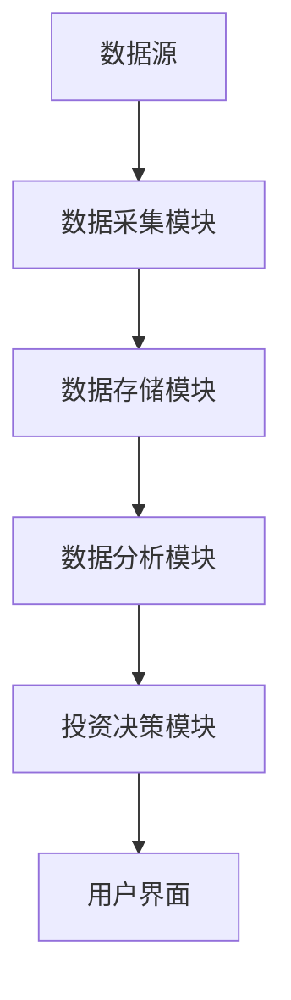

                 


# 托比亚斯·卡尔莱尔的新兴市场价值投资

> 关键词：托比亚斯·卡尔莱尔，新兴市场，价值投资，基本面分析，风险管理

> 摘要：托比亚斯·卡尔莱尔是新兴市场价值投资领域的权威，本文详细阐述其投资理念、方法和策略。通过分析其核心理论，如安全边际和市场先生，探讨如何在新兴市场中发现低估的投资机会，构建稳健的投资组合，并通过实际案例展示其投资策略的应用。

---

# 第一部分: 新兴市场价值投资的背景与核心概念

## 第1章: 新兴市场的定义与特点

### 1.1 新兴市场的定义
新兴市场是指那些经济快速发展但尚未完全工业化的国家的金融市场。这些市场通常具有较高的增长潜力，但也伴随着较高的风险。

### 1.2 新兴市场的核心特点
- 经济增速快，但波动性大。
- 市场流动性相对较低，信息透明度有限。
- 行业集中度低，竞争激烈。

### 1.3 新兴市场与发达市场的对比
| 特性 | 新兴市场 | 发达市场 |
|------|----------|----------|
| 经济增速 | 高 | 低 |
| 市场流动性 | 低 | 高 |
| 信息透明度 | 有限 | 高 |

---

## 第2章: 价值投资的核心概念

### 2.1 价值投资的定义
价值投资是一种以低于其内在价值的价格购买优质股票的投资策略，强调长期持有和安全边际。

### 2.2 价值投资的核心原则
- 购买价格低于内在价值。
- 选择具有强大护城河的公司。
- 长期持有，避免频繁交易。

### 2.3 安全边际的定义与作用
安全边际是投资价格与内在价值之间的差异，确保在市场波动中仍能获得正收益。

### 2.4 市场先生的概念
市场先生是格雷厄姆提出的概念，指市场情绪的波动性。投资者应利用市场先生的疯狂和恐惧来寻找低估和高估的机会。

---

# 第二部分: 新兴市场价值投资的核心原理

## 第3章: 基本面分析方法

### 3.1 基本面分析的核心要素
- 财务报表分析（收入、利润、现金流）。
- 行业分析（竞争格局、增长潜力）。
- 宏观经济因素（GDP增速、通胀率）。

### 3.2 财务指标分析
- 市盈率（P/E）：$$ P/E = \frac{\text{市场价格}}{\text{每股收益}} $$
- 市净率（P/B）：$$ P/B = \frac{\text{市场价格}}{\text{每股净资产}} $$
- 净资产收益率（ROE）：$$ ROE = \frac{\text{净利润}}{\text{净资产}} $$

### 3.3 现金流折现模型（DCF）
DCF模型用于估算公司内在价值，公式如下：
$$ \text{企业价值} = \sum_{t=1}^{n} \frac{\text{现金流}}{(1 + r)^t} + \frac{\text{残值}}{(1 + r)^n} $$
其中，\( r \) 是折现率。

---

## 第4章: 投资组合管理

### 4.1 投资组合构建的原则
- 分散投资以降低风险。
- 选择具有长期竞争优势的公司。
- 定期调整以适应市场变化。

### 4.2 投资组合的调整策略
- 定期重新评估持仓公司。
- 根据市场变化调整权重。
- 确保投资组合的分散性。

---

# 第三部分: 新兴市场价值投资的风险管理

## 第5章: 新兴市场投资风险

### 5.1 新兴市场的主要风险
- 政治风险：政策变化和政权更迭。
- 经济风险：通货膨胀和货币贬值。
- 市场风险：市场波动性和流动性不足。

### 5.2 风险管理的策略
- 设置止损点。
- 保持足够的流动性。
- 选择具有强大财务状况的公司。

---

## 第6章: 投资决策系统的架构设计

### 6.1 系统架构概述
- 数据采集模块：收集公司财务数据和市场信息。
- 数据分析模块：进行基本面分析和估值。
- 投资决策模块：生成投资建议。

### 6.2 系统功能设计
- 数据预处理：清洗和整理数据。
- 模型训练：使用机器学习算法优化估值模型。
- 界面展示：可视化投资机会和风险。

### 6.3 系统架构图


---

## 第7章: 项目实战与案例分析

### 7.1 实战环境安装
- 数据工具：Excel或Python（Pandas库）。
- 分析工具：Excel或Python（Scikit-learn库）。

### 7.2 核心代码实现
```python
import pandas as pd

def calculate_value(ticker):
    df = pd.read_csv(f'{ticker}.csv')
    pe = df['Price'] / df['Earnings']
    pb = df['Price'] / df['Book Value']
    return pe, pb

ticker = 'AAPL'
pe, pb = calculate_value(ticker)
print(f'PE: {pe}, PB: {pb}')
```

### 7.3 案例分析
以某新兴市场公司为例，计算其市盈率和市净率，并与行业平均水平对比，判断其是否低估。

---

## 第8章: 最佳实践与小结

### 8.1 最佳实践
- 持续学习和更新知识。
- 保持对市场的敏感性。
- 风险管理优先于收益追求。

### 8.2 小结
托比亚斯·卡尔莱尔的新兴市场价值投资策略强调基本面分析和安全边际，帮助投资者在波动的新兴市场中发现低估机会，构建稳健的投资组合。

---

## 第9章: 注意事项与拓展阅读

### 9.1 注意事项
- 避免过度依赖单一指标。
- 定期回顾和调整投资策略。
- 保持理性，避免情绪化决策。

### 9.2 拓展阅读
- 格雷厄姆的《聪明的投资者》。
- 巴菲特的股东大会演讲。
- 现代投资组合理论（MPT）。

---

通过以上结构和内容的分析，我们可以清晰地看到托比亚斯·卡尔莱尔的新兴市场价值投资策略的核心思想和实际应用。

