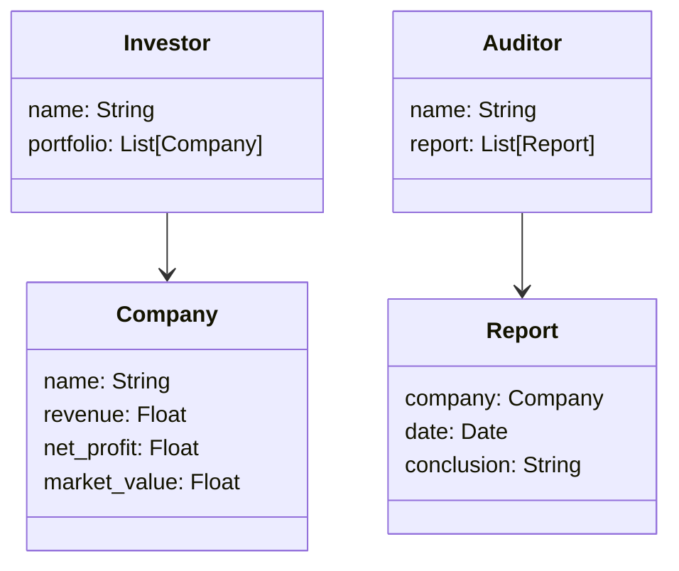
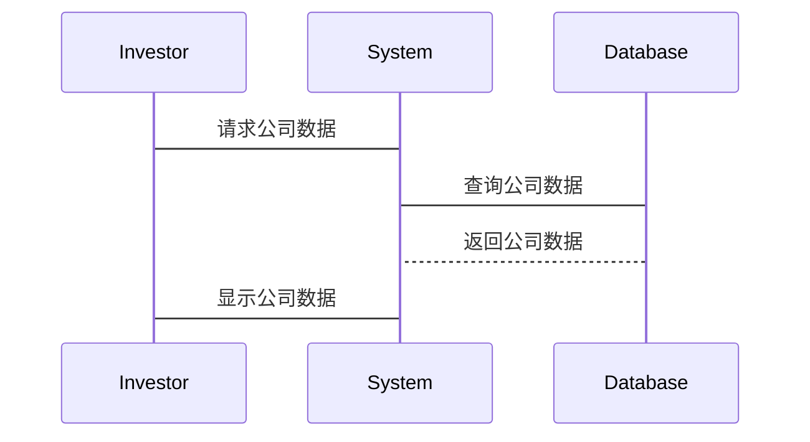

                 


# 托马斯·罗尼的价值投资审计：全面评估公司价值

> 关键词：价值投资审计，公司价值评估，托马斯·罗尼，财务报表分析，现金流折现模型

> 摘要：托马斯·罗尼的价值投资审计方法为投资者提供了一种系统化的公司价值评估工具。本文将详细探讨这一方法的核心概念、算法原理、系统设计及实际应用，帮助读者全面理解如何通过审计流程准确评估公司价值。

---

# 第一部分：价值投资审计的背景与核心概念

## 第1章：价值投资审计的背景与意义

### 1.1 价值投资的基本概念

#### 1.1.1 价值投资的定义与特点
价值投资是一种以公司基本面分析为基础的投资策略，强调以低于公允价值的价格购买优质资产。其核心在于识别市场低估的公司，长期持有，等待价值回归。托马斯·罗尼的价值投资理论强调对公司财务状况的深入分析，尤其是对现金流和内在价值的评估。

#### 1.1.2 价值投资与其它投资策略的对比
- **趋势投资**：依赖市场趋势，注重短期价格波动。
- **成长投资**：关注公司未来增长潜力，而非当前估值。
- **价值投资**：专注于公司当前的低估状态，强调安全边际。

#### 1.1.3 价值投资审计的重要性与作用
价值投资审计通过系统化的方法评估公司的真实价值，帮助投资者识别市场低估的公司，降低投资风险，提高投资收益。

---

### 1.2 托马斯·罗尼的价值投资理论

#### 1.2.1 托马斯·罗尼的生平简介
托马斯·罗尼（Thomas Rوني）是价值投资领域的先驱，其理论奠定了现代价值投资审计的基础。他强调对公司财务报表的深入分析，尤其是对现金流的关注。

#### 1.2.2 罗尼价值投资的核心思想
罗尼认为，公司的内在价值是其未来现金流的现值。投资者应通过分析公司财务报表，计算其内在价值，并与市场价格进行对比，寻找低估的投资机会。

#### 1.2.3 罗尼理论的现代应用与演变
随着金融市场的变化，价值投资审计的方法不断完善，但其核心思想——基于现金流的内在价值评估——始终是其精髓。

---

### 1.3 价值投资审计的定义与范围

#### 1.3.1 审计的定义与基本概念
审计是对公司财务报表的真实性和准确性进行验证的过程。价值投资审计则是通过审计方法，评估公司的真实价值。

#### 1.3.2 价值投资审计的核心目标
- 评估公司财务报表的真实性和准确性。
- 计算公司内在价值，判断其是否被市场低估。
- 识别投资机会，降低投资风险。

#### 1.3.3 审计的范围与边界
- 财务报表分析：包括资产负债表、利润表、现金流量表。
- 竞争力与市场地位评估。
- 财务指标分析与估值模型的应用。

---

## 第2章：公司价值评估的核心要素

### 2.1 财务报表分析的基础知识

#### 2.1.1 资产负债表的核心内容
- 资产：包括流动资产和非流动资产。
- 负债：包括流动负债和非流动负债。
- 所有者权益：资产减去负债的余额。

#### 2.1.2 利润表的关键指标
- 营业收入：公司主营业务收入。
- 净利润：公司净利润，反映公司盈利能力。

#### 2.1.3 现金流量表的重要性
现金流量表反映了公司经营活动、投资活动和筹资活动的现金流情况，是评估公司财务健康状况的重要依据。

---

### 2.2 财务指标分析与公司价值评估

#### 2.2.1 常用财务指标的计算方法
- **市盈率（P/E）**：股价除以每股收益。
- **市净率（P/B）**：股价除以每股净资产。
- **股息率**：每股股息除以股价。

#### 2.2.2 财务指标与公司价值的关系
- 市盈率：反映市场对公司盈利能力的预期。
- 市净率：反映市场对公司资产价值的评估。
- 股息率：反映公司的分红能力。

#### 2.2.3 财务指标的行业差异性分析
不同行业的财务指标差异较大，需结合行业特点进行分析。

---

### 2.3 竞争力与市场地位的评估

#### 2.3.1 行业分析与市场定位
- 行业分析：了解公司所在行业的竞争格局和市场容量。
- 市场定位：评估公司在行业中的地位和竞争优势。

#### 2.3.2 核心竞争力的识别
- 技术优势：公司是否拥有独特的技术或专利。
- 品牌优势：公司在市场上的品牌影响力。
- 成本优势：公司是否具有更低的生产成本。

#### 2.3.3 市场风险与机会评估
- 行业周期：行业所处的周期阶段。
- 市场风险：行业面临的政策、经济等风险。
- 市场机会：行业的发展前景。

---

## 第3章：价值投资审计的核心方法

### 3.1 财务报表分析方法

#### 3.1.1 资产负债表分析
- 资产结构：流动资产与非流动资产的比例。
- 负债结构：流动负债与非流动负债的比例。
- 负债率：负债总额与资产总额的比率。

#### 3.1.2 利润表分析
- 收入构成：主营业务收入与其它收入的比例。
- 利润构成：净利润的来源及占比。
- 盈利能力：净利润率、毛利率等指标。

#### 3.1.3 现金流量表分析
- 经营活动现金流：公司经营活动产生的现金流。
- 投资活动现金流：公司投资活动产生的现金流。
- 筹资活动现金流：公司筹资活动产生的现金流。

---

### 3.2 现金流折现模型（DCF）的应用

#### 3.2.1 DCF模型的基本原理
现金流折现模型（Discounted Cash Flow, DCF）通过将公司未来现金流折现，计算其内在价值。公式如下：

$$
\text{内在价值} = \sum_{t=1}^{n} \frac{\text{现金流}_t}{(1 + r)^t} + \frac{\text{残值}}{(1 + r)^n}
$$

其中，\( r \) 为折现率，通常使用加权平均资本成本（WACC）。

#### 3.2.2 无杠杆自由现金流的计算
无杠杆自由现金流（Free Cash Flow to Equity, FCFF）的计算公式为：

$$
\text{FCFF} = \text{营业收入} - \text{资本支出} - \text{税后利息支出}
$$

---

### 3.3 相对估值法与绝对估值法

#### 3.3.1 相对估值法的定义与应用
相对估值法通过比较公司与可比公司的估值指标，判断公司是否被低估。常用指标包括市盈率（P/E）、市净率（P/B）等。

#### 3.3.2 绝对估值法的定义与应用
绝对估值法通过计算公司内在价值，判断其是否被低估。常用方法包括现金流折现模型（DCF）和股息折扣模型（DDM）。

#### 3.3.3 两种方法的优缺点对比
- **相对估值法**：简单易用，但依赖可比公司数据。
- **绝对估值法**：准确性强，但计算复杂。

---

### 3.4 本章小结
价值投资审计的核心方法包括财务报表分析、现金流折现模型和相对估值法。通过这些方法，投资者可以准确评估公司的内在价值，判断其是否被低估。

---

# 第4章：价值投资审计的流程与步骤

## 4.1 审计流程的总体框架

### 4.1.1 审计目标的确定
- 确定审计的目标，例如评估公司的内在价值。
- 明确审计的范围，例如分析过去5年的财务数据。

### 4.1.2 审计范围的界定
- 确定审计的主体：公司本身。
- 确定审计的时间范围：过去5年的财务数据。

### 4.1.3 审计计划的制定
- 制定审计计划，包括时间安排、人员分工等。

---

## 4.2 具体审计步骤的实施

### 4.2.1 财务数据的收集与整理
- 收集公司的财务报表：包括资产负债表、利润表、现金流量表。
- 整理数据：将数据整理成易于分析的格式。

### 4.2.2 财务指标的计算与分析
- 计算财务指标：市盈率、市净率、股息率等。
- 分析财务指标：判断公司是否被低估。

### 4.2.3 竞争力与市场地位的评估
- 进行行业分析：了解公司所处的行业环境。
- 评估公司的核心竞争力。

---

## 4.3 审计结果的综合分析

### 4.3.1 数据分析结果的整合
- 综合分析财务指标和行业分析结果，得出审计结论。

### 4.3.2 审计结论的形成
- 判断公司是否被低估，是否值得投资。

### 4.3.3 审计报告的编写
- 编写审计报告，详细说明审计过程和结论。

---

## 4.4 本章小结
价值投资审计的流程包括目标确定、数据收集、指标计算、行业分析和结果整合。通过这些步骤，投资者可以系统地评估公司的价值。

---

# 第5章：价值投资审计的数学模型与公式

## 5.1 现金流折现模型（DCF）的数学公式

### 5.1.1 无杠杆自由现金流的计算公式
$$
\text{FCFF} = \text{营业收入} - \text{资本支出} - \text{税后利息支出}
$$

### 5.1.2 加权平均资本成本（WACC）的计算公式
$$
\text{WACC} = \left( \frac{\text{债务}}{\text{总资本}} \right) \times \text{债务成本} \times (1 - \text{税率}) + \left( \frac{\text{股权}}{\text{总资本}} \right) \times \text{股权成本}
$$

### 5.1.3 公司价值的计算公式
$$
\text{公司价值} = \sum_{t=1}^{n} \frac{\text{现金流}_t}{(1 + \text{WACC})^t} + \frac{\text{残值}}{(1 + \text{WACC})^n}
$$

---

## 5.2 相对估值法的数学公式

### 5.2.1 市盈率（P/E）的计算公式
$$
\text{P/E} = \frac{\text{股价}}{\text{每股收益}}
$$

### 5.2.2 市净率（P/B）的计算公式
$$
\text{P/B} = \frac{\text{股价}}{\text{每股净资产}}
$$

### 5.2.3 市销率（P/S）的计算公式
$$
\text{P/S} = \frac{\text{股价}}{\text{每股收入}}
$$

---

## 5.3 其他常用财务指标的公式

### 5.3.1 净利润率
$$
\text{净利润率} = \frac{\text{净利润}}{\text{营业收入}} \times 100\%
$$

### 5.3.2 毛利率
$$
\text{毛利率} = \frac{\text{营业收入} - \text{营业成本}}{\text{营业收入}} \times 100\%
$$

### 5.3.3 资产周转率
$$
\text{资产周转率} = \frac{\text{营业收入}}{\text{平均总资产}}
$$

---

# 第6章：价值投资审计的系统设计与实现

## 6.1 系统功能设计

### 6.1.1 领域模型（Mermaid 类图）


---

### 6.1.2 系统架构设计（Mermaid 架构图）
```mermaid
architectural {
    title Value Investment Audit System
    UserInterface --> BusinessLogic
    BusinessLogic --> Database
    BusinessLogic --> ExternalAPI
    ExternalAPI --> ThirdPartyServices
}
```

---

## 6.2 系统实现细节

### 6.2.1 环境安装
- **Python**：安装 Python 3.9 或更高版本。
- **库的安装**：安装 `pandas`、`numpy`、`scipy` 等库。

### 6.2.2 核心代码实现

#### 6.2.2.1 财务数据读取
```python
import pandas as pd

# 读取财务数据
df = pd.read_csv('financial_data.csv')
```

#### 6.2.2.2 财务指标计算
```python
# 计算市盈率
def calculate_pe_ratio(stock_price, earnings_per_share):
    return stock_price / earnings_per_share

# 计算市净率
def calculate_pb_ratio(stock_price, book_value_per_share):
    return stock_price / book_value_per_share
```

#### 6.2.2.3 现金流折现模型实现
```python
import numpy as np

def discounted_cash_flow(cash_flows, discount_rate):
    return np.npv(discount_rate, cash_flows)
```

---

## 6.3 系统交互设计（Mermaid 序列图）


---

## 6.4 本章小结
本章详细介绍了价值投资审计系统的功能设计、架构设计和实现细节，展示了如何通过系统化的方法实现公司价值评估。

---

# 第7章：价值投资审计的项目实战

## 7.1 项目背景与目标

### 7.1.1 项目背景
假设我们是一家投资公司，希望通过价值投资审计的方法，评估一家公司是否值得投资。

### 7.1.2 项目目标
- 计算公司的内在价值。
- 判断公司是否被低估。

---

## 7.2 项目实施过程

### 7.2.1 数据收集
收集公司的财务报表和行业数据。

### 7.2.2 数据分析
- 计算财务指标。
- 构建现金流折现模型。

### 7.2.3 结果分析
- 比较市场价格与内在价值。
- 判断是否投资。

---

## 7.3 项目案例分析

### 7.3.1 案例选择
假设我们选择一家制造业公司作为案例。

### 7.3.2 数据分析
- 计算市盈率、市净率等指标。
- 构建现金流折现模型，计算内在价值。

### 7.3.3 结果解读
- 如果市场价格低于内在价值，说明公司被低估，值得投资。

---

## 7.4 本章小结
通过实际案例分析，展示了价值投资审计方法的应用，帮助投资者识别投资机会。

---

# 第8章：价值投资审计的最佳实践与注意事项

## 8.1 最佳实践

### 8.1.1 数据收集与清洗
- 确保数据的准确性和完整性。
- 处理缺失值和异常值。

### 8.1.2 模型选择与优化
- 根据实际情况选择合适的估值模型。
- 优化模型参数，提高计算精度。

### 8.1.3 结果验证与反馈
- 验证模型结果的合理性。
- 根据市场变化及时调整模型。

---

## 8.2 注意事项

### 8.2.1 数据的准确性
- 数据来源要可靠。
- 数据处理要细致。

### 8.2.2 模型的适用性
- 模型适用于特定的行业和市场环境。
- 需要根据实际情况调整模型参数。

### 8.2.3 投资风险
- 价值投资审计只能降低风险，不能消除风险。
- 投资者需保持谨慎，避免过度依赖模型。

---

## 8.3 本章小结
价值投资审计需要结合实际情况，灵活运用各种方法，才能取得最佳效果。

---

# 第9章：总结与展望

## 9.1 本章总结
托马斯·罗尼的价值投资审计方法为投资者提供了一种系统化的公司价值评估工具。通过财务报表分析、现金流折现模型和相对估值法，投资者可以准确评估公司的内在价值，判断其是否被低估。

---

## 9.2 未来展望
随着人工智能和大数据技术的发展，价值投资审计的方法将更加智能化和精准化。投资者可以利用新技术，进一步提高评估效率和准确性。

---

# 结语
托马斯·罗尼的价值投资审计方法是一种科学的投资工具，帮助投资者在复杂多变的市场中找到低估的投资机会。通过系统化的方法和实际案例分析，投资者可以更好地理解和应用这一方法，实现长期稳健的投资收益。

---

