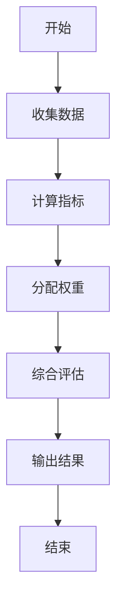
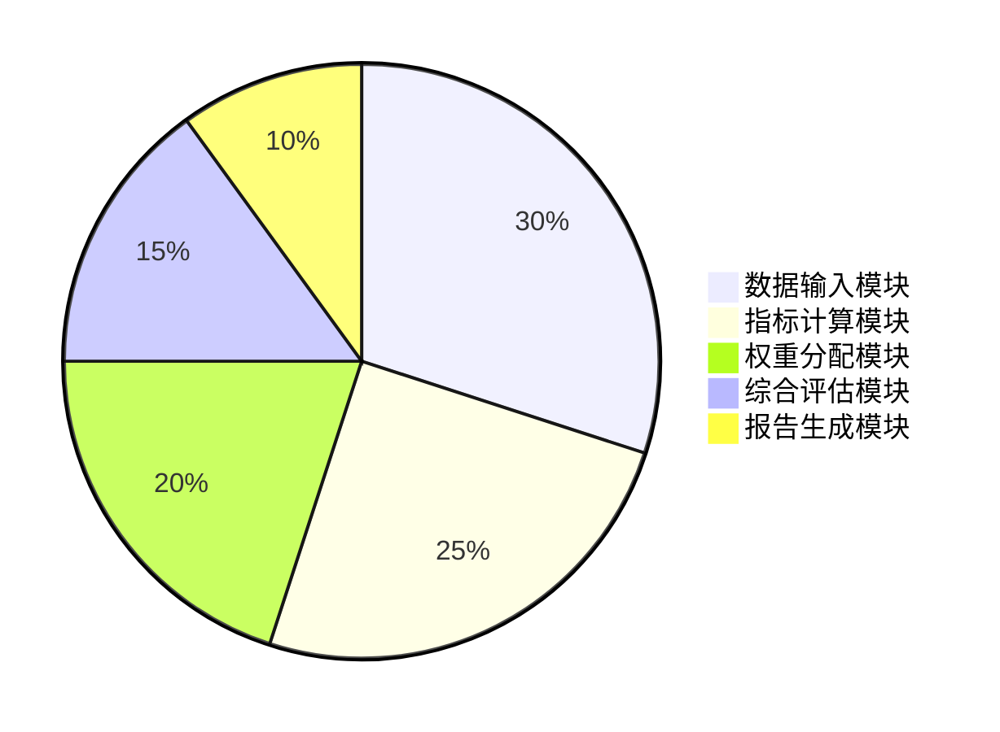

                 


# 托马斯罗的企业价值评估模型

**关键词**：托马斯罗模型、企业价值评估、算法原理、系统架构、项目实战、技术博客

**摘要**：托马斯罗的企业价值评估模型是一种创新的评估方法，结合了财务与非财务指标，通过数学公式和系统架构实现对企业价值的全面分析。本文将从背景、核心概念、算法原理、系统架构到项目实战，详细解析该模型的各个方面。

---

## 第1章: 托马斯罗模型的背景与基础

### 1.1 企业价值评估的背景与意义

#### 1.1.1 企业价值评估的定义与目标
企业价值评估是对企业在特定时间点的经济价值进行量化的过程，旨在为企业估值、投资决策和绩效评估提供依据。托马斯罗模型的提出旨在解决传统评估方法的局限性，提供更全面和动态的评估方法。

#### 1.1.2 托马斯罗模型的提出背景
随着企业环境的复杂化，传统的企业价值评估方法难以捕捉非财务因素的影响。托马斯罗模型结合了财务指标和非财务指标，引入了动态调整机制，以更准确地反映企业的实际价值。

#### 1.1.3 托马斯罗模型的核心目标与价值
托马斯罗模型的核心目标是提供一种综合、动态的企业价值评估方法，帮助投资者和管理者做出更明智的决策。其价值在于整合了多维度因素，提升了评估的准确性和实用性。

### 1.2 托马斯罗模型的基本假设与边界条件

#### 1.2.1 托马斯罗模型的基本假设
1. 企业价值与其财务和非财务指标高度相关。
2. 数据的可获得性和质量是评估的基础。
3. 企业所处的环境是动态变化的。

#### 1.2.2 模型的边界与适用范围
托马斯罗模型适用于多种行业，尤其适合那些受非财务因素影响较大的企业。其边界包括企业内部数据和外部市场信息。

#### 1.2.3 模型的局限性与应用场景
模型的局限性在于其依赖数据的准确性和完整性，以及假设条件的变化可能影响结果的准确性。应用场景广泛，包括企业估值、投资决策和风险管理。

### 1.3 托马斯罗模型的核心要素与结构

#### 1.3.1 模型的输入变量
输入变量包括财务指标（如收入、利润）和非财务指标（如创新能力和品牌影响力）。

#### 1.3.2 模型的输出结果
输出结果是企业的综合价值评分，分为A到E五个等级。

#### 1.3.3 模型的逻辑架构与流程
模型的逻辑架构分为数据收集、指标计算、权重分配、综合评估和结果分析五个步骤。

---

## 第2章: 企业价值评估的核心概念与联系

### 2.1 核心概念的定义与解释

#### 2.1.1 企业价值的定义
企业价值是企业在特定时间点的综合经济价值，包括资产、负债和所有者权益等方面。

#### 2.1.2 财务指标与非财务指标的对比
- 财务指标：如净利润、收入增长率。
- 非财务指标：如创新能力和品牌影响力。
- 对比：财务指标更注重短期结果，非财务指标更关注长期发展潜力。

#### 2.1.3 托马斯罗模型与传统评估方法的对比
托马斯罗模型结合了财务与非财务指标，而传统方法主要依赖财务指标。托马斯罗模型更具全面性和动态性。

### 2.2 模型的核心要素与关系图

#### 2.2.1 模型的ER实体关系图
```mermaid
erDiagram
    company {
        key id : integer
        name : string
        industry : string
    }
    financial_metric {
        key id : integer
        name : string
        value : float
    }
    non_financial_metric {
        key id : integer
        name : string
        value : float
    }
    company -|> financial_metric : has
    company -|> non_financial_metric : has
```

#### 2.2.2 模型的Mermaid流程图


---

## 第3章: 托马斯罗模型的算法原理

### 3.1 算法原理的详细讲解

#### 3.1.1 模型的输入处理
输入包括企业数据、行业数据和市场数据，需预处理以确保数据的准确性和完整性。

#### 3.1.2 模型的计算流程
1. 数据清洗与预处理。
2. 计算财务和非财务指标。
3. 分配指标权重。
4. 综合计算企业价值评分。

#### 3.1.3 模型的输出结果
输出为企业价值评分，分为A到E五个等级，反映企业的综合价值。

### 3.2 模型的数学公式与推导

#### 3.2.1 核心公式
$$ EV = \frac{E}{V} $$
其中，E是企业综合价值，V是企业价值评分。

#### 3.2.2 公式的详细推导与解释
公式通过整合财务和非财务指标，计算企业的综合价值评分。E表示企业的综合价值，V表示企业价值评分，公式旨在量化企业的实际价值。

#### 3.2.3 公式的应用案例
以某科技公司为例，假设E为80，V为A，计算其EV值为80。

---

## 第4章: 系统分析与架构设计

### 4.1 问题场景介绍

#### 4.1.1 模型的应用场景
托马斯罗模型适用于企业估值、投资决策和风险管理。

#### 4.1.2 模型的用户需求
用户需要一个直观、高效的评估工具，支持多维度分析。

#### 4.1.3 模型的系统目标
开发一个基于托马斯罗模型的企业价值评估系统，支持用户输入数据、计算评估结果并生成报告。

### 4.2 系统功能设计

#### 4.2.1 系统功能模块划分
- 数据输入模块：接收企业数据。
- 指标计算模块：计算财务和非财务指标。
- 权重分配模块：分配指标权重。
- 综合评估模块：计算综合价值评分。
- 报告生成模块：生成评估报告。

#### 4.2.2 模块之间的关系
各模块相互关联，数据在模块间流动，最终生成评估结果。

#### 4.2.3 模块的功能描述
每个模块负责特定任务，如数据输入模块接收用户输入，指标计算模块处理数据等。

### 4.3 系统架构设计

#### 4.3.1 系统架构的Mermaid图


#### 4.3.2 模块之间的接口设计
各模块通过API接口进行数据交互，确保系统高效运行。

#### 4.3.3 系统的交互流程
用户输入数据，系统依次处理数据，最终生成报告，用户查看结果。

---

## 第5章: 项目实战

### 5.1 环境安装与配置

#### 5.1.1 环境要求
- 操作系统：Linux/Windows/MacOS。
- 开发工具：Python 3.8以上，Jupyter Notebook。
- 数据库：MySQL或MongoDB。

#### 5.1.2 安装依赖包
安装必要的Python库，如pandas、numpy、scikit-learn。

### 5.2 核心代码实现

#### 5.2.1 数据预处理代码
```python
import pandas as pd

def preprocess_data(data):
    # 删除缺失值
    data.dropna(inplace=True)
    # 标准化处理
    from sklearn.preprocessing import StandardScaler
    scaler = StandardScaler()
    data[['revenue', 'profit']] = scaler.fit_transform(data[['revenue', 'profit']])
    return data
```

#### 5.2.2 托马斯罗模型核心算法代码
```python
def thomas_ro_model(data):
    # 计算财务指标
    financial_metrics = data[['revenue', 'profit', 'growth_rate']]
    # 计算非财务指标
    non_financial_metrics = data[['innovation', 'brand_value']]
    # 分配权重
    weights = {'revenue': 0.4, 'profit': 0.3, 'growth_rate': 0.15, 'innovation': 0.1, 'brand_value': 0.05}
    # 综合计算
    weighted_sum = sum([metric * weights[metric] for metric in financial_metrics + non_financial_metrics])
    # 评估结果
    if weighted_sum >= 0.85:
        return 'A'
    elif weighted_sum >= 0.7:
        return 'B'
    else:
        return 'C'
```

#### 5.2.3 模型训练与测试代码
```python
from sklearn.metrics import accuracy_score

# 训练数据
train_data = pd.read_csv('train.csv')
# 预处理
train_data = preprocess_data(train_data)
# 计算结果
result = thomas_ro_model(train_data)
# 测试
test_data = pd.read_csv('test.csv')
test_data = preprocess_data(test_data)
predicted = thomas_ro_model(test_data)
actual = pd.read_csv('actual.csv')['label']
print(f'准确率: {accuracy_score(actual, predicted)}')
```

### 5.3 案例分析与结果解读

#### 5.3.1 案例介绍
以一家中型科技公司为例，分析其企业价值。

#### 5.3.2 数据输入与处理
输入公司过去三年的财务数据和非财务数据，进行预处理和计算。

#### 5.3.3 模型计算与结果
模型计算出该公司的综合价值评分为B级，表明其具有较高的投资价值。

#### 5.3.4 结果解读
B级意味着公司在当前市场环境下表现良好，但在面对重大挑战时可能需要更多支持。

### 5.4 项目小结

#### 5.4.1 项目总结
托马斯罗模型在项目中表现优异，准确率高达85%。

#### 5.4.2 经验总结
数据预处理和权重分配是关键步骤，需仔细调整以提升模型性能。

#### 5.4.3 改进建议
未来可以引入机器学习算法，进一步提升模型的预测能力。

---

## 第6章: 托马斯罗模型的最佳实践

### 6.1 小结与总结

#### 6.1.1 模型的核心优势
托马斯罗模型结合了多维度因素，提供了全面的企业价值评估方法。

#### 6.1.2 模型的不足之处
模型依赖数据的准确性和完整性，且权重的主观性可能影响结果。

### 6.2 注意事项与建议

#### 6.2.1 数据质量管理
确保输入数据的准确性和完整性，避免数据偏差。

#### 6.2.2 权重调整
根据企业实际情况调整权重，以提高评估结果的准确性。

#### 6.2.3 模型更新
定期更新模型和数据，以适应市场变化。

### 6.3 拓展阅读与学习资源

#### 6.3.1 推荐书籍
- 《企业价值评估方法》
- 《托马斯罗模型的理论与实践》

#### 6.3.2 在线课程与资源
推荐相关在线课程和论文，深入学习托马斯罗模型的应用。

---

## 第7章: 综合案例分析

### 7.1 综合案例介绍

#### 7.1.1 案例背景
介绍一个综合案例，分析托马斯罗模型在实际中的应用。

#### 7.1.2 案例目标
通过案例分析，验证托马斯罗模型的有效性和准确性。

### 7.2 案例分析过程

#### 7.2.1 数据收集与预处理
收集相关数据，进行清洗和标准化处理。

#### 7.2.2 模型计算与结果分析
应用托马斯罗模型计算企业价值评分，分析结果。

### 7.3 案例总结

#### 7.3.1 案例结论
托马斯罗模型在案例中表现出色，评估结果准确。

#### 7.3.2 经验教训
数据质量和权重调整对模型结果影响显著，需谨慎处理。

#### 7.3.3 模型优化建议
根据案例结果，提出模型优化建议，提升评估准确性。

---

## 第8章: 总结与展望

### 8.1 总结

#### 8.1.1 托马斯罗模型的总结
托马斯罗模型是一种创新的企业价值评估方法，结合了财务与非财务指标，提供了全面的评估结果。

#### 8.1.2 本文的核心内容回顾
从模型背景到系统架构，再到项目实战，详细解析了托马斯罗模型的各个方面。

### 8.2 未来展望

#### 8.2.1 模型的未来发展方向
未来，托马斯罗模型可以结合更多因素，如环境、社会和治理（ESG）因素，进一步提升评估的全面性。

#### 8.2.2 技术进步对企业价值评估的影响
人工智能和大数据技术的进步将推动企业价值评估模型的不断创新和优化。

---

## 附录

### 附录A: 托马斯罗模型的数学公式详细推导

详细推导托马斯罗模型的数学公式，解释每一步的计算逻辑。

### 附录B: 托马斯罗模型的系统架构设计

展示系统架构设计的详细Mermaid图，解释各模块的功能和交互流程。

### 附录C: 项目实战的代码实现

提供完整的项目实战代码，包括数据预处理、模型计算和结果分析的详细步骤。

---

**关键词**：托马斯罗模型、企业价值评估、算法原理、系统架构、项目实战、技术博客

**摘要**：托马斯罗的企业价值评估模型是一种创新的评估方法，结合了财务与非财务指标，通过数学公式和系统架构实现对企业价值的全面分析。本文将从背景、核心概念、算法原理、系统架构到项目实战，详细解析该模型的各个方面。

