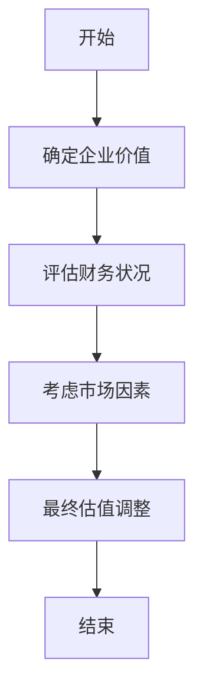
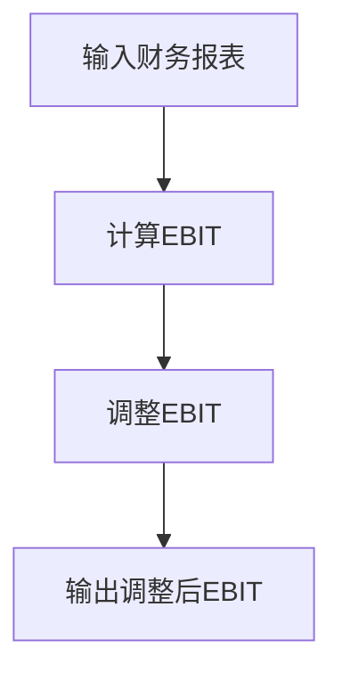
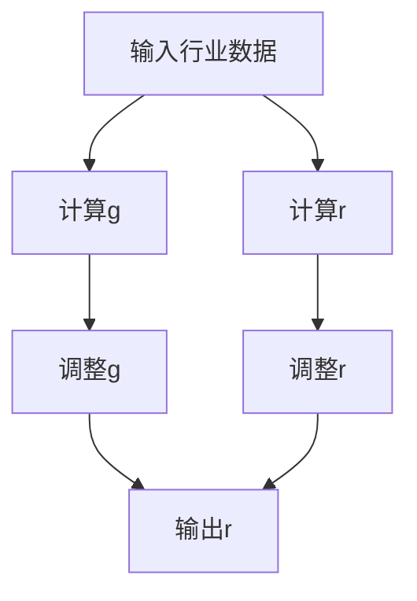

                 


# 托马斯罗的公司估值技巧

> 关键词：公司估值，托马斯·罗，估值方法，财务分析，企业价值

> 摘要：本文深入探讨了托马斯·罗的公司估值技巧，从理论基础到实际应用，结合数学模型和系统架构，全面解析了该估值方法的原理和步骤，帮助读者掌握如何科学地进行公司估值。

---

# 第一部分: 公司估值基础

## 第1章: 公司估值的基本概念

### 1.1 什么是公司估值
#### 1.1.1 公司估值的定义
公司估值是通过对企业的财务状况、市场地位、盈利能力等多方面因素的分析，确定其整体或股权的市场价值的过程。它是企业融资、并购、上市等重要决策的基础。

#### 1.1.2 公司估值的重要性
- 为企业融资提供依据。
- 帮助投资者做出投资决策。
- 评估企业并购价值。
- 优化企业内部管理。

#### 1.1.3 公司估值的边界与外延
- 边界：仅考虑企业的财务和市场因素，不涉及主观判断。
- 外延：包括企业未来盈利能力、市场环境变化等动态因素。

### 1.2 公司估值的核心要素
#### 1.2.1 财务指标分析
- 主要指标：EBIT（息税折旧前利润）、净利润、自由现金流。
- 指标作用：评估企业的盈利能力和现金流状况。

#### 1.2.2 市场分析与竞争环境
- 行业分析：市场规模、增长潜力、竞争格局。
- 宏观经济：政策、经济周期、利率变化。

#### 1.2.3 管理团队与企业战略
- 管理团队：经验、能力、稳定性。
- 企业战略：长期目标、发展方向、竞争优势。

---

## 第2章: 托马斯·罗的估值方法概述

### 2.1 托马斯·罗估值法的核心原理
#### 2.1.1 托马斯·罗估值法的理论基础
托马斯·罗的估值方法基于企业价值的永续增长率模型，强调企业未来现金流的折现价值。

#### 2.1.2 托马斯·罗估值法的核心公式
$$ EV = \frac{EBIT \times (1 + g)}{r - g} $$
其中：
- EV：企业价值
- EBIT：息税折旧前利润
- g：永续增长率
- r：资本成本率

#### 2.1.3 托马斯·罗估值法与传统估值方法的对比
| 特性               | 托马斯·罗估值法         | 传统DCF模型         |
|--------------------|-------------------------|--------------------|
| 核心指标           | EBIT                    | FCFF（自由现金流）   |
| 增长率假设         | 永续增长率              | 有限期增长率        |
| 计算复杂度         | 较低                   | 较高               |

### 2.2 托马斯·罗估值法的步骤
#### 2.2.1 确定企业价值
- 收集企业的财务数据，计算EBIT。
- 确定永续增长率g和资本成本率r。

#### 2.2.2 评估财务状况
- 分析企业的财务健康状况，调整EBIT。
- 考虑非经常性损益和一次性事件。

#### 2.2.3 考虑市场因素
- 评估行业前景和宏观经济环境。
- 调整增长率g和资本成本率r。

#### 2.2.4 最终估值调整
- 结合市场交易案例和可比公司分析。
- 确定最终的企业价值和股权价值。

---

## 第3章: 托马斯·罗估值法的数学模型

### 3.1 托马斯·罗估值法的核心公式
$$ EV = \frac{EBIT \times (1 + g)}{r - g} $$
- 示例：假设EBIT=100，g=5%，r=10%，则：
$$ EV = \frac{100 \times 1.05}{0.10 - 0.05} = \frac{105}{0.05} = 2100 $$

### 3.2 托马斯·罗估值法的流程图


---

## 第4章: 托马斯·罗估值法的系统架构设计

### 4.1 系统功能设计
#### 4.1.1 企业价值计算模块
- 输入EBIT、g、r，输出EV。
- 使用公式：EV = EBIT × (1 + g) / (r - g)。

#### 4.1.2 财务状况评估模块
- 分析财务报表，调整EBIT。
- 考虑非经常性损益和资产减值。

#### 4.1.3 市场因素分析模块
- 获取行业数据和宏观经济指标。
- 调整g和r。

### 4.2 系统架构图
```mermaid
classDiagram
    class 托马斯·罗估值系统 {
        +

---

# 第二部分: 托马斯·罗估值法的系统实现

## 第5章: 系统功能设计

### 5.1 企业价值计算模块
#### 5.1.1 功能需求
- 输入：EBIT、g、r。
- 输出：EV。

#### 5.1.2 功能流程图
```mermaid
graph TD
    A[输入EBIT、g、r] --> B[计算EV]
    B --> C[输出EV]
```

### 5.2 财务状况评估模块
#### 5.2.1 功能需求
- 输入：财务报表数据。
- 输出：调整后的EBIT。

#### 5.2.2 功能流程图


### 5.3 市场因素分析模块
#### 5.3.1 功能需求
- 输入：行业数据、宏观经济指标。
- 输出：调整后的g和r。

#### 5.3.2 功能流程图


---

## 第6章: 系统架构设计

### 6.1 系统架构图
```mermaid
classDiagram
    class 托马斯·罗估值系统 {
        +

---

# 第三部分: 项目实战

## 第7章: 项目实战案例

### 7.1 环境配置
- 安装Python和相关库（如pandas、numpy）。

### 7.2 核心代码实现
```python
def calculate_ev(ebit, g, r):
    return ebit * (1 + g) / (r - g)

# 示例数据
ebit = 100
g = 0.05
r = 0.10

ev = calculate_ev(ebit, g, r)
print(f"企业价值 EV = {ev:.2f}")
```

### 7.3 案例分析
- 案例公司：假设是一家科技公司，EBIT=200，g=5%，r=10%。
- 计算EV：
$$ EV = \frac{200 \times 1.05}{0.10 - 0.05} = \frac{210}{0.05} = 4200 $$

### 7.4 结果解读
- 企业价值为4200，意味着该公司在当前市场条件下的估值为4200万元。

---

## 第8章: 总结与展望

### 8.1 总结
托马斯·罗的估值方法提供了一种简洁有效的公司估值工具，特别适用于快速评估企业价值。

### 8.2 最佳实践
- 结合多种估值方法进行交叉验证。
- 定期更新财务数据和市场假设。
- 考虑企业的特有风险因素。

### 8.3 注意事项
- 确保输入数据的准确性和合理性。
- 估值结果仅供参考，需结合实际情况调整。

### 8.4 拓展阅读
- 《企业价值评估》
- 《托马斯·罗估值法精解》

---

通过以上步骤，托马斯·罗的公司估值技巧得以系统化地介绍和实现，帮助读者掌握这一重要的估值方法。

