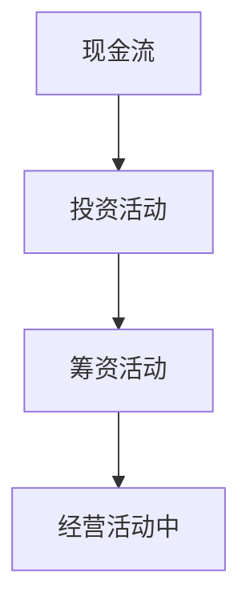
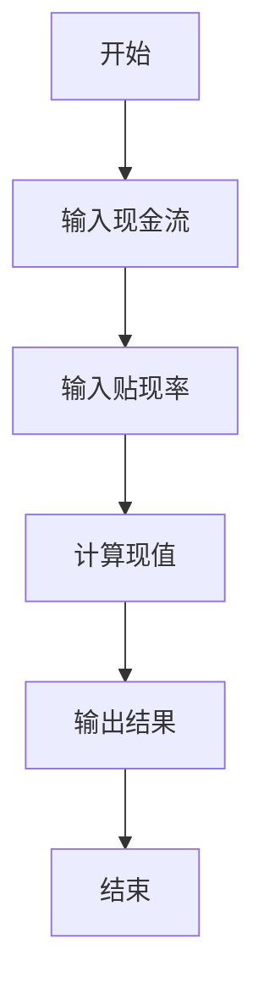

                 

# 《托马斯罗的现金流投资法》

## 关键词：现金流投资法、托马斯·罗、现金流分析、投资决策、内部收益率、净现值、现金流贴现

## 摘要：  
托马斯·罗的现金流投资法是一种基于现金流量分析的投资决策方法，旨在通过预测和评估投资项目中的现金流，计算其内在价值和投资回报率，从而帮助投资者做出更科学的投资决策。本文详细介绍了现金流投资法的核心概念、数学模型、算法原理及其在实际投资中的应用，通过案例分析和实战指导，帮助读者掌握这一方法。

---

## 第1章: 现金流投资法的背景与重要性

### 1.1 现金流投资法的定义与核心概念  
现金流投资法是一种以现金流为核心分析对象的投资决策方法，旨在通过预测未来现金流量并将其贴现为现值，评估投资项目的内在价值和可行性。其核心在于将未来的现金流折现，计算出一个可以与当前投资金额比较的现值，从而判断投资是否具有吸引力。

#### 现金流的定义与分类  
- **现金流的定义**：现金流是指企业在一定时期内通过经营、投资和筹资等活动所获得或支出的现金和现金等价物。
- **现金流的分类**：
  - **经营性现金流**：来自日常经营业务的现金流。
  - **投资性现金流**：来自投资活动的现金流，如购买或出售资产。
  - **筹资性现金流**：来自筹资活动的现金流，如发行债券或偿还贷款。

#### 现金流投资法与其他投资方法的区别  
传统的投资方法往往关注于企业的盈利能力（如ROE、ROA等），而现金流投资法则更关注企业的现金生成能力和现金流的质量。现金流投资法通过分析未来现金流的现值，能够更准确地评估企业的内在价值。

### 1.2 现金流投资法的起源与发展  
现金流投资法的理论基础可以追溯到财务学中的“时间价值”概念。托马斯·罗在其著作中首次系统性地提出了基于现金流的估值方法，强调现金流的真实性和可预测性，认为现金流是企业价值的核心驱动因素。

### 1.3 现金流投资法的核心原则  
- **现金流的时间价值**：资金的时间价值意味着相同的金额在未来的价值低于现在。
- **内在价值与外在价值**：内在价值是基于现金流折现的理论价值，而外在价值是市场交易的实际价值。
- **风险与收益的匹配**：高风险项目通常需要更高的预期回报率。

---

## 第2章: 现金流的基本概念与计算方法

### 2.1 现金流的定义与分类  
如前所述，现金流分为经营性、投资性和筹资性三类，每类现金流都有其特定的来源和用途。

### 2.2 现金流的时间价值与贴现  
现金流的时间价值可以通过贴现计算其现值。贴现率的选择通常基于项目的资本成本或市场利率。

#### 现金流的贴现公式  
$$ PV = \sum_{t=1}^{n} \frac{CF_t}{(1 + r)^t} $$  
其中，$PV$为现值，$CF_t$为第$t$期的现金流，$r$为贴现率，$n$为现金流的期限。

### 2.3 现金流的内部收益率（IRR）  
内部收益率是使净现值为零的折现率，计算公式为：  
$$ NPV = \sum_{t=1}^{n} \frac{CF_t}{(1 + IRR)^t} = 0 $$  

#### 现金流的数学模型与公式  
- 净现值（NPV）的计算：$$ NPV = \sum_{t=1}^{n} \frac{CF_t}{(1 + r)^t} - Initial Investment $$  
- 内部收益率（IRR）的计算：$$ IRR = \text{使} \, NPV = 0 \, \text{的折现率} $$  

### 2.4 现金流的实体关系图  
使用Mermaid绘制的现金流实体关系图如下：  

### 2.5 现金流的算法流程图  
使用Mermaid绘制的现金流贴现算法流程图如下：  

---

## 第3章: 现金流投资法在不同领域的应用

### 3.1 股票投资中的现金流分析  
在股票投资中，现金流投资法通常用于评估企业的内在价值。例如，使用自由现金流模型计算企业的目标股价。

#### 自由现金流模型  
$$ FCF = \text{营业收入} - \text{资本支出} $$  
$$ \text{目标股价} = \frac{\text{FCF}_1}{(1 + r)^1} + \frac{\text{FCF}_2}{(1 + r)^2} + \dots + \frac{\text{FCF}_n}{(1 + r)^n} $$  

### 3.2 房地产投资中的现金流分析  
在房地产投资中，现金流投资法用于评估项目的净现值和内部收益率。例如，购买一栋商业楼的现金流模型：

#### 房地产现金流模型  
$$ \text{NPV} = \sum_{t=1}^{n} \frac{\text{租金收入} - \text{运营成本}}{(1 + r)^t} - \text{初始投资} $$  

### 3.3 创业企业中的现金流分析  
对于创业企业，现金流投资法用于评估项目的可行性和风险。例如，使用创业企业的五年现金流预测计算其内在价值。

---

## 第4章: 现金流投资法的优势与局限性

### 4.1 优势  
- **准确性**：现金流投资法通过预测未来现金流的现值，能够更准确地评估企业的内在价值。
- **风险控制**：通过分析现金流的时间分布，投资者可以更好地控制投资风险。
- **决策支持**：现金流投资法为投资决策提供了科学依据，有助于避免盲目投资。

### 4.2 局限性  
- **假设的局限性**：现金流投资法假设未来的现金流可以被准确预测，这在现实中往往难以实现。
- **贴现率的选择**：贴现率的高低直接影响现值的计算，而选择合适的贴现率需要丰富的经验和市场判断。
- **忽略非财务因素**：现金流投资法主要关注财务指标，忽略了市场环境、管理团队等非财务因素的影响。

---

## 第5章: 现金流投资法的实战应用与案例分析

### 5.1 案例分析：某创业企业的现金流估值  
假设某创业企业的前五年现金流分别为：  
- 第一年：-100万  
- 第二年：-80万  
- 第三年：-60万  
- 第四年：+100万  
- 第五年：+150万  

贴现率假设为10%，计算其净现值：  
$$ NPV = \frac{-100}{1.1} + \frac{-80}{1.21} + \frac{-60}{1.331} + \frac{100}{1.4641} + \frac{150}{1.5746} $$  

通过计算，可以得出该项目的NPV为正值，说明项目具有投资价值。

### 5.2 案例分析：某房地产项目的现金流分析  
假设某房地产项目初始投资为500万，预计在未来五年内每年产生净现金流分别为：120万、150万、180万、200万、220万。贴现率为8%。计算其内部收益率：  
$$ IRR = \text{使} \, NPV = 0 \, \text{的折现率} $$  

通过计算，可以得出该项目的IRR为12%，高于贴现率8%，说明项目具有较高的投资回报率。

---

## 第6章: 现金流投资法的总结与展望

### 6.1 总结  
现金流投资法是一种科学的投资决策方法，通过分析未来现金流的现值和内在价值，帮助投资者做出更合理的选择。其核心在于现金流的时间价值和贴现率的合理选择。

### 6.2 展望  
随着金融市场的不断发展，现金流投资法的应用前景将更加广阔。未来，随着大数据和人工智能技术的进步，现金流预测的准确性将不断提高，现金流投资法将更加精确和智能化。

---

## 小结  
托马斯·罗的现金流投资法为投资者提供了一种基于现金流分析的科学投资方法。通过本文的详细介绍和案例分析，读者可以更好地理解和应用这一方法，从而在投资决策中做出更明智的选择。

---

## 注意事项  
- 投资者在使用现金流投资法时，应充分考虑市场的不确定性和数据的准确性。
- 现金流投资法仅是一种工具，投资者还需结合其他因素进行综合判断。

---

## 最佳实践 Tips  
- 在进行现金流分析时，建议使用专业的财务软件或工具（如Excel、Python）进行计算。
- 投资者应定期更新现金流预测模型，以反映市场变化和企业实际情况。

---

## 拓展阅读  
- 《价值投资：从格雷厄姆到巴菲特》
- 《财务报表分析与股票投资》
- 《风险管理与投资组合优化》

