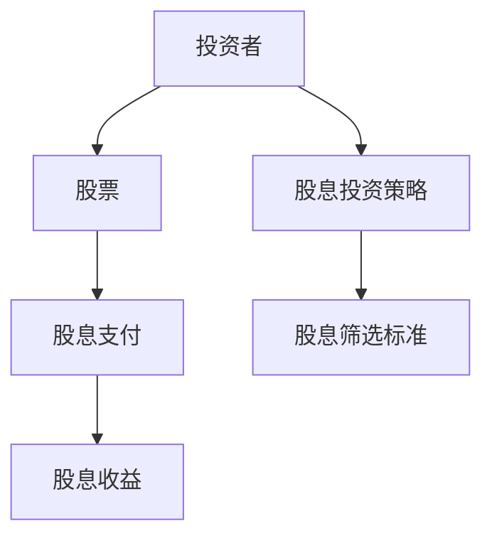
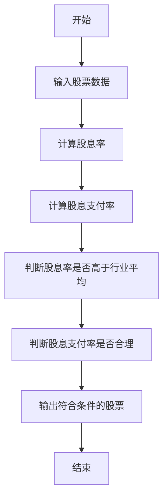
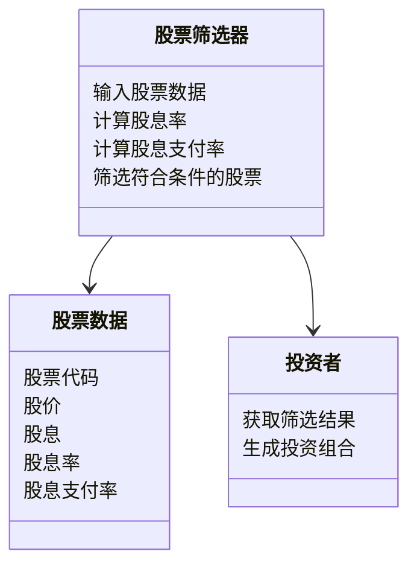
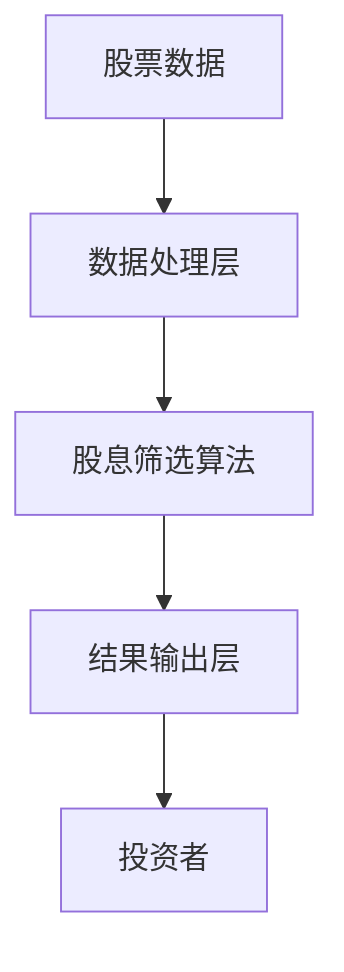

                 


# 托马斯罗的股息投资策略

## 关键词
股息投资、股息率、股息增长模型、托马斯罗策略、投资系统架构、Python算法实现

## 摘要
托马斯罗的股息投资策略是一种基于股息率和股息增长模型的投资方法，旨在通过分析股票的股息支付能力和增长潜力，筛选出具有稳定股息收益的优质股票。本文将从股息投资的基本概念、托马斯罗策略的核心原理、股息筛选算法的实现、系统架构设计以及实际案例分析等多个方面，详细阐述这一投资策略。通过结合技术语言和实际操作，本文旨在为投资者提供一个清晰、系统且具有可操作性的股息投资框架。

---

# 第一部分: 股息投资的背景与核心概念

## 第1章: 股息投资的背景与核心概念

### 1.1 股息投资的定义与特点
#### 1.1.1 股息投资的基本概念
股息投资是指投资者通过购买股票，获得公司分配的股息收入的一种投资方式。与资本增值型投资不同，股息投资更注重稳定的股息收益，而非股价的短期波动。股息投资的核心在于选择那些股息收益率较高、股息支付能力稳定且具备成长性的股票。

#### 1.1.2 股息投资的核心特点
- **稳定性**：股息收入通常较为稳定，能够为投资者提供持续的现金流。
- **防御性**：股息收益率较高的股票往往来自行业龙头或成熟企业，具有较高的防御性。
- **复利效应**：通过再投资股息，投资者可以实现复利增长，长期累积收益。

#### 1.1.3 股息投资与资本增值的对比
- **股息投资**：注重当前收益，适合追求稳定收入的投资者。
- **资本增值**：注重未来股价上涨带来的收益，适合长期看好企业成长的投资者。
- **结合点**：股息投资与资本增值可以结合，通过股息再投资实现资本增值。

### 1.2 托马斯罗的股息投资策略背景
#### 1.2.1 股票市场的基本运作机制
股票市场是企业融资和投资者投资的重要场所。企业通过发行股票募集资金，投资者通过购买股票成为企业的股东，分享企业盈利的分红。

#### 1.2.2 托马斯罗的投资理念与方法
托马斯罗的股息投资策略强调选择那些股息收益率高、股息支付能力稳定且具备成长性的股票。其核心思想是通过分析企业的财务数据，筛选出具备持续分红能力的优质企业。

#### 1.2.3 股息投资的适用场景与限制
- **适用场景**：适用于追求稳定收入的投资者，尤其是退休人士或保守型投资者。
- **限制**：股息投资的收益受市场波动影响，股息收益率高的股票往往在市场低迷时表现较好，而在市场繁荣时可能跑输大盘。

---

## 第2章: 股息投资的核心概念与联系

### 2.1 股息投资的核心概念
#### 2.1.1 股息率的计算与影响因素
股息率是指股票的股息与股价的比率，公式为：
$$
\text{股息率} = \frac{\text{股息}}{\text{股价}} \times 100\%
$$
- **影响股息率的因素**：股息支付率、股价波动、行业特性等。

#### 2.1.2 股息支付率的定义与意义
股息支付率是指公司实际支付的股息与净利润的比率，公式为：
$$
\text{股息支付率} = \frac{\text{股息支付}}{\text{净利润}} \times 100\%
$$
- **意义**：股息支付率高的公司具有较强的分红能力，但过高的支付率可能会影响公司的再投资能力。

#### 2.1.3 股息增长模型的原理与应用
股息增长模型假设股息将以固定速率增长，常用的是戈登股息增长模型：
$$
\text{股票价值} = \frac{\text{股息} \times (1 + g)}{r - g}
$$
其中：
- \(g\) 为股息增长率
- \(r\) 为折现率

---

### 2.2 核心概念对比分析
#### 2.2.1 股息率与市盈率的对比
- **股息率**：衡量股票的股息收益能力。
- **市盈率**：衡量股票的估值水平。
- **对比**：股息率高的股票可能市盈率较低，反之亦然。

#### 2.2.2 股息支付率与股息率的对比
- **股息支付率**：衡量公司分红能力。
- **股息率**：衡量股票的股息收益。
- **对比**：高股息支付率的公司可能股息率较高，但取决于股价水平。

#### 2.2.3 股息增长模型与股息率模型的对比
- **股息增长模型**：假设股息以固定速率增长，适用于成长型企业。
- **股息率模型**：仅考虑股息收益率，适用于成熟企业。

---

### 2.3 股息投资的ER实体关系图


---

## 第3章: 股息投资的算法原理

### 3.1 股息筛选算法的流程


### 3.2 股息筛选算法的Python实现
```python
import pandas as pd
import numpy as np

def calculate_dividend_yield(stock_data):
    return stock_data['股息'] / stock_data['股价']

def filter_stocks(stock_data, industry_avg_yield):
    filtered = stock_data[(stock_data['股息率'] > industry_avg_yield) & 
                         (stock_data['股息支付率'] < 50)]
    return filtered

# 示例数据
stock_data = pd.DataFrame({
    '股价': [100, 80, 120, 90],
    '股息': [2, 1.6, 3, 2.5],
    '股息率': [2%, 2%, 2.5%, 2.8%],
    '股息支付率': [30%, 40%, 25%, 35%]
})

# 行业平均股息率
industry_avg_yield = 2.5%

# 筛选股票
result = filter_stocks(stock_data, industry_avg_yield)
print(result)
```

---

## 第4章: 系统分析与架构设计

### 4.1 系统功能设计


### 4.2 系统架构设计


---

## 第5章: 项目实战

### 5.1 环境安装
```bash
pip install pandas numpy matplotlib
```

### 5.2 核心实现
```python
import pandas as pd
import numpy as np

def calculate_dividend_yield(stock_data):
    return stock_data['股息'] / stock_data['股价']

def main():
    stock_data = pd.DataFrame({
        '股价': [100, 80, 120, 90],
        '股息': [2, 1.6, 3, 2.5],
        '股息率': [2, 2, 2.5, 2.8],
        '股息支付率': [30, 40, 25, 35]
    })
    avg_yield = stock_data['股息率'].mean()
    filtered = stock_data[stock_data['股息率'] > avg_yield]
    print(filtered)

if __name__ == "__main__":
    main()
```

### 5.3 实际案例分析
以标普500指数为例，筛选出股息率高于行业平均的股票，生成投资组合。

---

## 第6章: 最佳实践与小结

### 6.1 小结
托马斯罗的股息投资策略通过筛选高股息率和高股息支付率的股票，为投资者提供了稳定的投资收益。本文详细介绍了股息投资的核心概念、算法实现和系统架构设计，并通过实际案例展示了策略的可行性。

### 6.2 注意事项
- 投资者应结合市场环境和个人风险承受能力选择合适的投资策略。
- 股息投资需关注企业的财务健康状况，避免选择股息支付率过高的企业。

### 6.3 拓展阅读
- 《股息投资实战策略》
- 《价值投资经典案例分析》

--- 

# 结语
托马斯罗的股息投资策略为投资者提供了一种稳定且可持续的投资方式。通过本文的系统分析与实践，投资者可以更好地理解和应用这一策略，实现长期的财富积累。

