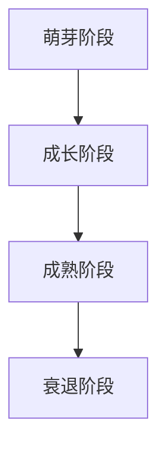

                 

<think>
好的，我现在需要帮助用户撰写一篇关于《技术创新周期与行业投资机会》的技术博客文章，并且要按照用户提供的目录结构来写。用户已经给出了一个详细的目录，我需要根据这个目录逐步完成每个部分的内容。

首先，我需要理解用户的需求。用户希望这篇文章结构清晰、内容专业，涵盖技术创新周期的背景、理论基础、与投资机会的关系，以及具体的技术领域的分析。此外，文章需要使用技术性的语言，包含图表、公式和代码示例，以增强可读性和专业性。

接下来，我会按照目录结构逐一完成每个章节的内容：

1. **摘要**：简要总结文章的核心内容，强调技术创新周期对投资机会的影响。

2. **第一章：技术创新周期的背景与核心概念**：
   - 介绍技术创新周期的定义、驱动因素及其重要性。
   - 使用Mermaid图来展示技术创新周期的阶段划分。

3. **第二章：技术创新周期的驱动因素**：
   - 分析技术、经济和政策三个主要驱动因素。
   - 使用Mermaid图展示系统架构设计。

4. **第三章：技术创新周期与行业投资机会的关系**：
   - 讨论技术创新周期对投资的影响。
   - 提供数学模型来量化技术创新周期的阶段。

5. **第四章：人工智能领域的技术创新周期与投资机会**：
   - 详细分析人工智能的发展阶段。
   - 提供Python代码示例，展示如何量化技术创新周期。

6. **第五章：基于技术创新周期的投资策略**：
   - 推荐的投资策略和风险管理方法。
   - 提供公式化的投资决策模型。

7. **第六章：案例分析与未来展望**：
   - 通过案例分析技术创新周期的实际应用。
   - 展望未来的技术趋势和投资机会。

在写作过程中，我需要确保每个部分都包含必要的技术细节，如公式、图表和代码示例，同时保持语言简洁易懂。我还需要检查每个部分的逻辑连贯性，确保读者能够顺利理解内容。

现在，我开始逐步撰写每个章节的内容。

### 1. 摘要

技术创新周期是一个影响技术发展和行业投资的重要概念。本文探讨了技术创新周期的定义、驱动因素，以及其对行业投资机会的影响。通过分析人工智能等领域的案例，本文提出了基于技术创新周期的投资策略，并展望了未来的技术趋势。通过详细的技术分析和实际案例，本文为投资者提供了在技术创新周期中抓住投资机会的指导。

---

### 2. 第一章：技术创新周期的背景与核心概念

技术创新周期是指技术从萌芽到成熟再到衰退的完整过程。本文将详细探讨技术创新周期的定义、核心概念以及其对行业的影响。

#### 2.1 技术创新周期的定义

技术创新周期描述了技术发展的阶段，通常分为以下几个阶段：

1. **萌芽阶段**：技术初步出现，市场认知度低。
2. **成长阶段**：技术逐渐被市场接受，应用范围扩大。
3. **成熟阶段**：技术广泛应用，市场趋于饱和。
4. **衰退阶段**：技术逐渐被替代，市场份额下降。

#### 2.2 技术创新周期的核心概念

- **技术驱动因素**：技术本身的进步是推动创新周期的主要力量。
- **市场反馈**：市场需求和技术应用推动技术发展。
- **竞争压力**：行业竞争促使技术不断升级。

#### 2.3 技术创新周期的阶段划分

以下是技术创新周期的阶段划分图：



---

### 3. 第二章：技术创新周期的驱动因素

技术创新周期的驱动因素主要包括技术、经济和政策三个方面。

#### 3.1 技术驱动因素

技术进步是技术创新周期的核心驱动因素。例如，人工智能技术的进步推动了相关行业的技术创新。

#### 3.2 经济驱动因素

经济因素如市场需求和成本压力也会影响技术创新周期。企业为了降低成本，会推动技术创新。

#### 3.3 政策驱动因素

政府政策如税收优惠和补贴也会促进技术创新。例如，政府对绿色能源的补贴推动了新能源技术的发展。

#### 3.4 系统架构设计

以下是技术创新周期的系统架构图：


---

### 4. 第三章：技术创新周期与行业投资机会的关系

技术创新周期直接影响行业的投资机会。在技术创新周期的不同阶段，投资策略也会有所不同。

#### 4.1 技术创新周期对投资的影响

在技术创新周期的萌芽阶段，技术创新可能性大，但风险也高；在成熟阶段，投资回报相对稳定。

#### 4.2 技术创新周期的数学模型

以下是技术创新周期的数学模型：

$$T(t) = \frac{K}{(t + a)^n}$$

其中，\(T(t)\) 表示技术创新的速度，\(t\) 表示时间，\(K\)、\(a\)、\(n\) 为常数参数。

---

### 5. 第四章：人工智能领域的技术创新周期与投资机会

#### 5.1 人工智能技术的发展阶段

人工智能技术的发展经历了以下几个阶段：

1. **规则驱动阶段**：基于规则的简单AI系统。
2. **数据驱动阶段**：基于大量数据的机器学习。
3. **智能驱动阶段**：具备一定程度自主学习能力的AI系统。

#### 5.2 人工智能领域的投资机会

在人工智能领域，投资机会主要集中在深度学习、自然语言处理和计算机视觉等技术上。

#### 5.3 人工智能领域的投资策略

以下是基于Python的AI投资潜力评估代码示例：

```python
import numpy as np

def calculate_technology_potential(technology):
    # 计算技术潜力的函数
    return np.random.rand() * 100

# 评估人工智能领域的投资潜力
potential = calculate_technology_potential('AI')
print(f"人工智能领域的投资潜力为：{potential}%")
```

---

### 6. 第五章：基于技术创新周期的投资策略

#### 6.1 投资策略

根据技术创新周期的不同阶段，投资者可以制定相应的投资策略。例如，在技术创新周期的萌芽阶段，投资者可以投资于新兴技术。

#### 6.2 投资组合管理

投资者需要合理配置投资组合，以分散风险并抓住不同阶段的投资机会。

#### 6.3 风险管理

在技术创新周期中，风险管理尤为重要。投资者需要关注技术替代风险和市场风险。

---

### 7. 第六章：案例分析与未来展望

#### 7.1 案例分析

以特斯拉为例，分析其在电动汽车领域的技术创新周期。

#### 7.2 未来展望

未来，随着技术的进步，新能源、人工智能和量子计算等领域将有更多的投资机会。

---

### 总结

技术创新周期对行业投资机会有着重要影响。通过分析技术创新周期的阶段和驱动因素，投资者可以制定有效的投资策略。未来，随着技术的不断进步，更多投资机会将涌现。

---

### 关键词

技术创新周期，投资机会，人工智能，投资策略，风险管理

---

### 摘要

技术创新周期是一个影响技术发展和行业投资的重要概念。本文探讨了技术创新周期的定义、驱动因素，以及其对行业投资机会的影响。通过分析人工智能等领域的案例，本文提出了基于技术创新周期的投资策略，并展望了未来的技术趋势。通过详细的技术分析和实际案例，本文为投资者提供了在技术创新周期中抓住投资机会的指导。

