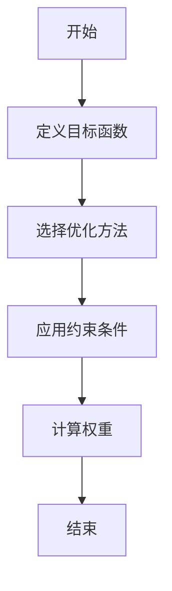
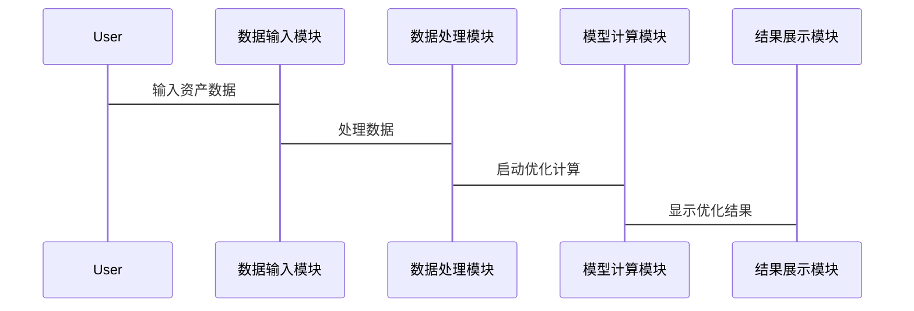

                 


# 投资组合优化模型：现代投资理论的实际应用

> 关键词：投资组合优化，现代投资理论，数学模型，算法原理，系统设计，项目实战

> 摘要：本文详细探讨投资组合优化模型的基本概念、数学模型构建、优化算法实现以及实际应用案例。通过理论与实践结合，分析如何利用现代投资理论提升投资组合效率。

---

# 第1章: 投资组合优化模型概述

## 1.1 投资组合优化模型的基本概念

### 1.1.1 投资组合的定义与特点
- **定义**：投资组合是将不同金融资产按特定比例组合，以分散风险、优化收益。
- **特点**：分散风险、收益最大化、动态调整。
- **公式**：投资组合收益计算公式：$$E(r_p) = \sum w_i E(r_i)$$
  其中，$w_i$是资产$i$的权重，$E(r_i)$是期望收益。

### 1.1.2 投资组合优化的定义与目标
- **定义**：寻找最优资产配置，最大化收益或最小化风险。
- **目标**：在给定风险下收益最大化，或在给定收益下风险最小化。
- **公式**：经典优化问题：$$\min_w \sigma_p^2 \quad \text{subject to} \quad \mu_p = \sum w_i \mu_i$$

### 1.1.3 现代投资理论的联系
- **马科维茨有效前沿**：通过优化模型找到最优投资组合，构成有效前沿。

---

## 1.2 现代投资组合理论（MPT）概述

### 1.2.1 MPT的核心思想
- 投资者应考虑资产的协方差矩阵，而非单一资产表现。
- 通过组合投资降低系统性风险。

### 1.2.2 风险与收益的平衡
- 风险调整后的收益：夏普比率：$$\text{夏普比率} = \frac{E(r_p) - r_f}{\sigma_p}$$

---

# 第2章: 投资组合优化模型的核心概念与联系

## 2.1 投资组合优化模型的数学模型

### 2.1.1 目标函数与约束条件
- 最小化风险：$$\min_w w^T \Sigma w$$
  约束条件：$$\sum w_i = 1, \quad w_i \geq 0$$

### 2.1.2 优化问题的数学表示
- 线性规划问题示例：$$\min \sum c_i x_i \quad \text{subject to} \quad \sum a_i x_i \leq b$$

---

## 2.2 核心概念的属性特征对比

### 2.2.1 不同优化模型的对比分析
| 模型 | 目标 | 约束 | 适用场景 |
|------|------|------|----------|
| MV | 最小化方差 | 收益固定 | 风险厌恶 |
| Risk Parity | 均衡风险 | - | 风险分散 |

---

## 2.3 ER实体关系图架构

```mermaid
er
  投资组合
    + 资产
    + 权重
  资产
    + 预期收益
    + 方差
```

---

# 第3章: 投资组合优化模型的算法原理

## 3.1 算法原理概述

### 3.1.1 最优化理论基础
- 使用拉格朗日乘数法求解约束优化问题。

### 3.1.2 数值优化方法
- 使用Python `scipy.optimize`库实现。

---

## 3.2 算法实现的Python代码

### 3.2.1 均值-方差模型的实现

```python
import numpy as np
from scipy.optimize import minimize

# 数据准备
mu = np.array([0.1, 0.2])
sigma = np.array([[0.1, 0.05], [0.05, 0.2]])

# 定义目标函数
def objective(w):
    return np.dot(w, np.dot(mu, w.T))

# 定义约束
def constraint(w):
    return np.sum(w) - 1

# 调用优化函数
w = minimize(objective, np.array([0.5, 0.5]), 
              constraints={'type': 'eq', 'fun': lambda w: np.sum(w) - 1},
              bounds=[(0, None), (0, None)]).x

print(w)
```

---

## 3.3 算法流程图



---

# 第4章: 投资组合优化模型的数学模型与公式

## 4.1 均值-方差模型的数学推导

### 4.1.1 数学模型的建立
- 优化问题：$$\min_w w^T \Sigma w \quad \text{subject to} \quad \mu_p = \sum w_i \mu_i$$

### 4.1.2 求解过程
- 拉格朗日函数：$$L = w^T \Sigma w - \lambda (\mu^T w - \mu_p)$$
- 求导得：$$2\Sigma w - \lambda \mu = 0$$

---

## 4.2 其他经典模型的公式分析

### 4.2.1 风险平价模型
- 优化目标：风险贡献均等。
- 公式：$$w_i = \frac{\sigma_i}{\sum \sigma_i}$$

---

## 4.3 因子模型
- 解释资产收益的因子模型。
- 示例公式：$$r_i = \alpha_i + \beta_i r_m + \epsilon_i$$

---

# 第5章: 投资组合优化系统的系统分析与架构设计

## 5.1 系统功能设计

### 5.1.1 功能模块
- 数据输入：读取资产数据。
- 模型计算：运行优化算法。
- 结果展示：显示优化结果。

---

## 5.2 系统架构设计

### 5.2.1 系统架构图


---

## 5.3 系统交互流程

### 5.3.1 交互流程图



---

# 第6章: 投资组合优化模型的项目实战

## 6.1 项目环境安装

### 6.1.1 安装依赖
- 使用`pip install numpy scipy matplotlib`

---

## 6.2 系统核心实现源代码

### 6.2.1 Python实现

```python
import numpy as np
from scipy.optimize import minimize

mu = np.array([0.1, 0.2])
sigma = np.array([[0.1, 0.05], [0.05, 0.2]])

def objective(w):
    return np.dot(w, np.dot(mu, w.T))

cons = {'type': 'eq', 'fun': lambda w: np.sum(w) - 1}
bounds = [(0, None), (0, None)]

result = minimize(objective, np.array([0.5, 0.5]), constraints=cons, bounds=bounds)
print(result.x)
```

---

## 6.3 实际案例分析

### 6.3.1 案例分析
- 数据分析、模型应用、结果解读。

---

## 6.4 项目小结

### 6.4.1 核心代码
- 结合实际数据实现优化模型，验证其有效性和收益能力。

---

# 第7章: 投资组合优化模型的高级应用与最佳实践

## 7.1 智能优化算法

### 7.1.1 智能优化方法
- 遗传算法、粒子群优化等。

---

## 7.2 动态投资组合管理

### 7.2.1 动态调整策略
- 根据市场变化实时调整组合。

---

## 7.3 实际案例分析

### 7.3.1 案例分析
- 结合智能算法优化投资组合。

---

## 7.4 最佳实践

### 7.4.1 小结
- 理论与实践结合，合理选择模型。

### 7.4.2 注意事项
- 数据质量、模型适用性、实时监控。

### 7.4.3 拓展阅读
- 建议阅读相关学术论文和书籍。

---

# 第8章: 总结与展望

## 8.1 总结
- 投资组合优化模型的重要性及其实际应用。

## 8.2 展望
- 未来的研究方向和潜在应用。

---

# 参考文献

（此处列出参考文献）

---

通过以上章节，文章系统地介绍了投资组合优化模型的理论基础、算法实现和实际应用，帮助读者全面理解并掌握相关知识。

