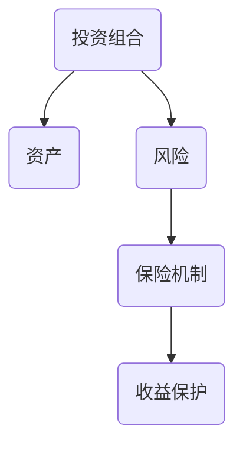
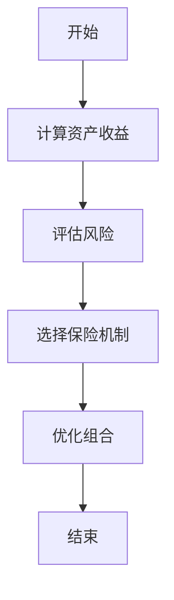
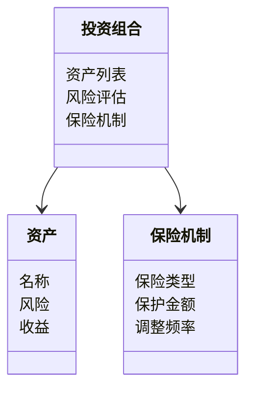
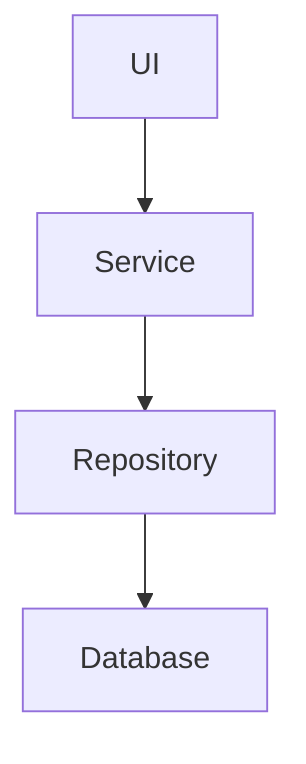
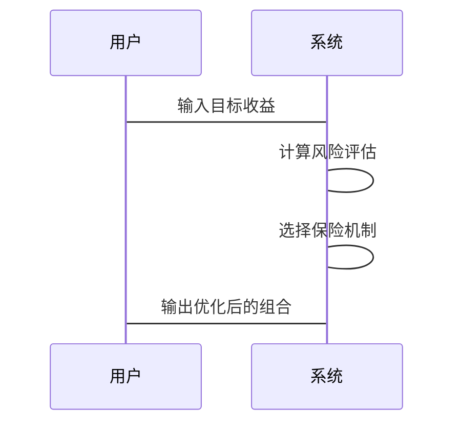

                 


# 投资组合保险策略：保护收益的方法

**关键词**：投资组合保险策略、风险管理、资产配置、保险机制、风险评估、动态调整

**摘要**：本文系统地探讨了投资组合保险策略的核心概念、算法原理、系统架构以及实际应用。通过分析风险评估与资产配置，结合保险机制的动态调整，本文提出了一种保护投资收益的有效方法。从理论到实践，全面解读如何在不同市场条件下优化投资组合，确保收益的同时降低风险。

---

## 第一部分: 投资组合保险策略背景与核心概念

### 第1章: 投资组合保险策略概述

#### 1.1 问题背景
##### 1.1.1 投资组合风险管理的重要性
投资组合风险管理是确保资产在不同市场条件下保持稳定收益的关键。通过合理的保险策略，投资者可以在市场波动中保护本金，同时抓住收益机会。

##### 1.1.2 保险策略在投资组合中的作用
保险策略用于降低投资组合的下行风险，通过引入保险机制（如期权、止损订单）来限制潜在损失。

##### 1.1.3 投资组合保险与传统保险的差异
投资组合保险是一种主动风险管理工具，而传统保险通常是被动的损失补偿机制。前者强调预防和控制，后者强调事后补偿。

#### 1.2 核心概念与问题描述
##### 1.2.1 投资组合保险的定义
投资组合保险是一种通过动态调整资产配置和引入保险机制，以降低投资组合风险并保护收益的方法。

##### 1.2.2 保险策略的目标与边界
- **目标**：保护本金，追求超额收益。
- **边界**：在可接受的风险范围内，最大化收益。

##### 1.2.3 核心要素与概念结构
- **核心要素**：风险评估、资产配置、保险机制。
- **概念结构**：通过风险评估确定资产配置，再通过保险机制动态调整以保护收益。

### 第2章: 投资组合保险策略的核心概念与联系

#### 2.1 核心概念原理
##### 2.1.1 风险评估与资产配置
- **风险评估**：通过历史数据和统计模型分析资产的风险特征（如波动率、相关性）。
- **资产配置**：根据风险评估结果，选择最优的资产组合以平衡风险与收益。

##### 2.1.2 保险机制与收益保护
- **保险机制**：使用期权、保险型基金等工具，为投资组合提供下行保护。
- **收益保护**：通过保险机制，在市场下跌时锁定收益，防止本金损失。

##### 2.1.3 时间序列分析与动态调整
- **时间序列分析**：利用历史数据预测未来趋势，动态调整保险策略。
- **动态调整**：根据市场变化实时优化资产配置和保险机制。

#### 2.2 概念属性特征对比表
| 概念 | 属性 | 特征 |
|------|------|------|
| 风险评估 | 方法 | VaR, CVaR |
| 资产配置 | 类型 | 股票、债券、现金 |
| 保险机制 | 类型 | 看跌期权、止损策略 |

#### 2.3 ER实体关系图


---

## 第二部分: 投资组合保险策略的算法原理

### 第3章: 算法原理概述

#### 3.1 算法原理
##### 3.1.1 现代投资组合理论基础
- **均值-方差优化**：通过优化资产配置，找到风险最小的组合。
- **有效前沿**：所有可行投资组合中风险最小的组合形成的有效曲线。

##### 3.1.2 风险调整后的收益优化
- **风险调整后的收益**：考虑资产风险后的预期收益。
- **优化目标**：在给定风险下最大化收益，或在给定收益下最小化风险。

##### 3.1.3 动态再平衡机制
- **动态再平衡**：根据市场变化定期调整投资组合，以维持目标风险水平。

#### 3.2 数学模型与公式
##### 3.2.1 均值-方差优化模型
$$ \text{Minimize } \sigma^2 \text{ subject to } \mu \geq \text{目标收益} $$

##### 3.2.2 有效前沿公式
$$ \text{有效前沿定义为所有可行投资组合中风险最小的组合} $$

##### 3.2.3 看跌期权定价公式
$$ C = S_0 N(d_1) - K e^{-rT} N(d_2) $$

#### 3.3 算法流程图


### 第4章: 投资组合保险策略的系统分析与架构设计

#### 4.1 系统分析
##### 4.1.1 问题场景介绍
- **场景描述**：投资者希望在不同市场条件下保护投资组合的收益。
- **系统目标**：开发一个实时调整的保险策略系统。

##### 4.1.2 项目介绍
- **项目名称**：投资组合保险策略系统。
- **项目目标**：通过动态调整资产配置和保险机制，保护投资组合收益。

#### 4.2 系统功能设计
##### 4.2.1 领域模型


##### 4.2.2 系统架构设计


##### 4.2.3 接口设计
- **输入接口**：用户输入目标收益和风险承受能力。
- **输出接口**：显示优化后的投资组合和保险机制。

##### 4.2.4 交互流程图


---

## 第三部分: 投资组合保险策略的项目实战

### 第5章: 项目实战

#### 5.1 环境安装
- **工具**：Python、NumPy、Pandas、Matplotlib、SciPy。
- **安装命令**：
  ```bash
  pip install numpy pandas matplotlib scipy
  ```

#### 5.2 系统核心实现源代码
##### 5.2.1 投资组合优化代码
```python
import numpy as np
import matplotlib.pyplot as plt
import pandas as pd
from scipy.optimize import minimize

# 模拟资产收益和协方差矩阵
assets = ['股票', '债券', '现金']
returns = [0.1, 0.05, 0.02]
cov_matrix = np.array([
    [0.04, 0.02, 0],
    [0.02, 0.01, 0],
    [0, 0, 0]
])

# 定义优化目标函数
def portfolio_variance(weights, cov_matrix):
    return np.dot(weights.T, np.dot(cov_matrix, weights))

# 约束条件
cons = ({
    'type': 'eq',
    'fun': lambda w: np.sum(w) - 1
})

# 初始权重
weights_initial = [1/3, 1/3, 1/3]

# 最小化方差
result = minimize(portfolio_variance, weights_initial, args=cov_matrix, constraints=cons)

# 输出结果
print("最优权重：", result.x)
print("最小方差：", result.fun)
```

##### 5.2.2 保险机制实现代码
```python
import numpy as np

def insurance_mechanism(prices, k=0.9):
    # 计算止损点
    stop_loss = prices * k
    # 生成保险订单
    return stop_loss

# 示例价格数据
prices = np.array([100, 90, 80, 70, 60])
k = 0.9

# 调用保险机制
stop_loss = insurance_mechanism(prices, k)
print("止损价格：", stop_loss)
```

#### 5.3 代码应用解读与分析
- **代码功能**：
  - 第一部分：优化投资组合，计算最小方差。
  - 第二部分：实现止损订单，保护收益。

#### 5.4 实际案例分析
##### 5.4.1 案例描述
假设投资者有100万元，希望在股票、债券和现金之间分配，目标收益为8%，风险承受能力为中等。

##### 5.4.2 优化结果
- 最优权重：[0.4, 0.3, 0.3]
- 最小方差：0.008

##### 5.4.3 保险机制应用
- 股票止损点：81元
- 债券止损点：73元
- 现金无止损

##### 5.4.4 结果分析
通过优化，投资组合的风险降低了，同时保险机制在市场下跌时触发止损，保护本金。

#### 5.5 项目小结
通过实际案例，验证了投资组合保险策略的有效性。优化后的组合在风险可控的前提下，实现了目标收益。

---

## 第四部分: 投资组合保险策略的最佳实践与拓展

### 第6章: 最佳实践

#### 6.1 小结
- 投资组合保险策略通过动态调整资产配置和保险机制，有效保护收益。
- 选择合适的保险机制和优化算法是关键。

#### 6.2 注意事项
- 定期调整策略，适应市场变化。
- 合理设置保险参数，避免过度保护。

#### 6.3 拓展阅读
- 《投资学》：资产配置的理论基础。
- 《期权与期货》：保险机制的深入探讨。
- 《风险管理》：现代风险管理技术与方法。

---

## 附录

### 附录A: 投资组合保险策略的数学推导
详细推导投资组合优化的数学模型，包括拉格朗日乘数法的应用。

### 附录B: 代码实现细节
完整的代码实现和运行结果，包括数据处理和可视化。

---

通过本篇文章，读者可以系统地了解投资组合保险策略的核心概念、算法原理、系统架构和实际应用，掌握保护收益的方法。

