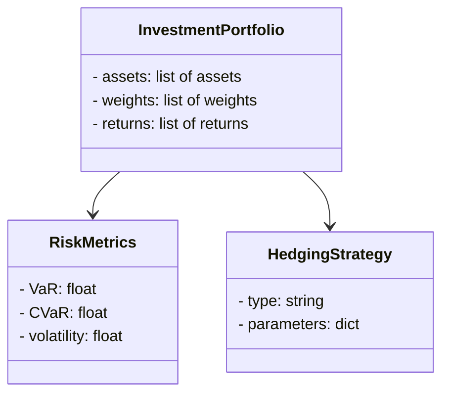

                 


# 投资组合尾部对冲：保护策略在极端市场中的作用

## 关键词：投资组合管理，尾部风险，对冲策略，极端市场，风险管理

## 摘要：  
在金融投资中，尾部风险指的是投资组合在极端市场条件下可能出现的远低于预期损失的情况。本文详细探讨了尾部对冲策略在保护投资组合免受极端市场影响中的作用，包括尾部风险的量化、对冲策略的类型、算法原理以及实际应用案例。通过理论分析和实际操作，本文旨在为投资者提供在极端市场中保护投资组合的实用方法。

---

## 第一部分：投资组合风险管理与尾部对冲基础

### 第1章：投资组合风险管理概述

#### 1.1 投资组合风险管理的基本概念

##### 1.1.1 投资组合风险管理的定义  
投资组合风险管理是指通过分析和控制投资组合在不同市场条件下的风险，以实现风险与收益的最佳平衡。  

##### 1.1.2 尾部风险的定义与特征  
尾部风险是指投资组合在极端市场条件下可能出现的远低于预期收益或远高于预期损失的情况。尾部风险具有低概率、高损失的特点，通常被称为“黑天鹅”事件。  

##### 1.1.3 对冲策略的基本原理  
对冲策略是一种通过建立相反头寸来降低投资组合风险的策略。通过对冲，投资者可以在市场波动时减少损失，同时保留潜在收益。  

#### 1.2 极端市场条件下的投资组合风险

##### 1.2.1 极端市场的定义与特征  
极端市场指的是市场出现剧烈波动或危机情况，如金融危机、经济衰退或地缘政治冲突等。  

##### 1.2.2 尾部风险在极端市场中的表现  
在极端市场中，尾部风险可能以市场崩盘、资产价格大幅下跌或流动性危机的形式出现，导致投资组合的损失远超预期。  

##### 1.2.3 尾部风险对投资组合的影响  
尾部风险可能导致投资组合的损失急剧扩大，甚至引发投资者的恐慌性抛售，进一步加剧市场的波动。  

### 第2章：尾部对冲策略的核心概念

#### 2.1 尾部对冲策略的定义

##### 2.1.1 尾部对冲的定义  
尾部对冲是一种通过特定策略来减少投资组合在极端市场条件下潜在损失的方法。  

##### 2.1.2 尾部对冲的目标与作用  
尾部对冲的目标是在极端市场条件下保护投资组合，减少潜在损失，同时保留收益。  

#### 2.2 尾部对冲策略的主要类型

##### 2.2.1 保险型对冲策略  
保险型对冲策略类似于购买保险，当市场出现大幅下跌时，对冲工具（如期权）会产生收益来抵消投资组合的损失。  

##### 2.2.2 投机型对冲策略  
投机型对冲策略是通过押注市场下跌来获利，从而在投资组合出现亏损时获得收益。  

##### 2.2.3 组合对冲策略  
组合对冲策略是通过调整投资组合中不同资产的比例，使得在极端情况下，投资组合的损失最小化。  

#### 2.3 尾部对冲策略的适用场景

##### 2.3.1 在极端市场中的应用  
在极端市场中，尾部对冲策略可以有效减少投资组合的潜在损失。例如，在金融危机期间，保险型对冲策略可以通过购买信用违约互换（CDS）来对冲债券违约的风险。  

##### 2.3.2 在常规市场中的应用  
在常规市场中，尾部对冲策略可以作为一种风险控制工具，帮助投资者在市场波动时保持投资组合的稳定性。例如，组合对冲策略可以在市场波动加剧时调整资产配置，减少波动性的影响。  

##### 2.3.3 不同资产类别的尾部对冲策略  
不同的资产类别可能需要不同的尾部对冲策略。例如，股票投资可以使用看跌期权来对冲下行风险，而债券投资可以通过信用衍生品来对冲信用风险。  

---

## 第二部分：尾部对冲策略的数学模型与算法

### 第3章：尾部风险的量化与度量

#### 3.1 常见的风险度量指标

##### 3.1.1 VaR（Value at Risk）
VaR是指在一定置信水平下，投资组合可能遭受的最大损失。例如，95%置信水平下的VaR意味着在95%的情况下，投资组合的损失不会超过VaR值。  

##### 3.1.2 CVaR（Conditional Value at Risk）
CVaR是指在VaR的基础上，计算VaR之外的平均损失。CVaR考虑了尾部风险的严重性，通常用于风险控制。  

##### 3.1.3 标准差与波动率
标准差和波动率是衡量资产价格波动性的指标，常用于评估投资组合的潜在风险。  

#### 3.2 尾部风险的数学模型

##### 3.2.1 VaR的计算公式  
$$ VaR = \mu + z \cdot \sigma $$  
其中，$\mu$是资产的平均回报率，$z$是标准正态分布的分位数，$\sigma$是资产的波动率。  

##### 3.2.2 CVaR的计算公式  
$$ CVaR = \frac{1}{1 - \alpha} \int_{\alpha}^{1} VaR \, dF $$  
其中，$\alpha$是置信水平，$F$是VaR的累积分布函数。  

#### 3.3 尾部风险的算法实现

##### 3.3.1 VaR的计算步骤  
1. 计算资产的历史回报率和波动率。  
2. 确定置信水平，例如95%。  
3. 查找标准正态分布对应的分位数，例如1.645。  
4. 计算VaR值：VaR = 平均回报率 + 分位数 × 波动率。  

##### 3.3.2 CVaR的计算步骤  
1. 计算VaR值。  
2. 确定VaR之外的损失分布。  
3. 计算VaR之外的平均损失。  

### 第4章：尾部对冲的优化算法

#### 4.1 基于均值-方差优化的尾部对冲

##### 4.1.1 均值-方差优化的基本原理  
均值-方差优化是一种通过调整资产权重，使得投资组合的波动率最小化的方法。  

##### 4.1.2 尾部对冲的优化目标  
尾部对冲的优化目标是在极端市场条件下最小化投资组合的潜在损失。  

##### 4.1.3 优化步骤  
1. 确定投资组合的约束条件，例如资产权重的限制。  
2. 使用优化算法（如拉格朗日乘数法）调整资产权重，使得投资组合的尾部风险最小化。  

#### 4.2 基于蒙特卡洛模拟的尾部对冲

##### 4.2.1 蒙特卡洛模拟的基本原理  
蒙特卡洛模拟是一种通过随机抽样来模拟市场波动的方法，常用于评估投资组合在极端情况下的表现。  

##### 4.2.2 尾部对冲的模拟步骤  
1. 生成大量可能的市场情景。  
2. 计算投资组合在不同情景下的表现。  
3. 确定极端情景下的潜在损失。  
4. 调整投资组合权重，以减少极端情景下的损失。  

---

## 第三部分：尾部对冲策略的系统分析与架构设计

### 第5章：系统分析与架构设计方案

#### 5.1 问题场景介绍  
在极端市场条件下，投资组合可能面临巨大的尾部风险，导致投资者的损失。为了应对这种情况，需要设计一个实时监控和对冲的系统。  

#### 5.2 系统功能设计

##### 5.2.1 领域模型（mermaid类图）  


##### 5.2.2 系统架构设计（mermaid架构图）  
```mermaid
container InvestmentPortfolio {
    + InvestmentPortfolio
    + RiskMetrics
    + HedgingStrategy
}
container RiskManagementSystem {
    + RiskMetrics
    + HedgingStrategy
    + MonitoringInterface
}
```

##### 5.2.3 系统接口设计  
- 输入：市场数据、投资组合权重、对冲参数  
- 输出：VaR、CVaR、对冲建议  

##### 5.2.4 系统交互（mermaid序列图）  
```mermaid
sequenceDiagram
    User -> RiskManagementSystem: 提供市场数据
    RiskManagementSystem -> InvestmentPortfolio: 计算投资组合风险
    InvestmentPortfolio -> RiskManagementSystem: 返回VaR和CVaR
    RiskManagementSystem -> HedgingStrategy: 生成对冲建议
    User <- RiskManagementSystem: 显示对冲建议
```

---

## 第四部分：尾部对冲策略的项目实战

### 第6章：项目实战

#### 6.1 环境安装  
1. 安装Python和相关库（如NumPy、Pandas、Plotly）。  
2. 安装风险管理框架（如Pyfolio）。  

#### 6.2 核心代码实现

##### 6.2.1 计算VaR和CVaR  
```python
import numpy as np
import pandas as pd

def calculate_var(returns, confidence_level=0.95):
    sorted_returns = sorted(returns)
    var_index = int(len(sorted_returns) * (1 - confidence_level))
    var = sorted_returns[var_index]
    return var

def calculate_cvar(returns, confidence_level=0.95):
    var = calculate_var(returns, confidence_level)
    cvar = np.mean(sorted_returns[var_index:])
    return cvar
```

##### 6.2.2 实施对冲策略  
```python
def implement_hedging_strategy(portfolio, var):
    # 调整投资组合权重，以减少尾部风险
    adjusted_portfolio = portfolio.copy()
    adjusted_portfolio['weights'] = adjusted_portfolio['weights'] * (1 - var)
    return adjusted_portfolio
```

#### 6.3 案例分析与解读  
通过实际市场数据，计算投资组合的VaR和CVaR，并实施尾部对冲策略，观察投资组合在极端市场中的表现。  

#### 6.4 项目小结  
尾部对冲策略在实际应用中可以有效减少投资组合的潜在损失，但在实施过程中需要注意成本和流动性问题。  

---

## 第五部分：尾部对冲策略的最佳实践

### 第7章：最佳实践

#### 7.1 投资者需注意的事项  
1. 尾部对冲策略的成本可能较高，需权衡成本与收益。  
2. 尾部对冲策略的有效性依赖于对市场风险的准确预测。  
3. 尾部对冲策略应与整体投资策略相结合，避免过度依赖单一策略。  

#### 7.2 小结  
尾部对冲策略是保护投资组合免受极端市场影响的重要工具，但在实际应用中需谨慎选择和实施。  

#### 7.3 拓展阅读  
1. “Risk Management and Financial Institutions” by John C. Hull  
2. “Practical Portfolio Performance Measurement and Attribution” by Carl R. Green

---

## 总结

通过本文的详细分析，我们可以看到，尾部对冲策略在极端市场中的作用不可忽视。投资者应根据自身需求和市场环境，选择合适的尾部对冲策略，并结合其他风险管理工具，构建稳健的投资组合。

