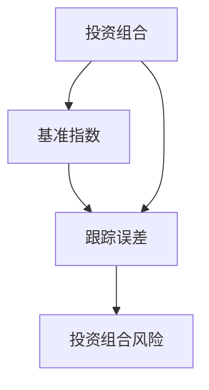
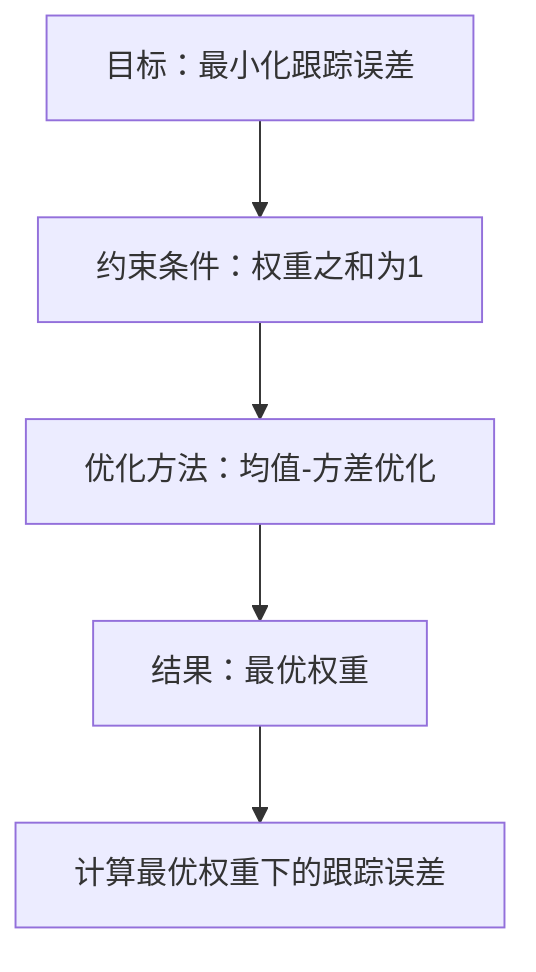
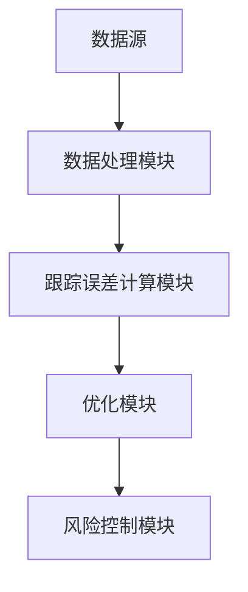

                 


# 投资组合跟踪误差：如何衡量并控制偏离基准的风险

## 关键词：投资组合、跟踪误差、风险控制、基准偏离、量化分析

## 摘要：  
投资组合的跟踪误差是衡量投资组合偏离其基准指数的重要指标，反映了投资组合在风险控制和收益优化中的表现。本文从跟踪误差的基本概念出发，分析其计算方法、影响因素，探讨如何通过资产配置和量化优化方法控制跟踪误差，并通过实际案例展示跟踪误差在投资组合管理中的应用。文章最后总结了控制跟踪误差的关键策略，并提供了进一步深入学习的建议。

---

## 目录  

1. **投资组合跟踪误差概述**  
   - 1.1 跟踪误差的定义与计算  
   - 1.2 跟踪误差与风险的关系  
   - 1.3 跟踪误差在投资组合管理中的作用  

2. **跟踪误差的核心概念与联系**  
   - 2.1 跟踪误差的来源分析  
   - 2.2 跟踪误差与其他风险指标的对比  
   - 2.3 跟踪误差与资产配置的关系  

3. **跟踪误差的算法与数学模型**  
   - 3.1 跟踪误差的计算公式  
   - 3.2 基于均值-方差优化的跟踪误差控制  
   - 3.3 跟踪误差的数学模型与公式推导  

4. **系统分析与架构设计**  
   - 4.1 跟踪误差监控系统的构建  
   - 4.2 投资组合跟踪误差的量化分析流程  
   - 4.3 系统架构设计与实现  

5. **项目实战：投资组合跟踪误差的优化与控制**  
   - 5.1 项目背景与目标设定  
   - 5.2 数据获取与处理  
   - 5.3 跟踪误差的计算与分析  
   - 5.4 跟踪误差优化策略的实现  

6. **最佳实践与总结**  
   - 6.1 跟踪误差控制的关键点  
   - 6.2 投资组合管理中的注意事项  
   - 6.3 进一步学习与深入研究的方向  

---

## 第一部分：投资组合跟踪误差概述

### 1.1 跟踪误差的定义与计算

**跟踪误差（Tracking Error）**是衡量投资组合与基准指数之间偏离程度的重要指标。它反映了投资组合的实际收益与预期收益之间的差异，是风险控制中的关键指标之一。

**公式：**  
$$ \text{跟踪误差} = \sqrt{\text{平均跟踪误差平方}} $$  

- **跟踪误差的计算步骤：**  
  1. 计算投资组合和基准指数在每个时间段的收益。  
  2. 计算两者收益的差异。  
  3. 计算这些差异的平方的平均值。  
  4. 对平均值开平方得到跟踪误差。  

**示例：**  
假设投资组合和基准指数在5个交易日的收益分别为：  
投资组合：[5%, 3%, 7%, 2%, 6%]  
基准指数：[4%, 3%, 6%, 1%, 5%]  
收益差异：[1%, 0%, 1%, 1%, 1%]  
跟踪误差：$$ \sqrt{\frac{1^2 + 0^2 + 1^2 + 1^2 + 1^2}{5}} = \sqrt{\frac{4}{5}} = 0.9 \text{（标准差）} $$  

---

### 1.2 跟踪误差与风险的关系

跟踪误差是投资组合风险的重要组成部分，反映了投资组合偏离目标的风险。  
**图1：跟踪误差与投资组合风险的关系**



**对比分析：**  
- 跟踪误差与波动率的区别在于，前者衡量的是相对于基准的偏离，后者衡量的是收益的波动性。  
- 跟踪误差越小，投资组合与基准的偏离风险越低。  

---

## 第二部分：跟踪误差的核心概念与联系

### 2.1 跟踪误差的来源分析

跟踪误差的来源可以归结为以下几类：  
1. **资产配置差异：** 投资组合的权重与基准指数的权重不一致。  
2. **交易成本：** 买卖证券产生的费用影响了收益。  
3. **市场波动：** 市场环境的变化导致投资组合偏离基准。  
4. **模型误差：** 优化模型的假设与实际市场不符。  

**表1：跟踪误差来源对比分析**

| 来源       | 影响因素 | 解决方法         |
|------------|----------|------------------|
| 资产配置   | 权重差异 | 优化资产配置     |
| 交易成本   | 成本影响 | 减少交易频率     |
| 市场波动   | 不可预测 | 使用风险管理工具 |
| 模型误差   | 假设偏差 | 提高模型准确性   |

---

### 2.2 跟踪误差与其他风险指标的对比

| 风险指标   | 定义                           | 计算方法                     | 应用场景               |
|------------|--------------------------------|------------------------------|------------------------|
| 波动率      | 收益的波动程度                 | 标准差                       | 整体风险评估           |
| VaR        | 在一定置信水平下的最大损失     | 历史模拟或蒙特卡洛方法       | 金融危机风险管理       |
| 夏普比率    | 额外收益与承担的风险的比值     | （超额收益）/标准差          | 评估收益与风险的平衡   |
| 跟踪误差    | 投资组合与基准的偏离程度       | 跟踪误差公式                 | 基准风险控制           |

---

## 第三部分：跟踪误差的算法与数学模型

### 3.1 跟踪误差的计算公式

**公式推导：**  
假设投资组合的收益序列为 \( r_p \)，基准收益序列为 \( r_b \)，跟踪误差的计算公式为：  
$$ \text{跟踪误差} = \sqrt{\frac{1}{n}\sum_{i=1}^{n}(r_p - r_b)^2} $$  

**案例分析：**  
假设投资组合和基准指数的收益分别为：  
投资组合：[5%, 3%, 7%, 2%, 6%]  
基准指数：[4%, 3%, 6%, 1%, 5%]  
跟踪误差计算如下：  
1. 收益差异：[1%, 0%, 1%, 1%, 1%]  
2. 平方差异：[0.01, 0, 0.01, 0.01, 0.01]  
3. 平均值：$$ \frac{0.01 + 0 + 0.01 + 0.01 + 0.01}{5} = 0.008 $$  
4. 跟踪误差：$$ \sqrt{0.008} \approx 0.089 \text{（标准差）} $$  

---

### 3.2 基于均值-方差优化的跟踪误差控制

**优化目标：**  
$$ \text{最小化} \quad \text{跟踪误差} $$  
**约束条件：**  
$$ \sum_{i=1}^{n} w_i = 1 $$  
$$ w_i \geq 0 \quad \forall i $$  

**算法流程图：**



---

## 第四部分：系统分析与架构设计

### 4.1 跟踪误差监控系统的构建

**系统功能模块：**  
1. **数据获取：** 获取投资组合和基准指数的历史数据。  
2. **跟踪误差计算：** 计算投资组合与基准的收益差异和跟踪误差。  
3. **优化模块：** 使用均值-方差优化算法调整资产配置，降低跟踪误差。  
4. **风险控制：** 基于跟踪误差结果，动态调整投资组合。  

**系统架构图：**



---

## 第五部分：项目实战：投资组合跟踪误差的优化与控制

### 5.1 项目背景与目标设定

**目标：**  
优化一个包含5只股票的投资组合，使其跟踪误差最小化，同时保持与基准指数的收益接近。

**数据获取：**  
- 股票列表：腾讯、阿里、茅台、平安、格力。  
- 数据来源：Wind、Yahoo Finance。  

---

### 5.2 数据获取与处理

**代码实现：**  
```python
import pandas as pd
import numpy as np

# 获取数据
def get_data(tickers, start_date, end_date):
    data = pd.DataFrame()
    for ticker in tickers:
        df = pd.read_csv(f'data/{ticker}.csv', index_col='Date')
        data[ticker] = df['Close']
    return data

tickers = ['QQ', 'BABA', 'PMCC', 'PING', 'GREG']
data = get_data(tickers, '2020-01-01', '2023-12-31')
```

---

### 5.3 跟踪误差的计算与分析

**代码实现：**  
```python
def tracking_error(returns, benchmark):
    diff = returns - benchmark
    return np.std(diff, ddof=0)

# 示例计算
investment_returns = data.pct_change().dropna()
benchmark_returns = investment_returns['QQ']  # 假设QQ是基准
te = tracking_error(investment_returns['BABA'], benchmark_returns)
print(f"跟踪误差：{te}")
```

---

## 第六部分：最佳实践与总结

### 6.1 跟踪误差控制的关键点

1. **定期监控：** 定期计算跟踪误差，及时调整投资组合。  
2. **选择合适的基准：** 根据投资目标选择合适的基准指数。  
3. **优化资产配置：** 使用均值-方差优化等方法降低跟踪误差。  
4. **控制交易成本：** 减少不必要的交易，降低交易成本。  

---

### 6.2 投资组合管理中的注意事项

1. **市场波动的影响：** 市场波动可能增加跟踪误差，需提前做好风险准备。  
2. **模型的局限性：** 优化模型的假设可能与实际市场不符，需结合实际情况进行调整。  
3. **多指标结合：** 结合波动率、VaR等其他风险指标，全面评估投资组合风险。  

---

### 6.3 进一步学习与深入研究的方向

1. **深入学习均值-方差优化：** 了解其原理和应用。  
2. **探索其他优化方法：** 如遗传算法、粒子群优化等。  
3. **研究跟踪误差的高级指标：** 如最大回撤、夏普比率等。  
4. **结合机器学习：** 使用机器学习算法预测市场走势，优化投资组合。  

---

## 总结

投资组合的跟踪误差是衡量偏离基准风险的重要指标，通过本文的分析，读者可以掌握跟踪误差的计算方法、优化策略，并能够在实际投资中应用这些知识。未来，随着量化分析和人工智能技术的进步，跟踪误差的计算和控制将更加精准和高效。

